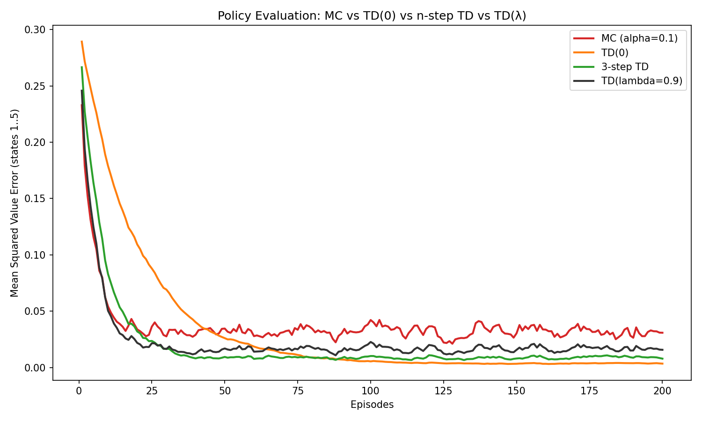
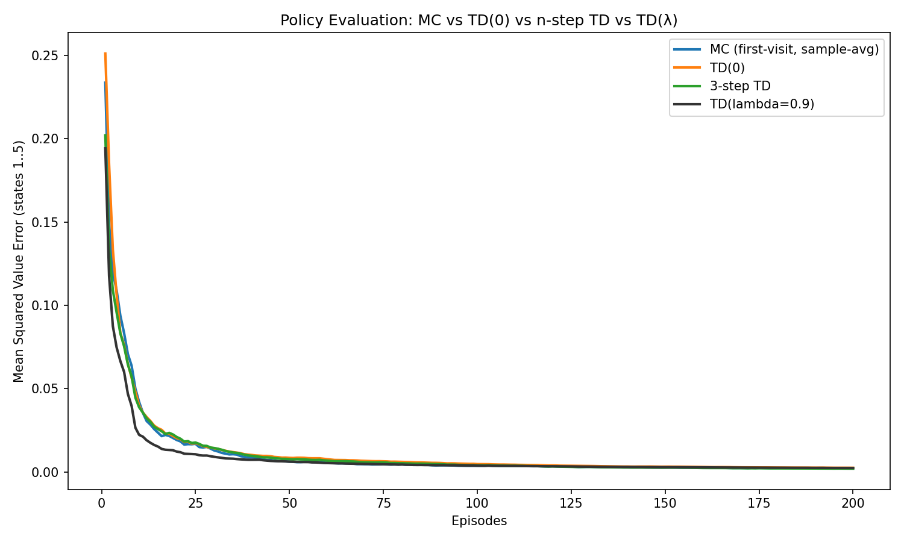
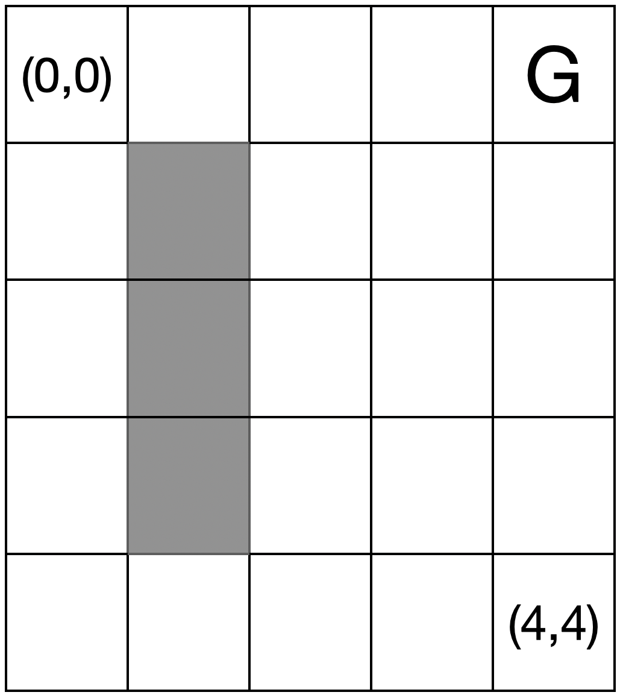
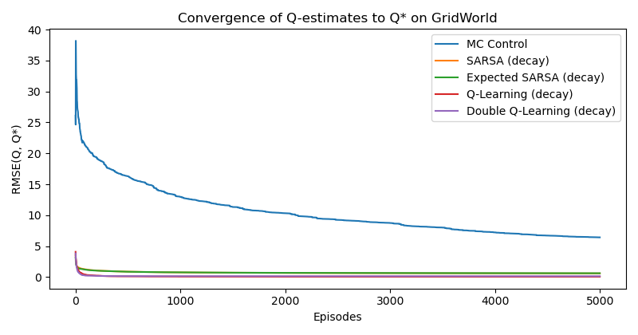

# Value-based Reinforcement Learning {#value-rl}

In Chapter \@ref(mdp), we introduced algorithms for policy evaluation, policy improvement, and computing optimal policies in the tabular setting when the model is known. These dynamic-programming methods are grounded in Bellman consistency and optimality and come with strong convergence guarantees.

A key limitation of the methods in Chapter \@ref(mdp) is that they require the transition dynamics \(P(s' \mid s, a)\) to be known. While in some applications modeling the dynamics is feasible (e.g., the inverted pendulum), in many others it is costly or impractical to obtain an accurate model of the environment (e.g., a humanoid robot interacting with everyday objects).

This motivates relaxing the known-dynamics assumption and asking whether we can design algorithms that learn purely from interaction—i.e., by collecting data through environment interaction. This brings us to **model-free reinforcement learning**.

In this chapter we focus on **value-based** RL methods. The central idea is to learn the value functions—\(V(s)\) and \(Q(s,a)\)—from interaction with the environment and then leverage these estimates to derive (approximately) optimal policies. We begin with tabular methods and then move to function-approximation approaches (e.g., neural networks) for problems where a tabular representation is intractable.


## Tabular Methods {#tabular-methods}

Consider an infinite-horizon Markov decision process (MDP)  
$$
\mathcal{M} = (\mathcal{S}, \mathcal{A}, P, R, \gamma),
$$
with a discount factor \(\gamma \in [0,1)\). We focus on the *tabular setting* where both the state space \(\mathcal{S}\) and the action space \(\mathcal{A}\) are finite, with cardinalities \(|\mathcal{S}|\) and \(|\mathcal{A}|\), respectively.  

A policy is a stationary stochastic mapping  
$$
\pi: \mathcal{S} \to \Delta(\mathcal{A}),
$$
where \(\pi(a \mid s)\) denotes the probability of selecting action \(a\) in state \(s\).  

Unlike in Chapter \@ref(mdp), here we do not assume knowledge of the transition dynamics \(P\) or the reward function \(R\) (other than that \(R\) is deterministic). Instead, we assume we can interact with the environment and obtain *trajectories* of the form  
$$
\tau = (s_0, a_0, r_0, s_1, a_1, r_1, \dots),
$$
by following a policy \(\pi\).


### Policy Evaluation

We first consider the problem of estimating the value function of a given policy $\pi$. Recall the definition of the state-value function associated with $\pi$ is:
\begin{equation}
V^{\pi}(s) = \mathbb{E}\left[ \sum_{t=0}^{\infty} \gamma^t R(s_t, a_t) \mid s_0 = s \right],
(\#eq:InfiniteHorizonStateValueRestate)
\end{equation}
where the expectation is taken over the randomness of both the policy $\pi$ and the transition dynamics $P$.


#### Monte Carlo Estimation

The basic idea of Monte Carlo (MC) estimation is to approximate the value function \(V^\pi\) by averaging *empirical returns* observed from sampled trajectories generated under policy \(\pi\). Since the return is defined as the discounted sum of future rewards, MC methods replace the expectation in the definition of \(V^\pi\) with an average over sampled trajectories.

**Episodic Assumption.** To make Monte Carlo methods well-defined, we restrict attention to the *episodic setup*, where each trajectory terminates upon reaching a terminal state (and the rewards thereafter are always zero). This ensures that the return is finite and can be computed exactly for each trajectory. Concretely, if an episode terminates at time \(T\), the return starting from time \(t\) is
\begin{equation}
g_t = \sum_{k=0}^{T-t-1} \gamma^k r_{t+k} = r_t + \gamma r_{t+1} + \gamma^2 r_{t+2} + \dots + \gamma^{T-t-1} r_{T-1}.
(\#eq:return-MC)
\end{equation}

**Algorithmic Form.** Let \(\mathcal{D}(s)\) denote the set of all time indices at which state \(s\) is visited across sampled episodes. Then the Monte Carlo estimate of the value function is
\begin{equation}
\hat{V}(s) = \frac{1}{|\mathcal{D}(s)|} \sum_{t \in \mathcal{D}(s)} g_t.
(\#eq:StateValueMCEstimate)
\end{equation}

There are two common variants:

- **First-visit MC:** use only the first occurrence of \(s\) in each episode.  
- **Every-visit MC:** use all occurrences of \(s\) within an episode.  

Both variants converge to the same value function in the limit of infinitely many episodes.

**Incremental Implementation.** Monte Carlo can be written as an incremental stochastic-approximation update that uses the return \(g_t\) as the *target* and a *diminishing step size*. Let \(N(s)\) be the number of (first- or every-) visits to state \(s\) that have been used to update \(\hat V(s)\) so far, and let \(g_t\) be the return computed at a particular visit time \(t\in\mathcal{D}(s)\). Then the MC update is
\begin{equation}
\hat V(s) \;\leftarrow\; \hat V(s) + \alpha_{N(s)}\,\big( g_t - \hat V(s) \big),
\qquad \alpha_{N(s)} > 0 \text{ diminishing.}
(\#eq:mc-incremental)
\end{equation}
A canonical choice is the *sample-average* step size \(\alpha_{N(s)} = 1/N(s)\), which yields the recurrence
\begin{align}
\hat V_{N}(s) = \hat V_{N-1}(s) + \tfrac{1}{N}\big(g_t - \hat V_{N-1}(s)\big)
& = \Big(1-\tfrac{1}{N}\Big)\hat V_{N-1}(s) + \tfrac{1}{N}\, g_t \\
& = \frac{N-1}{N} \frac{1}{N-1} \sum_{i=1}^{N-1} g_{t,i} + \frac{1}{N} g_t \\
& = \frac{1}{N} \sum_{i=1}^N g_{t,i}
\end{align}
so that \(\hat V_{N}(s)\) equals the average of the \(N\) observed returns for \(s\) (i.e., Eq. \@ref(eq:StateValueMCEstimate)). In the above equation, I have used $g_{t,i}$ to denote the $i$-th return before $g_t$ was collected (and $g_t = g_{t,N}$). More generally, any diminishing schedule satisfying
\[
\sum_{n=1}^\infty \alpha_n = \infty, \qquad \sum_{n=1}^\infty \alpha_n^2 < \infty
\]
(e.g., \(\alpha_n = c/(n+t_0)^p\) with \(1/2 < p \le 1\)) also ensures consistency in the tabular setting. In first-visit MC, \(N(s)\) increases by one per episode at most; in every-visit MC, \(N(s)\) increases at each occurrence of \(s\) within an episode.


**Theoretical Guarantees.**

1. **Unbiasedness:** For any state \(s\), the return \(g_t\) is an unbiased sample of \(V^\pi(s)\).  
   \[
   \mathbb{E}[g_t \mid s_t = s] = V^\pi(s).
   \]
2. **Consistency:** By the law of large numbers, as the number of episodes grows,
   \[
   \hat{V}(s) \xrightarrow{\text{a.s.}} V^\pi(s).
   \]
3. **Asymptotic Normality:** The MC estimator converges at rate \(O(1/\sqrt{N})\), where $N$ is the number of episodes used for the estimation.


**Limitations.** Despite its conceptual simplicity, MC estimation suffers from several drawbacks:

- It requires *episodes to terminate*, making it unsuitable for continuing tasks without artificial truncation.  

- It can only update value estimates *after an episode ends*, which is data-inefficient.  

- While unbiased, MC estimates often have *high variance*, leading to slow convergence.  

These limitations motivate the study of *Temporal-Difference (TD) learning*, which updates value estimates online and can handle continuing tasks.


#### Temporal-Difference Learning 

While Monte Carlo methods estimate value functions by averaging full returns from complete episodes, Temporal-Difference (TD) learning provides an alternative approach that updates value estimates *incrementally* after each step of interaction with the environment. The key idea is to combine the sampling of Monte Carlo with the *bootstrapping* of dynamic programming.

**High-Level Intuition.** TD learning avoids waiting until the end of an episode by using the Bellman consistency equation as a basis for updates. Recall that for any policy $\pi$, the Bellman consistency equation reads:
\begin{equation}
V^\pi(s) = \mathbb{E}_{a \sim \pi(\cdot \mid s)} \left[ R(s,a) + \gamma \mathbb{E}_{s' \sim P(s' \mid s, a)} V(s')  \right].
(\#eq:InfiniteHorizonBellmanConsistencyRestate)
\end{equation}
At a high level, TD learning turns the expectation in Bellman equation into sampling.
At each step, it updates the current estimate of the value function toward a *one-step bootstrap target*: the immediate reward plus the discounted value of the next state. This makes TD methods more data-efficient and applicable to continuing tasks without terminal states.

**Algorithmic Form.** Suppose the agent is in state \(s_t\), takes action \(a_t \sim \pi(\cdot \mid s_t)\), receives reward \(r_t\), and transitions to \(s_{t+1}\). The TD(0) update rule is
\begin{equation}
\hat{V}(s_t) \;\leftarrow\; \hat{V}(s_t) + \alpha \big[ r_t + \gamma \hat{V}(s_{t+1}) - \hat{V}(s_t) \big],
(\#eq:TDZeroUpdate)
\end{equation}
where \(\alpha \in (0,1]\) is the learning rate.  

The term inside the brackets,
\begin{equation}
\delta_t = r_t + \gamma \hat{V}(s_{t+1}) - \hat{V}(s_t),
(\#eq:TDError)
\end{equation}
is called the TD error. It measures the discrepancy between the current value estimate and the bootstrap target. The algorithm updates \(\hat{V}(s_t)\) in the direction of reducing this error.

**Theoretical Guarantees.**

1. **Convergence in the Tabular Case:**  If each state is visited infinitely often and the learning rate sequence satisfies
   $$
   \sum_t \alpha_t = \infty, \; \sum_t \alpha_t^2 < \infty
   $$
   then TD(0) converges almost surely to the true value function \(V^\pi\). For example, choosing $\alpha_t = 1/(t+1)$ satisfies this condition.
   
2. **Bias–Variance Tradeoff:**  

   - The TD target uses the current estimate \(\hat{V}(s_{t+1})\) rather than the true value, which introduces *bias*. 

   - However, it has significantly *lower variance* than Monte Carlo estimates, often leading to faster convergence in practice.

   To see this, note that for TD(0), the target is a one-step bootstrap:
$$
Y_t = r_t + \gamma \hat{V}(s_{t+1}).
$$
This replaces the true value \(V^\pi(s_{t+1})\) with the *current estimate* \(\hat{V}(s_{t+1})\). As a result, \(Y_t\) is *biased* relative to the true return. However, since it depends only on the immediate reward and the next state, the variance of \(Y_t\) is *much lower* than that of the Monte Carlo target.


**Limitations.**

- TD(0) relies on bootstrapping, which introduces bias relative to Monte Carlo methods.  

- Convergence can be slow if the learning rate is not chosen carefully.  

In summary, Temporal-Difference learning addresses the major limitations of Monte Carlo estimation: it works in *continuing tasks*, updates *online* at each step, and is generally more *sample-efficient*. However, it trades away unbiasedness for bias–variance efficiency, motivating further extensions such as multi-step TD and TD(\(\lambda\)).


#### Multi-Step TD Learning

Monte Carlo methods use the *full return* \(g_t\), while TD(0) uses a *one-step bootstrap*. Multi-step TD learning generalizes these two extremes by using $n$-step returns as targets. In this way, multi-step TD interpolates between Monte Carlo and TD(0).

**High-Level Intuition.** The motivation is to balance the high variance of Monte Carlo with the bias of TD(0). Instead of waiting for a full return (MC) or using only one step of bootstrapping (TD(0)), multi-step TD uses partial returns spanning \(n\) steps of real rewards, followed by a bootstrap. This provides a flexible tradeoff between bias and variance.

**Algorithmic Form.** The $n$-step return starting from time \(t\) is defined as
\begin{equation}
g_t^{(n)} = r_t + \gamma r_{t+1} + \dots + \gamma^{n-1} r_{t+n-1} + \gamma^n \hat{V}(s_{t+n}).
(\#eq:nStepReturn)
\end{equation}

The $n$-step TD update is
\begin{equation}
\hat{V}(s_t) \;\leftarrow\; \hat{V}(s_t) + \alpha \big[ g_t^{(n)} - \hat{V}(s_t) \big],
(\#eq:nStepTDUpdate)
\end{equation}
where \(g_t^{(n)}\) replaces the one-step target in TD(0) \@ref(eq:TDZeroUpdate).

- For \(n=1\): the method reduces to TD(0).  

- For \(n=T-t\) (the full episode length): the method reduces to Monte Carlo.  

**Theoretical Guarantees.**

1. **Convergence in the Tabular Case:** With suitable learning rates and sufficient exploration, $n$-step TD converges to \(V^\pi\).  

2. **Bias–Variance Tradeoff:**  

   - Larger \(n\): lower bias, higher variance (closer to Monte Carlo).  

   - Smaller \(n\): higher bias, lower variance (closer to TD(0)).  

   - Intermediate \(n\) provides a balance that often yields faster learning in practice.

**Limitations.**

- Choosing the right \(n\) is problem-dependent: too small and bias dominates; too large and variance grows.  

- Requires storing \(n\)-step reward sequences before updating, which can increase memory and computation.  

  
In summary, multi-step TD unifies Monte Carlo and TD(0) by introducing \(n\)-step returns. It allows practitioners to *tune the bias–variance tradeoff* by selecting \(n\). Later, we will see how TD(\(\lambda\)) averages over all $n$-step returns in a principled way, further smoothing this tradeoff.

#### Eligibility Traces and TD(\(\lambda\))

So far, we have seen that Monte Carlo methods use *full returns* \(g_t\), while TD(0) uses a *one-step bootstrap*. Multi-step TD methods generalize between these two extremes by using \(n\)-step returns. However, a natural question arises: *can we combine information from all possible \(n\)-step returns in a principled way?*  

This motivates TD(\(\lambda\)), which blends multi-step TD methods into a single algorithm using *eligibility traces*.

**High-Level Intuition.** TD(\(\lambda\)) introduces a parameter \(\lambda \in [0,1]\) that controls the weighting of \(n\)-step returns:

- \(\lambda = 0\): reduces to TD(0), relying only on one-step bootstrapping.  

- \(\lambda = 1\): reduces to Monte Carlo, relying on full returns.  

- \(0 < \lambda < 1\): interpolates smoothly between these two extremes by averaging all \(n\)-step returns with exponentially decaying weights.  

Formally, the \(\lambda\)-return is
\begin{equation}
g_t^{(\lambda)} = (1-\lambda) \sum_{n=1}^{\infty} \lambda^{n-1} g_t^{(n)},
(\#eq:LambdaReturn)
\end{equation}
where \(g_t^{(n)}\) is the \(n\)-step return defined in \@ref(eq:nStepReturn).


::: {.exercisebox}
::: {.remark}
To make the $\lambda$-return well defined, we consider two cases.

**Episodic Case: Well-posed.** If an episode terminates at time \(T\), let \(N=T-t\) be the remaining steps. Then
\begin{equation}
\begin{split}
g_t^{(\lambda)}
& =
(1-\lambda)\sum_{n=1}^{N-1}\lambda^{\,n-1} \, g_t^{(n)}
\;+\;
\lambda^{\,N-1}\, g_t^{(N)}, \\
& = (1-\lambda)\sum_{n=1}^{N}\lambda^{\,n-1} \, g_t^{(n)}
\;+\;
\lambda^{N}\, g_t^{(N)},
\end{split}
(\#eq:lambda-return-episodic)
\end{equation}
where \(g_t^{(n)}\) is the \(n\)-step return (Eq. \@ref(eq:nStepReturn)) and \(g_t^{(N)}\) is the *full* Monte Carlo return (Eq. \@ref(eq:return-MC)).

This expression is well-defined for all \(\lambda\in[0,1]\). Note that the weights form a convex combination:
\[
(1-\lambda)\sum_{n=1}^{N-1}\lambda^{n-1} + \lambda^{N-1}
= 1-\lambda^{N-1}+\lambda^{N-1} = 1.
\]

**Continuing Case: Limit.** Taking \(\lambda\uparrow 1\) in \@ref(eq:lambda-return-episodic) gives
\[
\lim_{\lambda\uparrow 1} g_t^{(\lambda)}
= g_t^{(N)} = g_t,
\]
so the \(\lambda\)-return *reduces to the Monte Carlo return* at \(\lambda=1\). For continuing tasks (no terminal \(T\)), \(\lambda=1\) is conventionally defined by this same limiting argument, yielding the infinite-horizon discounted return when \(\gamma<1\).
:::
:::


**Eligibility Traces.** Naively computing \(g_t^{(\lambda)}\) would require storing and combining infinitely many \(n\)-step returns, which is impractical. Instead, TD(\(\lambda\)) uses eligibility traces to implement this efficiently online.

An eligibility trace is a temporary record that tracks how much each state is “eligible” for updates based on how recently and frequently it has been visited. Specifically, for each state \(s\), we maintain a trace \(z_t(s)\) that evolves as
\begin{equation}
z_t(s) = \gamma \lambda z_{t-1}(s) + \mathbf{1}\{s_t = s\},
(\#eq:EligibilityTrace)
\end{equation}
where \(\mathbf{1}\{s_t = s\}\) is an indicator that equals 1 if state \(s\) is visited at time \(t\), and 0 otherwise.

**TD(\(\lambda\)) Update Rule.** At each time step \(t\), we compute the TD error
\[
\delta_t = r_t + \gamma \hat{V}(s_{t+1}) - \hat{V}(s_t),
\]
as in \@ref(eq:TDError). Then, for each state \(s\), we update
\begin{equation}
\hat{V}(s) \;\leftarrow\; \hat{V}(s) + \alpha \, \delta_t \, z_t(s).
(\#eq:TDLambdaUpdate)
\end{equation}

Thus, all states with nonzero eligibility traces are updated simultaneously, with the magnitude of the update determined by both the TD error and the eligibility trace. See Proposition \@ref(prp:ForwardBackwardEquivalence) below for a justification.


**Theoretical Guarantees.**

1. In the tabular case, TD(\(\lambda\)) converges almost surely to the true value function \(V^\pi\) under the usual stochastic approximation conditions (sufficient exploration, decaying step sizes).  

2. The parameter \(\lambda\) directly controls the bias–variance tradeoff:  

   - Smaller \(\lambda\): more bootstrapping, more bias but lower variance.  

   - Larger \(\lambda\): less bootstrapping, less bias but higher variance.  

3. TD(\(\lambda\)) can be shown to converge to the fixed point of the \(\lambda\)-operator, which is itself a contraction mapping.


In summary, eligibility traces provide an elegant mechanism to combine the advantages of Monte Carlo and TD learning. TD(\(\lambda\)) introduces a spectrum of algorithms: at one end TD(0), at the other Monte Carlo, and in between a family of methods balancing bias and variance. In practice, intermediate values such as \(\lambda \approx 0.9\) often work well.

::: {.theorembox}
::: {.proposition #ForwardBackwardEquivalence name="Forward–Backward Equivalence"}
Consider one episode \(s_0,a_0,r_0,\ldots,s_T\) with \( \hat V(s_T)=0 \). Let the **forward view** apply updates at the end of the episode:
\[
\hat V(s_t) \leftarrow \hat V(s_t) + \alpha \big[g_t^{(\lambda)}-\hat V(s_t)\big],
\quad t=0,\ldots,T-1,
\]
where \(g_t^{(\lambda)}\) is the \(\lambda\)-return in \@ref(eq:LambdaReturn) with the \(n\)-step returns \(g_t^{(n)}\) from \@ref(eq:nStepReturn), and where \(\hat V\) is kept fixed while computing all \(g_t^{(\lambda)}\).

Let the **backward view** run through the episode once, using the TD error \(\delta_t\) from \@ref(eq:TDError) and eligibility traces \(z_t(s)\) from \@ref(eq:EligibilityTrace), and then apply the cumulative update
\[
\Delta_{\text{back}} \hat V(s) \;=\; \alpha \sum_{t=0}^{T-1} \delta_t\, z_t(s).
\]

Then, for every state \(s\),
\[
\Delta_{\text{back}} \hat V(s)
\;=\;
\alpha \sum_{t:\, s_t=s}\big[g_t^{(\lambda)}-\hat V(s_t)\big],
\]
i.e., the net parameter change produced by \@ref(eq:TDLambdaUpdate) equals that of the \(\lambda\)-return updates.
:::
:::
::: {.proofbox}
::: {.proof}
Fix a state \(s\). Using \@ref(eq:EligibilityTrace),
\[
z_t(s)=\sum_{k=0}^{t}(\gamma\lambda)^{\,t-k}\,\mathbf{1}\{s_k=s\}.
\]
Hence
\[
\sum_{t=0}^{T-1}\delta_t z_t(s)
=\sum_{t=0}^{T-1}\delta_t \sum_{k=0}^{t}(\gamma\lambda)^{\,t-k}\mathbf{1}\{s_k=s\}
=\sum_{k:\,s_k=s}\; \sum_{t=k}^{T-1} (\gamma\lambda)^{\,t-k}\delta_t .
\tag{1}
\]

Write \(\delta_t=r_t+\gamma\hat V(s_{t+1})-\hat V(s_t)\) and split the inner sum:
\[
\sum_{t=k}^{T-1} (\gamma\lambda)^{t-k}\delta_t
= \underbrace{\sum_{t=k}^{T-1} \gamma^{t-k}\lambda^{t-k} r_t}_{\text{(A)}}
+ \underbrace{\sum_{t=k}^{T-1}\gamma^{t-k}\lambda^{t-k}(\gamma\hat V(s_{t+1})-\hat V(s_t))}_{\text{(B)}}.
\]

Term (B) telescopes. Shifting index in the first part of (B),
\[
\sum_{t=k}^{T-1}\gamma^{t-k}\lambda^{t-k}\gamma \hat V(s_{t+1})
= \sum_{t=k+1}^{T}\gamma^{t-k}\lambda^{t-1-k}\hat V(s_t).
\]
Therefore
\[
\text{(B)}=
-\hat V(s_k) 
+ \sum_{t=k+1}^{T-1}\gamma^{t-k}\lambda^{t-1-k}(1-\lambda)\hat V(s_t)
+ \underbrace{\gamma^{T-k}\lambda^{T-1-k}\hat V(s_T)}_{=\,0}.
\tag{2}
\]

Combining (A) and (2), and reindexing with \(n=t-k\),
\[
\sum_{t=k}^{T-1} (\gamma\lambda)^{t-k}\delta_t
= -\hat V(s_k)
+ \sum_{n=0}^{T-1-k}\gamma^{n}\lambda^{n} r_{k+n}
+ (1-\lambda)\sum_{n=1}^{T-1-k}\gamma^{n}\lambda^{n-1}\hat V(s_{k+n}).
\tag{3}
\]

On the other hand, expanding the \(\lambda\)-return \@ref(eq:LambdaReturn),
\[
\begin{aligned}
g_k^{(\lambda)}
&=(1-\lambda)\sum_{n=1}^{T-k}\lambda^{n-1}
\Bigg(\sum_{m=0}^{n-1}\gamma^{m} r_{k+m} + \gamma^{n}\hat V(s_{k+n})\Bigg) + \lambda^{T-k} g_k^{(T-k)}\\
&= \sum_{n=0}^{T-1-k}\gamma^{n}\lambda^{n} r_{k+n}
+ (1-\lambda)\sum_{n=1}^{T-1-k}\gamma^{n}\lambda^{n-1}\hat V(s_{k+n}),
\end{aligned}
\tag{4}
\]
where we used that \(\hat V(s_T)=0\). Comparing (3) and (4) yields
\[
\sum_{t=k}^{T-1} (\gamma\lambda)^{t-k}\delta_t
= g_k^{(\lambda)} - \hat V(s_k).
\tag{5}
\]

Substituting (5) into (1) and multiplying by \(\alpha\) completes the proof.
:::
:::

<!-- **Remarks.**
1. The equivalence above is **exact** when the value function \(\hat V\) is held fixed throughout the episode (offline/episodic view).  
2. With *online* updates (changing \(\hat V\) within the episode), the standard accumulating-trace TD(\(\lambda\)) is only approximately forward-equivalent; the discrepancy is \(O(\alpha)\). An exactly online-equivalent variant is known as **true online TD(\(\lambda\))** (not covered here). -->

::: {.examplebox}
::: {.example #PolicyEvaluationRandomWalk name="Policy Evaluation (MC and TD Family)"}

We consider the classic random-walk MDP with terminal states:

- **States:** \(\{0,1,2,3,4,5,6\}\), where \(0\) and \(6\) are terminal; nonterminal states are \(1{:}5\).
- **Actions:** \(\{-1,+1\}\) (“Left”/“Right”).
- **Dynamics:** From a nonterminal state \(s\in\{1,\dots,5\}\), action \(-1\) moves to \(s-1\), and action \(+1\) moves to \(s+1\).
- **Rewards:** Transitioning into state \(6\) yields reward \(+1\); all other transitions yield \(0\).
- **Discount:** \(\gamma=1\) (episodic task). Episodes start at state \(s_0=3\) and terminate upon reaching \(\{0,6\}\).

We evaluate the *equiprobable policy* \(\pi\) that chooses Left/Right with probability \(1/2\) each at every nonterminal state. Under this policy, the true state-value function on nonterminal states \(s\in\{1,\dots,5\}\) is
\begin{equation}
V^\pi(s) \;=\; \frac{s}{6}.
(\#eq:trueV-rw)
\end{equation}

We compare four *tabular policy-evaluation* methods:

1. **Monte Carlo (MC), first-visit** — using full returns as target.

2. **TD(0)** — one-step bootstrap.

3. **\(n\)-step TD** — here we use \(n=3\) (intermediate between MC and TD(0)).

4. **TD(\(\lambda\))** — accumulating eligibility traces (we illustrate with \(\lambda=0.9\)).

All methods estimate \(V^\pi\) from trajectories generated by \(\pi\).

**Error Metric.**
We report the *mean-squared error (MSE)* over nonterminal states after each episode:
\begin{equation}
\mathrm{MSE}_t \;=\; \frac{1}{5}\sum_{s=1}^{5}\big(\hat V_t(s)-V^\pi(s)\big)^2,
(\#eq:mse-metric)
\end{equation}
where \(V^\pi\) is given by \@ref(eq:trueV-rw). Curves are averaged over multiple random seeds.

**Fixed Step Sizes.**
We first use a fixed step size $\alpha=0.1$ for all methods. Fig. \@ref(fig:policy-evaluation-random-walk-fixed-step-size) shows the trajectories of MSE versus number of episodes. We can see that, when using a constant step size, these methods do not converge to exactly the true value function, but to a small neighborhood. In addition, if the algorithm initially decays very fast, then the final variance is larger. For example, MC initially decays very fast, but has a higher variance, whereas TD(0) initially decays slower, but has a lower final variance. This agrees with the theoretical analysis in [@kearns2000bias].

```{r policy-evaluation-random-walk-fixed-step-size, out.width='90%', fig.show='hold', fig.cap='Policy Evaluation, MC versus TD Family, Fixed Step Size', fig.align='center', echo=FALSE}

```

**Diminishing Step Sizes.**
We then use a diminishing step size for the TD family:
\begin{equation}
\alpha_t(s) \;=\; \frac{c}{\big(N_t(s)+t_0\big)^p}, 
\qquad \tfrac{1}{2} < p \le 1,
(\#eq:per-state-decay)
\end{equation}
where \(N_t(s)\) counts how many times \(V(s)\) has been updated up to time \(t\). A common choice is \(p=1\) with moderate \(c>0\) and \(t_0>0\).

Fig. \@ref(fig:policy-evaluation-random-walk-diminishing-step-size) shows the MSE versus episodes for MC, TD(0), 3-step TD, and TD(\(\lambda\)) under the diminishing step-size. Observe that all algorithms converge to the true value function under the diminishing step size schedule.

```{r policy-evaluation-random-walk-diminishing-step-size, out.width='90%', fig.show='hold', fig.cap='Policy Evaluation, MC versus TD Family, Diminishing Step Size', fig.align='center', echo=FALSE}

```

You are encouraged to play with the parameters of these algorithms in the code [here](https://github.com/ComputationalRobotics/2025-ES-AM-158-LECTURE-CODE/blob/main/policy_evaluation_mc_td.py).

:::
:::

### Convergence Proof of TD Learning

TBD.


### On-Policy Control

Monte Carlo (MC) estimation and the TD family evaluate policies directly from interaction—no model required. We now turn evaluation into control via generalized policy iteration (GPI): repeatedly (i) evaluate the current policy from data and (ii) improve it by acting greedily with respect to the new estimates. We first cover on-policy control methods, which estimate and improve the same (typically $\varepsilon$-greedy) policy, and then off-policy methods, which learn about a target policy while behaving with a different one.

#### Monte Carlo Control

**High-level Intuition.**

- **Goal.** Learn an (approximately) optimal policy by alternating *policy evaluation* and *policy improvement* using only sampled episodes.
- **Why action-values?** Estimating \(Q^\pi(s,a)\) lets us improve the policy *without a model* by choosing "\(\arg\max_a Q(s,a)\)".
- **Exploration.** Pure greedy improvement can get stuck. MC control keeps the policy *$\varepsilon$-soft* (e.g., $\varepsilon$-greedy) so that every action has nonzero probability and all state-action pairs continue to be sampled. An $\varepsilon$-soft policy is one that never rules out any action: in every state $s$, each action $a$ gets at least a small fraction of probability. Formally, in the tabular setup, we have that a policy $\pi$ is $\varepsilon$-soft if and only if
\begin{equation}
\forall s, \forall a: \quad \pi(a \mid s) \geq \frac{\varepsilon}{|\mathcal{A}(s)|}, \quad \varepsilon \in (0,1],
(\#eq:epsilon-soft-policy)
\end{equation}
where $\mathcal{A}(s)$ denotes the set of actions the agent can select at state $s$.

- **Coverage mechanisms.** Classic guarantees use either:
  1) **Exploring starts (ES):** start each episode from a randomly chosen \((s,a)\) with nonzero probability; or  
  2) **$\varepsilon$-soft / GLIE (Greedy in the Limit with Infinite Exploration):** use $\varepsilon$-greedy behavior with \(\varepsilon_t \downarrow 0\) so every \((s,a)\) is visited infinitely often while the policy becomes greedy in the limit.


**Algorithmic Form.**
We maintain tabular action-value estimates \(Q(s,a)\) and an *$\varepsilon$-soft* policy \(\pi\) ($\varepsilon$-greedy w.r.t. \(Q\)). After each episode we update \(Q\) from *empirical returns* and then improve \(\pi\).

**Return from time \(t\):**
\[
g_t = r_t + \gamma r_{t+1} + \dots + \gamma^{T-t} r_T = \sum_{k=0}^{T-t} \gamma^{k} r_{t+k}.
\]

**First-visit MC update (common choice):**
\begin{equation}
Q(s_t,a_t) \;\leftarrow\; Q(s_t,a_t) + \alpha_{N(s_t,a_t)}\!\left(g_t - Q(s_t,a_t)\right),
(\#eq:MCControl-QUpdate)
\end{equation}
applied only on the first occurrence of \((s_t,a_t)\) in the episode. *Sample-average* learning uses \(\alpha_n = 1/n\) per pair; more generally, use diminishing stepsizes.

**Policy improvement ($\varepsilon$-greedy):**
\begin{equation}
\pi(a|s) \;=\;
\begin{cases}
1-\varepsilon + \dfrac{\varepsilon}{|\mathcal{A}(s)|}, & a \in \arg\max_{a'} Q(s,a'), \\
\dfrac{\varepsilon}{|\mathcal{A}(s)|}, & \text{otherwise}.
\end{cases}
(\#eq:MCControl-PI)
\end{equation}

**Theoretical Guarantees.**

Assume a tabular episodic MDP and \(\gamma \in [0,1)\).

- **Convergence with Exploring Starts.** If every state–action pair has nonzero probability of being the *first* pair of an episode (using ES), and each \(Q(s,a)\) is updated toward the true mean return from \((s,a)\) (e.g., via sample averages), then repeated policy evaluation and greedy improvement converge with probability 1 to an optimal deterministic policy. (If one uses an $\varepsilon$-greedy improvement, then it converges to an optimal $\varepsilon$-soft policy.)

- **Convergence with $\varepsilon$-soft GLIE behavior.** If the behavior policy is GLIE—every \((s,a)\) is visited infinitely often and \(\epsilon_t \to 0\)—and the stepsizes for each \((s,a)\) satisfy the Robbins–Monro conditions $\sum_{t} \alpha_t(s,a) = \infty,\sum_{t} \alpha_t(s,a)^2 < \infty$, then \(Q(s,a)\) converges to \(Q^\star(s,a)\) for all pairs visited infinitely often, and the $\varepsilon$-greedy policy converges almost surely to an optimal policy.

::: {.remark}
**Unbiased but high-variance.** MC targets \(g_t\) are unbiased estimates of action values under the current policy, but can have high variance—especially for long horizons—so convergence can be slower than TD methods. Keeping \(\varepsilon>0\) ensures exploration but limits asymptotic optimality to the best $\varepsilon$-soft policy; hence \(\varepsilon_t \downarrow 0\) (GLIE) is recommended for optimality.
:::


#### SARSA (On-Policy TD Control)

**High-level Intuition.**

- **Goal.** Turn evaluation into control by updating action values online and improving the same policy that generates data.
- **Key idea.** Replace Monte Carlo returns with a bootstrapped target. After taking action \(a_t\) in state \(s_t\) and observing \(r_{t}, s_{t+1}\), sample the next action \(a_{t+1}\) from the current policy and update toward \(r_{t} + \gamma Q(s_{t+1}, a_{t+1})\).
- **On-policy nature.** SARSA evaluates the behavior policy itself, typically an \(\varepsilon\)-greedy policy w.r.t. \(Q\).
- **Exploration.** Use \(\varepsilon\)-soft behavior so every action keeps nonzero probability. For optimality, let \(\varepsilon_t \downarrow 0\) to obtain GLIE (Greedy in the Limit with Infinite Exploration).


**Algorithmic Form.**

Let \(Q\) be a tabular action-value function and \(\pi_t\) be \(\varepsilon_t\)-greedy w.r.t. \(Q_t\).

**TD target and error:**
\begin{equation}
y_t = r_{t} + \gamma Q(s_{t+1}, a_{t+1}), \qquad
\delta_t = y_t - Q(s_t, a_t).
(\#eq:SARSA-TDTarget)
\end{equation}

**SARSA update (one-step):**
\begin{equation}
Q(s_t, a_t) \leftarrow Q(s_t, a_t) + \alpha_t(s_t,a_t)\, \delta_t.
(\#eq:SARSA-QUpdate)
\end{equation}

**\(\varepsilon\)-greedy policy improvement:**
\begin{equation}
\pi_{t+1}(a\mid s) =
\begin{cases}
1-\varepsilon_{t+1} + \dfrac{\varepsilon_{t+1}}{|\mathcal A(s)|}, & a \in \arg\max_{a'} Q_{t+1}(s,a'),\\
\dfrac{\varepsilon_{t+1}}{|\mathcal A(s)|}, & \text{otherwise.}
\end{cases}
(\#eq:SARSA-PolicyUpdate)
\end{equation}

<!-- ### Algorithm 2 — SARSA (tabular, \(\varepsilon\)-greedy) {#alg:sarsa}
1. Initialize \(Q(s,a)\) arbitrarily. Choose an exploration schedule \(\varepsilon_t\).
2. For each episode:
   1. Sample \(a_0 \sim \pi_0(\cdot\mid s_0)\) (\(\varepsilon_0\)-greedy w.r.t. \(Q\)).
   2. For \(t=0,1,\dots\) until terminal:
      - Take \(a_t\), observe \(r_{t+1}, s_{t+1}\).
      - Sample \(a_{t+1} \sim \pi_t(\cdot\mid s_{t+1})\) (\(\varepsilon_t\)-greedy w.r.t. \(Q\)).
      - Compute \(\delta_t = r_{t+1} + \gamma Q(s_{t+1}, a_{t+1}) - Q(s_t, a_t)\).
      - Update \(Q(s_t, a_t) \leftarrow Q(s_t, a_t) + \alpha_t(s_t,a_t)\, \delta_t\).
      - Improve policy at \(s_t\) to be \(\varepsilon_t\)-greedy w.r.t. updated \(Q\).
   3. Optionally decay \(\varepsilon_{t}\) according to a GLIE schedule. -->

**Variants.**

- **Expected SARSA** replaces the sampled \(a_{t+1}\) by its expectation under \(\pi_t\) for lower variance: 
\begin{equation}
y_t = r_{t} + \gamma \sum_a \pi_t(a\mid s_{t+1}) Q(s_{t+1}, a).
(\#eq:ExpectedSARSA-Target)
\end{equation}


- **$n$-step SARSA** and **SARSA(\(\lambda\))** blend multi-step targets; these trade bias and variance similarly to MC vs TD.


**Convergence Guarantees.**

Assume a finite MDP, \(\gamma \in [0,1)\), asynchronous updates, and that each state–action pair is visited infinitely often.

- **GLIE convergence to optimal policy.** If the behavior is GLIE, i.e., \(\varepsilon_t \downarrow 0\) while ensuring infinite exploration, and stepsizes satisfy the Robbins–Monro conditions, then \(Q_t \to Q^\star\) almost surely and the \(\varepsilon_t\)-greedy behavior becomes greedy in the limit, yielding an optimal policy almost surely.


### Off-Policy Control

Off-policy methods learn about a *target* policy \(\pi\) while following a (potentially different) *behavior* policy \(b\) to gather data. This decoupling is useful when:

- you want to *reuse logged data* collected by some \(b\) (e.g., a rule-based controller or a past system),

- you need *safer exploration* by restricting behavior \(b\) while aiming to evaluate or improve a different \(\pi\),

- you want to learn about the *greedy* policy without executing it, which motivates algorithms like Q-learning.

In this section we first cover off-policy policy evaluation with *importance sampling*, then show how it can be used to construct an off-policy *Monte Carlo control* scheme in the tabular case. Finally, we present Q-learning.

#### Importance Sampling for Policy Evaluation

**Motivation.** Suppose we have episodes generated by a behavior policy \(b\), but we want the value of a different target policy \(\pi\). For a state value this is \(V^\pi(s) = \mathbb{E}_\pi[g_t \mid s_t=s]\), and for action values \(Q^\pi(s,a) = \mathbb{E}_\pi[g_t \mid s_t=s, a_t=a]\), where
\[
g_t = \sum_{k=0}^{T-t} \gamma^{k} r_{t+k}.
\]
Because the data come from \(b\), the naive sample average is biased. Importance sampling (IS) reweights returns so that expectations under \(b\) equal those under \(\pi\).

A basic *support condition* is required:
\begin{equation}
\text{If } \pi(a\mid s) > 0 \text{ then } b(a\mid s) > 0 \quad \text{for all visited } (s,a).
(\#eq:IS-SupportCondition)
\end{equation}
This ensures that \(\pi\) is absolutely continuous with respect to \(b\) on the experienced trajectories.

**Importance Sampling (episode-wise).** Consider a trajectory starting at time $t$:
$$
\tau_t = (s_t, a_t, r_t, s_{t+1}, a_{t+1}, \dots, s_{T-1}, a_{T-1}, r_{T-1}, s_T).
$$
The probability of observing this trajectory conditioned on $s_t = s$, under policy $\pi$, is 
$$
\mathbb{P}_{\pi}[\tau_t \mid s_t = s] = \pi(a_t \mid s_t) P(s_{t+1} \mid s_t, a_t) \pi(a_{t+1} \mid s_{t+1}) \cdots \pi(a_{T-1} \mid s_{T-1}) P(s_T \mid s_{T-1}, a_{T-1}).
$$
The probability of observing the same trajectory conditioned on $s_t = s$, under policy $b$, is 
$$
\mathbb{P}_{b}[\tau_t \mid s_t = s] = b(a_t \mid s_t) P(s_{t+1} \mid s_t, a_t) b(a_{t+1} \mid s_{t+1}) \cdots b(a_{T-1} \mid s_{T-1}) P(s_T \mid s_{T-1}, a_{T-1}).
$$
Since the return $g_t$ is a deterministic function of $\tau_t$, i.e., applying the reward function $R$ to state-action pairs, we have that
\begin{equation}
\begin{split}
V^\pi (s) & = \mathbb{E}_{\pi}[g_t \mid s_t = s] = \sum_{\tau_t} g_t \mathbb{P}_\pi [\tau_t \mid s_t = s] \\
& = \sum_{\tau_t} g_t \mathbb{P}_b[\tau_t \mid s_t = s] \left(\frac{\mathbb{P}_\pi [\tau_t \mid s_t = s]}{\mathbb{P}_b[\tau_t \mid s_t = s]} \right) \\
& = \sum_{\tau_t} \left( \frac{\pi(a_t \mid s_t) \pi(a_{t+1} \mid s_{t+1}) \cdots \pi(a_{T-1} \mid s_{T-1}) }{b(a_t \mid s_t)  b(a_{t+1} \mid s_{t+1}) \cdots b(a_{T-1} \mid s_{T-1})} \right) g_t \mathbb{P}_b [\tau_t \mid s_t = s]
\end{split}
(\#eq:IS-Trajectory-LikelihoodRatio)
\end{equation}
Therefore, define the *likelihood ratio*
\begin{equation}
\rho_{t:T-1} = \prod_{k=t}^{T-1} \frac{\pi(a_k \mid s_k)}{b(a_k \mid s_k)},
(\#eq:IS-LikelihoodRatio)
\end{equation}
we have
\begin{equation}
V^\pi(s) = \mathbb{E}_b\left[\rho_{t:T-1} g_t \mid s_t=s\right]. 
(\#eq:IS-Value)
\end{equation}
Similarly, we have 
\begin{equation}
Q^\pi(s,a) =  \mathbb{E}_b\!\left[\rho_{t:T-1} g_t \mid s_t=s, a_t=a\right].
(\#eq:IS-ActionValue)
\end{equation}
Given \(n\) episodes, the ordinary IS estimator for \(Q^\pi\) at the first visit of \((s,a)\) is
\[
\hat Q_n^{\text{IS}}(s,a) = \frac{1}{N_n(s,a)} \sum_{i=1}^n \mathbf{1}\{(s,a)\text{ visited}\}\, \rho_{t_i:T_i-1}^{(i)}\, g_{t_i}^{(i)},
\]
where \(N_n(s,a)\) counts the number of first visits of \((s,a)\). In words, to estimate the $Q$ value of the target policy $\pi$ using trajectories of the behavior policy $b$, we need to reweight the return $g_t$ by the likelihood ratio $\rho_{t:T-1}$. Note that the likelihood ratio does not require knowledge about the transition dynamics.

<!-- ### Weighted (self-normalized) importance sampling

To reduce variance, use **weighted IS**
\[
\hat Q_n^{\text{WIS}}(s,a) = \frac{\sum_{i=1}^n w_i\, G_{t_i}^{(i)}}{\sum_{i=1}^n w_i}, \quad
w_i = \mathbf{1}\{(s,a)\text{ visited}\}\, \rho_{t_i:T_i-1}^{(i)}.
\]
This estimator is **biased** for finite \(n\) but typically has much lower variance and is **consistent** as \(n\to\infty\) under the support condition.

### Per-decision importance sampling

Variance can be further reduced by reweighting **each reward term** with the prefix ratio
\[
\rho_{t:k} = \prod_{j=t}^{k} \frac{\pi(a_j \mid s_j)}{b(a_j \mid s_j)}.
\]
The per-decision target for state values is
\[
\tilde G_t^{\text{PD}} = \sum_{k=t}^{T-1} \gamma^{k-t} \rho_{t:k} r_{k+1},
\]
and analogously for action values when conditioning on \((s_t,a_t)\). These can be used in either ordinary or weighted form.
!-->

**Algorithmic Form: Off-policy Monte Carlo Policy Evaluation.**

**Input:** behavior \(b\), target \(\pi\), episodes from \(b\)  
**For each episode** $(s_0,a_0,r_0,s_1,\dots,s_{T-1},a_{T-1},r_{T-1},s_T)$:

1. For \(t=T-1,\dots,0\) compute episode-wise likelihood ratio \(\rho_{t:T-1}\) and return \(g_t\),

2. For first visits of \((s_t,a_t)\), update
\[
Q(s_t,a_t) \leftarrow Q(s_t,a_t) + \alpha_{N(s_t,a_t)}\big(\rho_{t:T-1} g_t - Q(s_t,a_t)\big).
\]
Use sample averages \(\alpha_n=1/n\) or Robbins-Monro stepsizes.

**Guarantees.** Under the support condition and finite variance assumptions, ordinary IS is *unbiased* and converges almost surely to \(Q^\pi\).

#### Off-Policy Monte Carlo Control

**High-level Intuition.** We wish to improve a target policy \(\pi\) toward optimality while behaving with a different exploratory policy \(b\). We evaluate \(Q^\pi\) off-policy using IS on data from \(b\), then set \(\pi\) greedy with respect to the updated \(Q\). Keep \(b\) sufficiently exploratory (for coverage), for example \(\varepsilon\)-greedy with a fixed \(\varepsilon>0\) or a GLIE schedule.

**Algorithmic Form.**

1. Initialize \(Q(s,a)\) arbitrarily. Set target \(\pi\) to be greedy w.r.t. \(Q\). Choose an exploratory behavior \(b\) that ensures coverage, e.g., \(\varepsilon\)-greedy w.r.t. \(Q\) with \(\varepsilon>0\).

2. Loop over iterations \(i=0,1,2,\dots\):
   1. Data collection under \(b\): generate a batch of episodes using \(b\).
   2. Off-policy evaluation of \(\pi\): for each episode, compute IS targets for first visits of \((s_t,a_t)\) and update \(Q\) using either ordinary IS
   3. Policy improvement: set for all states
\[
\pi_{i+1}(s) \in \arg\max_{a} Q(s,a).
\]
   4. Optionally update \(b\) to remain exploratory, for example \(b\) \(\leftarrow\) \(\varepsilon\)-greedy w.r.t. \(Q\) with a chosen \(\varepsilon\) or a GLIE decay.

<!-- ::: {.remark}
You may separate time scales: use many episodes to evaluate \(\pi\) before each improvement step, or interleave smaller updates more frequently.
::: -->

**Convergence Guarantees.**

- **Evaluation step:** With the support condition and appropriate stepsizes, off-policy MC prediction converges almost surely to \(Q^\pi\) when using ordinary IS.

- **Control in the batch GPI limit:** If each evaluation step produces estimates that converge to the exact \(Q^{\pi_i}\) before improvement, then by the policy improvement theorem the sequence of greedy target policies \(\pi_i\) converges to an optimal policy in finite MDPs.

<!-- - **Practical interleaving:** When evaluation and improvement are interleaved with finite samples, high variance of IS can slow or destabilize progress. There is **no general convergence guarantee** for incremental off-policy MC control beyond the evaluation consistency. This motivates off-policy TD control methods such as **Q-learning** and **Expected Q-learning**, which avoid explicit IS. -->

::: {.remark}
**Choice of \(b\).** A common and simple choice is an \(\varepsilon\)-greedy behavior \(b\) w.r.t. current \(Q\) that maintains \(\varepsilon>0\) for coverage or uses GLIE so that \(\varepsilon_t \downarrow 0\) while all pairs are still visited infinitely often.
:::


#### Q-Learning

**High-Level Intuition.**

- **What it learns.** Q-Learning seeks the fixed point of the Bellman optimality operator
  \[
  (\mathcal T^\star Q)(s,a) = \mathbb E\big[ r_{t} + \gamma \max_{a'} Q(s_{t+1}, a') \mid s_t=s, a_t=a \big],
  \]
  whose unique fixed point is \(Q^\star\). Because \(\mathcal T^\star\) is a \(\gamma\)-contraction in \(\|\cdot\|_\infty\), repeatedly applying it converges to \(Q^\star\) in the tabular case.

- **Why off-policy.** We can behave with any sufficiently exploratory policy \(b\) (e.g., \(\varepsilon\)-greedy w.r.t. current \(Q\)) but learn from the greedy target \(\max_{a'} Q(s',a')\). No importance sampling is needed.

<!-- - **Bias–variance profile.** The max target bootstraps strongly (low variance) but introduces maximization bias when estimates are noisy; Double Q-Learning** remedies this. -->

**Algorithmic Form.** Let \(Q\) be a tabular action-value function. At each step observe a transition \((s_t, a_t, r_{t}, s_{t+1})\) generated by a behavior policy \(b_t\) (typically \(\varepsilon_t\)-greedy w.r.t. \(Q_t\)).

- **Target and TD error**
  \[
  y_t = r_{t} + \gamma \max_{a'} Q(s_{t+1}, a'), \qquad
  \delta_t = y_t - Q(s_t, a_t).
  \]

- **Update**
  \[
  Q(s_t, a_t) \leftarrow Q(s_t, a_t) + \alpha_t(s_t,a_t)\, \delta_t.
  \]

- **Behavior (exploration)**
  Use \(\varepsilon_t\)-greedy with \(\varepsilon_t\) decaying (GLIE) or any scheme that ensures each \((s,a)\) is updated infinitely often.

<!-- **Algorithm 3 — Q-Learning (tabular, off-policy) {#alg:qlearning}**

1. Initialize \(Q(s,a)\) arbitrarily and choose stepsizes \(\alpha_t(s,a)\).
2. For each episode:
   1. Set \(s \leftarrow s_0\).
   2. Repeat until terminal:
      - Choose \(a \sim b_t(\cdot \mid s)\) (e.g., \(\varepsilon_t\)-greedy w.r.t. \(Q\)).
      - Take \(a\), observe \(r, s'\).
      - \(Q(s,a) \leftarrow Q(s,a) + \alpha_t(s,a)\big[r + \gamma \max_{a'} Q(s',a') - Q(s,a)\big]\).
      - \(s \leftarrow s'\). -->

<!-- **Variants and Practical Tweaks**

- **Double Q-Learning.** Maintain \(Q^A, Q^B\) and alternate:
  \[
  Q^A(s,a) \leftarrow Q^A(s,a) + \alpha\big[r + \gamma Q^B(s', \arg\max_{a'} Q^A(s',a')) - Q^A(s,a)\big],
  \]
  and symmetrically for \(Q^B\). This reduces overestimation bias.

- **Expected Q-Learning.** Replace \(\max\) with the expectation under a target policy (e.g., \(\varepsilon\)-greedy) for variance reduction. -->

**Convergence.** In a finite MDP with \(\gamma \in [0,1)\), if each \((s,a)\) is updated infinitely often (sufficient exploration) and stepsizes satisfy Robbins-Monro conditions, then Q-Learning converges to \(Q^\star\) with probability 1. 


#### Double Q-Learning

**Motivation.** Max operators tend to be optimistically biased when action values are noisy. Consider an example where in state $s$ one can take two actions $1$ and $2$. The estimated Q function $\hat{Q}(s, \cdot)$ has two values $+1$ and $-1$ with equal probability. In this case we have $Q(s,1) = Q(s,2) = \mathbb{E}[\hat{Q}(s,\cdot)] = 0$. Therefore, $\max Q(s,a) = 0$. However, the noisy estimated $\hat{Q}(s,\cdot)$ has four outcomes with equal probabilities: 
$$
(+1,-1), (+1,+1), (-1, +1), (-1,-1).
$$
Therefore, we have
$$
\mathbb{E}[\max_a \hat{Q}(s,a)] = \frac{1}{4} (1 + 1 + 1 -1) = 1/2 > \max_a Q(s,a),
$$
which overestimates the max $Q$ value. In general, we have
$$
\mathbb{E}[\max_a \hat{Q}(s,a)] \geq \max_a \mathbb{E} [\hat{Q}(s,a)] = \max_a Q(s,a),
$$
where the estimates $\hat{Q}$ are noisy (try to prove this on your own).
In Q-Learning the target
\[
y_t = r_{t} + \gamma \max_{a'} Q(s_{t+1}, a')
\]
can therefore overestimate action values and slow learning or push policies toward risky actions.

Double Q-Learning reduces this bias by decoupling selection from evaluation: maintain two independent estimators \(Q^A\) and \(Q^B\). Use one to select the greedy action and the other to evaluate it, and alternate which table you update. This weakens the statistical coupling that creates overestimation.

**Algorithmic Form.** Keep two tables \(Q^A, Q^B\). Use an \(\varepsilon\)-greedy behavior policy with respect to a combined estimate, e.g., \(Q^{\text{avg}}= \tfrac12(Q^A+Q^B)\) or \(Q^A+Q^B\).

At each step observe \((s_t, a_t, r_{t}, s_{t+1})\). With probability \(1/2\) update \(Q^A\), else update \(Q^B\).

- **Update \(Q^A\):**
  \[
  a^\star = \arg\max_{a'} Q^A(s_{t+1}, a'),\qquad
  y_t = r_{t} + \gamma\, Q^B(s_{t+1}, a^\star),
  \]
  \[
  Q^A(s_t, a_t) \leftarrow Q^A(s_t, a_t) + \alpha_t(s_t,a_t)\big[y_t - Q^A(s_t, a_t)\big].
  \]

- **Update \(Q^B\):**
  \[
  a^\star = \arg\max_{a'} Q^B(s_{t+1}, a'),\qquad
  y_t = r_{t} + \gamma\, Q^A(s_{t+1}, a^\star),
  \]
  \[
  Q^B(s_t, a_t) \leftarrow Q^B(s_t, a_t) + \alpha_t(s_t,a_t)\big[y_t - Q^B(s_t, a_t)\big].
  \]

- **Behavior policy (\(\varepsilon\)-greedy):** choose \(a_t \sim \varepsilon\)-greedy with respect to \(Q^{\text{avg}}(s_t,\cdot)\).
  A GLIE schedule \(\varepsilon_t \downarrow 0\) is standard.

- **Acting and planning:** for greedy actions or plotting a single estimate, use \(Q^{\text{avg}} = \tfrac12(Q^A+Q^B)\).

**Convergence.**

- **Tabular setting.** In a finite MDP with \(\gamma \in [0,1)\), bounded rewards, sufficient exploration so that every \((s,a)\) is updated infinitely often, and Robbins–Monro stepsizes for each pair. Double Q-Learning converges with probability 1 to \(Q^\star\).

<!-- - **Bias reduction, not elimination.** Decoupling selection and evaluation markedly reduces overestimation; it does not guarantee a perfectly unbiased max estimate at all times, but empirically it stabilizes and often improves learning compared to standard Q-Learning. -->

<!-- **Practical Notes**

- **Tie handling.** Break \(\arg\max\) ties uniformly at random to avoid systematic bias.
- **Which estimate to act on.** Use \(Q^{\text{avg}}\) for action selection; alternatives like \(Q^A\) or \(Q^B\) alone also work but can add variance.
- **Expected variants.** You can combine Double Q with **Expected** targets by replacing the evaluation term with an expectation under a target policy at \(s_{t+1}\).
- **Function approximation.** Double Q reduces overestimation in deep RL (e.g., Double DQN) when paired with target networks and replay, but it does not by itself prevent the off-policy bootstrapping instabilities of the deadly triad. -->


::: {.examplebox}
::: {.example #GridWorldMCControl name="Value-based RL for Grid World"}
Consider the following $5 \times 5$ grid with $(0,4)$ being the goal and the terminal state. At every state, the agent can take four actions: left, right, up, and down. There is a wall in the gray area shown in Fig. \@ref(fig:grid-world). Upon hitting the wall, the agent stays in the original cell. Every action incurs a reward of $-1$. Once the agent arrives at the goal state, reward stays at 0.

```{r grid-world, out.width='40%', fig.show='hold', fig.cap='Grid World', fig.align='center', echo=FALSE}

```

We run Generalized Policy Iteration (GPI) with Monte Carlo (on-policy), SARSA, Expected SARSA, Q-Learning, and Double Q-Learning on this problem with diminishing learning rates. 

Fig. \@ref(fig:grid-world-Q-convergence) plots the error between the estimated Q values (of different algorithms) and the ground-truth optimal Q value (obtained from value iteration with known transition dynamics). Except Monte Carlo control which converges slowly, the other methods converge fast.

```{r grid-world-Q-convergence, out.width='90%', fig.show='hold', fig.cap='Convergence of Estimated Q Values.', fig.align='center', echo=FALSE}

```

From the final estimated Q value, we can extract a greedy policy, visualized below. 

You can play with the code [here](https://github.com/ComputationalRobotics/2025-ES-AM-158-LECTURE-CODE/blob/main/GPI_GridWorld.py).

```
MC Control:
 > > > > G
^ # ^ ^ ^
v # ^ ^ ^
v # > ^ ^
> > > > ^
SARSA:
 > > > > G
^ # > > ^
^ # ^ ^ ^
^ # ^ ^ ^
> > ^ ^ ^
Expected SARSA:
 > > > > G
^ # > > ^
^ # ^ ^ ^
^ # > > ^
> > ^ ^ ^
Q-Learning:
 > > > > G
^ # ^ ^ ^
^ # ^ ^ ^
^ # ^ ^ ^
> > ^ ^ ^
Double Q-Learning:
 > > > > G
^ # > ^ ^
^ # > ^ ^
^ # ^ ^ ^
> > > > ^
```
:::
:::

## Function Approximation {#function-approximation}