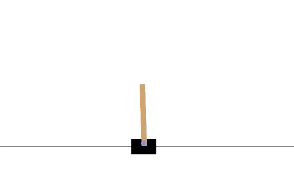
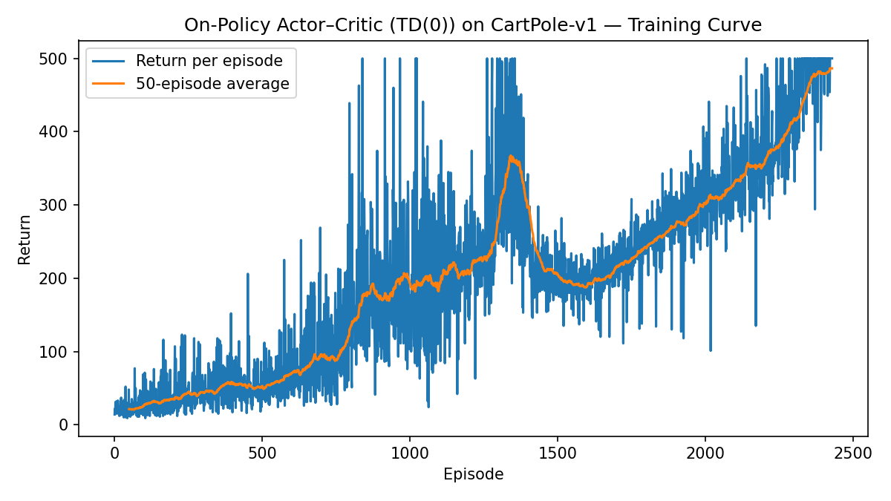

# Policy Gradient Methods {#policy-gradient}

In Chapter \@ref(value-rl), we relaxed two key assumptions of the MDP introduced in Chapter \@ref(mdp):

- **Unknown dynamics**: the transition function $P$ was no longer assumed to be known.  
- **Continuous states**: the state space $\mathcal{S}$ was extended from finite to continuous.

When only the dynamics are unknown but the MDP remains tabular, we introduced generalized versions of policy iteration (e.g., SARSA) and value iteration (e.g., Q-learning). These algorithms can recover near-optimal value functions with strong convergence guarantees.

When both the dynamics are unknown and the state space is continuous, tabular methods become infeasible. In this setting, we employed function approximation to represent value functions, and generalized SARSA and Q-learning accordingly. We also introduced stabilization techniques such as experience replay and target networks to ensure more reliable learning.

---

In this chapter, we relax a third assumption: the action space $\mathcal{A}$ is also continuous. This setting captures many important real-world systems, such as autonomous vehicles and robots. Handling continuous actions requires a departure from the value-based methods of Chapter \@ref(value-rl). The key difficulty is that even if we had access to a near-optimal action-value function $Q(s,a)$, selecting the control action requires solving
\[
\max_a Q(s,a),
\]
which is often computationally expensive and can lead to suboptimal solutions.

To address this challenge, we introduce a new paradigm: policy gradient methods. Rather than learning value functions to derive policies indirectly, we directly optimize parameterized policies using gradient-based methods.

We begin this chapter by reviewing the fundamentals of gradient-based optimization, and then build upon them to develop algorithms for searching optimal policies via policy gradients.

## Gradient-based Optimization {#gradient-optimization}

Gradient-based optimization is the workhorse behind most modern machine learning algorithms, including policy gradient methods. The central idea is to iteratively update the parameters of a model in the direction that most improves an objective function.

### Basic Setup

Suppose we have a differentiable objective function $J(\theta)$, where $\theta \in \mathbb{R}^d$ represents the parameter vector. The goal is to find
\[
\theta^\star \in \arg\max_\theta J(\theta).
\]

The gradient of the objective with respect to the parameters,
\[
\nabla_\theta J(\theta) = 
\begin{bmatrix}
\frac{\partial J}{\partial \theta_1} &
\frac{\partial J}{\partial \theta_2} &
\cdots &
\frac{\partial J}{\partial \theta_d}
\end{bmatrix}^\top,
\]
provides the local direction of steepest ascent. Gradient-based optimization uses this direction to iteratively update the parameters. Note that modern machine learning software tools such as PyTorch allow the user to conveniently query the gradient of any function $J$ defined by neural networks. 

### Gradient Ascent and Descent

The simplest method is **gradient ascent** (for maximization):
\[
\theta_{k+1} = \theta_k + \alpha \nabla_\theta J(\theta_k),
\]
where $\alpha > 0$ is the learning rate.  
For minimization, the update rule uses **gradient descent**:
\[
\theta_{k+1} = \theta_k - \alpha \nabla_\theta J(\theta_k).
\]

The choice of learning rate $\alpha$ is critical:  

- Too large $\alpha$ can cause divergence.  
- Too small $\alpha$ leads to slow convergence.  


#### Convergence Guarantees

For convex functions $J(\theta)$, gradient descent (or ascent) can be shown to converge to the **global optimum** under appropriate conditions on the learning rate. 

For non-convex functions—which are common in reinforcement learning—gradient methods may only find so-called **first-order stationary points**, i.e., points $\theta$ at which the gradient $\nabla_\theta J(\theta) = 0$. Nevertheless, they remain effective in practice.

[TODO: graph different stationary points]{.red}

We now formalize the convergence speed of Gradient Descent (GD) for minimizing a smooth convex function. We switch to the minimization convention and write the objective as $f:\mathbb{R}^d \to \mathbb{R}$ (to avoid sign confusions with $J$ used for maximization). We assume exact gradients $\nabla f(\theta)$ are available.

**Setup and Assumptions.**

- (**Convexity**) For all $\theta,\vartheta\in\mathbb{R}^d$,
  \begin{equation}
  f(\vartheta) \;\ge\; f(\theta) + \nabla f(\theta)^\top(\vartheta-\theta).
  (\#eq:PG-GO-convexity)
  \end{equation}

- (**$L$-smoothness**) The gradient is $L$-Lipschitz: for all $\theta,\vartheta$,
  \begin{equation}
  \|\nabla f(\vartheta)-\nabla f(\theta)\| \;\le\; L\|\vartheta-\theta\|.
  (\#eq:PG-GO-Lsmooth)
  \end{equation}
  Equivalently (the **descent lemma**), for all $\theta,\Delta$,
  \begin{equation}
  f(\theta+\Delta) \;\le\; f(\theta) + \nabla f(\theta)^\top \Delta + \frac{L}{2}\|\Delta\|^2.
  (\#eq:PG-GO-descent-lemma)
  \end{equation}

Consider Gradient Descent with a constant stepsize $\alpha>0$:
\[
\theta_{k+1} \;=\; \theta_k \;-\; \alpha\, \nabla f(\theta_k).
\]

::: {.theorembox}
::: {.theorem #gd-convex-smooth name="GD on smooth convex function"}
Let $f$ be convex and $L$-smooth with a minimizer 
$$
\theta^\star\in\arg\min_\theta f(\theta).
$$
and the global minimum $f^\star = f(\theta^\star)$.
If $0<\alpha\le \frac{2}{L}$, then the GD iterates satisfy for all $k\ge 0$:
\begin{equation}
f(\theta_k) - f^\star \leq \frac{2 (f(\theta_0) - f^\star) \Vert \theta_0 - \theta^\star \Vert^2 }{2 \Vert \theta_0 - \theta^\star \Vert^2 + k\alpha ( 2 - L \alpha) (f(\theta_0) - f^\star)}
(\#eq:GD-SmoothConvex-Value)
\end{equation}
In particular, choosing $\alpha=\frac{1}{L}$ yields the canonical $O(1/k)$ convergence rate in suboptimality:
\begin{equation}
f(\theta_k) - f^\star \leq \frac{2L \Vert \theta_0 - \theta^\star \Vert^2}{k+4}
(\#eq:GD-SmoothConvex-optimal-rate)
\end{equation}
:::
:::
::: {.proofbox}
::: {.proof}
See Theorem 2.1.14 and Corollary 2.1.2 in [@nesterov2018lectures].
:::
:::

**Strongly Convex Case (Linear Rate).** If, in addition, $f$ is $\mu$-strongly convex ($\mu>0$), i.e., for all $\theta,\vartheta\in\mathbb{R}^d$,
\begin{equation}
f(\vartheta)\;\ge\; f(\theta) + \nabla f(\theta)^\top(\vartheta-\theta) \;+\; \frac{\mu}{2}\,\|\vartheta-\theta\|^2.
(\#eq:PG-GO-strongly-convex)
\end{equation}
Then, GD with $0<\alpha\le \frac{2}{\mu + L}$ enjoys a **linear** (geometric) rate:

::: {.theorembox}
::: {.theorem #gd-strongly-convex name="GD on smooth strongly convex function"}
If $f$ is $L$-smooth and $\mu$-strongly convex, then for $0<\alpha\le \frac{2}{\mu + L}$,
\begin{equation}
\Vert \theta_k - \theta^\star \Vert^2 \leq \left( 1 - \frac{2\alpha \mu L}{\mu + L} \right)^k \Vert \theta_0 - \theta^\star \Vert^2.
(\#eq:GD-Strongly-Convex-1)
\end{equation}
If $\alpha = \frac{2}{\mu + L}$, then 
\begin{equation}
\begin{split}
\Vert \theta_k - \theta^\star \Vert & \leq \left( \frac{Q_f - 1}{Q_f + 1} \right)^k \Vert \theta_0 - \theta^\star \Vert \\
f(\theta_k) - f^\star & \leq \frac{L}{2} \left( \frac{Q_f - 1}{Q_f + 1} \right)^{2k} \Vert \theta_0 - \theta^\star \Vert^2,
\end{split}
(\#eq:GD-Strongly-Convex-2)
\end{equation}
where $Q_f = L/\mu$.
:::
:::
::: {.proofbox}
::: {.proof}
See Theorem 2.1.15 in [@nesterov2018lectures].
:::
:::

**Practical Notes.**

- The step size $\alpha=\frac{1}{L}$ is **optimal among fixed stepsizes** for the above worst-case bounds on smooth convex $f$.  

- In practice, backtracking line search or adaptive schedules can approach similar behavior without knowing $L$.  

- For policy gradients (which maximize $J$), apply the results to $f=-J$ and flip the update sign (gradient ascent). The smooth/convex assumptions rarely hold globally in RL, but these results calibrate expectations about step sizes and motivate variance reduction and curvature-aware methods used later.


### Stochastic Gradients

In reinforcement learning and other large-scale machine learning problems, computing the exact gradient $\nabla_\theta J(\theta)$ is often infeasible. Instead, we use an unbiased estimator $\hat{\nabla}_\theta J(\theta)$ computed from a subset of data (or trajectories in RL). The update becomes
\[
\theta_{k+1} = \theta_k + \alpha \hat{\nabla}_\theta J(\theta_k).
\]

This approach, known as **stochastic gradient ascent/descent (SGD)**, trades off exactness for computational efficiency. Variance in the gradient estimates plays an important role in convergence speed and stability.

#### Convergence Guarantees

We now turn to the convergence guarantees of stochastic gradient methods, which replace exact gradients with unbiased noisy estimates. Throughout this section we consider the minimization problem $\min_\theta f(\theta)$ and assume $\nabla f$ is available only through a stochastic oracle.

**Setup and Assumptions.**

Let $f:\mathbb{R}^d\!\to\!\mathbb{R}$ be differentiable. At iterate $\theta_k$, we observe a random vector $g_k$ such that
\[
\mathbb{E}[\,g_k \mid \theta_k\,] = \nabla f(\theta_k)
\quad\text{and}\quad
\mathbb{E}\!\left[\|g_k-\nabla f(\theta_k)\|^2 \mid \theta_k\right] \le \sigma^2.
\]
We will also use one of the following standard regularity conditions:

- (**Convex + $L$-smooth**) $f$ is convex and the gradient is $L$-Lipschitz.  
- (**Strongly convex + $L$-smooth**) $f$ is $\mu$-strongly convex and $L$-smooth.

We consider the SGD update
\[
\theta_{k+1} \;=\; \theta_k - \alpha_k\, g_k,
\]
and define the **averaged iterate** 
$$
\bar\theta_K := \frac{1}{K+1}\sum_{k=0}^{K}\theta_k.
$$

::: {.theorembox}
::: {.theorem #sgd-convex-rate name="SGD on smooth convex function"}  
Assume $f$ is convex and $L$-smooth. Suppose there exists $G\!>\!0$ with $\mathbb{E}\|g_k\|^2 \le G^2$ for all $k$. 

- Choose a constant stepsize $\alpha_k = \alpha > 0$. Then for all $K \ge 1$,
\begin{equation}
\mathbb{E}\big[f(\bar\theta_K)\big] - f^\star \leq \frac{\Vert \theta_0 - \theta^\star \Vert^2}{2 \alpha (K+1)} + \frac{\alpha G^2}{2}.
(\#eq:SGD-convex-fixed-step-size)
\end{equation}

- Choose a diminishing step size $\alpha_k = \frac{\Vert \theta_0 - \theta^\star \Vert}{G \sqrt{k+1}}$, then
\begin{equation}
\mathbb{E}\big[f(\bar\theta_K)\big] - f^\star \leq \frac{\Vert \theta_0 - \theta^\star \Vert G}{\sqrt{K+1}} = \mathcal{O}\left(  \frac{1}{\sqrt{K}} \right).
(\#eq:SGD-convex-diminishing-step-size)
\end{equation}
:::
:::
::: {.proofbox}
::: {.proof}
See this [lecture note](https://people.eecs.berkeley.edu/~jiantao/227c2022spring/scribe/227C_Lecture_24.pdf) and [@garrigos2023handbook].
:::
:::

**Remarks.**

- The bound is on the *averaged* iterate $\bar\theta_K$ (the last iterate may be worse by constants without further assumptions).

- Replacing the second-moment bound by a variance bound $\sigma^2$ yields the same rate with $G^2$ replaced by $\sigma^2 + \sup_k\|\nabla f(\theta_k)\|^2$.

- With a constant stepsize, SGD converges $\mathcal{O}(1/k)$ up to a neighborhood set by the gradient noise.

The next theorem states the convergence rate of SGD for minimizing strongly convex functions.

::: {.theorembox}
::: {.theorem #sgd-strong-rate name="SGD on smooth strongly convex function"} 
Assume $f$ is $\mu$-strongly convex and $L$-smooth, and $\mathbb{E}\!\left[\|g_k\|^2 \right]\le G^2$.  
With stepsize $\alpha_k = \frac{1}{\mu(k+1)}$, the SGD iterates satisfy for all $K\!\ge\!1$,
\begin{equation}
\begin{split}
\mathbb{E}[f(\bar\theta_K)] - f^\star & \leq \frac{G^2}{2 \mu (K+1)} (1 + \log(K+1)), \\
\mathbb{E} \Vert \bar\theta_K - \theta^\star \Vert^2 & \leq \frac{Q}{K+1}, \ \ Q = \max \left( \frac{G^2}{\mu^2}, \Vert \theta_0 - \theta^\star \Vert^2 \right).
\end{split}
(\#eq:SGD-Strongly-Convex)
\end{equation}
:::
:::
::: {.proofbox}
::: {.proof}
See this [lecture note](https://people.eecs.berkeley.edu/~jiantao/227c2022spring/scribe/227C_Lecture_24.pdf) and [@garrigos2023handbook].
:::
:::

**Practical Takeaways for Policy Gradients.**

- Use **diminishing stepsizes** for theoretical convergence ($\alpha_k \propto 1/\sqrt{k}$ for general convex, $\alpha_k \propto 1/k$ for strongly convex surrogates).  

- With **constant stepsizes**, expect fast initial progress down to a variance-limited plateau; lowering variance (e.g., via baselines/advantage estimation) is as important as tuning $\alpha$. 

[TODO: graph the different trajectories between minimizing a convex function using GD and SGD.]{.red}


### Beyond Vanilla Gradient Methods

Several refinements to basic gradient updates are widely used:

- **Momentum methods**: incorporate past gradients to smooth updates and accelerate convergence.
- **Adaptive learning rates (Adam, RMSProp, AdaGrad)**: adjust the learning rate per parameter based on historical gradient magnitudes.
- **Second-order methods**: approximate or use curvature information (the Hessian) for more informed updates, though often impractical in high dimensions.


## Policy Gradients

Policy gradients optimize a *parameterized stochastic policy* directly, without requiring an explicit action-value maximization step. They are applicable to both finite and continuous action spaces and are especially useful when actions are continuous or when "$\arg\max$" over $Q(s,a)$ is costly or ill-posed.

### Setup

We consider a Markov decision process (MDP) with (possibly continuous) state space $\mathcal{S}$, action space $\mathcal{A}$, unknown dynamics $P$, reward function $R(s,a)$, and discount factor $\gamma\in[0,1)$. Let $\pi_\theta(a\mid s)$ be a differentiable stochastic policy with parameters $\theta\in\mathbb{R}^d$.

- **Trajectory.** A state-action trajectory is $\tau=(s_0,a_0,s_1,a_1,\dots,s_{T})$ with probability density/mass
  \begin{equation}
  p_\theta(\tau) = \rho(s_0)\prod_{t=0}^{T-1} \pi_\theta(a_t\mid s_t)\,P(s_{t+1}\mid s_t,a_t),
  (\#eq:trajectory-density)
  \end{equation}
  where $\rho$ is the initial state distribution and $T$ is the (random or fixed) episode length.
- **Return.** Define the (discounted) return
\begin{equation}
R(\tau) \;=\; \sum_{t=0}^{T-1}\gamma^t R(s_t,a_t), 
(\#eq:PG-Trajectory-Return)
\end{equation}
and the return-to-go
\begin{equation}
g_t \;=\; \sum_{t'=t}^{T-1}\gamma^{t'-t} R(s_{t'},a_{t'}).
(\#eq:PG-return-to-go)
\end{equation}

- **Optimization objective.** The goal is to maximize the expected return
\begin{equation}
J(\theta) \;\equiv\; \mathbb{E}_{\tau\sim p_\theta}\!\left[R(\tau)\right]
  \;=\; \mathbb{E}\!\left[\sum_{t=0}^{T-1}\gamma^t R(s_t,a_t)\right],
(\#eq:PG-objective)
\end{equation}
where the expectation is taken over the randomness in (i) the initial state $s_0 \sim \rho$, (ii) the policy $\pi_\theta$, and (iii) the transition dynamics $P$.

#### Policy models

- **Finite action spaces ($\mathcal{A}$ discrete).** A common choice is a **softmax (categorical) policy** over a score (logit) function $f_\theta(s,a)$:
  \begin{equation}
  \pi_\theta(a\mid s)
  \;=\;
  \frac{\exp\{f_\theta(s,a)\}}{\sum_{a'\in\mathcal{A}}\exp\{f_\theta(s,a')\}}.
  (\#eq:finite-action-policy)
  \end{equation}
  Here we use $\exp\{f_\theta(s,a)\} = e^{f_\theta(s,a)}$ for pretty formatting. Typically $f_\theta$ is a neural network or a linear function over features.

- **Continuous action spaces ($\mathcal{A}\subseteq\mathbb{R}^m$).** A standard choice is a **Gaussian policy**:
  \begin{equation}
  \pi_\theta(a\mid s) \;=\; \mathcal{N}\!\big(a;\;\mu_\theta(s),\,\Sigma_\theta(s)\big),
  (\#eq:continuous-action-policy)
  \end{equation}
  where $\mu_\theta(s)$ and (often diagonal) covariance $\Sigma_\theta(s)$ are differentiable functions (e.g., neural networks) parameterized by $\theta$. The policy $\pi_\theta(a \mid s)$ samples actions from the Gaussian parameterized by $\mu_\theta(s)$ and $\Sigma_\theta(s)$. Other choices include squashed Gaussians (e.g., $\tanh$) or Beta distributions for bounded actions.

### The Policy Gradient Lemma

With the gradient-based optimization machinery from Section \@ref(gradient-optimization), a natural strategy for the policy optimization problem in \@ref(eq:PG-objective) is gradient ascent on the objective $J(\theta)$.
Consequently, the central task is to characterize the ascent direction, i.e., to compute $\nabla_\theta J(\theta)$.

The policy gradient lemma, stated below, provides exactly this characterization. Crucially, it expresses $\nabla_\theta J(\theta)$ in terms of the policy's score function $\nabla_\theta \log \pi_\theta(a\mid s)$ and returns, without differentiating through the environment dynamics. This likelihood-ratio form makes policy optimization feasible even when the transition model is unknown or non-differentiable.

::: {.theorembox}
::: {.theorem #policy-gradient-lemma name="Policy Gradient Lemma"}
Let $J(\theta)=\mathbb{E}_{\tau \sim p_\theta}[R(\tau)]$ as defined in \@ref(eq:PG-objective) Then:
\begin{equation}
\nabla_\theta J(\theta)
\;=\;
\mathbb{E}_{\tau\sim p_\theta} \Big[R(\tau)\,\nabla_\theta \log p_\theta(\tau)\Big]
\;=\;
\mathbb{E}_{\tau\sim p_\theta} \Bigg[\sum_{t=0}^{T-1}
\nabla_\theta \log \pi_\theta(a_t\mid s_t)\;R(\tau)\Bigg].
(\#eq:PG-PGLemma-1)
\end{equation}
By causality (future action does not affect past reward), the full return can be replaced by return-to-go:
\begin{equation}
\nabla_\theta J(\theta)
\;=\;
\mathbb{E}_{\tau\sim p_\theta} \Bigg[\sum_{t=0}^{T-1} \gamma^t
\nabla_\theta \log \pi_\theta(a_t\mid s_t)\;g_t\Bigg].
(\#eq:PG-PGLemma-2)
\end{equation}
Equivalently, using value functions,
\begin{equation}
\nabla_\theta J(\theta)
\;=\;
 \frac{1}{1-\gamma} \mathbb{E}_{s\sim d_\theta,\;a\sim\pi_\theta} \Big[\nabla_\theta \log \pi_\theta(a\mid s)\,Q^{\pi_\theta}(s,a)\Big],
(\#eq:PG-PGLemma-3)
\end{equation}
where $d_\theta$ is the (discounted) on-policy state visitation distribution for infinite-horizon MDPs:
\begin{equation}
d_\theta(s) = (1 - \gamma) \sum_{t=0}^{\infty} \gamma^t \Pr_\theta(s_t=s).
(\#eq:state-visitation-distribution)
\end{equation}
:::
:::
::: {.proof}
We prove the three equivalent forms step by step. Throughout, we assume $\theta$ parameterizes only the policy $\pi_\theta$ (not the dynamics $P$ nor the initial distribution $\rho$), and that interchanging $\nabla_\theta$ with the trajectory integral/sum is justified (e.g., bounded rewards and finite horizon or standard dominated-convergence conditions). 
Let the return-to-go $g_t$ be defined as in \@ref(eq:PG-return-to-go).

**Step 1 (Log-derivative trick).** Write the objective as an expectation over trajectories:
\[
J(\theta) \;=\; \int R(\tau)\, p_\theta(\tau)\, d\tau.
\]
Differentiate under the integral and use
\begin{equation}
\nabla_\theta p_\theta(\tau)=p_\theta(\tau)\nabla_\theta\log p_\theta(\tau)
(\#eq:log-derivative-trick)
\end{equation}
we can write:
\[
\nabla_\theta J(\theta)
= \int R(\tau)\,\nabla_\theta p_\theta(\tau)\, d\tau
= \int R(\tau)\, p_\theta(\tau)\,\nabla_\theta \log p_\theta(\tau)\, d\tau
= \mathbb{E}_{\tau\sim p_\theta}\!\big[R(\tau)\,\nabla_\theta \log p_\theta(\tau)\big],
\]
which is \@ref(eq:PG-PGLemma-1) up to expanding $\log p_\theta(\tau)$. To see why \@ref(eq:log-derivative-trick) is true, write
$$
\nabla_\theta \log p_\theta(\tau) = \frac{1}{p_\theta(\tau)} \nabla_\theta p_\theta(\tau),
$$
using the chain rule.

**Step 2 (Policy-only dependence).** Factor the trajectory likelihood/mass:
\[
p_\theta(\tau)
= \rho(s_0)\,\prod_{t=0}^{T-1}\pi_\theta(a_t\mid s_t)\,P(s_{t+1}\mid s_t,a_t).
\]
Since $\rho$ and $P$ do not depend on $\theta$,
\[
\log p_\theta(\tau)
= \text{const} \;+\; \sum_{t=0}^{T-1}\log \pi_\theta(a_t\mid s_t)
\quad\Rightarrow\quad
\nabla_\theta \log p_\theta(\tau) \;=\; \sum_{t=0}^{T-1}\nabla_\theta \log \pi_\theta(a_t\mid s_t).
\]
Substitute into Step 1 to obtain the second equality in \@ref(eq:PG-PGLemma-1):
\[
\nabla_\theta J(\theta)
= \mathbb{E}_{\tau\sim p_\theta}\!\Bigg[\sum_{t=0}^{T-1}\nabla_\theta \log \pi_\theta(a_t\mid s_t)\,R(\tau)\Bigg].
\]

**Step 3 (Causality $\Rightarrow$ return-to-go).** Expand $R(\tau)=\sum_{t=0}^{T-1}\gamma^{t} r_{t}$ (with $r_{t}:=R(s_{t},a_{t})$) and swap sums:
\[
\mathbb{E} \Bigg[\sum_{t=0}^{T-1}\nabla_\theta \log \pi_\theta(a_t\mid s_t)\,R(\tau)\Bigg]
=
\sum_{t=0}^{T-1}\sum_{t'=0}^{T-1}\mathbb{E} \big[\nabla_\theta \log \pi_\theta(a_t\mid s_t)\,\gamma^{t'} r_{t'}\big].
\]
For $t'<t$, the factor $\gamma^{t'} r_{t'}$ is measurable w.r.t. the history $\mathcal{F}_t=\sigma(s_0,a_0,\dots,s_t)$, while
\[
\mathbb{E} \big[\nabla_\theta \log \pi_\theta(a_t\mid s_t)\,\big|\,\mathcal{F}_t\big]
= \sum_{a} \pi_\theta(a\mid s_t)\,\nabla_\theta \log \pi_\theta(a\mid s_t) = \nabla_\theta \sum_{a}\pi_\theta(a\mid s_t) = \nabla_\theta 1 = 0,
\]
(and analogously with integrals for continuous $\mathcal{A}$). Hence by the tower property,
\[
\mathbb{E} \big[\nabla_\theta \log \pi_\theta(a_t\mid s_t)\,\gamma^{t'} r_{t'}\big]=0\quad\text{for all }t'<t.
\]
Therefore only the terms with $t'\ge t$ survive, and
\[
\nabla_\theta J(\theta)
= \sum_{t=0}^{T-1}\mathbb{E} \Big[\nabla_\theta \log \pi_\theta(a_t\mid s_t)\,\sum_{t'=t}^{T-1}\gamma^{t'} r_{t'}\Big]
= \mathbb{E} \Bigg[\sum_{t=0}^{T-1} \gamma^t \nabla_\theta \log \pi_\theta(a_t\mid s_t)\,g_t\Bigg],
\]
which is \@ref(eq:PG-PGLemma-2).

**Step 4 (Value-function form).** Condition on $(s_t,a_t)$ and use the definition of the action-value function:
\[
Q^{\pi_\theta}(s_t,a_t) \;\equiv\; \mathbb{E}\!\left[g_t \,\middle|\, s_t,a_t\right].
\]
Taking expectations then yields
\[
\mathbb{E} \big[\gamma^t \nabla_\theta \log \pi_\theta(a_t\mid s_t)\,g_t\big]
= \mathbb{E} \big[\gamma^t \nabla_\theta \log \pi_\theta(a_t\mid s_t)\,Q^{\pi_\theta}(s_t,a_t)\big].
\]
Summing over $t$ and collecting terms with the (discounted) on-policy state visitation distribution $d_\theta$ (for the infinite-horizon case, e.g., $d_\theta(s)=(1-\gamma)\sum_{t=0}^\infty \gamma^t\,\Pr_\theta(s_t=s)$; for finite $T$, use the corresponding finite-horizon weighting), we obtain
\[
\nabla_\theta J(\theta)
\;=\;
\mathbb{E}_{s\sim d_\theta,\;a\sim \pi_\theta} \Big[\nabla_\theta \log \pi_\theta(a\mid s)\,Q^{\pi_\theta}(s,a)\Big],
\]
which is \@ref(eq:PG-PGLemma-3).

**Conclusion.** Combining Steps 1–4 proves all three stated forms of the policy gradient.
:::


### REINFORCE

The policy gradient lemma immediately gives us an algorithm. Specifically, the gradient receipe in \@ref(eq:PG-PGLemma-1) tells us that if we generate one trajectory $\tau$ by following the policy $\pi$, then
\begin{equation}
\widehat{\nabla_\theta J} = \sum_{t=0}^{T-1} \nabla_\theta \log \pi_\theta(a_t \mid s_t) R(\tau)
(\#eq:PG-Estimator-1)
\end{equation}
is an unbiased estimator of the true gradient. 

With this sample gradient estimator, we obtain the classical REINFORCE algorithm.

::: {.highlightbox}

<div style="text-align: center;">
**Single-Trajectory (Naive) REINFORCE**
</div>

1. Initialize $\theta_0$ for the initial policy $\pi_{\theta_0}(a \mid s)$
2. For $k=0,1,\dots,$ do:
 - Obtain a trajectory $\tau \sim p_{\theta_k}$
 - Compute the stochastic gradient $g_k$ as in \@ref(eq:PG-Estimator-1)
 - Update $\theta_{k+1} = \theta_k + \alpha_k g_k$
:::

To reduce variance of the gradient estimator, we can use a minibatch of trajectories. For example, given a batch of $N$ trajectories $\{\tau^{(i)}\}_{i=1}^N$ collected by $\pi_\theta$, define for each timestep the return-to-go
\[
g_t^{(i)} = \sum_{t'=t}^{T^{(i)}-1} \gamma^{t'-t} R\!\left(s_{t'}^{(i)},a_{t'}^{(i)}\right).
\]
An unbiased gradient estimator, from \@ref(eq:PG-PGLemma-2) is
\begin{equation}
\widehat{\nabla_\theta J}
\;=\;
\frac{1}{N}\sum_{i=1}^N \sum_{t=0}^{T^{(i)}-1} \gamma^t
\nabla_\theta \log \pi_\theta \big(a_t^{(i)}\mid s_t^{(i)}\big) g_t^{(i)}.
(\#eq:PG-Estimator-2)
\end{equation}

This leads to the following minibatch REINFORCE algorithm.

::: {.highlightbox}

<div style="text-align: center;">
**Minibatch REINFORCE**
</div>

1. Initialize $\theta_0$ for the initial policy $\pi_{\theta_0}(a \mid s)$
2. For $k=0,1,\dots,$ do:
 - Obtain N trajectories $\{ \tau^{(i)} \}_{i=1}^N \sim p_{\theta_k}$
 - Compute the stochastic gradient $g_k$ as in \@ref(eq:PG-Estimator-2)
 - Update $\theta_{k+1} = \theta_k + \alpha_k g_k$
:::


We apply both the single-trajectory (naive) REINFORCE and a minibatch variant to the CartPole-v1 balancing task. The results show that variance reduction via minibatching is crucial for stable learning and for obtaining strong policies with policy-gradient methods.

::: {.examplebox}
::: {.example #cartpole-reinforce name="REINFORCE for Cart-Pole Balancing"}

Consider the cart-pole balancing task illustrated in Fig. \@ref(fig:cart-pole-illustration). A pole is attached by an un-actuated joint to a cart, which moves along a frictionless track. The pendulum is placed upright on the cart and the goal is to balance the pole by applying forces in the left and right direction on the cart.

```{r cart-pole-illustration, out.width='60%', fig.show='hold', fig.cap='Cart Pole balance.', fig.align='center', echo=FALSE}
knitr::include_graphics('images/Policy-Gradients/cart_pole.gif')
```

**State Space.** The state of the cart-pole system is denoted by $s \in \mathcal{S} \subset \mathbb{R}^4$, containing the position and velocity of the cart, as well as the angle and angular velocity of the pole. 

**Action Space.** The action space $\mathcal{A}$ is discrete and contains two elements: pushing to the left and pushing to the right.

The dynamics of the MDP is provided by the [Gym simulator](https://gymnasium.farama.org/environments/classic_control/cart_pole/) and is described in the original paper [@barto2012neuronlike]. At the beginning of the episode, all state variables are randomly initialized in $[-0.05,0.05]$ and the goal for the agent is to apply the actions to balance the cart-pole for as long as possible---the agent gets a reward of $+1$ every step if (1) the pole angle remains between $-12^\circ$ and $+12^\circ$ and (2) the cart position remains between $-2.4$ and $2.4$. The maximum episode length is $500$.

We design a policy network in the form of \@ref(eq:finite-action-policy) since the action space is finite.

**REINFORCE.** We first apply the naive REINFORCE algorithm where the gradient estimator is computed from a single trajectory as in \@ref(eq:PG-Estimator-1). Fig. \@ref(fig:cart-pole-learning-curve-reinforce) shows the learning curve, which indicates that the REINFORCE algorithm was not able to learn a good policy after 2000 episodes.

```{r cart-pole-learning-curve-reinforce, out.width='60%', fig.show='hold', fig.cap='Learning curve (Naive REINFORCE).', fig.align='center', echo=FALSE}
knitr::include_graphics('images/Policy-Gradients/cartpole_returns_reinforce.png')
```

**Minibatch REINFORCE.** We then apply the minibatch REINFORCE algorithm where the gradient estimator is computed from multiple ($20$ in our case) trajectories as in \@ref(eq:PG-Estimator-2). Fig. \@ref(fig:cart-pole-learning-curve-minibatch-reinforce) shows the learning curve, which shows steady increase in the per-episode return that eventually gets close to the maximum per-episode return $500$.

Fig. \@ref(fig:cart-pole-policy-rollout-minibatch-reinforce) shows a rollout video of applying the policy training from minibatch REINFORCE. We can see the policy nicely balances the cart-pole system.

You can play with the code [here](https://github.com/ComputationalRobotics/2025-ES-AM-158-LECTURE-CODE/blob/main/cartpole_reinforce.py).

```{r cart-pole-learning-curve-minibatch-reinforce, out.width='60%', fig.show='hold', fig.cap='Learning curve (Minibatch REINFORCE).', fig.align='center', echo=FALSE}
knitr::include_graphics('images/Policy-Gradients/cartpole_returns_minibatch_reinforce.png')
```

```{r cart-pole-policy-rollout-minibatch-reinforce, out.width='60%', fig.show='hold', fig.cap='Policy rollout (Minibatch REINFORCE).', fig.align='center', echo=FALSE}
knitr::include_graphics('images/Policy-Gradients/cartpole_policy_rollout_minibatch_reinforce.gif')
```

:::
:::

### Baselines and Variance Reduction

From the REINFORCE experiments above, we have seen firsthand that **variance reduction** is critical for stable policy-gradient learning.  

A natural question is: *what framework can we use to systematically reduce the variance of the gradient estimator while preserving unbiasedness?*

#### Baseline

A key device is a **baseline** $b:\mathcal{S}\to\mathbb{R}$ added at each timestep:
\begin{equation}
\widehat{g}
\;=\;
\sum_{t=0}^{T-1} \gamma^t\,\nabla_\theta \log \pi_\theta(a_t\mid s_t)\,\big(g_t - b(s_t)\big).
(\#eq:baseline-estimator)
\end{equation}

The only difference between \@ref(eq:baseline-estimator) and the original gradient estimator \@ref(eq:PG-PGLemma-2) is that the baseline $b(s_t)$ is subtracted from the return-to-go $g_t$. The next theorem states that any state-only baseline does not change the expectation of the gradient estimator.

::: {.theorembox}
::: {.theorem #baseline-invariance name="Baseline Invariance"}
Let $b:\mathcal{S}\to\mathbb{R}$ be any function independent of the action $a_t$. Then
\[
\mathbb{E}\!\left[\sum_{t=0}^{T-1} \gamma^t \nabla_\theta \log \pi_\theta(a_t\mid s_t)\,b(s_t)\right]=0,
\]
and thus
\begin{equation}
\nabla_\theta J(\theta) \;=\; 
\mathbb{E}\!\left[\sum_{t=0}^{T-1} \gamma^t \nabla_\theta \log \pi_\theta(a_t\mid s_t)\,\big(g_t - b(s_t)\big)\right].
(\#eq:PG-baseline-form)
\end{equation}

Equivalently, using action-values,
\begin{equation}
\nabla_\theta J(\theta)
=
\frac{1}{1-\gamma}\,
\mathbb{E}_{s\sim d_\theta,\;a\sim\pi_\theta}
\!\Big[\nabla_\theta \log \pi_\theta(a\mid s)\,\big(Q^{\pi_\theta}(s,a)-b(s)\big)\Big].
(\#eq:baseline-estimator-Qvalue)
\end{equation}
:::
:::
::: {.proofbox}
::: {.proof}
We prove (i) the baseline term has zero expectation, (ii) the baseline-subtracted estimator in \@ref(eq:PG-baseline-form) is unbiased, and (iii) the equivalent $Q$-value form \@ref(eq:baseline-estimator-Qvalue).

Throughout we assume standard conditions ensuring interchange of expectation and differentiation (e.g., bounded rewards with finite horizon or discounted infinite horizon, and a differentiable policy).


**Step 1 (Score-function expectation is zero).** Fix a state $s\in\mathcal{S}$. The **score function** integrates/sums to zero under the policy:
\begin{equation}
\begin{split}
\mathbb{E}_{a\sim \pi_\theta(\cdot\mid s)}\!\big[\nabla_\theta \log \pi_\theta(a\mid s)\big]
& =
\sum_{a\in\mathcal{A}} \pi_\theta(a\mid s)\,\nabla_\theta \log \pi_\theta(a\mid s)
=
\sum_{a\in\mathcal{A}} \nabla_\theta \pi_\theta(a\mid s) \\
& = 
\nabla_\theta \sum_{a\in\mathcal{A}} \pi_\theta(a\mid s)
=
\nabla_\theta 1
=
0,
\end{split}
\end{equation}
with the obvious replacement of sums by integrals for continuous $\mathcal{A}$. This identity is the standard "score has zero mean" property.

**Step 2 (Baseline term has zero expectation).** Let $\mathcal{F}_t := \sigma(s_0,a_0,\ldots,s_t)$ be the history up to time $t$ and recall that $b(s_t)$ is **independent of** $a_t$. Using iterated expectations:
\[
\mathbb{E}\!\left[\gamma^t \nabla_\theta \log \pi_\theta(a_t\mid s_t)\,b(s_t)\right]
=
\mathbb{E}\!\left[
\gamma^t\, b(s_t)\,
\underbrace{\mathbb{E}\!\left[\nabla_\theta \log \pi_\theta(a_t\mid s_t)\,\middle|\, s_t\right]}_{=\,0~\text{by Step 1}}
\right]
= 0.
\]
Summing over $t$ yields
\[
\mathbb{E}\!\left[\sum_{t=0}^{T-1} \gamma^t \nabla_\theta \log \pi_\theta(a_t\mid s_t)\,b(s_t)\right]=0.
\]


**Step 3 (Unbiasedness of the baseline-subtracted estimator).** By the policy gradient lemma (likelihood-ratio form with return-to-go; see \@ref(eq:PG-PGLemma-2)),
\[
\nabla_\theta J(\theta)
=
\mathbb{E}\!\left[\sum_{t=0}^{T-1} \gamma^t \nabla_\theta \log \pi_\theta(a_t\mid s_t)\,g_t\right].
\]
Subtract and add the baseline term inside the expectation:
\[
  \begin{split}
\mathbb{E}\!\left[\sum_{t=0}^{T-1} \gamma^t \nabla_\theta \log \pi_\theta(a_t\mid s_t)\,g_t\right]
& =
\mathbb{E}\!\left[\sum_{t=0}^{T-1} \gamma^t \nabla_\theta \log \pi_\theta(a_t\mid s_t)\,\big(g_t-b(s_t)\big)\right]
\;+\; \\
& \quad \quad \underbrace{\mathbb{E}\!\left[\sum_{t=0}^{T-1} \gamma^t \nabla_\theta \log \pi_\theta(a_t\mid s_t)\,b(s_t)\right]}_{=\,0~\text{by Step 2}}.
\end{split}
\]
Therefore \@ref(eq:PG-baseline-form) holds, proving that **any** state-only baseline preserves unbiasedness.

**Step 4 (Equivalent $Q$-value form).**  Condition on $(s_t,a_t)$ and use the definition $Q^{\pi_\theta}(s_t,a_t):=\mathbb{E}[g_t\mid s_t,a_t]$:
\[
\mathbb{E}\!\big[\gamma^t \nabla_\theta \log \pi_\theta(a_t\mid s_t)\,\big(g_t-b(s_t)\big)\big]
=
\mathbb{E}\!\Big[
\gamma^t\,
\mathbb{E}\!\big[\nabla_\theta \log \pi_\theta(a_t\mid s_t)\,\big(g_t-b(s_t)\big)\mid s_t\big]
\Big].
\]
Inside the inner expectation (over $a_t\sim \pi_\theta(\cdot\mid s_t)$) and using $b(s_t)$’s independence from $a_t$,
\[
\mathbb{E}\!\big[\nabla_\theta \log \pi_\theta(a_t\mid s_t)\,\big(g_t-b(s_t)\big)\mid s_t\big]
=
\mathbb{E}_{a\sim \pi_\theta(\cdot\mid s_t)}\!\Big[\nabla_\theta \log \pi_\theta(a\mid s_t)\,\big(Q^{\pi_\theta}(s_t,a)-b(s_t)\big)\Big].
\]
Summing over $t$ with discount $\gamma^t$ and collecting terms with the (discounted) on-policy state-visitation distribution $d_\theta$ (cf. \@ref(eq:state-visitation-distribution)) yields the infinite-horizon identity
\[
\nabla_\theta J(\theta)
=
\frac{1}{1-\gamma}\,
\mathbb{E}_{s\sim d_\theta,\;a\sim \pi_\theta}\!
\Big[\nabla_\theta \log \pi_\theta(a\mid s)\,\big(Q^{\pi_\theta}(s,a)-b(s)\big)\Big],
\]
which is \@ref(eq:baseline-estimator-Qvalue).
:::
:::

#### Optimal Baseline and Advantage

Among all state-only baselines $b(s)$, which one minimizes the variance of the gradient estimator?

::: {.theorembox}
::: {.theorem #variance-minimizing-baseline name="Variance-Minimizing Baseline (per-state)"} 
For the estimator 
$$
g(s,a)=\nabla_\theta \log \pi_\theta(a\mid s)\,\big(Q^\pi(s,a)-b(s)\big),
$$
the $b(s)$ minimizing $\operatorname{Var}[g\mid s]$ is
\[
b^\star(s)=
\frac{\mathbb{E}_{a\sim \pi_\theta}\!\left[\| \nabla_\theta \log \pi_\theta(a\mid s)\|^2\, Q^\pi(s,a)\right]}
{\mathbb{E}_{a\sim \pi_\theta}\!\left[\| \nabla_\theta \log \pi_\theta(a\mid s)\|^2\right]}.
(\#eq:best-baseline)
\]
Assuming that the norm factor $\Vert \nabla_\theta \log \pi_\theta(a\mid s) \Vert^2$ varies slowly with $a$, then 
$$
b^\star(s) \approx V^\pi(s).
$$
:::
:::
::: {.proofbox}
::: {.proof}
Let $s\in\mathcal{S}$ be fixed and write
\[
u(a\mid s) \;\equiv\; \nabla_\theta \log \pi_\theta(a\mid s)\in\mathbb{R}^d,
\qquad
w(a\mid s) \;\equiv\; \|u(a\mid s)\|^2 \;\ge 0.
\]
Consider the vector-valued random variable
\[
g(s,a) \;=\; u(a\mid s)\,\big(Q^\pi(s,a)-b(s)\big),
\]
where the randomness is over $a\sim \pi_\theta(\cdot\mid s)$.

We aim to choose $b(s)\in\mathbb{R}$ to minimize the **conditional variance**
\[
\operatorname{Var}[g\mid s] \;=\; \mathbb{E}\!\left[\|g(s,a)-\mathbb{E}[g\mid s]\|^2 \,\middle|\, s\right].
\]
Using the identity $\operatorname{Var}[X]=\mathbb{E}\|X\|^2-\|\mathbb{E}X\|^2$ (for vector $X$ with Euclidean norm), we have
\[
\operatorname{Var}[g\mid s]
\;=\;
\underbrace{\mathbb{E}\!\left[\|g(s,a)\|^2 \mid s\right]}_{\text{depends on } b(s)}
\;-\;
\underbrace{\big\|\mathbb{E}[g\mid s]\big\|^2}_{\text{independent of } b(s)}.
\]
We first show that the mean term is independent of $b(s)$. Indeed,
\[
\mathbb{E}[g\mid s]
=
\mathbb{E}_{a\sim\pi_\theta(\cdot\mid s)}\!\big[u(a\mid s)\,\big(Q^\pi(s,a)-b(s)\big)\big]
=
\mathbb{E}\!\big[u(a\mid s)\,Q^\pi(s,a)\big]
\;-\;
b(s)\,\underbrace{\mathbb{E}\!\big[u(a\mid s)\big]}_{=\,0},
\]
where $\mathbb{E}[u(a\mid s)]=\sum_a \pi_\theta(a\mid s)\nabla_\theta\log\pi_\theta(a\mid s)=\nabla_\theta \sum_a \pi_\theta(a\mid s)=\nabla_\theta 1=0$ (replace sums by integrals in the continuous case). Therefore $\mathbb{E}[g\mid s]$ does **not** depend on $b(s)$.

Consequently, minimizing $\operatorname{Var}[g\mid s]$ is equivalent to minimizing the conditional **second moment**
\[
\mathbb{E}\!\left[\|g(s,a)\|^2 \mid s\right]
=
\mathbb{E}\!\left[\|u(a\mid s)\|^2 \,\big(Q^\pi(s,a)-b(s)\big)^2 \,\middle|\, s\right]
=
\mathbb{E}\!\left[w(a\mid s)\,\big(Q^\pi(s,a)-b(s)\big)^2 \,\middle|\, s\right].
\]
The right-hand side is a convex quadratic in the scalar $b(s)$. Differentiate w.r.t. $b(s)$ and set to zero:
\[
\frac{\partial}{\partial b(s)}
\mathbb{E}\!\left[w(a\mid s)\,\big(Q^\pi(s,a)-b(s)\big)^2 \,\middle|\, s\right]
=
-2\,\mathbb{E}\!\left[w(a\mid s)\,\big(Q^\pi(s,a)-b(s)\big)\,\middle|\, s\right]
= 0.
\]
Hence,
\[
\mathbb{E}\!\left[w(a\mid s)\,Q^\pi(s,a)\,\middle|\, s\right]
=
b(s)\,\mathbb{E}\!\left[w(a\mid s)\,\middle|\, s\right],
\]
and provided $\mathbb{E}[w(a\mid s)\mid s]>0$ (i.e., the Fisher information at $s$ is non-degenerate), the unique minimizer is
\[
b^\star(s)
=
\frac{\mathbb{E}_{a\sim\pi_\theta(\cdot\mid s)}\!\left[\| \nabla_\theta \log \pi_\theta(a\mid s)\|^2\, Q^\pi(s,a)\right]}
{\mathbb{E}_{a\sim\pi_\theta(\cdot\mid s)}\!\left[\| \nabla_\theta \log \pi_\theta(a\mid s)\|^2\right]},
\]
which is \@ref(eq:best-baseline). If $\mathbb{E}[w(a\mid s)\mid s]=0$ (e.g., a locally deterministic policy), then $g\equiv 0$ almost surely and any $b(s)$ attains the minimum.

Finally, when the weight $w(a\mid s)=\|\nabla_\theta \log \pi_\theta(a\mid s)\|^2$ varies slowly with $a$ (or is approximately constant) for a fixed $s$, the ratio simplifies to
\[
b^\star(s)\;\approx\;\frac{\mathbb{E}[c(s)\,Q^\pi(s,a)\mid s]}{\mathbb{E}[c(s)\mid s]}
\;=\;
\mathbb{E}_{a\sim \pi_\theta(\cdot\mid s)}\!\big[Q^\pi(s,a)\big]
\;=\;
V^\pi(s),
\]
so that the baseline-subtracted target becomes the **advantage**
$A^\pi(s,a)=Q^\pi(s,a)-V^\pi(s)$.
:::
:::

When using $V^\pi(s)$ as the baseline, the baseline-subtracted target is called the **advantage function**
\begin{equation}
A^{\pi_\theta}(s,a)\;=\;Q^{\pi_\theta}(s,a)-V^{\pi_\theta}(s).
(\#eq:advantage-def)
\end{equation}
The corresponding minibatch gradient estimator becomes
\begin{equation}
\widehat{\nabla_\theta J}
\;=\;
\frac{1}{N}\sum_{i=1}^N \sum_{t=0}^{T^{(i)}-1} \gamma^t\,
\nabla_\theta \log \pi_\theta \big(a_t^{(i)}\mid s_t^{(i)}\big)\,
\widehat{A}_t^{(i)},
\quad
\widehat{A}_t^{(i)} \approx g_t^{(i)} - V_\phi \big(s_t^{(i)}\big),
(\#eq:reinforce-adv-estimator)
\end{equation}
where $V_\phi$ is a learned approximation to $V^{\pi_\theta}$.

#### Intuition for the Advantage
 
The advantage
\[
A^\pi(s,a) \;=\; Q^\pi(s,a) - V^\pi(s)
\]
measures how much *better or worse* action \(a\) is at state \(s\) *relative to the policy's average action quality* \(V^\pi(s)=\mathbb{E}_{a\sim\pi}[Q^\pi(s,a)\mid s]\).  
Hence \(\mathbb{E}_{a\sim\pi}[A^\pi(s,a)\mid s]=0\): it is a *relative* score.

With a value baseline, the policy-gradient update is
\[
\nabla_\theta J(\theta)
\;=\;
\frac{1}{1-\gamma}\,
\mathbb{E}_{s\sim d_\pi,\;a\sim\pi}\!\big[
\nabla_\theta \log \pi_\theta(a\mid s)\,A^\pi(s,a)
\big].
\]

- If \(A^\pi(s,a) > 0\): the term \(\nabla_\theta \log \pi_\theta(a\mid s)\,A^\pi(s,a)\) **increases** \(\log \pi_\theta(a\mid s)\) (and thus \(\pi_\theta(a\mid s)\))—the policy puts **more** probability mass on actions that outperformed its average at \(s\).

- If \(A^\pi(s,a) < 0\): it **decreases** \(\log \pi_\theta(a\mid s)\)—the policy puts **less** probability mass on actions that underperformed at \(s\).

- If \(A^\pi(s,a) \approx 0\): the action performed about as expected; the update at that \((s,a)\) is **negligible**.


Subtracting \(V^\pi(s)\) centers returns *per state*, so the update depends only on *relative* goodness. This:

- preserves unbiasedness (baseline invariance),

- reduces variance (no large, shared offset),

- focuses learning on which actions at \(s\) should get more/less probability.


#### REINFORCE with a Learned Value Baseline

Recall that in Section \@ref(function-approximation), we have introduced multiple algorithms that can learn an approximate value function for policy evaluation. For example, we can use Monte Carlo estimation.

We now combine REINFORCE with a learned baseline $V_\phi(s)\approx V^{\pi_\theta}(s)$, yielding a lower-variance update while keeping the estimator unbiased.

::: {.highlightbox}

<div style="text-align: center;">
**Minibatch REINFORCE with a Learned Value Baseline**
</div>

**Inputs:** policy $\pi_\theta(a\mid s)$, value $V_\phi(s)$, discount $\gamma\in[0,1)$, stepsizes $\alpha_\theta,\alpha_\phi>0$, batch size $N$.  
**Convergence controls:** tolerance $\varepsilon>0$, maximum inner steps $K_{\max}$ (value-fit loop), optional patience $P$.

1. **Collect trajectories.** Roll out $N$ on-policy trajectories $\{\tau^{(i)}\}_{i=1}^N$ using $\pi_\theta$.  
   For each trajectory $i$ and timestep $t$, record $(s_t^{(i)},a_t^{(i)},r_t^{(i)})$.

2. **Compute returns-to-go.** For each $i,t$,
   \[
   g_t^{(i)} \;=\; \sum_{t'=t}^{T^{(i)}-1} \gamma^{\,t'-t}\, r_{t'}^{(i)}.
   \]

3. **Fit the value to convergence (critic inner loop).** Define the batch regression loss
   \[
   \mathcal{L}_V(\phi)
   \;=\;
   \frac{1}{N}\sum_{i=1}^N \sum_{t=0}^{T^{(i)}-1}
   \big(g_t^{(i)} - V_\phi(s_t^{(i)})\big)^2.
   \]
   Perform gradient steps on $\phi$ **until convergence** on this fixed batch:
   \[
   \phi \leftarrow \phi - \alpha_\phi \,\nabla_\phi \mathcal{L}_V(\phi).
   \]
   Repeat for $k=1,\dots,K_{\max}$ or until
   \[
   \frac{\mathcal{L}_V^{(k-1)}-\mathcal{L}_V^{(k)}}{\max\{1,|\mathcal{L}_V^{(k-1)}|\}} < \varepsilon
   \]
   for $M$ consecutive checks.
   Denote the (approximately) converged parameters by $\phi^\star$.

4. **Form (optionally standardized) advantages using the converged value.**
   \[
   \widehat{A}_t^{(i)} \;=\; g_t^{(i)} - V_{\phi^\star}\!\big(s_t^{(i)}\big),
   \qquad
   \tilde{A}_t^{(i)} \;=\; \frac{\widehat{A}_t^{(i)} - \mu_A}{\sigma_A+\delta}\ \ (\text{optional, batch-wise}),
   \]
   where $\mu_A,\sigma_A$ are the mean and std of $\{\widehat{A}_t^{(i)}\}$ over the **whole** batch, and $\delta>0$ is a small constant.

5. **Single policy (actor) update.** Using the converged baseline, take **one** ascent step:
   \[
   \theta \;\leftarrow\; \theta
   \;+\; \alpha_\theta \cdot
   \frac{1}{N}\sum_{i=1}^N \sum_{t=0}^{T^{(i)}-1}
   \gamma^t\,\nabla_\theta \log \pi_\theta \big(a_t^{(i)}\mid s_t^{(i)}\big)\,\tilde{A}_t^{(i)}.
   \]
   *(If not standardizing, use $\widehat{A}_t^{(i)}$ in place of $\tilde{A}_t^{(i)}$.)*

6. **Repeat** from Step 1 with the updated policy.
:::

**Notes.** 

- By baseline invariance, subtracting $V_{\phi^\star}(s)$ keeps the policy-gradient unbiased while reducing variance.  

- Converging the critic on each fixed batch (Steps 3–4) approximates the variance-minimizing baseline for that batch before a single actor step, often stabilizing learning in high-variance settings.

::: {.examplebox}
::: {.example #cartpole-reinforce-learned-value name="REINFORCE with a Learned Value Baseline for Cart-Pole"}

Consider the same cart-pole balancing task in Example \@ref(exm:cartpole-reinforce). We use minibatch REINFORCE with a learned value baseline (batch size $50$), the algorithm described above.

Fig. \@ref(fig:cart-pole-learning-curve-minibatch-reinforce-learned-value) shows the learning curve. The algorithm is able to steadily increase the per-episode returns.

Fig. \@ref(fig:cart-pole-policy-rollout-minibatch-reinforce-learned-value) shows a rollout of the system trajectory under the learned policy.

You can play with the code [here](https://github.com/ComputationalRobotics/2025-ES-AM-158-LECTURE-CODE/blob/main/cartpole_reinforce_learned_value.py).

```{r cart-pole-learning-curve-minibatch-reinforce-learned-value, out.width='60%', fig.show='hold', fig.cap='Learning curve (Minibatch REINFORCE with a Learned Value Baseline).', fig.align='center', echo=FALSE}
knitr::include_graphics('images/Policy-Gradients/cartpole_returns_minibatch_reinforce_value_baseline.png')
```

```{r cart-pole-policy-rollout-minibatch-reinforce-learned-value, out.width='60%', fig.show='hold', fig.cap='Policy rollout (Minibatch REINFORCE with a Learned Value Baseline).', fig.align='center', echo=FALSE}

```

:::
:::


## Actor–Critic Methods

Actor–critic (AC) algorithms marry **policy gradients** (the *actor*) with **value function learning** (the *critic*). The critic reduces variance by supplying low-noise estimates of action quality (values or advantages), while the actor updates the policy using these estimates. In contrast to pure Monte Carlo baselines, actor–critic **bootstraps** from its own predictions, enabling online, incremental, and often more sample-efficient learning.

### Anatomy of an Actor–Critic

- **Actor (policy):** a differentiable policy $\pi_\theta(a\mid s)$.
- **Critic (value):** an approximator for $V_\phi(s)$, $Q_\psi(s,a)$, or directly the advantage $A_\eta(s,a)$.
- **Update coupling:** the actor ascends a baseline-subtracted log-likelihood objective using *advantage-like* targets supplied by the critic.

<!-- Concretely, the actor uses the generic gradient form
\begin{equation}
\widehat{\nabla_\theta J}
\;=\;
\frac{1}{N}\sum_{i=1}^N\sum_{t=0}^{T^{(i)}-1}
\gamma^t \,\nabla_\theta\log\pi_\theta\big(a_t^{(i)}\mid s_t^{(i)}\big)\,\widehat{A}_t^{(i)},
(\#eq:ac-actor-update)
\end{equation}
where $N$ is the number of trajectories in a minibatch and $\widehat{A}_t$ is supplied by the critic. -->

### On-Policy Actor–Critic with TD(0)

We first learn a state value function \(V_\phi(s)\) with a **one-step bootstrapped** TD(0) target:
\[
\delta_t \;\equiv\; r_t + \gamma\,V_\phi(s_{t+1}) - V_\phi(s_t),
\qquad
\mathcal{L}_V(\phi) \;=\; \frac12\,\delta_t^{\,2}.
(\#eq:td0)
\]
If \(V_\phi \approx V^\pi\), then \(\mathbb{E}[\delta_t\mid s_t,a_t]\approx A^\pi(s_t,a_t)\), so \(\delta_t\) serves as a low-variance **advantage** target for the actor:
\[
\widehat{\nabla_\theta J}
\;=\;
\frac{1}{|\mathcal{B}|}
\sum_{(s_t,a_t)\in \mathcal{B}}
\nabla_\theta \log\pi_\theta(a_t\mid s_t)\,\underbrace{\delta_t}_{\text{advantage target}}.
(\#eq:ac-actor-delta)
\]
*(Practical: normalize \(\{\delta_t\}_{\mathcal{B}}\) to mean \(0\) and unit variance within a batch; clip gradients for stability.)*

::: {.highlightbox}
<div style="text-align:center;">**On-Policy Actor–Critic with One-Step Bootstrap (TD(0))**</div>

**Inputs:** policy \(\pi_\theta(a\mid s)\), value \(V_\phi(s)\), discount \(\gamma\in[0,1)\), stepsizes \(\alpha_\theta,\alpha_\phi>0\), rollout length \(K\), minibatch size \(|\mathcal{B}|\).

For iterations \(k=0,1,2,\dots\):

1. **Collect on-policy rollouts.** Run \(\pi_\theta\) for \(K\) steps (optionally across parallel envs), storing transitions \(\{(s_t,a_t,r_t,s_{t+1}\}\).

2. **Compute TD errors.** For each transition, compute the TD error
   \[
   \delta_t \leftarrow r_t + \gamma V_\phi(s_{t+1}) - V_\phi(s_t).
   \]

3. **Critic update (value).** Minimize \(\sum_{t\in\mathcal{B}} \frac12\,\delta_t^{\,2}\): perform multiple steps of 
   \[
   \phi \leftarrow \phi - \alpha_\phi \,\nabla_\phi \Big(\frac{1}{|\mathcal{B}|}\sum_{t\in\mathcal{B}}\frac12\,\delta_t^{\,2}\Big).
   \]

4. **Actor advantages.** Set \(\widehat{A}_t \leftarrow \delta_t\) (optionally normalize over \(\mathcal{B}\)).

5. **Actor update (policy gradient).**
   \[
   \theta \leftarrow \theta + \alpha_\theta \,\frac{1}{|\mathcal{B}|}\sum_{t\in\mathcal{B}}
   \nabla_\theta\log\pi_\theta(a_t\mid s_t)\,\widehat{A}_t.
   \]

6. **Repeat** from step 1.
:::

We apply the on-policy actor-critic algorithm to the cart-pole balancing task.


::: {.examplebox}
::: {.example #cartpole-actor-critic-TD name="Actor--Critic with One-Step Bootstrap for Cart-Pole"}

Consider the same cart-pole balancing control task as before, and this time apply the on-policy actor-critic with one-step bootstrap. 

Fig. \@ref(fig:cart-pole-learning-curve-actor-critic-TD) shows the learning curve.

Fig. \@ref(fig:cart-pole-policy-rollout-actor-critic-TD) shows an example rollout of the policy.

You can play with the code [here](https://github.com/ComputationalRobotics/2025-ES-AM-158-LECTURE-CODE/blob/main/cartpole_actor-critic_on-policy_td0.py).

```{r cart-pole-learning-curve-actor-critic-TD, out.width='60%', fig.show='hold', fig.cap='Learning curve (Actor--Critic with One-Step Bootstrap).', fig.align='center', echo=FALSE}

```

```{r cart-pole-policy-rollout-actor-critic-TD, out.width='60%', fig.show='hold', fig.cap='Policy rollout (Actor--Critic with One-Step Bootstrap).', fig.align='center', echo=FALSE}
knitr::include_graphics('images/Policy-Gradients/cartpole_policy_rollout_actor-critic-td.gif')
```
:::
:::


<!-- ### TD Residuals and GAE as Advantage Targets

The simplest on-policy AC uses a **value critic** $V_\phi$ and the **TD residual**
\begin{equation}
\delta_t
\;=\;
r_t + \gamma\,V_\phi(s_{t+1}) - V_\phi(s_t).
(\#eq:td-error)
\end{equation}
If $V_\phi\equiv V^\pi$, then $\mathbb{E}[\delta_t\mid s_t,a_t]=A^\pi(s_t,a_t)$, so $\delta_t$ is an unbiased *advantage* target. 

Variance can be further reduced with **generalized advantage estimation (GAE)**:
\begin{equation}
\widehat{A}_t^{(\lambda)}
\;=\;
\sum_{\ell=0}^{\infty} (\gamma\lambda)^\ell\,\delta_{t+\ell},
\qquad \lambda\in[0,1],
(\#eq:gae)
\end{equation}
which trades bias for variance via $\lambda$.

### Learning the Critic

**Value critic ($V$).** Minimize TD error (semi-gradient TD) or fitted value regression:
\begin{equation}
\phi \leftarrow \phi - \alpha_\phi \nabla_\phi
\Big(r_t + \gamma V_\phi(s_{t+1}) - V_\phi(s_t)\Big)^2.
(\#eq:critic-v-update)
\end{equation}

**Action-value critic ($Q$).** Regress to one-step bootstrapped targets:
\begin{equation}
\psi \leftarrow \psi - \alpha_\psi \nabla_\psi
\Big(r_t + \gamma \,\mathbb{E}_{a'\sim\pi_\theta(\cdot\mid s_{t+1})}[Q_\psi(s_{t+1},a')] - Q_\psi(s_t,a_t)\Big)^2.
(\#eq:critic-q-update)
\end{equation}

**Advantage critic ($A$).** Fit $A_\eta(s,a)$ directly and use $\widehat{A}_t=A_\eta(s_t,a_t)$ in \@ref(eq:ac-actor-update). In practice, $A$ is often represented implicitly via $Q-V$.

::: {.theorembox}
::: {.theorem #compatible-fa name="Compatible Function Approximation and Natural Gradient"}
Let the critic be $Q_w(s,a)=w^\top \nabla_\theta \log \pi_\theta(a\mid s)$ (compatible features), and let $w$ minimize
$\mathbb{E}_{s\sim d_\pi,a\sim\pi}\!\big[(Q_w(s,a)-A^\pi(s,a))^2\big]$.
Then the policy gradient equals a **natural gradient** direction:
\[
\nabla_\theta J(\theta) \;=\; F(\theta)\,w,
\]
where $F(\theta)=\mathbb{E}_{s,a}\!\big[\nabla_\theta \log\pi\,\nabla_\theta \log\pi^\top\big]$ is the Fisher information matrix. 
:::
:::

This result motivates critics that approximate advantages in the **policy’s score-feature space**, yielding well-conditioned actor updates.

### On-Policy Actor–Critic (TD/GAE)

::: {.highlightbox}
<div style="text-align:center;">**On-Policy Advantage Actor–Critic (TD/GAE)**</div>

**Inputs:** $\pi_\theta$, $V_\phi$, $\gamma\in[0,1)$, $\lambda\in[0,1]$, stepsizes $\alpha_\theta,\alpha_\phi$, batch size $N$.

1. **Collect rollouts.** Run $\pi_\theta$ to gather $\{(s_t,a_t,r_t,s_{t+1})\}$ for $N$ trajectories.
2. **Compute TD errors.** $\delta_t \leftarrow r_t + \gamma V_\phi(s_{t+1}) - V_\phi(s_t)$.
3. **Advantages.** $\widehat{A}_t \leftarrow$ either $\delta_t$ or GAE from \@ref(eq:gae).
4. **Actor update.** $\theta \leftarrow \theta + \alpha_\theta \frac{1}{N}\sum \gamma^t \nabla_\theta\log\pi_\theta(a_t\mid s_t)\,\widehat{A}_t$.
5. **Critic update.** Minimize $\sum (r_t+\gamma V_\phi(s_{t+1})-V_\phi(s_t))^2$ as in \@ref(eq:critic-v-update).
6. **Repeat.**
:::

**Synchronous (A2C) and Asynchronous (A3C).**  
A2C aggregates gradients from multiple parallel workers *synchronously*, while A3C applies them *asynchronously* (Hogwild-style), improving exploration and wall-clock efficiency. Both are instances of the template above.

### Off-Policy Actor–Critic and Importance Sampling

When data come from a **behavior policy** $\mu$ (e.g., replay buffer), correct the distribution mismatch with **per-decision importance ratios**
\begin{equation}
\rho_t \;=\; \frac{\pi_\theta(a_t\mid s_t)}{\mu(a_t\mid s_t)}.
(\#eq:is-ratio)
\end{equation}
A basic off-policy actor update is
\begin{equation}
\widehat{\nabla_\theta J}
\;=\;
\mathbb{E}\big[\rho_t\,\nabla_\theta\log\pi_\theta(a_t\mid s_t)\,\widehat{A}_t\big],
(\#eq:offpolicy-ac)
\end{equation}
often with **clipping** (e.g., $\min\{\bar\rho,\rho_t\}$) to control variance. Modern variants use **trace corrections** (e.g., Retrace, V-trace) to stabilize value targets while keeping bias small.

::: {.highlightbox}
<div style="text-align:center;">**Experience-Replay Off-Policy AC (with clipped IS)**</div>

1. Interact with the environment using $\mu$ (e.g., slightly exploratory $\pi$) and store transitions in a buffer.  
2. Sample minibatches $(s_t,a_t,r_t,s_{t+1})$.  
3. Critic: update $V_\phi$ or $Q_\psi$ with off-policy targets (optionally with trace corrections).  
4. Actor: update with \@ref(eq:offpolicy-ac) using clipped $\rho_t$.  
5. Periodically refresh $\mu$ toward $\pi_\theta$.
:::

### Deterministic Actor–Critic (DPG, DDPG, TD3)

For continuous actions, a **deterministic policy** $\mu_\theta:\mathcal{S}\to\mathcal{A}$ yields the **deterministic policy gradient**:
\begin{equation}
\nabla_\theta J(\theta)
\;=\;
\mathbb{E}_{s\sim d^\mu}\!\Big[\nabla_\theta \mu_\theta(s)\,\nabla_a Q^\mu(s,a)\big|_{a=\mu_\theta(s)}\Big].
(\#eq:dpg)
\end{equation}
In practice (DDPG/TD3), learn a critic $Q_\psi$ off-policy with replay:
\begin{equation}
\psi \leftarrow \psi - \alpha_\psi \nabla_\psi
\Big(r + \gamma\, Q_{\bar\psi}\!\big(s',\,\mu_{\bar\theta}(s')\big) - Q_\psi(s,a)\Big)^2,
(\#eq:ddpg-critic)
\end{equation}
and update the actor with the sampled gradient from \@ref(eq:dpg).  
**Stability tricks:** target networks $(\bar\theta,\bar\psi)$, action noise for exploration, **TD3**’s *twin critics* and *target policy smoothing* (reduces overestimation).

### Entropy-Regularized Actor–Critic and SAC

Max-entropy RL augments rewards with policy entropy to encourage exploration:
\begin{equation}
J(\pi)
\;=\;
\mathbb{E}\!\Big[\sum_{t\ge 0}\gamma^t \big(r(s_t,a_t)\;+\;\alpha\,\mathcal{H}\!\left(\pi(\cdot\mid s_t)\right)\big)\Big],
\quad
\mathcal{H}(\pi(\cdot\mid s)) = -\mathbb{E}_{a\sim\pi}\![\log\pi(a\mid s)].
(\#eq:soft-objective)
\end{equation}
The associated **soft Bellman backup** for $Q$ is
\begin{equation}
Q(s,a)
\;\leftarrow\;
r(s,a) + \gamma\,\mathbb{E}_{s'}\!\Big[V(s')\Big],
\quad
V(s) \;=\; \mathbb{E}_{a\sim\pi}\!\big[Q(s,a) - \alpha \log \pi(a\mid s)\big].
(\#eq:soft-bellman)
\end{equation}
**Soft Actor–Critic (SAC)** uses (i) reparameterized stochastic Gaussian policies, (ii) twin $Q$ critics, and (iii) **automatic temperature tuning** by minimizing
\begin{equation}
\mathcal{L}(\alpha) \;=\; \mathbb{E}_{a\sim\pi}\!\big[-\alpha\,(\log\pi(a\mid s)+\bar{\mathcal{H}})\big],
(\#eq:sac-alpha)
\end{equation}
driving the policy’s entropy toward a target $\bar{\mathcal{H}}$. The actor is trained by minimizing the KL to a Boltzmann distribution induced by $Q$:
\begin{equation}
\theta \; \leftarrow \; \arg\min_\theta\;
\mathbb{E}_{s\sim\mathcal{D}}\!\Big[
\mathrm{KL}\!\Big(\pi_\theta(\cdot\mid s)\;\big\|\;
\frac{\exp\{\frac{1}{\alpha}Q(s,\cdot)\}}{Z(s)}\Big)
\Big].
(\#eq:sac-policy)
\end{equation}

### Practical Refinements

- **Entropy bonus (on-policy):** add $\beta\,\mathbb{E}[\nabla_\theta\log\pi_\theta \,(-\log\pi_\theta)]$ to encourage exploration.  
- **Advantage normalization:** center/scale $\widehat{A}_t$ within a batch.  
- **Gradient clipping & value clipping:** stabilize learning.  
- **Target networks & Polyak averaging:** reduce moving-target drift for bootstrapped critics.  
- **Parallel workers:** better state coverage and lower variance (A2C/A3C).

### Putting It Together: Minimal A2C (TD + Entropy)

::: {.highlightbox}
<div style="text-align:center;">**Minimal A2C (Single Machine, Parallel Envs)**</div>

**Inputs:** $\pi_\theta$, $V_\phi$, $\gamma$, rollout length $K$, workers $M$, stepsizes $\alpha_\theta,\alpha_\phi$, entropy weight $\beta$.

For iterations $k=0,1,\dots$:

1. **Parallel rollouts:** each worker runs $\pi_\theta$ for $K$ steps, collecting $\{(s_t,a_t,r_t,s_{t+1})\}_{t=0}^{K-1}$.
2. **Compute $\delta_t$ and $\widehat{A}_t$:** use \@ref(eq:td-error) (or GAE, \@ref(eq:gae)).  
3. **Actor update:**
\[
\theta \leftarrow \theta + \alpha_\theta \frac{1}{MK}\sum\nolimits_{m,t}
\Big(
\nabla_\theta\log\pi_\theta(a_t\mid s_t)\,\widehat{A}_t
\;+\; \beta\,\nabla_\theta \mathcal{H}\big(\pi_\theta(\cdot\mid s_t)\big)
\Big).
\]
4. **Critic update:** minimize $\sum_{m,t}\delta_t^2$ as in \@ref(eq:critic-v-update).  
5. **Repeat.**
:::

### When to Use Which AC Variant?

- **On-policy A2C/A3C (+GAE):** stable, simple, good for simulators where fresh data are cheap.  
- **DPG/DDPG/TD3:** high-dimensional continuous control when off-policy data and replay are crucial.  
- **SAC:** robust defaults for continuous control; strong exploration via entropy and reliable critics.

### Summary

Actor–critic methods reduce variance via bootstrapped critics while preserving the core policy-gradient structure. By choosing appropriate critics (value, action-value, or soft variants), off-policy corrections, and stability tricks (GAE, target networks, twin critics), AC algorithms form the backbone of modern deep RL for both discrete and continuous control. -->


