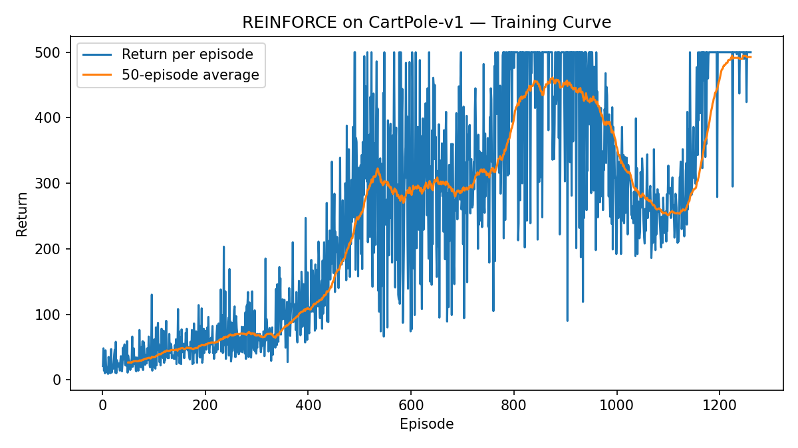
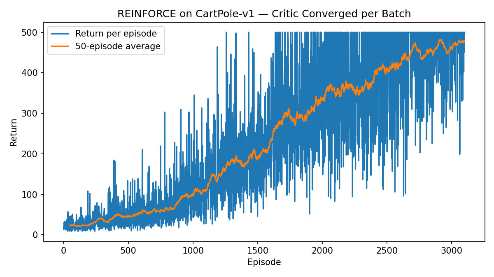
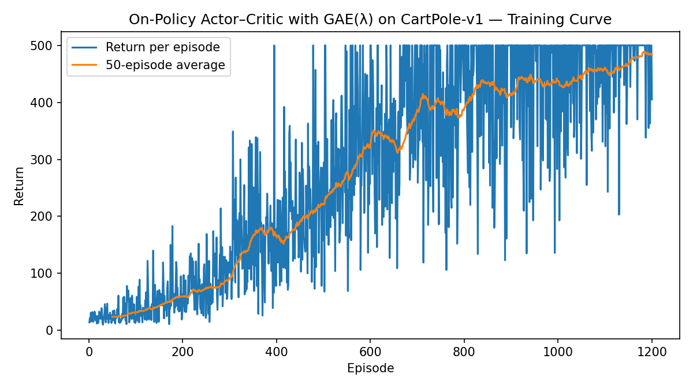
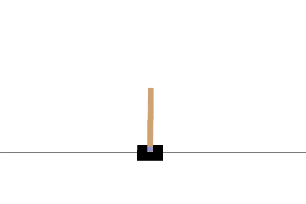
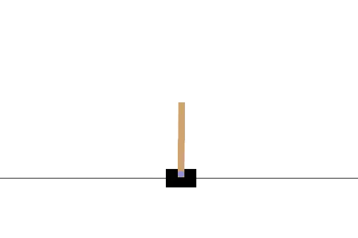
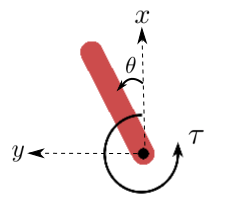

# Policy Gradient Methods {#policy-gradient}

In Chapter \@ref(value-rl), we relaxed two key assumptions of the MDP introduced in Chapter \@ref(mdp):

- **Unknown dynamics**: the transition function $P$ was no longer assumed to be known.  
- **Continuous states**: the state space $\mathcal{S}$ was extended from finite to continuous.

When only the dynamics are unknown but the MDP remains tabular, we introduced generalized versions of policy iteration (e.g., SARSA) and value iteration (e.g., Q-learning). These algorithms can recover near-optimal value functions with strong convergence guarantees.

When both the dynamics are unknown and the state space is continuous, tabular methods become infeasible. In this setting, we employed function approximation to represent value functions, and generalized SARSA and Q-learning accordingly. We also introduced stabilization techniques such as experience replay and target networks to ensure more reliable learning.

---

In this chapter, we relax a third assumption: the action space $\mathcal{A}$ is also continuous. This setting captures many important real-world systems, such as autonomous vehicles and robots. Handling continuous actions requires a departure from the value-based methods of Chapter \@ref(value-rl). The key difficulty is that even if we had access to a near-optimal action-value function $Q(s,a)$, selecting the control action requires solving
\[
\max_a Q(s,a),
\]
which is often computationally expensive and can lead to suboptimal solutions.

To address this challenge, we introduce a new paradigm: policy gradient methods. Rather than learning value functions to derive policies indirectly, we directly optimize parameterized policies using gradient-based methods.

We begin this chapter by reviewing the fundamentals of gradient-based optimization, and then build upon them to develop algorithms for searching optimal policies via policy gradients.

## Gradient-based Optimization {#gradient-optimization}

Gradient-based optimization is the workhorse behind most modern machine learning algorithms, including policy gradient methods. The central idea is to iteratively update the parameters of a model in the direction that most improves an objective function.

### Basic Setup

Suppose we have a differentiable objective function $J(\theta)$, where $\theta \in \mathbb{R}^d$ represents the parameter vector. The goal is to find
\[
\theta^\star \in \arg\max_\theta J(\theta).
\]

The gradient of the objective with respect to the parameters,
\[
\nabla_\theta J(\theta) = 
\begin{bmatrix}
\frac{\partial J}{\partial \theta_1} &
\frac{\partial J}{\partial \theta_2} &
\cdots &
\frac{\partial J}{\partial \theta_d}
\end{bmatrix}^\top,
\]
provides the local direction of steepest ascent. Gradient-based optimization uses this direction to iteratively update the parameters. Note that modern machine learning software tools such as PyTorch allow the user to conveniently query the gradient of any function $J$ defined by neural networks. 

### Gradient Ascent and Descent

The simplest method is **gradient ascent** (for maximization):
\[
\theta_{k+1} = \theta_k + \alpha \nabla_\theta J(\theta_k),
\]
where $\alpha > 0$ is the learning rate.  
For minimization, the update rule uses **gradient descent**:
\[
\theta_{k+1} = \theta_k - \alpha \nabla_\theta J(\theta_k).
\]

The choice of learning rate $\alpha$ is critical:  

- Too large $\alpha$ can cause divergence.  
- Too small $\alpha$ leads to slow convergence.  


#### Convergence Guarantees

For convex functions $J(\theta)$, gradient descent (or ascent) can be shown to converge to the **global optimum** under appropriate conditions on the learning rate. 

For non-convex functions—which are common in reinforcement learning—gradient methods may only find so-called **first-order stationary points**, i.e., points $\theta$ at which the gradient $\nabla_\theta J(\theta) = 0$. Nevertheless, they remain effective in practice.

[TODO: graph different stationary points]{.red}

We now formalize the convergence speed of Gradient Descent (GD) for minimizing a smooth convex function. We switch to the minimization convention and write the objective as $f:\mathbb{R}^d \to \mathbb{R}$ (to avoid sign confusions with $J$ used for maximization). We assume exact gradients $\nabla f(\theta)$ are available.

**Setup and Assumptions.**

- (**Convexity**) For all $\theta,\vartheta\in\mathbb{R}^d$,
  \begin{equation}
  f(\vartheta) \;\ge\; f(\theta) + \nabla f(\theta)^\top(\vartheta-\theta).
  (\#eq:PG-GO-convexity)
  \end{equation}

- (**$L$-smoothness**) The gradient is $L$-Lipschitz: for all $\theta,\vartheta$,
  \begin{equation}
  \|\nabla f(\vartheta)-\nabla f(\theta)\| \;\le\; L\|\vartheta-\theta\|.
  (\#eq:PG-GO-Lsmooth)
  \end{equation}
  Equivalently (the **descent lemma**), for all $\theta,\Delta$,
  \begin{equation}
  f(\theta+\Delta) \;\le\; f(\theta) + \nabla f(\theta)^\top \Delta + \frac{L}{2}\|\Delta\|^2.
  (\#eq:PG-GO-descent-lemma)
  \end{equation}

Consider Gradient Descent with a constant stepsize $\alpha>0$:
\[
\theta_{k+1} \;=\; \theta_k \;-\; \alpha\, \nabla f(\theta_k).
\]

::: {.theorembox}
::: {.theorem #gd-convex-smooth name="GD on smooth convex function"}
Let $f$ be convex and $L$-smooth with a minimizer 
$$
\theta^\star\in\arg\min_\theta f(\theta).
$$
and the global minimum $f^\star = f(\theta^\star)$.
If $0<\alpha\le \frac{2}{L}$, then the GD iterates satisfy for all $k\ge 0$:
\begin{equation}
f(\theta_k) - f^\star \leq \frac{2 (f(\theta_0) - f^\star) \Vert \theta_0 - \theta^\star \Vert^2 }{2 \Vert \theta_0 - \theta^\star \Vert^2 + k\alpha ( 2 - L \alpha) (f(\theta_0) - f^\star)}
(\#eq:GD-SmoothConvex-Value)
\end{equation}
In particular, choosing $\alpha=\frac{1}{L}$ yields the canonical $O(1/k)$ convergence rate in suboptimality:
\begin{equation}
f(\theta_k) - f^\star \leq \frac{2L \Vert \theta_0 - \theta^\star \Vert^2}{k+4}
(\#eq:GD-SmoothConvex-optimal-rate)
\end{equation}
:::
:::
::: {.proofbox}
::: {.proof}
See Theorem 2.1.14 and Corollary 2.1.2 in [@nesterov2018lectures].
:::
:::

**Strongly Convex Case (Linear Rate).** If, in addition, $f$ is $\mu$-strongly convex ($\mu>0$), i.e., for all $\theta,\vartheta\in\mathbb{R}^d$,
\begin{equation}
f(\vartheta)\;\ge\; f(\theta) + \nabla f(\theta)^\top(\vartheta-\theta) \;+\; \frac{\mu}{2}\,\|\vartheta-\theta\|^2.
(\#eq:PG-GO-strongly-convex)
\end{equation}
Then, GD with $0<\alpha\le \frac{2}{\mu + L}$ enjoys a **linear** (geometric) rate:

::: {.theorembox}
::: {.theorem #gd-strongly-convex name="GD on smooth strongly convex function"}
If $f$ is $L$-smooth and $\mu$-strongly convex, then for $0<\alpha\le \frac{2}{\mu + L}$,
\begin{equation}
\Vert \theta_k - \theta^\star \Vert^2 \leq \left( 1 - \frac{2\alpha \mu L}{\mu + L} \right)^k \Vert \theta_0 - \theta^\star \Vert^2.
(\#eq:GD-Strongly-Convex-1)
\end{equation}
If $\alpha = \frac{2}{\mu + L}$, then 
\begin{equation}
\begin{split}
\Vert \theta_k - \theta^\star \Vert & \leq \left( \frac{Q_f - 1}{Q_f + 1} \right)^k \Vert \theta_0 - \theta^\star \Vert \\
f(\theta_k) - f^\star & \leq \frac{L}{2} \left( \frac{Q_f - 1}{Q_f + 1} \right)^{2k} \Vert \theta_0 - \theta^\star \Vert^2,
\end{split}
(\#eq:GD-Strongly-Convex-2)
\end{equation}
where $Q_f = L/\mu$.
:::
:::
::: {.proofbox}
::: {.proof}
See Theorem 2.1.15 in [@nesterov2018lectures].
:::
:::

**Practical Notes.**

- The step size $\alpha=\frac{1}{L}$ is **optimal among fixed stepsizes** for the above worst-case bounds on smooth convex $f$.  

- In practice, backtracking line search or adaptive schedules can approach similar behavior without knowing $L$.  

- For policy gradients (which maximize $J$), apply the results to $f=-J$ and flip the update sign (gradient ascent). The smooth/convex assumptions rarely hold globally in RL, but these results calibrate expectations about step sizes and motivate variance reduction and curvature-aware methods used later.


### Stochastic Gradients

In reinforcement learning and other large-scale machine learning problems, computing the exact gradient $\nabla_\theta J(\theta)$ is often infeasible. Instead, we use an unbiased estimator $\hat{\nabla}_\theta J(\theta)$ computed from a subset of data (or trajectories in RL). The update becomes
\[
\theta_{k+1} = \theta_k + \alpha \hat{\nabla}_\theta J(\theta_k).
\]

This approach, known as **stochastic gradient ascent/descent (SGD)**, trades off exactness for computational efficiency. Variance in the gradient estimates plays an important role in convergence speed and stability.

#### Convergence Guarantees

We now turn to the convergence guarantees of stochastic gradient methods, which replace exact gradients with unbiased noisy estimates. Throughout this section we consider the minimization problem $\min_\theta f(\theta)$ and assume $\nabla f$ is available only through a stochastic oracle.

**Setup and Assumptions.**

Let $f:\mathbb{R}^d\!\to\!\mathbb{R}$ be differentiable. At iterate $\theta_k$, we observe a random vector $g_k$ such that
\[
\mathbb{E}[\,g_k \mid \theta_k\,] = \nabla f(\theta_k)
\quad\text{and}\quad
\mathbb{E}\!\left[\|g_k-\nabla f(\theta_k)\|^2 \mid \theta_k\right] \le \sigma^2.
\]
We will also use one of the following standard regularity conditions:

- (**Convex + $L$-smooth**) $f$ is convex and the gradient is $L$-Lipschitz.  
- (**Strongly convex + $L$-smooth**) $f$ is $\mu$-strongly convex and $L$-smooth.

We consider the SGD update
\[
\theta_{k+1} \;=\; \theta_k - \alpha_k\, g_k,
\]
and define the **averaged iterate** 
$$
\bar\theta_K := \frac{1}{K+1}\sum_{k=0}^{K}\theta_k.
$$

::: {.theorembox}
::: {.theorem #sgd-convex-rate name="SGD on smooth convex function"}  
Assume $f$ is convex and $L$-smooth. Suppose there exists $G\!>\!0$ with $\mathbb{E}\|g_k\|^2 \le G^2$ for all $k$. 

- Choose a constant stepsize $\alpha_k = \alpha > 0$. Then for all $K \ge 1$,
\begin{equation}
\mathbb{E}\big[f(\bar\theta_K)\big] - f^\star \leq \frac{\Vert \theta_0 - \theta^\star \Vert^2}{2 \alpha (K+1)} + \frac{\alpha G^2}{2}.
(\#eq:SGD-convex-fixed-step-size)
\end{equation}

- Choose a diminishing step size $\alpha_k = \frac{\Vert \theta_0 - \theta^\star \Vert}{G \sqrt{k+1}}$, then
\begin{equation}
\mathbb{E}\big[f(\bar\theta_K)\big] - f^\star \leq \frac{\Vert \theta_0 - \theta^\star \Vert G}{\sqrt{K+1}} = \mathcal{O}\left(  \frac{1}{\sqrt{K}} \right).
(\#eq:SGD-convex-diminishing-step-size)
\end{equation}
:::
:::
::: {.proofbox}
::: {.proof}
See this [lecture note](https://people.eecs.berkeley.edu/~jiantao/227c2022spring/scribe/227C_Lecture_24.pdf) and [@garrigos2023handbook].
:::
:::

**Remarks.**

- The bound is on the *averaged* iterate $\bar\theta_K$ (the last iterate may be worse by constants without further assumptions).

- Replacing the second-moment bound by a variance bound $\sigma^2$ yields the same rate with $G^2$ replaced by $\sigma^2 + \sup_k\|\nabla f(\theta_k)\|^2$.

- With a constant stepsize, SGD converges $\mathcal{O}(1/k)$ up to a neighborhood set by the gradient noise.

The next theorem states the convergence rate of SGD for minimizing strongly convex functions.

::: {.theorembox}
::: {.theorem #sgd-strong-rate name="SGD on smooth strongly convex function"} 
Assume $f$ is $\mu$-strongly convex and $L$-smooth, and $\mathbb{E}\!\left[\|g_k\|^2 \right]\le G^2$.  
With stepsize $\alpha_k = \frac{1}{\mu(k+1)}$, the SGD iterates satisfy for all $K\!\ge\!1$,
\begin{equation}
\begin{split}
\mathbb{E}[f(\bar\theta_K)] - f^\star & \leq \frac{G^2}{2 \mu (K+1)} (1 + \log(K+1)), \\
\mathbb{E} \Vert \bar\theta_K - \theta^\star \Vert^2 & \leq \frac{Q}{K+1}, \ \ Q = \max \left( \frac{G^2}{\mu^2}, \Vert \theta_0 - \theta^\star \Vert^2 \right).
\end{split}
(\#eq:SGD-Strongly-Convex)
\end{equation}
:::
:::
::: {.proofbox}
::: {.proof}
See this [lecture note](https://people.eecs.berkeley.edu/~jiantao/227c2022spring/scribe/227C_Lecture_24.pdf) and [@garrigos2023handbook].
:::
:::

**Practical Takeaways for Policy Gradients.**

- Use **diminishing stepsizes** for theoretical convergence ($\alpha_k \propto 1/\sqrt{k}$ for general convex, $\alpha_k \propto 1/k$ for strongly convex surrogates).  

- With **constant stepsizes**, expect fast initial progress down to a variance-limited plateau; lowering variance (e.g., via baselines/advantage estimation) is as important as tuning $\alpha$. 

[TODO: graph the different trajectories between minimizing a convex function using GD and SGD.]{.red}


### Beyond Vanilla Gradient Methods

Several refinements to basic gradient updates are widely used:

- **Momentum methods**: incorporate past gradients to smooth updates and accelerate convergence.
- **Adaptive learning rates (Adam, RMSProp, AdaGrad)**: adjust the learning rate per parameter based on historical gradient magnitudes.
- **Second-order methods**: approximate or use curvature information (the Hessian) for more informed updates, though often impractical in high dimensions.


## Policy Gradients

Policy gradients optimize a *parameterized stochastic policy* directly, without requiring an explicit action-value maximization step. They are applicable to both finite and continuous action spaces and are especially useful when actions are continuous or when "$\arg\max$" over $Q(s,a)$ is costly or ill-posed.

### Setup

We consider a Markov decision process (MDP) with (possibly continuous) state space $\mathcal{S}$, action space $\mathcal{A}$, unknown dynamics $P$, reward function $R(s,a)$, and discount factor $\gamma\in[0,1)$. Let $\pi_\theta(a\mid s)$ be a differentiable stochastic policy with parameters $\theta\in\mathbb{R}^d$.

- **Trajectory.** A state-action trajectory is $\tau=(s_0,a_0,s_1,a_1,\dots,s_{T})$ with probability density/mass
  \begin{equation}
  p_\theta(\tau) = \rho(s_0)\prod_{t=0}^{T-1} \pi_\theta(a_t\mid s_t)\,P(s_{t+1}\mid s_t,a_t),
  (\#eq:trajectory-density)
  \end{equation}
  where $\rho$ is the initial state distribution and $T$ is the (random or fixed) episode length.
- **Return.** Define the (discounted) return
\begin{equation}
R(\tau) \;=\; \sum_{t=0}^{T-1}\gamma^t R(s_t,a_t), 
(\#eq:PG-Trajectory-Return)
\end{equation}
and the return-to-go
\begin{equation}
g_t \;=\; \sum_{t'=t}^{T-1}\gamma^{t'-t} R(s_{t'},a_{t'}).
(\#eq:PG-return-to-go)
\end{equation}

- **Optimization objective.** The goal is to maximize the expected return
\begin{equation}
J(\theta) \;\equiv\; \mathbb{E}_{\tau\sim p_\theta}\!\left[R(\tau)\right]
  \;=\; \mathbb{E}\!\left[\sum_{t=0}^{T-1}\gamma^t R(s_t,a_t)\right],
(\#eq:PG-objective)
\end{equation}
where the expectation is taken over the randomness in (i) the initial state $s_0 \sim \rho$, (ii) the policy $\pi_\theta$, and (iii) the transition dynamics $P$.

#### Policy models

- **Finite action spaces ($\mathcal{A}$ discrete).** A common choice is a **softmax (categorical) policy** over a score (logit) function $f_\theta(s,a)$:
  \begin{equation}
  \pi_\theta(a\mid s)
  \;=\;
  \frac{\exp\{f_\theta(s,a)\}}{\sum_{a'\in\mathcal{A}}\exp\{f_\theta(s,a')\}}.
  (\#eq:finite-action-policy)
  \end{equation}
  Here we use $\exp\{f_\theta(s,a)\} = e^{f_\theta(s,a)}$ for pretty formatting. Typically $f_\theta$ is a neural network or a linear function over features.

- **Continuous action spaces ($\mathcal{A}\subseteq\mathbb{R}^m$).** A standard choice is a **Gaussian policy**:
  \begin{equation}
  \pi_\theta(a\mid s) \;=\; \mathcal{N}\!\big(a;\;\mu_\theta(s),\,\Sigma_\theta(s)\big),
  (\#eq:continuous-action-policy)
  \end{equation}
  where $\mu_\theta(s)$ and (often diagonal) covariance $\Sigma_\theta(s)$ are differentiable functions (e.g., neural networks) parameterized by $\theta$. The policy $\pi_\theta(a \mid s)$ samples actions from the Gaussian parameterized by $\mu_\theta(s)$ and $\Sigma_\theta(s)$. Other choices include squashed Gaussians (e.g., $\tanh$) or Beta distributions for bounded actions.

### The Policy Gradient Lemma

With the gradient-based optimization machinery from Section \@ref(gradient-optimization), a natural strategy for the policy optimization problem in \@ref(eq:PG-objective) is gradient ascent on the objective $J(\theta)$.
Consequently, the central task is to characterize the ascent direction, i.e., to compute $\nabla_\theta J(\theta)$.

The policy gradient lemma, stated below, provides exactly this characterization. Crucially, it expresses $\nabla_\theta J(\theta)$ in terms of the policy's score function $\nabla_\theta \log \pi_\theta(a\mid s)$ and returns, without differentiating through the environment dynamics. This likelihood-ratio form makes policy optimization feasible even when the transition model is unknown or non-differentiable.

::: {.theorembox}
::: {.theorem #policy-gradient-lemma name="Policy Gradient Lemma"}
Let $J(\theta)=\mathbb{E}_{\tau \sim p_\theta}[R(\tau)]$ as defined in \@ref(eq:PG-objective) Then:
\begin{equation}
\nabla_\theta J(\theta)
\;=\;
\mathbb{E}_{\tau\sim p_\theta} \Big[R(\tau)\,\nabla_\theta \log p_\theta(\tau)\Big]
\;=\;
\mathbb{E}_{\tau\sim p_\theta} \Bigg[\sum_{t=0}^{T-1}
\nabla_\theta \log \pi_\theta(a_t\mid s_t)\;R(\tau)\Bigg].
(\#eq:PG-PGLemma-1)
\end{equation}
By causality (future action does not affect past reward), the full return can be replaced by return-to-go:
\begin{equation}
\nabla_\theta J(\theta)
\;=\;
\mathbb{E}_{\tau\sim p_\theta} \Bigg[\sum_{t=0}^{T-1} \gamma^t
\nabla_\theta \log \pi_\theta(a_t\mid s_t)\;g_t\Bigg].
(\#eq:PG-PGLemma-2)
\end{equation}
Equivalently, using value functions,
\begin{equation}
\nabla_\theta J(\theta)
\;=\;
 \frac{1}{1-\gamma} \mathbb{E}_{s\sim d_\theta,\;a\sim\pi_\theta} \Big[\nabla_\theta \log \pi_\theta(a\mid s)\,Q^{\pi_\theta}(s,a)\Big],
(\#eq:PG-PGLemma-3)
\end{equation}
where $d_\theta$ is the (discounted) on-policy state visitation distribution for infinite-horizon MDPs:
\begin{equation}
d_\theta(s) = (1 - \gamma) \sum_{t=0}^{\infty} \gamma^t \Pr_\theta(s_t=s).
(\#eq:state-visitation-distribution)
\end{equation}
:::
:::
::: {.proof}
We prove the three equivalent forms step by step. Throughout, we assume $\theta$ parameterizes only the policy $\pi_\theta$ (not the dynamics $P$ nor the initial distribution $\rho$), and that interchanging $\nabla_\theta$ with the trajectory integral/sum is justified (e.g., bounded rewards and finite horizon or standard dominated-convergence conditions). 
Let the return-to-go $g_t$ be defined as in \@ref(eq:PG-return-to-go).

**Step 1 (Log-derivative trick).** Write the objective as an expectation over trajectories:
\[
J(\theta) \;=\; \int R(\tau)\, p_\theta(\tau)\, d\tau.
\]
Differentiate under the integral and use
\begin{equation}
\nabla_\theta p_\theta(\tau)=p_\theta(\tau)\nabla_\theta\log p_\theta(\tau)
(\#eq:log-derivative-trick)
\end{equation}
we can write:
\[
\nabla_\theta J(\theta)
= \int R(\tau)\,\nabla_\theta p_\theta(\tau)\, d\tau
= \int R(\tau)\, p_\theta(\tau)\,\nabla_\theta \log p_\theta(\tau)\, d\tau
= \mathbb{E}_{\tau\sim p_\theta}\!\big[R(\tau)\,\nabla_\theta \log p_\theta(\tau)\big],
\]
which is \@ref(eq:PG-PGLemma-1) up to expanding $\log p_\theta(\tau)$. To see why \@ref(eq:log-derivative-trick) is true, write
$$
\nabla_\theta \log p_\theta(\tau) = \frac{1}{p_\theta(\tau)} \nabla_\theta p_\theta(\tau),
$$
using the chain rule.

**Step 2 (Policy-only dependence).** Factor the trajectory likelihood/mass:
\[
p_\theta(\tau)
= \rho(s_0)\,\prod_{t=0}^{T-1}\pi_\theta(a_t\mid s_t)\,P(s_{t+1}\mid s_t,a_t).
\]
Since $\rho$ and $P$ do not depend on $\theta$,
\[
\log p_\theta(\tau)
= \text{const} \;+\; \sum_{t=0}^{T-1}\log \pi_\theta(a_t\mid s_t)
\quad\Rightarrow\quad
\nabla_\theta \log p_\theta(\tau) \;=\; \sum_{t=0}^{T-1}\nabla_\theta \log \pi_\theta(a_t\mid s_t).
\]
Substitute into Step 1 to obtain the second equality in \@ref(eq:PG-PGLemma-1):
\[
\nabla_\theta J(\theta)
= \mathbb{E}_{\tau\sim p_\theta}\!\Bigg[\sum_{t=0}^{T-1}\nabla_\theta \log \pi_\theta(a_t\mid s_t)\,R(\tau)\Bigg].
\]

**Step 3 (Causality $\Rightarrow$ return-to-go).** Expand $R(\tau)=\sum_{t=0}^{T-1}\gamma^{t} r_{t}$ (with $r_{t}:=R(s_{t},a_{t})$) and swap sums:
\[
\mathbb{E} \Bigg[\sum_{t=0}^{T-1}\nabla_\theta \log \pi_\theta(a_t\mid s_t)\,R(\tau)\Bigg]
=
\sum_{t=0}^{T-1}\sum_{t'=0}^{T-1}\mathbb{E} \big[\nabla_\theta \log \pi_\theta(a_t\mid s_t)\,\gamma^{t'} r_{t'}\big].
\]
For $t'<t$, the factor $\gamma^{t'} r_{t'}$ is measurable w.r.t. the history $\mathcal{F}_t=\sigma(s_0,a_0,\dots,s_t)$, while
\[
\mathbb{E} \big[\nabla_\theta \log \pi_\theta(a_t\mid s_t)\,\big|\,\mathcal{F}_t\big]
= \sum_{a} \pi_\theta(a\mid s_t)\,\nabla_\theta \log \pi_\theta(a\mid s_t) = \nabla_\theta \sum_{a}\pi_\theta(a\mid s_t) = \nabla_\theta 1 = 0,
\]
(and analogously with integrals for continuous $\mathcal{A}$). Hence by the tower property,
\[
\mathbb{E} \big[\nabla_\theta \log \pi_\theta(a_t\mid s_t)\,\gamma^{t'} r_{t'}\big]=0\quad\text{for all }t'<t.
\]
Therefore only the terms with $t'\ge t$ survive, and
\[
\nabla_\theta J(\theta)
= \sum_{t=0}^{T-1}\mathbb{E} \Big[\nabla_\theta \log \pi_\theta(a_t\mid s_t)\,\sum_{t'=t}^{T-1}\gamma^{t'} r_{t'}\Big]
= \mathbb{E} \Bigg[\sum_{t=0}^{T-1} \gamma^t \nabla_\theta \log \pi_\theta(a_t\mid s_t)\,g_t\Bigg],
\]
which is \@ref(eq:PG-PGLemma-2).

**Step 4 (Value-function form).** Condition on $(s_t,a_t)$ and use the definition of the action-value function:
\[
Q^{\pi_\theta}(s_t,a_t) \;\equiv\; \mathbb{E}\!\left[g_t \,\middle|\, s_t,a_t\right].
\]
Taking expectations then yields
\[
\mathbb{E} \big[\gamma^t \nabla_\theta \log \pi_\theta(a_t\mid s_t)\,g_t\big]
= \mathbb{E} \big[\gamma^t \nabla_\theta \log \pi_\theta(a_t\mid s_t)\,Q^{\pi_\theta}(s_t,a_t)\big].
\]
Summing over $t$ and collecting terms with the (discounted) on-policy state visitation distribution $d_\theta$ (for the infinite-horizon case, e.g., $d_\theta(s)=(1-\gamma)\sum_{t=0}^\infty \gamma^t\,\Pr_\theta(s_t=s)$; for finite $T$, use the corresponding finite-horizon weighting), we obtain
\[
\nabla_\theta J(\theta)
\;=\;
\mathbb{E}_{s\sim d_\theta,\;a\sim \pi_\theta} \Big[\nabla_\theta \log \pi_\theta(a\mid s)\,Q^{\pi_\theta}(s,a)\Big],
\]
which is \@ref(eq:PG-PGLemma-3).

**Conclusion.** Combining Steps 1–4 proves all three stated forms of the policy gradient.
:::


### REINFORCE

The policy gradient lemma immediately gives us an algorithm. Specifically, the gradient receipe in \@ref(eq:PG-PGLemma-1) tells us that if we generate one trajectory $\tau$ by following the policy $\pi$, then
\begin{equation}
\widehat{\nabla_\theta J} = \sum_{t=0}^{T-1} \nabla_\theta \log \pi_\theta(a_t \mid s_t) R(\tau)
(\#eq:PG-Estimator-1)
\end{equation}
is an unbiased estimator of the true gradient. 

With this sample gradient estimator, we obtain the classical REINFORCE algorithm.

::: {.highlightbox}

<div style="text-align: center;">
**Single-Trajectory (Naive) REINFORCE**
</div>

1. Initialize $\theta_0$ for the initial policy $\pi_{\theta_0}(a \mid s)$
2. For $k=0,1,\dots,$ do:
 - Obtain a trajectory $\tau \sim p_{\theta_k}$
 - Compute the stochastic gradient $g_k$ as in \@ref(eq:PG-Estimator-1)
 - Update $\theta_{k+1} = \theta_k + \alpha_k g_k$
:::

To reduce variance of the gradient estimator, we can use a minibatch of trajectories. For example, given a batch of $N$ trajectories $\{\tau^{(i)}\}_{i=1}^N$ collected by $\pi_\theta$, define for each timestep the return-to-go
\[
g_t^{(i)} = \sum_{t'=t}^{T^{(i)}-1} \gamma^{t'-t} R\!\left(s_{t'}^{(i)},a_{t'}^{(i)}\right).
\]
An unbiased gradient estimator, from \@ref(eq:PG-PGLemma-2) is
\begin{equation}
\widehat{\nabla_\theta J}
\;=\;
\frac{1}{N}\sum_{i=1}^N \sum_{t=0}^{T^{(i)}-1} \gamma^t
\nabla_\theta \log \pi_\theta \big(a_t^{(i)}\mid s_t^{(i)}\big) g_t^{(i)}.
(\#eq:PG-Estimator-2)
\end{equation}

This leads to the following minibatch REINFORCE algorithm.

::: {.highlightbox}

<div style="text-align: center;">
**Minibatch REINFORCE**
</div>

1. Initialize $\theta_0$ for the initial policy $\pi_{\theta_0}(a \mid s)$
2. For $k=0,1,\dots,$ do:
 - Obtain N trajectories $\{ \tau^{(i)} \}_{i=1}^N \sim p_{\theta_k}$
 - Compute the stochastic gradient $g_k$ as in \@ref(eq:PG-Estimator-2)
 - Update $\theta_{k+1} = \theta_k + \alpha_k g_k$
:::


We apply both the single-trajectory (naive) REINFORCE and a minibatch variant to the CartPole-v1 balancing task. The results show that variance reduction via minibatching is crucial for stable learning and for obtaining strong policies with policy-gradient methods.

::: {.examplebox}
::: {.example #cartpole-reinforce name="REINFORCE for Cart-Pole Balancing"}

Consider the cart-pole balancing task illustrated in Fig. \@ref(fig:cart-pole-illustration). A pole is attached by an un-actuated joint to a cart, which moves along a frictionless track. The pendulum is placed upright on the cart and the goal is to balance the pole by applying forces in the left and right direction on the cart.

```{r cart-pole-illustration, out.width='60%', fig.show='hold', fig.cap='Cart Pole balance.', fig.align='center', echo=FALSE}
knitr::include_graphics('images/Policy-Gradients/cart_pole.gif')
```

**State Space.** The state of the cart-pole system is denoted by $s \in \mathcal{S} \subset \mathbb{R}^4$, containing the position and velocity of the cart, as well as the angle and angular velocity of the pole. 

**Action Space.** The action space $\mathcal{A}$ is discrete and contains two elements: pushing to the left and pushing to the right.

The dynamics of the MDP is provided by the [Gym simulator](https://gymnasium.farama.org/environments/classic_control/cart_pole/) and is described in the original paper [@barto2012neuronlike]. At the beginning of the episode, all state variables are randomly initialized in $[-0.05,0.05]$ and the goal for the agent is to apply the actions to balance the cart-pole for as long as possible---the agent gets a reward of $+1$ every step if (1) the pole angle remains between $-12^\circ$ and $+12^\circ$ and (2) the cart position remains between $-2.4$ and $2.4$. The maximum episode length is $500$.

We design a policy network in the form of \@ref(eq:finite-action-policy) since the action space is finite.

**REINFORCE.** We first apply the naive REINFORCE algorithm where the gradient estimator is computed from a single trajectory as in \@ref(eq:PG-Estimator-1). Fig. \@ref(fig:cart-pole-learning-curve-reinforce) shows the learning curve, which indicates that the REINFORCE algorithm was not able to learn a good policy after 2000 episodes.

```{r cart-pole-learning-curve-reinforce, out.width='60%', fig.show='hold', fig.cap='Learning curve (Naive REINFORCE).', fig.align='center', echo=FALSE}
knitr::include_graphics('images/Policy-Gradients/cartpole_returns_reinforce.png')
```

**Minibatch REINFORCE.** We then apply the minibatch REINFORCE algorithm where the gradient estimator is computed from multiple ($20$ in our case) trajectories as in \@ref(eq:PG-Estimator-2). Fig. \@ref(fig:cart-pole-learning-curve-minibatch-reinforce) shows the learning curve, which shows steady increase in the per-episode return that eventually gets close to the maximum per-episode return $500$.

Fig. \@ref(fig:cart-pole-policy-rollout-minibatch-reinforce) shows a rollout video of applying the policy training from minibatch REINFORCE. We can see the policy nicely balances the cart-pole system.

You can play with the code [here](https://github.com/ComputationalRobotics/2025-ES-AM-158-LECTURE-CODE/blob/main/cartpole_reinforce.py).

```{r cart-pole-learning-curve-minibatch-reinforce, out.width='60%', fig.show='hold', fig.cap='Learning curve (Minibatch REINFORCE).', fig.align='center', echo=FALSE}

```

```{r cart-pole-policy-rollout-minibatch-reinforce, out.width='60%', fig.show='hold', fig.cap='Policy rollout (Minibatch REINFORCE).', fig.align='center', echo=FALSE}
knitr::include_graphics('images/Policy-Gradients/cartpole_policy_rollout_minibatch_reinforce.gif')
```

:::
:::

### Baselines and Variance Reduction

From the REINFORCE experiments above, we have seen firsthand that **variance reduction** is critical for stable policy-gradient learning.  

A natural question is: *what framework can we use to systematically reduce the variance of the gradient estimator while preserving unbiasedness?*

#### Baseline

A key device is a **baseline** $b:\mathcal{S}\to\mathbb{R}$ added at each timestep:
\begin{equation}
\widehat{g}
\;=\;
\sum_{t=0}^{T-1} \gamma^t\,\nabla_\theta \log \pi_\theta(a_t\mid s_t)\,\big(g_t - b(s_t)\big).
(\#eq:baseline-estimator)
\end{equation}

The only difference between \@ref(eq:baseline-estimator) and the original gradient estimator \@ref(eq:PG-PGLemma-2) is that the baseline $b(s_t)$ is subtracted from the return-to-go $g_t$. The next theorem states that any state-only baseline does not change the expectation of the gradient estimator.

::: {.theorembox}
::: {.theorem #baseline-invariance name="Baseline Invariance"}
Let $b:\mathcal{S}\to\mathbb{R}$ be any function independent of the action $a_t$. Then
\[
\mathbb{E}\!\left[\sum_{t=0}^{T-1} \gamma^t \nabla_\theta \log \pi_\theta(a_t\mid s_t)\,b(s_t)\right]=0,
\]
and thus
\begin{equation}
\nabla_\theta J(\theta) \;=\; 
\mathbb{E}\!\left[\sum_{t=0}^{T-1} \gamma^t \nabla_\theta \log \pi_\theta(a_t\mid s_t)\,\big(g_t - b(s_t)\big)\right].
(\#eq:PG-baseline-form)
\end{equation}

Equivalently, using action-values,
\begin{equation}
\nabla_\theta J(\theta)
=
\frac{1}{1-\gamma}\,
\mathbb{E}_{s\sim d_\theta,\;a\sim\pi_\theta}
\!\Big[\nabla_\theta \log \pi_\theta(a\mid s)\,\big(Q^{\pi_\theta}(s,a)-b(s)\big)\Big].
(\#eq:baseline-estimator-Qvalue)
\end{equation}
:::
:::
::: {.proofbox}
::: {.proof}
We prove (i) the baseline term has zero expectation, (ii) the baseline-subtracted estimator in \@ref(eq:PG-baseline-form) is unbiased, and (iii) the equivalent $Q$-value form \@ref(eq:baseline-estimator-Qvalue).

Throughout we assume standard conditions ensuring interchange of expectation and differentiation (e.g., bounded rewards with finite horizon or discounted infinite horizon, and a differentiable policy).


**Step 1 (Score-function expectation is zero).** Fix a state $s\in\mathcal{S}$. The **score function** integrates/sums to zero under the policy:
\begin{equation}
\begin{split}
\mathbb{E}_{a\sim \pi_\theta(\cdot\mid s)}\!\big[\nabla_\theta \log \pi_\theta(a\mid s)\big]
& =
\sum_{a\in\mathcal{A}} \pi_\theta(a\mid s)\,\nabla_\theta \log \pi_\theta(a\mid s)
=
\sum_{a\in\mathcal{A}} \nabla_\theta \pi_\theta(a\mid s) \\
& = 
\nabla_\theta \sum_{a\in\mathcal{A}} \pi_\theta(a\mid s)
=
\nabla_\theta 1
=
0,
\end{split}
\end{equation}
with the obvious replacement of sums by integrals for continuous $\mathcal{A}$. This identity is the standard "score has zero mean" property.

**Step 2 (Baseline term has zero expectation).** Let $\mathcal{F}_t := \sigma(s_0,a_0,\ldots,s_t)$ be the history up to time $t$ and recall that $b(s_t)$ is **independent of** $a_t$. Using iterated expectations:
\[
\mathbb{E}\!\left[\gamma^t \nabla_\theta \log \pi_\theta(a_t\mid s_t)\,b(s_t)\right]
=
\mathbb{E}\!\left[
\gamma^t\, b(s_t)\,
\underbrace{\mathbb{E}\!\left[\nabla_\theta \log \pi_\theta(a_t\mid s_t)\,\middle|\, s_t\right]}_{=\,0~\text{by Step 1}}
\right]
= 0.
\]
Summing over $t$ yields
\[
\mathbb{E}\!\left[\sum_{t=0}^{T-1} \gamma^t \nabla_\theta \log \pi_\theta(a_t\mid s_t)\,b(s_t)\right]=0.
\]


**Step 3 (Unbiasedness of the baseline-subtracted estimator).** By the policy gradient lemma (likelihood-ratio form with return-to-go; see \@ref(eq:PG-PGLemma-2)),
\[
\nabla_\theta J(\theta)
=
\mathbb{E}\!\left[\sum_{t=0}^{T-1} \gamma^t \nabla_\theta \log \pi_\theta(a_t\mid s_t)\,g_t\right].
\]
Subtract and add the baseline term inside the expectation:
\[
  \begin{split}
\mathbb{E}\!\left[\sum_{t=0}^{T-1} \gamma^t \nabla_\theta \log \pi_\theta(a_t\mid s_t)\,g_t\right]
& =
\mathbb{E}\!\left[\sum_{t=0}^{T-1} \gamma^t \nabla_\theta \log \pi_\theta(a_t\mid s_t)\,\big(g_t-b(s_t)\big)\right]
\;+\; \\
& \quad \quad \underbrace{\mathbb{E}\!\left[\sum_{t=0}^{T-1} \gamma^t \nabla_\theta \log \pi_\theta(a_t\mid s_t)\,b(s_t)\right]}_{=\,0~\text{by Step 2}}.
\end{split}
\]
Therefore \@ref(eq:PG-baseline-form) holds, proving that **any** state-only baseline preserves unbiasedness.

**Step 4 (Equivalent $Q$-value form).**  Condition on $(s_t,a_t)$ and use the definition $Q^{\pi_\theta}(s_t,a_t):=\mathbb{E}[g_t\mid s_t,a_t]$:
\[
\mathbb{E}\!\big[\gamma^t \nabla_\theta \log \pi_\theta(a_t\mid s_t)\,\big(g_t-b(s_t)\big)\big]
=
\mathbb{E}\!\Big[
\gamma^t\,
\mathbb{E}\!\big[\nabla_\theta \log \pi_\theta(a_t\mid s_t)\,\big(g_t-b(s_t)\big)\mid s_t\big]
\Big].
\]
Inside the inner expectation (over $a_t\sim \pi_\theta(\cdot\mid s_t)$) and using $b(s_t)$’s independence from $a_t$,
\[
\mathbb{E}\!\big[\nabla_\theta \log \pi_\theta(a_t\mid s_t)\,\big(g_t-b(s_t)\big)\mid s_t\big]
=
\mathbb{E}_{a\sim \pi_\theta(\cdot\mid s_t)}\!\Big[\nabla_\theta \log \pi_\theta(a\mid s_t)\,\big(Q^{\pi_\theta}(s_t,a)-b(s_t)\big)\Big].
\]
Summing over $t$ with discount $\gamma^t$ and collecting terms with the (discounted) on-policy state-visitation distribution $d_\theta$ (cf. \@ref(eq:state-visitation-distribution)) yields the infinite-horizon identity
\[
\nabla_\theta J(\theta)
=
\frac{1}{1-\gamma}\,
\mathbb{E}_{s\sim d_\theta,\;a\sim \pi_\theta}\!
\Big[\nabla_\theta \log \pi_\theta(a\mid s)\,\big(Q^{\pi_\theta}(s,a)-b(s)\big)\Big],
\]
which is \@ref(eq:baseline-estimator-Qvalue).
:::
:::

#### Optimal Baseline and Advantage

Among all state-only baselines $b(s)$, which one minimizes the variance of the gradient estimator?

::: {.theorembox}
::: {.theorem #variance-minimizing-baseline name="Variance-Minimizing Baseline (per-state)"} 
For the estimator 
$$
g(s,a)=\nabla_\theta \log \pi_\theta(a\mid s)\,\big(Q^\pi(s,a)-b(s)\big),
$$
the $b(s)$ minimizing $\operatorname{Var}[g\mid s]$ is
\[
b^\star(s)=
\frac{\mathbb{E}_{a\sim \pi_\theta}\!\left[\| \nabla_\theta \log \pi_\theta(a\mid s)\|^2\, Q^\pi(s,a)\right]}
{\mathbb{E}_{a\sim \pi_\theta}\!\left[\| \nabla_\theta \log \pi_\theta(a\mid s)\|^2\right]}.
(\#eq:best-baseline)
\]
Assuming that the norm factor $\Vert \nabla_\theta \log \pi_\theta(a\mid s) \Vert^2$ varies slowly with $a$, then 
$$
b^\star(s) \approx V^\pi(s).
$$
:::
:::
::: {.proofbox}
::: {.proof}
Let $s\in\mathcal{S}$ be fixed and write
\[
u(a\mid s) \;\equiv\; \nabla_\theta \log \pi_\theta(a\mid s)\in\mathbb{R}^d,
\qquad
w(a\mid s) \;\equiv\; \|u(a\mid s)\|^2 \;\ge 0.
\]
Consider the vector-valued random variable
\[
g(s,a) \;=\; u(a\mid s)\,\big(Q^\pi(s,a)-b(s)\big),
\]
where the randomness is over $a\sim \pi_\theta(\cdot\mid s)$.

We aim to choose $b(s)\in\mathbb{R}$ to minimize the **conditional variance**
\[
\operatorname{Var}[g\mid s] \;=\; \mathbb{E}\!\left[\|g(s,a)-\mathbb{E}[g\mid s]\|^2 \,\middle|\, s\right].
\]
Using the identity $\operatorname{Var}[X]=\mathbb{E}\|X\|^2-\|\mathbb{E}X\|^2$ (for vector $X$ with Euclidean norm), we have
\[
\operatorname{Var}[g\mid s]
\;=\;
\underbrace{\mathbb{E}\!\left[\|g(s,a)\|^2 \mid s\right]}_{\text{depends on } b(s)}
\;-\;
\underbrace{\big\|\mathbb{E}[g\mid s]\big\|^2}_{\text{independent of } b(s)}.
\]
We first show that the mean term is independent of $b(s)$. Indeed,
\[
\mathbb{E}[g\mid s]
=
\mathbb{E}_{a\sim\pi_\theta(\cdot\mid s)}\!\big[u(a\mid s)\,\big(Q^\pi(s,a)-b(s)\big)\big]
=
\mathbb{E}\!\big[u(a\mid s)\,Q^\pi(s,a)\big]
\;-\;
b(s)\,\underbrace{\mathbb{E}\!\big[u(a\mid s)\big]}_{=\,0},
\]
where $\mathbb{E}[u(a\mid s)]=\sum_a \pi_\theta(a\mid s)\nabla_\theta\log\pi_\theta(a\mid s)=\nabla_\theta \sum_a \pi_\theta(a\mid s)=\nabla_\theta 1=0$ (replace sums by integrals in the continuous case). Therefore $\mathbb{E}[g\mid s]$ does **not** depend on $b(s)$.

Consequently, minimizing $\operatorname{Var}[g\mid s]$ is equivalent to minimizing the conditional **second moment**
\[
\mathbb{E}\!\left[\|g(s,a)\|^2 \mid s\right]
=
\mathbb{E}\!\left[\|u(a\mid s)\|^2 \,\big(Q^\pi(s,a)-b(s)\big)^2 \,\middle|\, s\right]
=
\mathbb{E}\!\left[w(a\mid s)\,\big(Q^\pi(s,a)-b(s)\big)^2 \,\middle|\, s\right].
\]
The right-hand side is a convex quadratic in the scalar $b(s)$. Differentiate w.r.t. $b(s)$ and set to zero:
\[
\frac{\partial}{\partial b(s)}
\mathbb{E}\!\left[w(a\mid s)\,\big(Q^\pi(s,a)-b(s)\big)^2 \,\middle|\, s\right]
=
-2\,\mathbb{E}\!\left[w(a\mid s)\,\big(Q^\pi(s,a)-b(s)\big)\,\middle|\, s\right]
= 0.
\]
Hence,
\[
\mathbb{E}\!\left[w(a\mid s)\,Q^\pi(s,a)\,\middle|\, s\right]
=
b(s)\,\mathbb{E}\!\left[w(a\mid s)\,\middle|\, s\right],
\]
and provided $\mathbb{E}[w(a\mid s)\mid s]>0$ (i.e., the Fisher information at $s$ is non-degenerate), the unique minimizer is
\[
b^\star(s)
=
\frac{\mathbb{E}_{a\sim\pi_\theta(\cdot\mid s)}\!\left[\| \nabla_\theta \log \pi_\theta(a\mid s)\|^2\, Q^\pi(s,a)\right]}
{\mathbb{E}_{a\sim\pi_\theta(\cdot\mid s)}\!\left[\| \nabla_\theta \log \pi_\theta(a\mid s)\|^2\right]},
\]
which is \@ref(eq:best-baseline). If $\mathbb{E}[w(a\mid s)\mid s]=0$ (e.g., a locally deterministic policy), then $g\equiv 0$ almost surely and any $b(s)$ attains the minimum.

Finally, when the weight $w(a\mid s)=\|\nabla_\theta \log \pi_\theta(a\mid s)\|^2$ varies slowly with $a$ (or is approximately constant) for a fixed $s$, the ratio simplifies to
\[
b^\star(s)\;\approx\;\frac{\mathbb{E}[c(s)\,Q^\pi(s,a)\mid s]}{\mathbb{E}[c(s)\mid s]}
\;=\;
\mathbb{E}_{a\sim \pi_\theta(\cdot\mid s)}\!\big[Q^\pi(s,a)\big]
\;=\;
V^\pi(s),
\]
so that the baseline-subtracted target becomes the **advantage**
$A^\pi(s,a)=Q^\pi(s,a)-V^\pi(s)$.
:::
:::

When using $V^\pi(s)$ as the baseline, the baseline-subtracted target is called the **advantage function**
\begin{equation}
A^{\pi_\theta}(s,a)\;=\;Q^{\pi_\theta}(s,a)-V^{\pi_\theta}(s).
(\#eq:advantage-def)
\end{equation}
The corresponding minibatch gradient estimator becomes
\begin{equation}
\widehat{\nabla_\theta J}
\;=\;
\frac{1}{N}\sum_{i=1}^N \sum_{t=0}^{T^{(i)}-1} \gamma^t\,
\nabla_\theta \log \pi_\theta \big(a_t^{(i)}\mid s_t^{(i)}\big)\,
\widehat{A}_t^{(i)},
\quad
\widehat{A}_t^{(i)} \approx g_t^{(i)} - V_\phi \big(s_t^{(i)}\big),
(\#eq:reinforce-adv-estimator)
\end{equation}
where $V_\phi$ is a learned approximation to $V^{\pi_\theta}$.

#### Intuition for the Advantage
 
The advantage
\[
A^\pi(s,a) \;=\; Q^\pi(s,a) - V^\pi(s)
\]
measures how much *better or worse* action \(a\) is at state \(s\) *relative to the policy's average action quality* \(V^\pi(s)=\mathbb{E}_{a\sim\pi}[Q^\pi(s,a)\mid s]\).  
Hence \(\mathbb{E}_{a\sim\pi}[A^\pi(s,a)\mid s]=0\): it is a *relative* score.

With a value baseline, the policy-gradient update is
\[
\nabla_\theta J(\theta)
\;=\;
\frac{1}{1-\gamma}\,
\mathbb{E}_{s\sim d_\pi,\;a\sim\pi}\!\big[
\nabla_\theta \log \pi_\theta(a\mid s)\,A^\pi(s,a)
\big].
\]

- If \(A^\pi(s,a) > 0\): the term \(\nabla_\theta \log \pi_\theta(a\mid s)\,A^\pi(s,a)\) **increases** \(\log \pi_\theta(a\mid s)\) (and thus \(\pi_\theta(a\mid s)\))—the policy puts **more** probability mass on actions that outperformed its average at \(s\).

- If \(A^\pi(s,a) < 0\): it **decreases** \(\log \pi_\theta(a\mid s)\)—the policy puts **less** probability mass on actions that underperformed at \(s\).

- If \(A^\pi(s,a) \approx 0\): the action performed about as expected; the update at that \((s,a)\) is **negligible**.


Subtracting \(V^\pi(s)\) centers returns *per state*, so the update depends only on *relative* goodness. This:

- preserves unbiasedness (baseline invariance),

- reduces variance (no large, shared offset),

- focuses learning on which actions at \(s\) should get more/less probability.


#### REINFORCE with a Learned Value Baseline {#REINFORCE-LearnedValue}

Recall that in Section \@ref(function-approximation), we have introduced multiple algorithms that can learn an approximate value function for policy evaluation. For example, we can use Monte Carlo estimation.

We now combine REINFORCE with a learned baseline $V_\phi(s)\approx V^{\pi_\theta}(s)$, yielding a lower-variance update while keeping the estimator unbiased.

::: {.highlightbox}

<div style="text-align: center;">
**Minibatch REINFORCE with a Learned Value Baseline**
</div>

**Inputs:** policy $\pi_\theta(a\mid s)$, value $V_\phi(s)$, discount $\gamma\in[0,1)$, stepsizes $\alpha_\theta,\alpha_\phi>0$, batch size $N$.  
**Convergence controls:** tolerance $\varepsilon>0$, maximum inner steps $K_{\max}$ (value-fit loop), optional patience $P$.

1. **Collect trajectories.** Roll out $N$ on-policy trajectories $\{\tau^{(i)}\}_{i=1}^N$ using $\pi_\theta$.  
   For each trajectory $i$ and timestep $t$, record $(s_t^{(i)},a_t^{(i)},r_t^{(i)})$.

2. **Compute returns-to-go.** For each $i,t$,
   \[
   g_t^{(i)} \;=\; \sum_{t'=t}^{T^{(i)}-1} \gamma^{\,t'-t}\, r_{t'}^{(i)}.
   \]

3. **Fit the value to convergence (critic inner loop).** Define the batch regression loss
   \[
   \mathcal{L}_V(\phi)
   \;=\;
   \frac{1}{N}\sum_{i=1}^N \sum_{t=0}^{T^{(i)}-1}
   \big(g_t^{(i)} - V_\phi(s_t^{(i)})\big)^2.
   \]
   Perform gradient steps on $\phi$ **until convergence** on this fixed batch:
   \[
   \phi \leftarrow \phi - \alpha_\phi \,\nabla_\phi \mathcal{L}_V(\phi).
   \]
   Repeat for $k=1,\dots,K_{\max}$ or until
   \[
   \frac{\mathcal{L}_V^{(k-1)}-\mathcal{L}_V^{(k)}}{\max\{1,|\mathcal{L}_V^{(k-1)}|\}} < \varepsilon
   \]
   for $M$ consecutive checks.
   Denote the (approximately) converged parameters by $\phi^\star$.

4. **Form (optionally standardized) advantages using the converged value.**
   \[
   \widehat{A}_t^{(i)} \;=\; g_t^{(i)} - V_{\phi^\star}\!\big(s_t^{(i)}\big),
   \qquad
   \tilde{A}_t^{(i)} \;=\; \frac{\widehat{A}_t^{(i)} - \mu_A}{\sigma_A+\delta}\ \ (\text{optional, batch-wise}),
   \]
   where $\mu_A,\sigma_A$ are the mean and std of $\{\widehat{A}_t^{(i)}\}$ over the **whole** batch, and $\delta>0$ is a small constant.

5. **Single policy (actor) update.** Using the converged baseline, take **one** ascent step:
   \[
   \theta \;\leftarrow\; \theta
   \;+\; \alpha_\theta \cdot
   \frac{1}{N}\sum_{i=1}^N \sum_{t=0}^{T^{(i)}-1}
   \gamma^t\,\nabla_\theta \log \pi_\theta \big(a_t^{(i)}\mid s_t^{(i)}\big)\,\tilde{A}_t^{(i)}.
   \]
   *(If not standardizing, use $\widehat{A}_t^{(i)}$ in place of $\tilde{A}_t^{(i)}$.)*

6. **Repeat** from Step 1 with the updated policy.
:::

**Notes.** 

- By baseline invariance, subtracting $V_{\phi^\star}(s)$ keeps the policy-gradient unbiased while reducing variance.  

- Converging the critic on each fixed batch (Steps 3–4) approximates the variance-minimizing baseline for that batch before a single actor step, often stabilizing learning in high-variance settings.

::: {.examplebox}
::: {.example #cartpole-reinforce-learned-value name="REINFORCE with a Learned Value Baseline for Cart-Pole"}

Consider the same cart-pole balancing task in Example \@ref(exm:cartpole-reinforce). We use minibatch REINFORCE with a learned value baseline (batch size $50$), the algorithm described above.

Fig. \@ref(fig:cart-pole-learning-curve-minibatch-reinforce-learned-value) shows the learning curve. The algorithm is able to steadily increase the per-episode returns.

Fig. \@ref(fig:cart-pole-policy-rollout-minibatch-reinforce-learned-value) shows a rollout of the system trajectory under the learned policy.

You can play with the code [here](https://github.com/ComputationalRobotics/2025-ES-AM-158-LECTURE-CODE/blob/main/cartpole_reinforce_learned_value.py).

```{r cart-pole-learning-curve-minibatch-reinforce-learned-value, out.width='60%', fig.show='hold', fig.cap='Learning curve (Minibatch REINFORCE with a Learned Value Baseline).', fig.align='center', echo=FALSE}

```

```{r cart-pole-policy-rollout-minibatch-reinforce-learned-value, out.width='60%', fig.show='hold', fig.cap='Policy rollout (Minibatch REINFORCE with a Learned Value Baseline).', fig.align='center', echo=FALSE}
knitr::include_graphics('images/Policy-Gradients/cartpole_policy_rollout_minibatch_reinforce_value_baseline.gif')
```

:::
:::


## Actor–Critic Methods

Actor–critic (AC) algorithms marry **policy gradients** (the *actor*) with **value function learning** (the *critic*). The critic reduces variance by supplying low-noise estimates of action quality (values or advantages), while the actor updates the policy using these estimates. In contrast to pure Monte Carlo baselines, actor–critic **bootstraps** from its own predictions, enabling online, incremental, and often more sample-efficient learning.

### Anatomy of an Actor–Critic

- **Actor (policy):** a differentiable policy $\pi_\theta(a\mid s)$.
- **Critic (value):** an approximator for $V_\phi(s)$, $Q_\psi(s,a)$, or directly the advantage $A_\eta(s,a)$.
- **Update coupling:** the actor ascends a baseline-subtracted log-likelihood objective using *advantage-like* targets supplied by the critic.

<!-- Concretely, the actor uses the generic gradient form
\begin{equation}
\widehat{\nabla_\theta J}
\;=\;
\frac{1}{N}\sum_{i=1}^N\sum_{t=0}^{T^{(i)}-1}
\gamma^t \,\nabla_\theta\log\pi_\theta\big(a_t^{(i)}\mid s_t^{(i)}\big)\,\widehat{A}_t^{(i)},
(\#eq:ac-actor-update)
\end{equation}
where $N$ is the number of trajectories in a minibatch and $\widehat{A}_t$ is supplied by the critic. -->

### On-Policy Actor–Critic with TD(0) {#ActorCriticTD}

We first learn a state value function \(V_\phi(s)\) with a **one-step bootstrapped** TD(0) target:
\[
\delta_t \;\equiv\; r_t + \gamma\,V_\phi(s_{t+1}) - V_\phi(s_t),
\qquad
\mathcal{L}_V(\phi) \;=\; \frac12\,\delta_t^{\,2}.
(\#eq:td0)
\]
If \(V_\phi \approx V^\pi\), then \(\mathbb{E}[\delta_t\mid s_t,a_t]\approx A^\pi(s_t,a_t)\), so \(\delta_t\) serves as a low-variance **advantage** target for the actor:
\[
\widehat{\nabla_\theta J}
\;=\;
\frac{1}{|\mathcal{B}|}
\sum_{(s_t,a_t)\in \mathcal{B}}
\nabla_\theta \log\pi_\theta(a_t\mid s_t)\,\underbrace{\delta_t}_{\text{advantage target}}.
(\#eq:ac-actor-delta)
\]
*(Practical: normalize \(\{\delta_t\}_{\mathcal{B}}\) to mean \(0\) and unit variance within a batch; clip gradients for stability.)*

::: {.highlightbox}
<div style="text-align:center;">**On-Policy Actor–Critic with One-Step Bootstrap (TD(0))**</div>

**Inputs:** policy \(\pi_\theta(a\mid s)\), value \(V_\phi(s)\), discount \(\gamma\in[0,1)\), stepsizes \(\alpha_\theta,\alpha_\phi>0\), rollout length \(K\), minibatch size \(|\mathcal{B}|\).

For iterations \(k=0,1,2,\dots\):

1. **Collect on-policy rollouts.** Run \(\pi_\theta\) for \(K\) steps (optionally across parallel envs), storing transitions \(\{(s_t,a_t,r_t,s_{t+1}\}\).

2. **Compute TD errors.** For each transition, compute the TD error
   \[
   \delta_t \leftarrow r_t + \gamma V_\phi(s_{t+1}) - V_\phi(s_t).
   \]

3. **Critic update (value).** Minimize \(\sum_{t\in\mathcal{B}} \frac12\,\delta_t^{\,2}\): perform multiple steps of 
   \[
   \phi \leftarrow \phi - \alpha_\phi \,\nabla_\phi \Big(\frac{1}{|\mathcal{B}|}\sum_{t\in\mathcal{B}}\frac12\,\delta_t^{\,2}\Big).
   \]

4. **Actor advantages.** Set \(\widehat{A}_t \leftarrow \delta_t\) (optionally normalize over \(\mathcal{B}\)).

5. **Actor update (policy gradient).**
   \[
   \theta \leftarrow \theta + \alpha_\theta \,\frac{1}{|\mathcal{B}|}\sum_{t\in\mathcal{B}}
   \nabla_\theta\log\pi_\theta(a_t\mid s_t)\,\widehat{A}_t.
   \]

6. **Repeat** from step 1.
:::

We apply the on-policy actor-critic algorithm to the cart-pole balancing task.


::: {.examplebox}
::: {.example #cartpole-actor-critic-TD name="Actor–Critic with One-Step Bootstrap for Cart-Pole"}

Consider the same cart-pole balancing control task as before, and this time apply the on-policy actor-critic with one-step bootstrap. 

Fig. \@ref(fig:cart-pole-learning-curve-actor-critic-TD) shows the learning curve.

Fig. \@ref(fig:cart-pole-policy-rollout-actor-critic-TD) shows an example rollout of the policy.

You can play with the code [here](https://github.com/ComputationalRobotics/2025-ES-AM-158-LECTURE-CODE/blob/main/cartpole_actor-critic_on-policy_td0.py).

```{r cart-pole-learning-curve-actor-critic-TD, out.width='60%', fig.show='hold', fig.cap='Learning curve (Actor--Critic with One-Step Bootstrap).', fig.align='center', echo=FALSE}
knitr::include_graphics('images/Policy-Gradients/cartpole_returns_actor-critic-td.png')
```

```{r cart-pole-policy-rollout-actor-critic-TD, out.width='60%', fig.show='hold', fig.cap='Policy rollout (Actor--Critic with One-Step Bootstrap).', fig.align='center', echo=FALSE}
knitr::include_graphics('images/Policy-Gradients/cartpole_policy_rollout_actor-critic-td.gif')
```
:::
:::

### Generalized Advantage Estimation (GAE) {#PG-GAE}

In REINFORCE with a learned value baseline (Section \@ref(REINFORCE-LearnedValue)), we used the full Monte Carlo return $g_t$ as the target for value function approximation; while in on-policy Actor-Critic with TD(0) (Section \@ref(ActorCriticTD)), we used the one-step bootstrap return $r_t + \gamma V_\phi (s_{t+1})$ as the target for value function estimation. 

Recall in policy evaluation (Section \@ref(tabular-PE)), we have introduced a spectrum of methods that sit in between Monte Carlo and TD(0): they are methods that leverage the $n$-step bootstrap return that balance bias and variance. (Section \@ref(PE-MultiStepTD) and \@ref(TDlambda)).

In particular, recall the definition of an $n$-step bootstrap return
\begin{equation}
g^{(n)}_t = \sum_{k=0}^{n-1} \gamma^k r_{t+k} \;+\; \gamma^{n}\,V_\phi(s_{t+n}),
(\#eq:nstep-target)
\end{equation}
where $V_\phi$ denotes the approximate value function.
The $\lambda$-return (with $\lambda \in [0,1]$) performs a convex combination of all the $n$-step returns
\begin{equation}
g^{(\lambda)}_t = (1-\lambda)\sum_{n=1}^{\infty} \lambda^{n-1} \, g^{(n)}_t.
(\#eq:lambda-return)
\end{equation}

The Generalized Advantage Estimation (GAE) algorithm [@schulman2015high] is an Actor-Critic type of policy gradient method that leverages the $\lambda$-return as the target for fitting the critic (i.e., the approximate value function).

**GAE-$\lambda$ Advantage.** Start from the TD residual
\[
\delta_t \;=\; r_t + \gamma\,V_\phi(s_{t+1}) - V_\phi(s_t),
\qquad
(\#eq:td-residual)
\]
and define the GAE-\(\lambda\) advantage as the exponentially-weighted sum of future TD residuals:
\[
\widehat{A}^{(\lambda)}_t
\;=\;
\sum_{\ell=0}^{T-1-t}
(\gamma\lambda)^\ell \,\delta_{t+\ell}.
\qquad
(\#eq:gae-def)
\]
This admits an efficient backward recursion:
\[
\widehat{A}^{(\lambda)}_t
\;=\;
\delta_t \;+\; \gamma\lambda\,\widehat{A}^{(\lambda)}_{t+1},
\quad
\widehat{A}^{(\lambda)}_{T}=0
\text{ (at terminal).}
\qquad
(\#eq:gae-recursion)
\]

**From Advantage to Return.** A key identity (obtained by expanding the sum of TD residuals and grouping terms) is
\[
\sum_{\ell=0}^{\infty} (\gamma\lambda)^\ell \,\delta_{t+\ell}
\;=\;
\Big(1-\lambda\Big)\sum_{n=1}^{\infty}\lambda^{n-1}\Big(g^{(n)}_t - V_\phi(s_t)\Big).
(\#eq:gae-equals-mix)
\]
The left-hand side is the GAE-$\lambda$ advantage, and the right-hand side is $g^{(\lambda)}_t - V_{\phi}(s_t)$. Therefore,
\[
\widehat{A}^{(\lambda)}_t
\;=\;
g^{(\lambda)}_t \;-\; V_\phi(s_t),
\qquad\text{and hence}\qquad
g_t^{(\lambda)}
\;=\;
\widehat{A}^{(\lambda)}_t + V_\phi(s_t).
\]
In GAE, we use
\[
\widehat{V}^{\,\text{targ}}_t
\;=\;
\widehat{A}^{(\lambda)}_t \;+\; V_\phi(s_t),
(\#eq:gae-vtarget)
\]
as the target for fitting \(V_\phi\).

**GAE Policy Gradient.** The true on-policy policy gradient can be written as
\[
\nabla_\theta J(\theta)
\;=\;
\mathbb{E}\!\left[\sum_{t=0}^{T-1}\nabla_\theta \log \pi_\theta(a_t\mid s_t)\,A^\pi(s_t,a_t)\right].
\qquad
(\#eq:true-pg)
\]
An estimator remains unbiased if we replace \(A^\pi\) by any \(\widehat{A}\) satisfying
\[
\mathbb{E}\!\left[\widehat{A}_t \,\middle|\, s_t,a_t\right] \;=\; A^\pi(s_t,a_t).
\qquad
(\#eq:cond-unbiased)
\]

When the critic is exact, \(V_\phi\equiv V^\pi\), each \(n\)-step bootstrap return has expectation
\[
\mathbb{E}\!\left[g^{(n)}_t \,\middle|\, s_t,a_t\right] \;=\; Q^\pi(s_t,a_t),
\]
so by linearity and \@ref(eq:lambda-return),
\[
\mathbb{E}\!\left[g^{(\lambda)}_t \,\middle|\, s_t,a_t\right] \;=\; Q^\pi(s_t,a_t).
\]
Using \(\widehat{A}^{(\lambda)}_t = g^{(\lambda)}_t - V^\pi(s_t)\) gives
\[
\mathbb{E}\!\left[\widehat{A}^{(\lambda)}_t \,\middle|\, s_t,a_t\right]
\;=\; Q^\pi(s_t,a_t) - V^\pi(s_t)
\;=\; A^\pi(s_t,a_t),
\]
which satisfies \@ref(eq:cond-unbiased). Plugging \(\widehat{A}^{(\lambda)}_t\) into \@ref(eq:true-pg) thus yields an unbiased policy-gradient estimator.


The pseudocode for GAE is presented below.

::: {.highlightbox}
<div style="text-align:center;">**On-Policy Actor–Critic with Generalized Advantage Estimation (GAE)**</div>

**Inputs:** policy \(\pi_\theta(a\mid s)\), value \(V_\phi(s)\), discount \(\gamma\in[0,1)\), GAE parameter \(\lambda\in[0,1]\); stepsizes \(\alpha_\theta,\alpha_\phi>0\); rollout length \(T\); minibatch size \(B\).

For iterations \(k=0,1,2,\dots\):

1. **Collect rollouts.** Run \(\pi_\theta\) to collect $B$ trajectories and each trajectory has \(T\) steps , storing \((s_t,a_t,r_t,s_{t+1},\mathrm{done}_t)\). 

2. **Values & residuals.** Compute 
$$
v_t\!\leftarrow\!V_\phi(s_t), \ \ v_{t+1}\!\leftarrow\!V_\phi(s_{t+1}),\ \ m_t\!\leftarrow\!1-\mathrm{done}_t, \ \ \delta_t \leftarrow r_t + \gamma m_t v_{t+1} - v_t.
$$

3. **Backward GAE.** Set \(\widehat{A}_{T}\!\leftarrow\!0\), and for \(t=T-1\) to \(0\) do:  
$$
\widehat{A}_t \leftarrow \delta_t + \gamma\lambda m_t \widehat{A}_{t+1}.
$$
*(Optionally normalize \(\{\widehat{A}_t\}\) within the minibatch.)*

4. **Critic target ($\lambda$-return).** Set critic target 
$$
\widehat{V}^{\,\text{targ}}_t \leftarrow \widehat{A}_t + v_t \;\;(=g^{(\lambda)}_t).
$$

5. **Critic update.** Gradient descent:
$$
\phi \leftarrow \phi - \alpha_\phi \nabla_\phi \frac{1}{ B }\sum_{t }\big(V_\phi(s_t)-\widehat{V}^{\,\text{targ}}_t\big)^2.
$$  
*(Often take several critic steps here.)*

6. **Actor update.** Gradient ascent
$$
\theta \leftarrow \theta + \alpha_\theta \frac{1}{ B }\sum_{t } \nabla_\theta \log \pi_\theta(a_t\mid s_t)\,\widehat{A}_t.
$$
:::

The next example applies GAE to the cart-pole balancing problem.

::: {.examplebox}
::: {.example #cartpole-gae name="GAE for Cart-Pole Balancing"}

Fig. \@ref(fig:cart-pole-learning-curve-gae) shows the learning curve using Actor-Critic with GAE and Fig. \@ref(fig:cart-pole-policy-rollout-gae) shows a sample rollout of the trained policy.

The Python code can be found [here](https://github.com/ComputationalRobotics/2025-ES-AM-158-LECTURE-CODE/blob/main/cartpole_actor-critic_gae.py).

```{r cart-pole-learning-curve-gae, out.width='60%', fig.show='hold', fig.cap='Learning curve (Actor--Critic with GAE).', fig.align='center', echo=FALSE}

```

```{r cart-pole-policy-rollout-gae, out.width='60%', fig.show='hold', fig.cap='Policy rollout (Actor--Critic with GAE).', fig.align='center', echo=FALSE}

```
:::
:::

### Off-Policy Actor–Critic

On-policy actor–critic discards data after a single update. *Off-policy* methods decouple the behavior policy (that collects data) from the target policy (that we improve), enabling replay buffers and better sample efficiency.

**Off-Policy Policy Gradient.** When data come from a behavior policy \(b\neq \pi_\theta\), define the per-decision likelihood ratio
\[
\rho_t \;=\; \frac{\pi_\theta(a_t\mid s_t)}{b (a_t\mid s_t)}.
\qquad (\#eq:is-ratio)
\]
A basic off-policy policy gradient with an advantage target \(\widehat{A}_t\) is
\begin{equation}
\widehat{\nabla_\theta J}
\;=\;
\mathbb{E}\!\left[\rho_t\,\nabla_\theta\log\pi_\theta(a_t\mid s_t)\,\widehat{A}_t\right].
(\#eq:offpolicy-actor)
\end{equation}
In practice we often clip the ratio to control variance:
\[
\bar\rho_t \;=\; \min\{\rho_t,\;c\}, \quad c\!\ge\!1,
\qquad
\widehat{\nabla_\theta J}
\approx
\mathbb{E}\!\left[\bar\rho_t\,\nabla_\theta\log\pi_\theta(a_t\mid s_t)\,\widehat{A}_t\right].
\]
Clipping introduces small bias but usually reduces variance.

**Off-policy Critic.** A convenient choice is an *action-value critic* \(Q_\psi(s,a)\) trained with an expected SARSA style target under the current \(\pi_\theta\):
\[
\begin{split}
y_t & = r_t \;+\; \gamma \,
\mathbb{E}_{a'\sim\pi_\theta(\cdot\mid s_{t+1})}\!\left[Q_{\bar\psi}(s_{t+1},a')\right],
\\
\psi & \leftarrow \arg\min_\psi \;\mathbb{E}\big[(Q_\psi(s_t,a_t)-y_t)^2\big],
\end{split} 
(\#eq:offpolicy-critic)
\]
where \(Q_{\bar\psi}\) is a target network used to stabilize bootstrapping (i.e., mitigate the deadly triad).
For discrete actions, the expectation is an exact sum \(\sum_{a'}\pi_\theta(a'\mid s')Q_{\bar\psi}(s',a')\); for continuous, we approximate the expectation with a few samples \(a'\!\sim\!\pi_\theta(\cdot\mid s')\).

**Advantage.** Given \(Q_\psi\), we can estimate the advantage by
\[
\widehat{A}_t
\;=\;Q_\psi(s_t,a_t) \;-\; V_\psi(s_t),
\quad
V_\psi(s)
\;\equiv\;
\mathbb{E}_{a\sim\pi_\theta(\cdot\mid s)}[Q_\psi(s,a)].
\qquad (\#eq:offpolicy-adv)
\]
Again, for discrete actions, we can compute \(V_\psi\) exactly; for continuous actions, we approximate using a few samples. 

Pseudocode for off-policy actor-critic is presented below.

::: {.highlightbox}
<div style="text-align:center;">**Experience-Replay Off-Policy Actor–Critic**</div>

**Inputs:** target policy \(\pi_\theta\), Q-critic \(Q_\psi\) (and target \(Q_{\bar\psi}\)), discount \(\gamma\), stepsizes \(\alpha_\theta,\alpha_\psi\), replay buffer \(\mathcal{D}\), IS clip \(c\ge 1\), minibatch size \(B\).

**Initialize:** \(\bar\psi\leftarrow\psi\). Behavior policy \(b\) can be \(\pi_\theta\) with exploration (e.g., \(\varepsilon\)-greedy).

For iterations $k=0,1,2,\dots$:

1. **Interact & store.** Use \(b\) to step the env and append to \(\mathcal{D}\) tuples \((s_t,a_t,r_t,s_{t+1},\mathrm{done}_t,\;p_t^b)\), where \(p_t^b=b(a_t\mid s_t)\) (store this to compute \(\rho_t\)).

2. **Sample minibatch** Sample transitions \(\{(s,a,r,s',d,p^\mu)\}_{i=1}^B\) from the replay buffer \(\mathcal{D}\).

3. **Critic target (expected SARSA).**
   - Compute \(\pi_\theta(a'\mid s')\) and \(Q_{\bar\psi}(s',a')\).
   - Set \(y \leftarrow r + \gamma(1-\mathrm{done}_t)\sum_{a'} \pi_\theta(a'\mid s')\,Q_{\bar\psi}(s',a')\).  (for continuous actions: perform sample average)

4. **Critic update.**
   \[
   \psi \leftarrow \psi - \alpha_\psi \nabla_\psi\frac{1}{B}\sum_{i=1}^B\big(Q_\psi(s_i,a_i)-y_i\big)^2.
   \]
   *(Optionally clip gradients; perform multiple critic steps.)*

5. **Actor advantage.**
   - Compute \(V_\psi(s)=\sum_{a}\pi_\theta(a\mid s)\,Q_\psi(s,a)\) (or sample-average for continuous actions).  
   - Set \(\widehat{A}=Q_\psi(s,a)-V_\psi(s)\); optionally normalize \(\widehat{A}\) within the batch.

6. **Importance ratios (clipped).**
   \[
   \rho \leftarrow \frac{\pi_\theta(a\mid s)}{p^b},\qquad \bar\rho \leftarrow \min\{\rho,\;c\}.
   \]

7. **Actor update.**
   \[
   \theta \leftarrow \theta + \alpha_\theta\,
   \frac{1}{B}\sum_{i=1}^B
   \bar\rho_i \,\nabla_\theta \log \pi_\theta(a_i\mid s_i)\,\widehat{A}_i.
   \]

8. **Target network (moving average).**
   \[
   \bar\psi \leftarrow \tau\,\psi + (1-\tau)\,\bar\psi.
   \]
:::

**Notes & Variants.**

- **Unbiased vs. biased:** Without clipping and with a correct critic/advantage, \@ref(eq:offpolicy-actor) is unbiased; clipping \(\bar\rho\) adds bias but improves variance.  
- **Critic options:** You can learn \(V_\phi\) instead of \(Q_\psi\) using off-policy TD with IS; using \(Q\) with an expected SARSA target avoids IS in the critic while keeping evaluation under \(\pi_\theta\).   
- **Behavior refresh:** Periodically update \(b\) toward \(\pi_\theta\) (reduce exploration) to keep ratios well-behaved.

<!-- This basic off-policy AC template sets the stage for **Soft Actor–Critic (SAC)**, which builds on it by adding a maximum-entropy objective, twin critics, and (optionally) automatic temperature tuning. -->

The next example applies off-policy actor-critic to cart-pole balancing.

::: {.examplebox}
::: {.example #cart-pole-off-policy-actor-critic name="Off-Policy Actor-Critic for Cart-Pole Balancing"}

Fig. \@ref(fig:cart-pole-learning-curve-off-policy-ac) shows the learning curve of applying off-policy actor-critic to cart-pole balancing.

Fig. \@ref(fig:cart-pole-policy-rollout-off-policy-ac) shows a sample rollout of the learned policy.

The Python code can be found [here](https://github.com/ComputationalRobotics/2025-ES-AM-158-LECTURE-CODE/blob/main/cartpole_off-policy_actor-critic.py).

```{r cart-pole-learning-curve-off-policy-ac, out.width='60%', fig.show='hold', fig.cap='Learning curve (Off-Policy Actor--Critic).', fig.align='center', echo=FALSE}
knitr::include_graphics('images/Policy-Gradients/cartpole_returns_off-policy_actor-critic.png')
```

```{r cart-pole-policy-rollout-off-policy-ac, out.width='60%', fig.show='hold', fig.cap='Policy rollout (Off-Policy Actor--Critic).', fig.align='center', echo=FALSE}

```
:::
:::

The next example applies off-policy actor-critic to a control problem with a continuous action space.

::: {.examplebox}
::: {.example #pendulum-off-policy-ac name="Off-Policy Actor-Critic for Inverted Pendulum"}

Consider the Inverted Pendulum problem illustrated in Fig. \@ref(fig:pendulum-diagram). The state of the pendulum is $s = (\theta, \dot{\theta})$, or equivalently, $s = (x, y, \dot{\theta})$ with $x = \cos(\theta), y = \sin(\theta)$. The action space is continuous: $\tau \in \mathcal{A} = [-2,2]$.

The dynamics of the pendulum is specified by [Gym](https://gymnasium.farama.org/environments/classic_control/pendulum/), and the reward is
$$
R(s,\tau) = -(\theta^2 + 0.1  \dot{\theta}^2 + 0.001 \tau^2).
$$
The episode truncates at $200$ time steps.


```{r pendulum-diagram, out.width='20%', fig.show='hold', fig.cap='Illustration of Inverted Pendulum in Gym.', fig.align='center', echo=FALSE}

```

Fig. \@ref(fig:pendulum-learning-curve-off-policy-ac) shows the learning curve of applying off-policy actor-critic to the pendulum problem.

Fig. \@ref(fig:pendulum-policy-rollout-off-policy-ac) shows a sample rollout of the learned policy.

You can find the Python code [here](https://github.com/ComputationalRobotics/2025-ES-AM-158-LECTURE-CODE/blob/main/pendulum_off-policy_actor-critic.py).


```{r pendulum-learning-curve-off-policy-ac, out.width='60%', fig.show='hold', fig.cap='Learning curve (Off-Policy Actor-Critic).', fig.align='center', echo=FALSE}
knitr::include_graphics('images/Policy-Gradients/pendulum_returns_off-policy_actor-critic.png')
```


```{r pendulum-policy-rollout-off-policy-ac, out.width='40%', fig.show='hold', fig.cap='Policy rollout (Off-Policy Actor-Critic).', fig.align='center', echo=FALSE}
knitr::include_graphics('images/Policy-Gradients/pendulum_policy_rollout_off-policy_actor-critic.gif')


```

:::
:::

## Advanced Policy Gradients

### Revisiting Generalized Policy Iteration

Recall from Chapter \@ref(value-rl) that **generalized policy iteration (GPI)** extends tabular policy iteration (with known dynamics) to unknown-dynamics settings. At a high level, GPI iterates over policies; at iteration \(k\) it performs:

1. **Policy evaluation.** Use the current policy \(\pi_k\) to generate \(N\) trajectories and estimate either the \(Q\)-function \(\hat Q^{\pi_k}(s,a)\) or the advantage function \(\hat A^{\pi_k}(s,a)\), using function approximation. This can be done, for example, with the GAE algorithm introduced in Section \@ref(PG-GAE), and is the "critic" in the Actor--Critic family of methods.

2. **Policy improvement.** Construct a new policy \(\pi_{k+1}\) that (approximately) prefers actions deemed better by \(\hat Q^{\pi_k}\) or \(\hat A^{\pi_k}\):
\[
\pi_{k+1}(s) \approx \arg\max_a \hat Q^{\pi_k}(s,a) \;=\; \arg\max_a \hat A^{\pi_k}(s,a).
\]
In policy gradients, we approximate \(\arg\max_a \hat A^{\pi_k}(s,a)\) via gradient ascent in \(a\), i.e., using
\begin{equation}
\nabla_\theta J(\theta)
= \frac{1}{1-\gamma}\,
\mathbb{E}_{s \sim d_{\pi_k},\, a \sim \pi_k}
\big[\nabla_\theta \log \pi_\theta(a \mid s)\, \hat A^{\pi_k}(s,a)\big].
(\#eq:policy-gradient-advantage-gpi)
\end{equation}

A key observation is that we use an advantage estimate obtained from data generated by \(\pi_k\) (the old policy) to produce a new policy. In the tabular case, this improvement step guarantees monotonic improvement of \(\pi_{k+1}\) over \(\pi_k\), because the evaluation produces a value (or advantage) estimate over the entire state space. In continuous state spaces, this no longer holds: we typically can only obtain an advantage estimate that is accurate *along the state–action distribution induced by \(\pi_k\)* rather than globally over \(\mathcal{S}\times\mathcal{A}\). (If, however, we use off-policy data, the expectation here can be different.)

The question "*how much better is \(\pi_{k+1}\) than \(\pi_k\)?*" motivates a relation between the performances of two policies that explicitly accounts for distribution shift. 

### Performance Difference Lemma

The following performance difference lemma (PDL) expresses the return gap between two policies in terms of the (old) policy's advantage and the (new) policy's state-action visitation:

::: {.theorembox}
::: {.theorem #pdl name="Performance Difference Lemma"}
Let \(\pi\) and \(\pi'\) be two stationary policies in a discounted MDP with \(\gamma\in[0,1)\). Then
\begin{equation}
J(\pi') - J(\pi)
\;=\;
\frac{1}{1-\gamma}\;
\mathbb{E}_{s\sim d^{\pi'},\,a\sim \pi'}\!\left[A^{\pi}(s,a)\right],
\qquad
(\#eq:PDL)
\end{equation}
where \(d^{\pi}(s)=(1-\gamma)\sum_{t=0}^\infty \gamma^t\,\Pr_{\pi}(s_t=s)\) is the (discounted) state-visitation distribution generated by policy $\pi$ and \(A^\pi=Q^\pi-V^\pi\) is the advantage.
:::
:::

**Interpretation.** The performance difference lemma highlights **distribution shift**: the advantage is evaluated under policy \(\pi\), while the expectation is taken over the state–action distribution induced by \(\pi'\). In policy gradients, when performing a step using \@ref(eq:policy-gradient-advantage-gpi), we are approximately maximizing the surrogate
\[
\mathcal{L}_{\pi}(\pi') := \frac{1}{1-\gamma}\;
\mathbb{E}_{s\sim d^{\pi},\,a\sim \pi'}[A^{\pi}(s,a)],
\]
where the state distribution is \(d_\pi\), not \(d_{\pi'}\). To guarantee improvement, we want this surrogate to reflect the true gain \(J(\pi')-J(\pi)\). The two coincide when \(d^{\pi'} \approx d^{\pi}\). Hence, **keep \(\pi'\) close to \(\pi\)** so state visitation does not change dramatically, making the surrogate reliable (to some extent, off-policy versions of actor–critic aim to achieve this). This "stay local" principle underpins TRPO, NPG, and PPO.

### Trust Region Constraint

How to enforce the new policy $\pi_{\theta_{k+1}}$ to be close to the old policy $\pi_{\theta_{k}}$?

**KL Divergence.** The Kullback–Leibler (KL) divergence is a type of statistical distance: a measure of how much an approximating probability distribution $Q$ is different from a true probability distribution $P$. Formally, let $P$ and $Q$ be two probability distributions supported on $\mathcal{X}$, the KL divergence between $P$ and $Q$ is
\begin{equation}
D_{\mathrm{KL}}(P \Vert Q) = \sum_{x \in \mathcal{X}} P(x) \log \left( \frac{P(x)}{Q(x)} \right) = \mathbb{E}_{x \sim P(x)}\left[ \log \left( \frac{P(x)}{Q(x)} \right) \right].
(\#eq:KL-divergence-def)
\end{equation}
For example, when $P = Q$, we have $D_{\mathrm{KL}}(P \Vert Q) = 0$. Indeed, $D_{\mathrm{KL}}(P \Vert Q) \geq 0$ and the equality holds if and only if $P = Q$. 

**Trust Region Constraint.** We now augment the usual policy optimization problem with a trust region constraint defined by the KL divergence. In particular, we wish to improve the current policy $\pi_{\theta_k}$ **locally** by maximizing a **surrogate advantage objective** while constraining the **expected KL divergence** from the old policy. This keeps the new policy \(\pi_{\theta}\) close to \(\pi_{\theta_k}\), so the surrogate built under \(d^{\pi_{\theta_k}}\) remains predictive of true improvement.

Formally, let \(\theta_k\) denote the current policy parameters. Define the importance ratio
\[
\rho_\theta(s,a)=\frac{\pi_\theta(a\mid s)}{\pi_{\theta_k}(a\mid s)}.
\]
We aim to maximize the on-policy surrogate
\begin{equation}
L_{\theta_k}(\theta)
\;=\;
\mathbb{E}_{s\sim d^{\pi_{\theta_k}},\,a\sim \pi_{\theta_k}}
\!\big[\rho_\theta(s,a)\,\widehat{A}^{\,\pi_{\theta_k}}(s,a)\big],
\qquad
(\#eq:trpo-surrogate)
\end{equation}
subject to an expected KL constraint measured under the old state distribution:
\begin{equation}
\bar D_{\mathrm{KL}}(\theta_k\,\|\,\theta)
\;:=\;
\mathbb{E}_{s\sim d^{\pi_{\theta_k}}}
\!\left[
D_{\mathrm{KL}}\!\big(\pi_{\theta_k}(\cdot\mid s)\,\|\,\pi_{\theta}(\cdot\mid s)\big)
\right]
\;\le\;\delta,
\qquad
(\#eq:trpo-kl)
\end{equation}
with a small radius \(\delta>0\). In summary, we are now interested in the following constrained policy optimization problem:
\begin{equation}
\begin{split}
\max_\theta & \quad L_{\theta_k}(\theta) \\
\text{subject to} & \quad \bar D_{\mathrm{KL}}(\theta_k\,\|\,\theta) \leq \delta.
\end{split}
(\#eq:constrained-policy-optimization)
\end{equation}

### Natural Policy Gradient

The natural policy gradient method [@kakade2001natural] can be seen as first performing a linear approximation to the objective of \@ref(eq:constrained-policy-optimization) and a quadratic approximation to the constraint of \@ref(eq:constrained-policy-optimization), and then solve the resulting approximate problem in closed form.

**Leading-Order Approximation.** To maximize the surrogate \(L_{\theta_k}(\theta)\) in \@ref(eq:trpo-surrogate) subject to the KL trust-region constraint \@ref(eq:trpo-kl), we linearize the surrogate around \(\theta_k\) and quadratically approximate the KL trust region constraint. This leads to the following convex quadratic program (QP)
\begin{equation}
\max_{\Delta\theta}\ \ g^\top \Delta\theta
\quad\text{s.t.}\quad
\frac{1}{2}\,\Delta\theta^\top F(\theta_k)\,\Delta\theta \;\le\; \delta,
(\#eq:npg-qp)
\end{equation}
where 
\begin{equation}
g \;=\; \nabla_\theta L_{\theta_k}(\theta)\big|_{\theta=\theta_k}
= \mathbb{E}_{s\sim d^{\pi_{\theta_k}},\,a\sim \pi_{\theta_k}(\cdot\mid s)} \big[\nabla_\theta \log \pi_{\theta_k}(a\mid s)\,\widehat{A}(s,a)\big]
(\#eq:npg-policy-gradient)
\end{equation}
is the policy gradient, and 
\begin{equation}
F(\theta_k) \;=\; \mathbb{E}_{s\sim d^{\pi_{\theta_k}},\,a\sim \pi_{\theta_k}(\cdot\mid s)} \big[\nabla_\theta \log \pi_{\theta_k}(a \mid s)\,\nabla_\theta \log \pi_{\theta_k}(a\mid s)^\top\big]
(\#eq:npg-fisher)
\end{equation}
is the (empirical) *Fisher information* of the policy under the old distribution. See a proof in Section \@ref(proof-fisher).

One can show that the QP \@ref(eq:npg-qp) has a closed-form solution:
\begin{equation}
p_{\text{NPG}} \;=\; F(\theta_k)^{-1}\, g,
\qquad
\Delta\theta_{\text{NPG}}
\;=\;
\sqrt{\frac{2\delta}{g^\top F(\theta_k)^{-1} g}}\;\;p_{\text{NPG}},
(\#eq:npg-step)
\end{equation}
where $p_{\text{NPG}}$ is called the *natural policy gradient*, for the reason that the usual policy gradient $g$ is pre-multiplied by $F(\theta_k)^{-1}$, which contains the second-order curvature of the KL constraint. In practice, \(p_{\text{NPG}}\) is computed with [conjugate gradient (CG)](https://en.wikipedia.org/wiki/Conjugate_gradient_method) using Fisher–vector products; no matrices are formed. In \@ref(eq:npg-step), 
$$
\alpha = \sqrt{\frac{2\delta}{g^\top F(\theta_k)^{-1} g}} = \sqrt{ \frac{2\delta}{p^\top_{\text{NPG}} F(\theta_k) p_{\text{NPG}} } }
$$
is often called the trust-region step size.

The following pseudocode implements NPG with GAE as the critic.

::: {.highlightbox}
<div style="text-align:center;">**Natural Policy Gradient (with GAE advantages)**</div>

**Inputs:** initial policy \(\theta_0\); value/critic \(\phi_0\); discount \(\gamma\); GAE parameter \(\lambda\); KL radius \(\delta\) (or learning rate \(\eta\)); CG iterations \(K_{\mathrm{cg}}\); (optional) damping \(\xi>0\).

For iterations \(k=0,1,2,\dots\):

1. **Collect rollouts (on-policy).** Run \(\pi_{\theta_k}\) to obtain a batch \(\{(s_t,a_t,r_t,s_{t+1},\mathrm{done}_t)\}_{t=1}^N\); cache \(\log \pi_{\theta_k}(a_t\mid s_t)\).

2. **Critic / advantages (GAE).**  
   Compute TD residuals \(\delta_t = r_t + \gamma(1-\mathrm{done}_t)V_\phi(s_{t+1}) - V_\phi(s_t)\);  
   backward recursion \(\widehat{A}_t = \delta_t + \gamma\lambda(1-\mathrm{done}_t)\widehat{A}_{t+1}\), with \(\widehat{A}_{T}=0\);  
   (optionally) standardize \(\widehat{A}\); set value targets \(\widehat{V}^{\,\text{targ}}_t=\widehat{A}_t+V_\phi(s_t)\).

3. **Value update.** Fit \(V_\phi\) by minimizing \(\sum_t (V_\phi(s_t)-\widehat{V}^{\,\text{targ}}_t)^2\) (one or several epochs).

4. **Surrogate gradient.**  
   \[
   g \;=\; \frac{1}{N} \sum_{t} \nabla_\theta \log \pi_{\theta_k}(a_t \mid s_t )\,\widehat{A}_t .
   \]

5. **Fisher–vector product (FvP).** Define the empirical KL
   \(\bar D_{\mathrm{KL}}(\theta_k\,\|\,\theta)\). Implement \(v\mapsto Fv\) as the **Hessian–vector product** of \(\bar D_{\mathrm{KL}}\) at \(\theta_k\) (optionally use **damping** \(F \leftarrow F+\xi I\) to make sure $F$ is positive definite).

6. **Conjugate gradient (CG).** Approximately solve \((F)\,p = g\) to obtain \(p_{\text{NPG}}\approx F^{-1}g\).

7. **Step size.**  
   - **Trust-region scaling:** set 
     \(\alpha \leftarrow \sqrt{\frac{2\delta}{p^\top_{\text{NPG}} F p_{\text{NPG}}}}\) and update \(\theta_{k+1} \leftarrow \theta_k + \alpha p_{\text{NPG}}\).  
   - **Fixed-rate natural step:** choose \(\eta>0\) and set \(\theta_{k+1} \leftarrow \theta_k + \eta p_{\text{NPG}}\) (monitor empirical KL for safety).
:::

### Proof of Fisher Information {#proof-fisher}

Let the expected KL trust-region constraint (measured under the old policy's state distribution) be
\[
\bar D_{\mathrm{KL}}(\theta_k\!\parallel\!\theta)
\;:=\;
\mathbb{E}_{s\sim d^{\pi_{\theta_k}}}
\Big[ D_{\mathrm{KL}}\!\big(\pi_{\theta_k}(\cdot\mid s)\,\|\,\pi_\theta(\cdot\mid s)\big) \Big].
\]
Write \(\theta=\theta_k+\Delta\theta\) and define, for a fixed state \(s\),
\[
f_s(\theta)
\;=\;
D_{\mathrm{KL}}\!\big(\pi_{\theta_k}(\cdot\mid s)\,\|\,\pi_\theta(\cdot\mid s)\big)
= \mathbb{E}_{a\sim \pi_{\theta_k}(\cdot\mid s)}
\big[\log \pi_{\theta_k}(a\mid s) - \log \pi_\theta(a\mid s)\big].
\]
We will show that the *second-order Taylor expansion* of \(\bar D_{\mathrm{KL}}\) around \(\theta_k\) is
\[
\bar D_{\mathrm{KL}}(\theta_k\!\parallel\!\theta_k+\Delta\theta)
\;=\;
\frac{1}{2}\,\Delta\theta^\top
\underbrace{
\mathbb{E}_{s\sim d^{\pi_{\theta_k}},\,a\sim \pi_{\theta_k}(\cdot\mid s)}
\!\big[\nabla_\theta \log \pi_{\theta_k}(a\mid s)\,\nabla_\theta \log \pi_{\theta_k}(a\mid s)^\top\big]
}_{F(\theta_k)\ \text{(Fisher information)}}
\,\Delta\theta \;+\; \mathcal{O}(\|\Delta\theta\|^3).
\]

**Step 1: Zeroth- and first-order terms vanish at \(\theta=\theta_k\).** For each \(s\),
\[
f_s(\theta_k) = D_{\mathrm{KL}}\!\big(\pi_{\theta_k}\,\|\,\pi_{\theta_k}\big)=0.
\]
The gradient (holding the expectation under \(\pi_{\theta_k}\)) is
\[
\nabla_\theta f_s(\theta)
= -\mathbb{E}_{a\sim \pi_{\theta_k}(\cdot\mid s)}\big[\nabla_\theta \log \pi_\theta(a\mid s)\big].
\]
Evaluating at \(\theta=\theta_k\),
\[
   \begin{split}
\nabla_\theta f_s(\theta_k)
& = -\mathbb{E}_{a\sim \pi_{\theta_k}(\cdot\mid s)}\big[\nabla_\theta \log \pi_{\theta_k}(a\mid s)\big] \\
& = -\sum_a \pi_{\theta_k}(a\mid s)\,\nabla_\theta \log \pi_{\theta_k}(a\mid s)
= -\nabla_\theta \sum_a \pi_{\theta_k}(a\mid s)
= 0,
\end{split}
\]
using the normalization \(\sum_a \pi_{\theta_k}(a\mid s)=1\). Hence both the value and the first-order term are zero.

**Step 2: The Hessian equals the (per-state) Fisher information.** The Hessian of \(f_s\) is
\[
\nabla_\theta^2 f_s(\theta)
= -\mathbb{E}_{a\sim \pi_{\theta_k}(\cdot\mid s)}\big[\nabla_\theta^2 \log \pi_\theta(a\mid s)\big].
\]
At \(\theta=\theta_k\), apply the *information identity* (a.k.a. [Bartlett identity](https://math.stackexchange.com/questions/2026428/what-is-second-bartlett-identity)):
\[
-\mathbb{E}_{a\sim \pi_{\theta_k}(\cdot\mid s)}\big[\nabla_\theta^2 \log \pi_{\theta_k}(a\mid s)\big]
=
\mathbb{E}_{a\sim \pi_{\theta_k}(\cdot\mid s)}
\big[\nabla_\theta \log \pi_{\theta_k}(a\mid s)\, \nabla_\theta \log \pi_{\theta_k}(a\mid s)^\top\big].
\]

::: {.proofbox}
*Proof sketch of the identity:* start from \(\sum_a \pi_\theta(a\mid s)=1\), differentiate once to get
\(\mathbb{E}_{a\sim \pi_\theta}[\nabla\log\pi_\theta]=0\); differentiate again and use the product rule to obtain
\(\mathbb{E}_{a\sim \pi_\theta}[\nabla^2\log\pi_\theta + (\nabla\log\pi_\theta)(\nabla\log\pi_\theta)^\top]=0\).
:::

Thus,
\[
\nabla_\theta^2 f_s(\theta_k)
=
\mathbb{E}_{a\sim \pi_{\theta_k}(\cdot\mid s)}
\big[\nabla_\theta \log \pi_{\theta_k}(a\mid s)\,\nabla_\theta \log \pi_{\theta_k}(a\mid s)^\top\big]
\;=:\; F_s(\theta_k).
\]

**Step 3: Second-order Taylor expansion and averaging over states.** For each \(s\),
\[
f_s(\theta_k+\Delta\theta)
= \frac{1}{2}\,\Delta\theta^\top F_s(\theta_k)\,\Delta\theta \;+\; \mathcal{O}(\|\Delta\theta\|^3).
\]
Taking expectation over \(s\sim d^{\pi_{\theta_k}}\) gives
\[
\bar D_{\mathrm{KL}}(\theta_k\!\parallel\!\theta_k+\Delta\theta)
= \mathbb{E}_{s\sim d^{\pi_{\theta_k}}}[f_s(\theta_k+\Delta\theta)]
= \frac{1}{2}\,\Delta\theta^\top
\underbrace{\mathbb{E}_{s\sim d^{\pi_{\theta_k}}}[F_s(\theta_k)]}_{F(\theta_k)}
\,\Delta\theta \;+\; \mathcal{O}(\|\Delta\theta\|^3).
\]

**Conclusion.** The Fisher information \(F(\theta_k)\) is exactly the Hessian of the expected KL at \(\theta_k\). Therefore, the KL trust-region constraint admits the quadratic local approximation
\[
\bar D_{\mathrm{KL}}(\theta_k\!\parallel\!\theta_k+\Delta\theta)\;\approx\;\frac{1}{2}\,\Delta\theta^\top F(\theta_k)\,\Delta\theta,
\]
which yields the TRPO/NPG quadratic constraint and identifies \(F(\theta_k)\) as the local metric tensor of the policy manifold.


### Trust Region Policy Optimization

The NPG algorithm presented above leverages a leading-order approximation of the KL-constrained policy optimization problem \@ref(eq:constrained-policy-optimization). 

In Trust Region Policy Optimization [@schulman2015trust], we still use the leading-order approximation to obtain the natural policy gradient direction, but additionally, we perform a *backtracking line search* to enforce the true (nonlinear) KL constraint and surrogate improvement.

The following pseudocode implements TRPO with GAE as the critic.

::: {.highlightbox}
<div style="text-align:center;">**TRPO (with GAE advantages)**</div>

**Inputs:** initial policy \(\theta_0\); value/critic parameters \(\phi_0\); discount \(\gamma\); GAE parameter \(\lambda\); KL radius \(\delta\); CG iterations \(K_{\mathrm{cg}}\); backtrack factor \(\beta\in(0,1)\); max backtracks \(M\).

For iterations \(k=0,1,2,\dots\):

1. **Collect rollouts (on-policy).** Run \(\pi_{\theta_k}\) to obtain trajectories; build a batch \(\{(s_t,a_t,r_t,s_{t+1},\mathrm{done}_t)\}_{t=1}^N\).

2. **Critic / advantages (GAE).**  
   Compute TD residuals \(\delta_t = r_t + \gamma(1-\mathrm{done}_t)V_\phi(s_{t+1}) - V_\phi(s_t)\);  
   backward recursion \(\widehat{A}_t = \delta_t + \gamma\lambda(1-\mathrm{done}_t)\widehat{A}_{t+1}\), with \(\widehat{A}_{T}=0\);  
   (optionally) standardize \(\widehat{A}\) within the batch; set value targets \(\widehat{V}^{\,\text{targ}}_t=\widehat{A}_t+V_\phi(s_t)\).

3. **Value function update.** Fit \(V_\phi\) by minimizing
   \(\sum_t (V_\phi(s_t)-\widehat{V}^{\,\text{targ}}_t)^2\) (one or several epochs).


4. **Policy gradient at \(\theta_k\).**  
   \[
   g \;=\; \nabla_\theta L_{\theta_k}(\theta)\big|_{\theta=\theta_k}
     \approx 
     \frac{1}{N} \sum_{t} \nabla_\theta \log \pi_{\theta_k}(a_t \mid s_t )\,\widehat{A}_t .
   \]

5. **Fisher–vector product (FvP).** Define the Fisher information under \(\pi_{\theta_k}\):
   \[
   F(\theta_k)\;=\;\mathbb{E}\Big[\nabla_\theta \log \pi_{\theta_k}(a\mid s)\,\nabla_\theta \log \pi_{\theta_k}(a\mid s)^\top\Big].
   \]
   Implement \(v\mapsto Fv\) via the **Hessian-vector product** of the empirical KL.

6. **Conjugate gradient (CG) solve.** Approximately solve \(F p = g\) with \(K_{\mathrm{cg}}\) CG iterations to get the natural direction \(p_{\text{NPG}}\approx F^{-1}g\).

7. **Compute step size for the quadratic trust region.**  
   \[
   \alpha \;\leftarrow\; \sqrt{\frac{2\delta}{p^\top_{\text{NPG}} F p_{\text{NPG}} }}.
   \]
   Candidate update: \(\theta^\star \leftarrow \theta_k + \alpha p_{\text{NPG}}\).

7. **Backtracking line search (feasibility + improvement).** Repeatedly set \(\theta^\star \leftarrow \theta_k + \beta^j \alpha p_{\text{NPG}}\) for \(j=0,1,\dots,M\) until both hold on the batch:
   - **KL constraint:** \(\bar D_{\mathrm{KL}}(\theta_k\,\|\,\theta^\star) \le \delta\).
   - **Surrogate improvement:** \(L_{\theta_k}(\theta^\star) \ge L_{\theta_k}(\theta_k)\).

   Accept the first \(\theta^\star\) that satisfies both; set \(\theta_{k+1}\leftarrow \theta^\star\).
:::

#### Backtracking Line Search

**Batch-only evaluation.** During TRPO's line search you **do not collect new trajectories**. All checks are computed on the same batch gathered with the old policy \(\pi_{\theta_k}\) (i.e., under \(d^{\pi_{\theta_k}}\)).

**Given:** a candidate update \(\theta^\star = \theta_k + \beta^j \alpha p_{\text{NPG}}\).

1. **Empirical KL constraint (nonlinear, “true” KL).** Compute the state-wise KL between the full action distributions of the old and candidate policies and average over the batch states:
   \[
   \widehat{\bar D}_{\mathrm{KL}}(\theta_k \,\|\, \theta^\star)
   \;=\;
   \frac{1}{|\mathcal{B}|}\sum_{s\in\mathcal{B}}
   D_{\mathrm{KL}}\!\big(\pi_{\theta_k}(\cdot\mid s)\,\|\,\pi_{\theta^\star}(\cdot\mid s)\big).
   \]
   - **Categorical policy:**  
     \[
     D_{\mathrm{KL}}(\pi_{\theta_k}\,\|\,\pi_{\theta^\star})
     \;=\;
     \sum_{a} \pi_{\theta_k}(a\mid s)\,
     \Big[\log \pi_{\theta_k}(a\mid s)-\log \pi_{\theta^\star}(a\mid s)\Big].
     \]
   - **Gaussian policy** (mean \(\mu(s),\) covariance \(\Sigma(s)\); use pre-squash distribution if actions are squashed):  
     \[
     D_{\mathrm{KL}}\big(\mathcal{N}(\mu_k,\Sigma_k)\,\|\,\mathcal{N}(\mu_\star,\Sigma_\star)\big)
     = \frac{1}{2}\Big(
       \operatorname{tr}(\Sigma_\star^{-1}\Sigma_k)
       + (\mu_\star-\mu_k)^\top \Sigma_\star^{-1}(\mu_\star-\mu_k)
       - d + \log\tfrac{\det \Sigma_\star}{\det \Sigma_k}
     \Big).
     \]
   **Feasibility test:** accept if \(\widehat{\bar D}_{\mathrm{KL}}(\theta_k \,\|\, \theta^\star) \le \delta\) (cf. \@ref(eq:trpo-kl)).

2. **Surrogate improvement.** Evaluate the TRPO surrogate \(L_{\theta_k}(\theta)\) (cf. \@ref(eq:trpo-surrogate)) on the same batch using importance ratios from \(\theta^\star\):
   \[
   \widehat{L}_{\theta_k}(\theta^\star)
   \;=\;
   \frac{1}{|\mathcal{B}|}\sum_{(s,a)\in\mathcal{B}}
   \frac{\pi_{\theta^\star}(a\mid s)}{\pi_{\theta_k}(a\mid s)}\,
   \widehat{A}^{\,\pi_{\theta_k}}(s,a),
   \qquad
   \widehat{L}_{\theta_k}(\theta_k)=\frac{1}{|\mathcal{B}|}\sum_{(s,a)}\widehat{A}^{\,\pi_{\theta_k}}(s,a).
   \]
   **Improvement test:** accept if \(\widehat{L}_{\theta_k}(\theta^\star)\ge \widehat{L}_{\theta_k}(\theta_k)\).

3. **Backtracking loop (on-batch).** Decrease the step by \(\beta\in(0,1)\) until both tests pass or a maximum of \(M\) backtracks is reached:
   \[
   \theta^\star \leftarrow \theta_k + \beta^j \alpha p_{\text{NPG}},\quad
   j=0,1,\dots,M.
   \]
   If successful, set \(\theta_{k+1}\leftarrow \theta^\star\); otherwise keep \(\theta_{k+1}\leftarrow \theta_k\).


### Proximal Policy Optimization

While NPG/TRPO are stable, they may be computationally heavier due to constrained solves or natural-step systems. Proximal Policy Optimization (PPO) [@schulman2017proximal] replaces the hard constraint with a *penalized (regularized) objective* and optimizes it with standard first-order SGD:
\begin{equation}
\ell_k(\theta)
\;=\;
\mathbb{E}_{s \sim d^{\pi_{\theta_k}},a\sim \pi_{\theta_k}}
\big[\,\rho_\theta(s,a)\, \widehat{A}^{\,\pi_{\theta_k}}(s,a)\,\big]
\;-\;
\lambda\;
\mathbb{E}_{s \sim d^{\pi_{\theta_k}},a\sim \pi_{\theta_k}}
\!\left[\log\frac{\pi_{\theta_k}(a\mid s)}{\pi_\theta(a\mid s)}\right],
(\#eq:PPO-regularized)
\end{equation}
where $\lambda > 0$ and the second term is the *per-sample KL penalty* that discourages large departures from \(\pi_{\theta_k}\). 
Conceptually, this is a *Lagrangian relaxation* of TRPO's trust region, where the hard constraint is moved to the objective function as a soft penalty.

#### Gradient of the KL–Regularized Surrogate

Treat \(\widehat{A}^{\,\pi_{\theta_k}}\) and the sampling distribution as fixed during the policy update. Using
\(\nabla_\theta \rho_\theta = \rho_\theta\,\nabla_\theta \log \pi_\theta\) and
\(\nabla_\theta \log \frac{\pi_{\theta_k}}{\pi_\theta} = - \nabla_\theta \log \pi_\theta\), the gradient of the KL-regularized objective \@ref(eq:PPO-regularized) is 
\[
\nabla_\theta \ell_k(\theta)
\;=\;
\mathbb{E}_{s \sim d^{\pi_{\theta_k}}, a\sim \pi_{\theta_k}}
\!\Big[
\nabla_\theta \log \pi_\theta(a\mid s)\,
\underbrace{\big(\rho_\theta(s,a)\,\widehat{A}(s,a)-\lambda\big)}_{\text{effective advantage}}
\Big].
\qquad (\#eq:PPO-penalty-gradient)
\]
This shows the KL penalty shifts the effective advantage by \(-\lambda\).

#### From the Lagrangian Relaxation to PPO Updates

There are two standard PPO realizations:

1. **PPO–KL (penalty version).**  Directly ascend \(\ell_k(\theta)\) with minibatch SGD:
   \[
   \theta \leftarrow \theta + \alpha\;
   \frac{1}{B}\sum_{(s,a)\in\mathcal{B}}
   \nabla_\theta \log \pi_\theta(a\mid s)\,
   \big(\rho_\theta(s,a)\,\widehat{A}(s,a)-\lambda\big).
   \]
   After each epoch, measure the empirical KL
   \(\widehat{\bar D}_{\mathrm{KL}}(\theta_k\!\parallel\!\theta)\)
   on the batch; increase \(\lambda\) if KL is too high (tighten the region), decrease \(\lambda\) if it is too low.

2. **PPO–Clip (clipping version).** Replace the penalty with a *hard* trust region on the ratio \(\rho_\theta\). When \(\widehat{A}>0\), forbid \(\rho_\theta>1+\varepsilon\); when \(\widehat{A}<0\), forbid \(\rho_\theta<1-\varepsilon\). This yields the clipped objective
   \begin{equation}
   \hspace{-16mm}
   \ell^{\text{CLIP}}_k(\theta)
   \;=\;
   \mathbb{E}_{s \sim d^{\pi_{\theta_k}}, a \sim \pi_{\theta_k}}
   \Big[\min\!\big(\rho_\theta(s,a)\,\widehat{A}(s,a),\;
   \operatorname{clip}(\rho_\theta(s,a),\,1-\varepsilon,\,1+\varepsilon)\,\widehat{A}(s,a)\big)\Big],
   (\#eq:PPO-clip-obj)
   \end{equation}
   which is a first-order proxy to the Lagrangian/TRPO trust region: the min/clip term cancels the incentive to move \(\rho_\theta\) outside \([1-\varepsilon,1+\varepsilon]\) in directions that would further increase the objective.

Both versions are typically combined with a value-function loss and an entropy bonus to encourage exploration:
\[
\mathcal{L}^{\text{PPO}}(\theta,\phi)
= - \ell^{\text{PG}}_k(\theta)
+ c_v\,\mathbb{E}\big[(V_\phi(s)-\widehat{V}^{\,\text{targ}})^2\big]
- c_e\,\mathbb{E}\big[\mathcal{H}(\pi_\theta(\cdot\mid s))\big],
\]
where \(\ell^{\text{PG}}_k\) is either \(\ell^{\text{CLIP}}_k\) or \(\ell_k\).

**Why PPO "forbids" \(\rho_\theta\) from leaving \([1-\varepsilon,\,1+\varepsilon]\).** Let \(r \equiv \rho_\theta(s,a)=\frac{\pi_\theta(a\mid s)}{\pi_{\theta_k}(a\mid s)}\) and \(\widehat{A}=\widehat{A}^{\,\pi_{\theta_k}}(s,a)\).
The PPO–Clip objective for one sample is
\[
L^{\text{CLIP}}(r,\widehat{A})
= \min\!\big(r\,\widehat{A},\ \operatorname{clip}(r,1-\varepsilon,1+\varepsilon)\,\widehat{A}\big).
\]

Let's do a case analysis:

- If \(\widehat{A}>0\): increasing \(r\) (i.e., increasing \(\pi_\theta(a\mid s)\)) raises the *unclipped* term \(r\,\widehat{A}\).  
  The clipped term equals \((1+\varepsilon)\widehat{A}\) whenever \(r>1+\varepsilon\).
  Hence
  \[
  L^{\text{CLIP}}(r,\widehat{A})
  =
  \begin{cases}
  r\,\widehat{A}, & r\le 1+\varepsilon,\\[4pt]
  (1+\varepsilon)\widehat{A}, & r>1+\varepsilon,
  \end{cases}
  \]
  so \(\frac{\partial L^{\text{CLIP}}}{\partial r}=\widehat{A}\) for \(r\le 1+\varepsilon\) and **\(0\)** for \(r>1+\varepsilon\).
  There is no further gain by pushing \(r\) beyond \(1+\varepsilon\); the gradient vanishes.  
  Intuitively: don't increase an action's probability *too much* even if it looks good—stay proximal.

- If \(\widehat{A}<0\): decreasing \(r\) (i.e., reducing \(\pi_\theta(a\mid s)\)) lowers the unclipped term \(r\,\widehat{A}\).
  The clipped term equals \((1-\varepsilon)\widehat{A}\) whenever \(r<1-\varepsilon\).
  Thus
  \[
  L^{\text{CLIP}}(r,\widehat{A})
  =
  \begin{cases}
  r\,\widehat{A}, & r\ge 1-\varepsilon,\\[4pt]
  (1-\varepsilon)\widehat{A}, & r<1-\varepsilon,
  \end{cases}
  \]
  so \(\frac{\partial L^{\text{CLIP}}}{\partial r}=\widehat{A}(<0)\) for \(r\ge 1-\varepsilon\) and **\(0\)** for \(r<1-\varepsilon\).
  There is no incentive to shrink \(r\) below \(1-\varepsilon\); the gradient goes to zero.

Therefore, the \(\min\) with a clipped ratio creates flat regions where the objective stops improving in the "profitable" outward direction. This removes the optimization incentive to move \(r\) outside \([1-\varepsilon,1+\varepsilon]\), implementing a per-sample trust region on the probability ratio while retaining the standard policy-gradient inside the bracket.

The following pseudocode implements PPO (clipped version) with GAE.

::: {.highlightbox}
<div style="text-align:center;">**Proximal Policy Optimization (PPO–Clip)**</div>

**Inputs:** policy \(\pi_\theta\), value \(V_\phi\), discount \(\gamma\), GAE \(\lambda\), clip \(\varepsilon\), coefficients \(c_v,c_e\), learning rate \(\alpha\), epochs \(K_{\text{epoch}}\), minibatch size \(B\).

For iterations \(k=0,1,2,\dots\):

1. **Collect on-policy data.** Roll out \(\pi_{\theta_k}\) to get trajectories \(\{(s_t,a_t,r_t,s_{t+1},\mathrm{done}_t)\}\).  
   Cache \(\log \pi_{\theta_k}(a_t\mid s_t)\).

2. **Compute GAE advantages and value targets.**  
   \(\delta_t = r_t + \gamma(1-\mathrm{done}_t) V_\phi(s_{t+1}) - V_\phi(s_t)\)  
   \(\widehat{A}_t = \delta_t + \gamma\lambda(1-\mathrm{done}_t)\widehat{A}_{t+1}\), with \(\widehat{A}_T=0\).  
   \(\widehat{V}^{\,\text{targ}}_t = \widehat{A}_t + V_\phi(s_t)\).  
   (Optionally standardize \(\{\widehat{A}_t\}\) within the batch.)

3. **Policy/Value optimization (multiple epochs).**  
   For \(e=1,\dots,K_{\text{epoch}}\):

   - Split the batch into minibatches \(\mathcal{B}\) of size \(B\).  
   - For each \(\mathcal{B}\):
   \[
   \rho_\theta(s,a) = \exp\!\big(\log\pi_\theta(a\mid s)-\log\pi_{\theta_k}(a\mid s)\big),
   \]
   \[
   \ell^{\text{CLIP}}_{\mathcal{B}}(\theta) =
   \frac{1}{B}\sum_{(s,a)\in\mathcal{B}}
   \min\!\big(\rho_\theta\,\widehat{A},\;
   \operatorname{clip}(\rho_\theta,1-\varepsilon,1+\varepsilon)\,\widehat{A}\big),
   \]
   \[
   \ell^{\text{VAL}}_{\mathcal{B}}(\phi)=
   \frac{1}{B}\sum_{s\in\mathcal{B}}(V_\phi(s)-\widehat{V}^{\,\text{targ}})^2,\quad
   \mathcal{H}_{\mathcal{B}}(\theta)=\frac{1}{B}\sum_{s\in\mathcal{B}}\mathcal{H}(\pi_\theta(\cdot\mid s)).
   \]
   - The total loss to be minimized is 
   $$
   \mathcal{J}_{\mathcal{B}}(\theta,\phi) = - \ell^{\text{CLIP}}_{\mathcal{B}}(\theta) + c_v\,\ell^{\text{VAL}}_{\mathcal{B}}(\phi) - c_e\,\mathcal{H}_{\mathcal{B}}(\theta).
   $$
   - Take an optimizer step on \(\mathcal{J}_{\mathcal{B}}\) (e.g., Adam with learning rate \(\alpha\)).

4. **(Optional) Early stopping by KL.**  
   Estimate \(\widehat{\bar D}_{\mathrm{KL}}(\theta_k\!\parallel\!\theta)\) on the whole batch; stop inner epochs early if it exceeds a threshold.
:::


<!-- ### Soft Actor–Critic

Standard actor–critic methods maximize expected return. Soft Actor–Critic (SAC) augments the objective with an entropy bonus that explicitly encourages exploration and robustness while remaining off-policy and sample efficient [@haarnoja2018soft].

**Maximum-Entropy Objective.** SAC maximizes the soft objective
\[
\begin{split}
J(\pi) &= \mathbb{E}\!\left[\sum_{t\ge0}\gamma^t\Big(R(s_t,a_t)\;+\;\alpha\,\mathcal{H}\!\left(\pi(\cdot\mid s_t)\right)\Big)\right],
\\
\mathcal{H}(\pi(\cdot\mid s)) &= -\mathbb{E}_{a\sim\pi}[\log \pi(a\mid s)],
\end{split}
(\#eq:soft-objective)
\]
with temperature \(\alpha>0\) trading reward maximization against exploration.

Define the soft state value and soft action value:
\[
V^\pi(s)\;=\;\mathbb{E}_{a\sim\pi}\!\left[Q^\pi(s,a)\;-\;\alpha\log\pi(a\mid s)\right],
\qquad
(\#eq:soft-v)
\]
\[
Q^\pi(s,a) \;=\; R(s,a) + \gamma\,\mathbb{E}_{s'}\!\left[V^\pi(s')\right].
(\#eq:soft-bellman)
\]
The fixed point of \@ref(eq:soft-bellman) yields the soft Bellman backup.

**Practical SAC for Continuous Actions.** SAC uses:

- a **stochastic Gaussian policy** \(\pi_\theta(a\mid s)=\mathcal{N}(\mu_\theta(s),\Sigma_\theta(s))\) passed through \(\tanh\) to respect action bounds (with change-of-variables correction in \(\log\pi\));

- **twin critics** \(Q_{\psi_1},Q_{\psi_2}\) to reduce positive bias via a **min** operator;

- **target networks** \(\bar\psi_1,\bar\psi_2\) for stable bootstrapping (Polyak averaging);

- optional **automatic temperature tuning** so \(\alpha\) tracks a target entropy \(\bar{\mathcal{H}}\approx-|\mathcal{A}|\).

**Critic Target.** For a replay sample \((s,a,r,s',\mathrm{done})\), draw \(a'\sim\pi_\theta(\cdot\mid s')\) and compute
\[
y(r,s') \;=\;
r + \gamma(1-\mathrm{done})\Big(\min\nolimits_{j=1,2} Q_{\bar\psi_j}(s',a') \;-\; \alpha\,\log \pi_\theta(a'\mid s')\Big).
(\#eq:sac-target)
\]
The critic loss (both heads) is
\[
\mathcal{L}_Q(\psi_j) \;=\; \mathbb{E}\big[\big(Q_{\psi_j}(s,a)-y\big)^2\big],\quad j\in\{1,2\}.
(\#eq:sac-critic-loss)
\]

**Policy Update (reparameterized).** With \(a=f_\theta(s,\varepsilon)\) for \(\varepsilon\sim\mathcal{N}(0,I)\),
\[
\mathcal{L}_\pi(\theta)
\;=\;
\mathbb{E}_{s,\varepsilon}\!\left[\;\alpha\,\log\pi_\theta\!\big(f_\theta(s,\varepsilon)\mid s\big)\;-\;\min_{j}Q_{\psi_j}\!\big(s,f_\theta(s,\varepsilon)\big)\right].
(\#eq:sac-policy-loss)
\]
This **minimization** is equivalent to ascending the soft objective (negative sign absorbed into the loss).

**Temperature Tuning (optional).** Let \(\bar{\mathcal{H}}\) be a target entropy (e.g., \(-|\mathcal{A}|\)). Optimize
\[
\mathcal{L}_\alpha(\alpha)
\;=\;
\mathbb{E}_{a\sim\pi_\theta(\cdot\mid s)}\!\big[-\alpha\,(\log\pi_\theta(a\mid s)+\bar{\mathcal{H}})\big],
\quad
\text{update } \log\alpha \text{ by gradient descent.}
(\#eq:sac-alpha-loss)
\]

::: {.highlightbox}
<div style="text-align:center;">**Soft Actor–Critic (SAC, continuous actions)**</div>

**Inputs:** replay buffer \(\mathcal{D}\), policy \(\pi_\theta\) (tanh-Gaussian), twin critics \(Q_{\psi_1},Q_{\psi_2}\), target critics \(\bar\psi_1,\bar\psi_2\); discount \(\gamma\); temperature \(\alpha\) (learned or fixed); Polyak \(\tau\in(0,1]\); batch size \(B\); stepsizes \(\alpha_\theta,\alpha_\psi,\alpha_\alpha\).

**Initialize:** \(\bar\psi_j\leftarrow\psi_j\) for \(j=1,2\).

For iterations \(k=0,1,2,\dots\):

1. **Interaction.** Sample \(a_t\sim\pi_\theta(\cdot\mid s_t)\); step env to get \((s_t,a_t,r_t,s_{t+1},\mathrm{done}_t)\); push to \(\mathcal{D}\).

2. **Sample minibatch.** Draw \(B\) transitions from \(\mathcal{D}\).

3. **Target computation.**
   - Sample \(a' \sim \pi_\theta(\cdot\mid s')\); compute \(\log\pi_\theta(a'\mid s')\) **with tanh correction**.
   - \(y \leftarrow r + \gamma(1-\mathrm{done})\Big(\min_j Q_{\bar\psi_j}(s',a') - \alpha\,\log\pi_\theta(a'\mid s')\Big)\).   [\@ref(eq:sac-target)]

4. **Critic update (both heads).**
   \[
   \psi_j \leftarrow \psi_j - \alpha_\psi \nabla_{\psi_j}\frac{1}{B}\sum (Q_{\psi_j}(s,a)-y)^2,\quad j=1,2.
   \]
   *(Option: gradient clipping.)*

5. **Actor update (reparameterized).**
   - Sample \(\varepsilon\) to build \(a=f_\theta(s,\varepsilon)\).
   - \(\theta \leftarrow \theta - \alpha_\theta \nabla_\theta \frac{1}{B}\sum \big(\alpha\,\log\pi_\theta(a\mid s)-\min_j Q_{\psi_j}(s,a)\big).\)  [\@ref(eq:sac-policy-loss)]

6. **Temperature (optional).**
   \[
   \alpha \leftarrow \alpha \cdot \exp\!\Big(-\alpha_\alpha\,\nabla_{\log\alpha}\frac{1}{B}\sum \big[-\alpha(\log\pi_\theta(a\mid s)+\bar{\mathcal{H}})\big]\Big).
   \]
   *(Equivalently, SGD on \(\log \alpha\) using \@ref(eq:sac-alpha-loss).)*

7. **Target critics (Polyak).** For \(j=1,2\):
   \[
   \bar\psi_j \;\leftarrow\; \tau\,\psi_j \;+\; (1-\tau)\,\bar\psi_j.
   \]

8. **Repeat.**
:::

#### Practical Tips

- **Action squashing & log-prob.** If \(a=\tanh(\tilde a)\) with \(\tilde a\sim\mathcal{N}(\mu,\Sigma)\), then  
  \(\log\pi(a\mid s)=\log\mathcal{N}(\tilde a;\mu,\Sigma) - \sum_i \log(1-\tanh^2(\tilde a_i))\). Always include this Jacobian term.
- **Target entropy.** A good default is \(\bar{\mathcal{H}}=-|\mathcal{A}|\) (per-dimension \(-1\)).
- **Initialization.** Start \(\bar\psi_j\!\leftarrow\!\psi_j\); use small \(\tau\) (e.g., \(0.005\)) for smooth targets.
- **Stability.** Normalize observations; clip gradients; bound \(\alpha\) away from zero; use **min** over twin critics to curb overestimation.
- **Discrete SAC.** Replace \(\min_j Q\) and sampling with exact action sums and a LogSumExp-based soft value; the rest is analogous.

**Summary.** SAC optimizes a maximum-entropy objective via off-policy updates, combining twin critics, a stochastic reparameterized actor, and (optionally) automatic temperature tuning. The result is a strong default for continuous control with stable learning and robust exploration. -->


