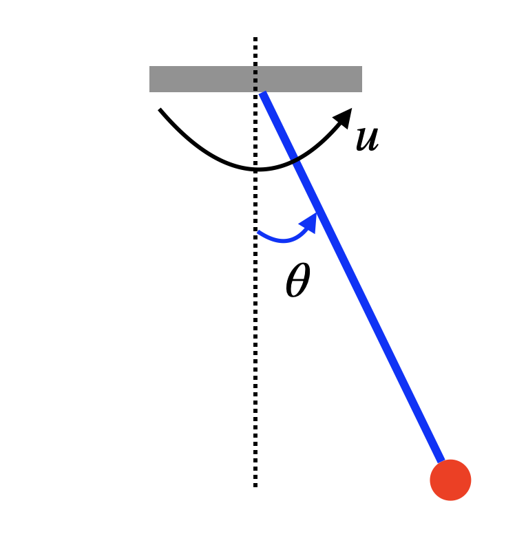
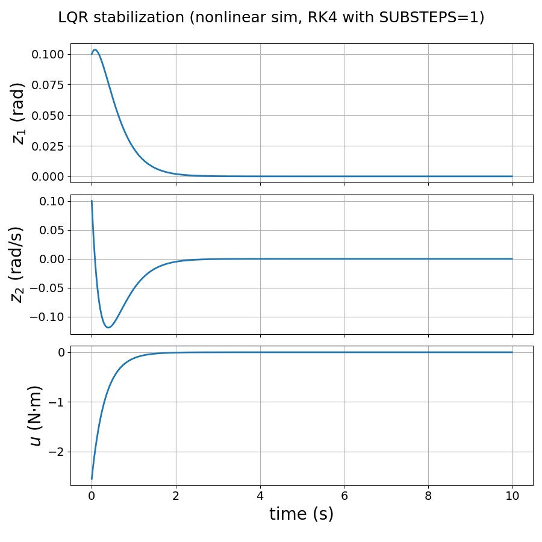
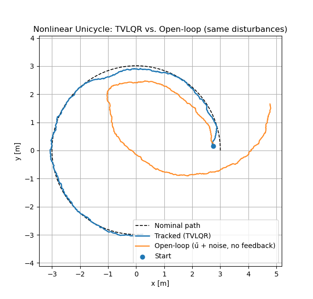
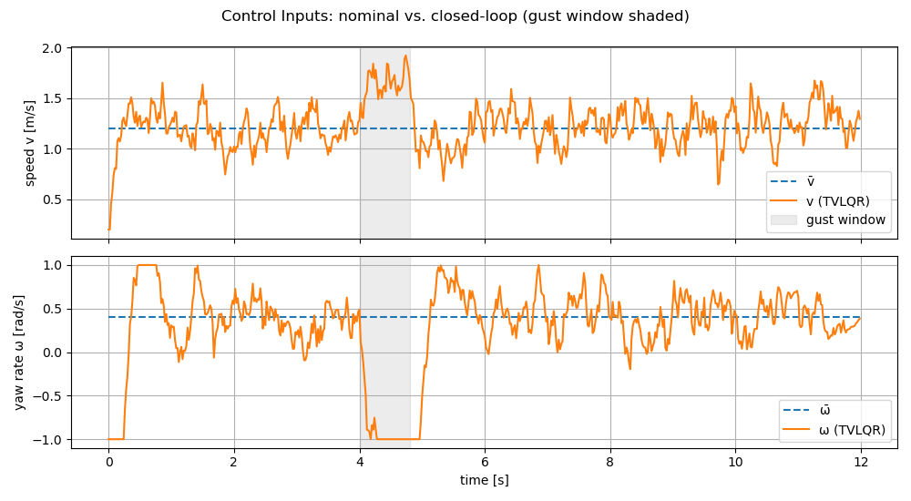
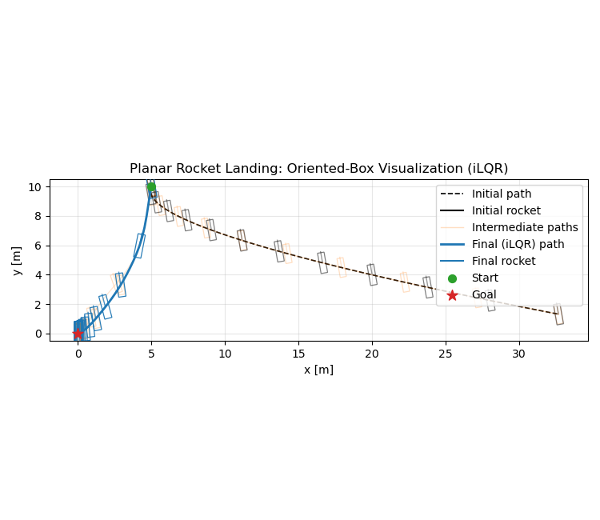
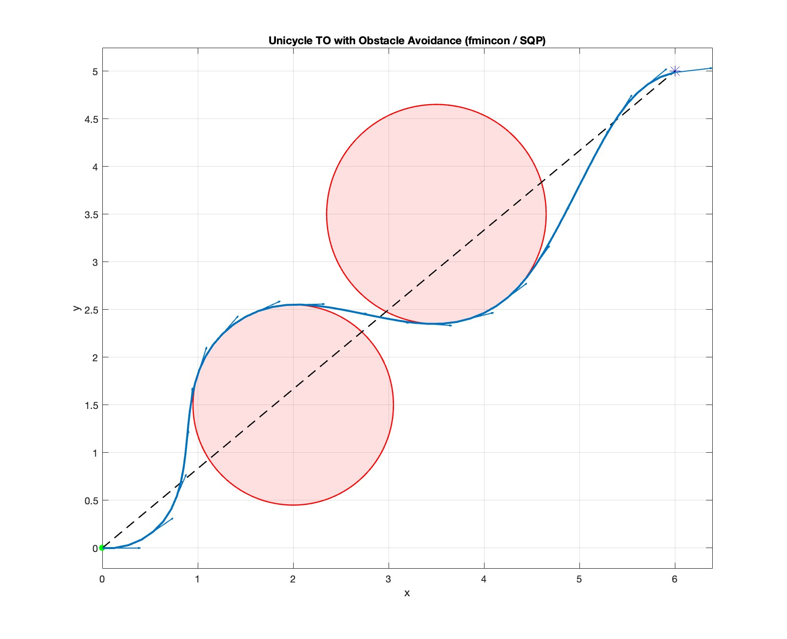
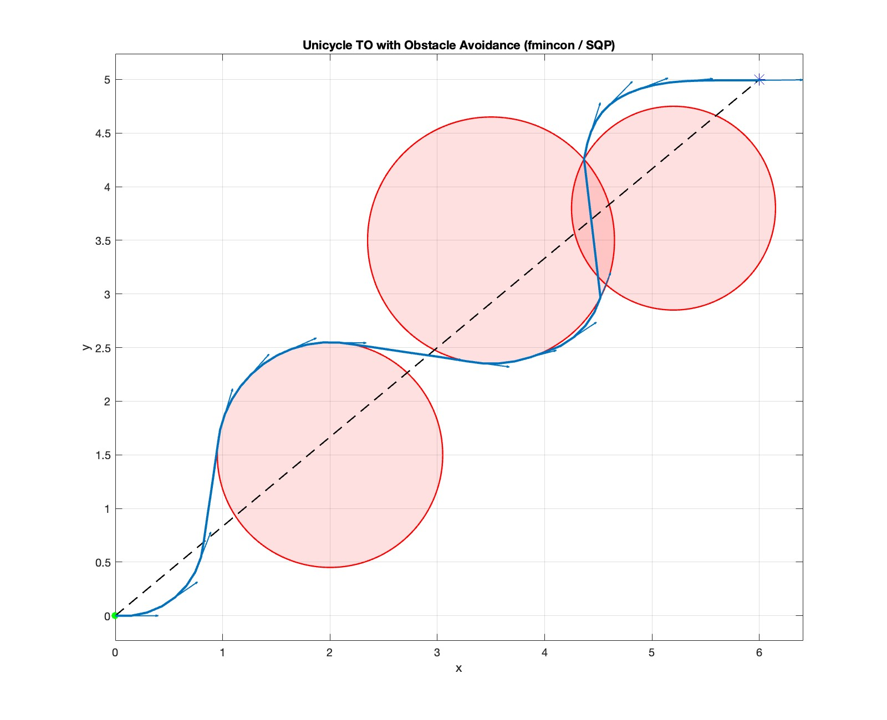
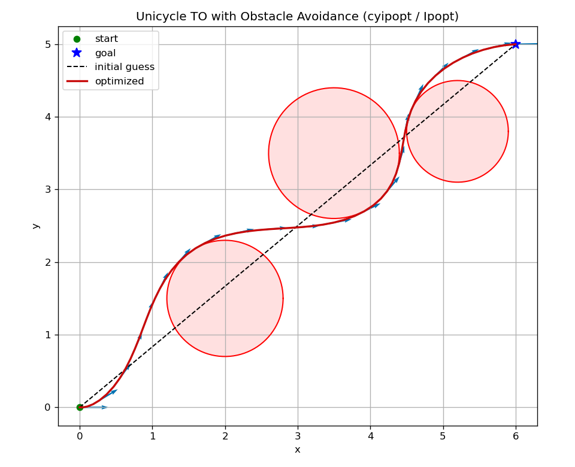
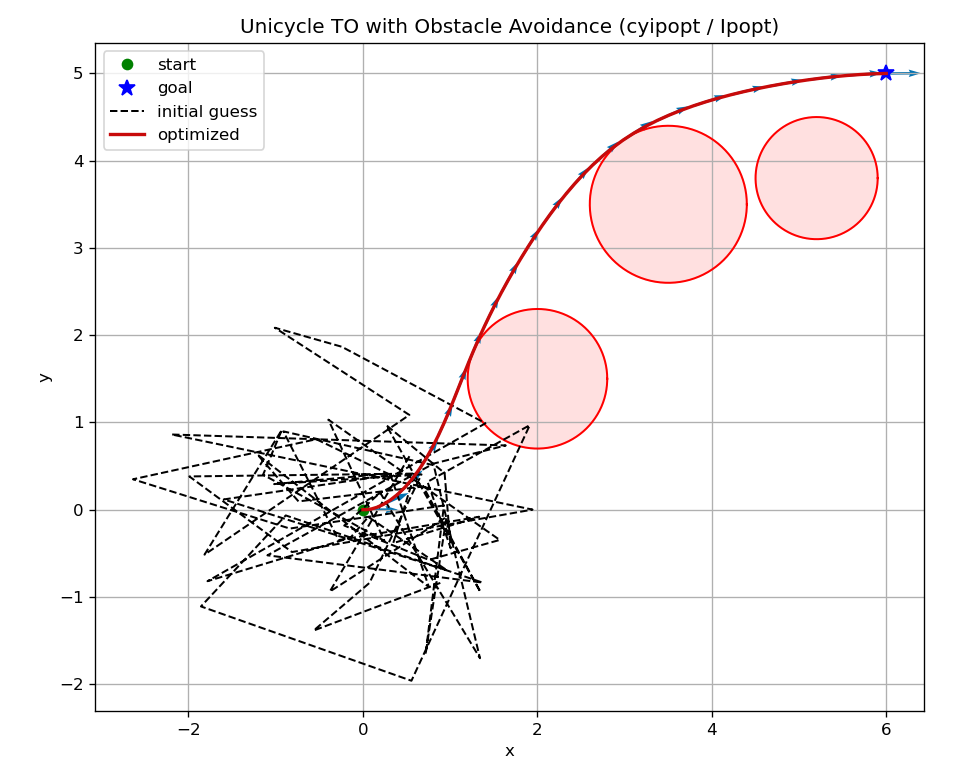

# Model-based Planning and Optimization {#model-based-plan-optimize}

In Chapter \@ref(mdp), we studied tabular MDPs with known dynamics where both the state and action spaces are finite, and we saw how dynamic-programming methods—Policy Iteration (PI) and Value Iteration (VI)—recover optimal policies.

Chapters \@ref(value-rl) and \@ref(policy-gradient) generalized these ideas to unknown dynamics and continuous spaces by introducing function approximation for value functions and policies. Those methods are *model-free*: they assume no access to the transition model and rely solely on data collected from interaction.

This chapter turns to the complementary regime: **known dynamics** with **continuous state and action spaces**. Our goal is to develop model-based planning and optimization methods that exploit the known dynamics to compute high-quality decisions efficiently.

We proceed in three steps:

1. **Linear-quadratic systems.** For linear dynamics and quadratic stage/terminal rewards (or costs), dynamic programming yields a linear optimal policy that can be computed efficiently via Riccati recursions. This setting serves as a tractable, illuminating baseline and a recurring building block in more general algorithms.

2. **Trajectory optimization (TO) for nonlinear systems.** When dynamics are nonlinear, we focus on planning an optimal state–action trajectory from a given initial condition, maximizing the cumulative reward (or minimizing cumulative cost) subject to dynamics and constraints. Unlike RL, which seeks an optimal *feedback policy* valid for all states, TO computes an *open-loop plan* (often with a time-varying local feedback around a nominal trajectory). Although less ambitious, TO naturally accommodates state/control constraints—common in motion planning under safety, actuation, and environmental limits—and is widely used in robotics and control.

3. **Model predictive control (MPC).** MPC converts open-loop plans into a feedback controller by repeatedly solving a short-horizon TO problem at each time step, applying only the first action, and receding the horizon. This receding-horizon strategy brings robustness to disturbances and model mismatch while retaining the constraint-handling benefits of TO.

We adopt the standard discrete-time dynamical system notation 
\[
x_{t+1} = f_t(x_t, u_t, w_t),
\]
where \(x_t \in \mathbb{R}^n\) is the state, \(u_t \in \mathbb{R}^m\) is the control/action, \(w_t \in \mathbb{R}^d\) is a (possibly stochastic) disturbance, and \(f_t\) is a known transition function, potentially nonlinear or nonsmooth. The goal is to find a policy that maximizes a sum of stage rewards \(r(x_t,u_t)\) and optional terminal reward \(r_T(x_T)\). We will often use the cost-minimization form \(c = -r\).
State and action constraints are written as
\[
x_t \in \mathcal{X}, \qquad u_t \in \mathcal{U}.
\]

## Linear Quadratic Regulator {#lqr}

In this section, we focus on the case when $f_t$ is a linear function, and the rewards/costs are quadratic in $x$ and $u$. This family of problems is known as linear quadratic regulator (LQR).

### Finite-Horizon LQR

Consider a linear discrete-time dynamical system 
\begin{equation}
x_{k+1} = A_k x_k + B_k u_k + w_k, \quad k=0,1,\dots,N-1,
(\#eq:lqr-linear-system)
\end{equation}
where $x_k \in \mathbb{R}^n$ the state, $u_k \in \mathbb{R}^m$ the control, $w_k \in \mathbb{R}^n$ the independent, zero-mean disturbance with given probability distribution that does not depend on $x_k,u_k$, and $A_k \in \mathbb{R}^{n \times n}, B_k \in \mathbb{R}^{n \times m}$ are known matrices determining the transition dynamics.

We want to solve the following optimal control problem 
\begin{equation}
\min_{\mu_0,\dots,\mu_{N-1}} \mathbb{E} \left\{ x_N^\top Q_N x_N + \sum_{k=0}^{N-1} \left( x_k^\top Q_k x_k + u_k^\top R_k u_k \right) \right\},
(\#eq:lqr-formulation)
\end{equation}
where $\mu_0,\dots,\mu_{N-1}$ are feedback policies/controllers that map states to actions and the expectation is taken over the randomness in $w_0,\dots,w_{N-1}$. In \@ref(eq:lqr-formulation), $\{Q_k \}_{k=0}^N$ are positive semidefinite matrices, and $\{ R_k \}_{k=0}^{N-1}$ are positive definite matrices. The formulation \@ref(eq:lqr-formulation) is known as the linear quadratic regulator (LQR) problem because the dynamics is linear, the cost is quadratic, and the formulation can be considered to "regulate" the system around the origin $x=0$. 

The Bellman Optimality condition introduced in Theorem \@ref(thm:FiniteHorizonMDPBellmanOptimality) still holds for continuous state and action spaces. Therefore, we will try to follow the dynamic programming (DP) algorithm in Section \@ref(dp) to solve for the optimal policy.

The DP algorithm computes the optimal cost-to-go backwards in time. 
The terminal cost is 
$$
J_N(x_N) = x_N^\top Q_N x_N
$$
by definition.

The optimal cost-to-go at time $N-1$ is equal to
\begin{equation}
\begin{split}
J_{N-1}(x_{N-1}) = \min_{u_{N-1}} \mathbb{E}_{w_{N-1}} \{ x_{N-1}^\top Q_{N-1} x_{N-1} + u_{N-1}^\top R_{N-1} u_{N-1} + \\ \Vert \underbrace{A_{N-1} x_{N-1} + B_{N-1} u_{N-1} + w_{N-1} }_{x_N} \Vert^2_{Q_N} \}
\end{split}
(\#eq:lqr-cost-N-1)
\end{equation}
where $\Vert v \Vert_Q^2 = v^\top Q v$ for $Q \succeq 0$. Now observe that the objective in \@ref(eq:lqr-cost-N-1) is 
\begin{equation}
\begin{split}
x_{N-1}^\top Q_{N-1} x_{N-1} + u_{N-1}^\top R_{N-1} u_{N-1} + \Vert A_{N-1} x_{N-1} + B_{N-1} u_{N-1} \Vert_{Q_N}^2 + \\
\mathbb{E}_{w_{N-1}} \left[ 2(A_{N-1} x_{N-1} + B_{N-1} u_{N-1} )^\top Q_{N-1} w_{N-1} \right] + \\
\mathbb{E}_{w_{N-1}} \left[ w_{N-1}^\top Q_N w_{N-1} \right]
\end{split}
\end{equation}
where the second line is zero due to $\mathbb{E}[w_{N-1}] = 0$ and the third line is a constant with respect to $u_{N-1}$. Consequently, the optimal control $u_{N-1}^\star$ can be computed by setting the derivative of the objective with respect to $u_{N-1}$ equal to zero 
\begin{equation}
u_{N-1}^\star = - \left[ \left( R_{N-1} + B_{N-1}^\top Q_N B_{N-1} \right)^{-1} B_{N-1}^\top Q_N A_{N-1} \right] x_{N-1}.
(\#eq:optimal-u-N-1)
\end{equation}
Plugging the optimal controller $u^\star_{N-1}$ back to the objective of \@ref(eq:lqr-cost-N-1) leads to
\begin{equation}
J_{N-1}(x_{N-1}) = x_{N-1}^\top S_{N-1} x_{N-1} + \mathbb{E} \left[ w_{N-1}^\top Q_N w_{N-1} \right],
(\#eq:optimal-cost-N-1)
\end{equation}
with 
$$
S_{N-1} = Q_{N-1} + A_{N-1}^\top \left[ Q_N - Q_N B_{N-1} \left( R_{N-1} + B_{N-1}^\top Q_N B_{N-1} \right)^{-1} B_{N-1}^\top Q_N \right] A_{N-1}.
$$
We note that $S_{N-1}$ is positive semidefinite (this is an exercise for you to convince yourself). 

Now we realize that something surprising and nice has happened.

1. The optimal controller $u^{\star}_{N-1}$ in \@ref(eq:optimal-u-N-1) is a linear feedback policy of the state $x_{N-1}$, and 

2. The optimal cost-to-go $J_{N-1}(x_{N-1})$ in \@ref(eq:optimal-cost-N-1) is quadratic in $x_{N-1}$, just the same as $J_{N}(x_N)$.

This implies that, if we continue to compute the optimal cost-to-go at time $N-2$, we will again compute a linear optimal controller and a quadratic optimal cost-to-go. This is the rare nice property for the LQR problem, that is, 

> The (representation) complexity of the optimal controller and cost-to-go does not grow as we run the DP recursion backwards in time. 

We summarize the solution for the LQR problem \@ref(eq:lqr-formulation) as follows.

::: {.theorembox}
::: {.proposition #discretetimefinitehorizonlqrsolution name="Solution of Discrete-Time Finite-Horizon LQR"}
The optimal controller for the LQR problem \@ref(eq:lqr-formulation) is a linear state-feedback policy
\begin{equation}
\mu_k^\star(x_k) = - K_k x_k, \quad k=0,\dots,N-1.
(\#eq:lqr-solution-control)
\end{equation}
The gain matrix $K_k$ can be computed as
$$
K_k = \left( R_k + B_k^\top S_{k+1} B_k  \right)^{-1} B_k^\top S_{k+1} A_k,
$$
where the matrix $S_k$ satisfies the following backwards recursion
\begin{equation}
\hspace{-6mm}
\begin{split}
S_N &= Q_N \\
S_k &= Q_k + A_k^\top \left[ S_{k+1} - S_{k+1}B_k \left( R_k + B_k^\top S_{k+1} B_k  \right)^{-1}  B_k^\top S_{k+1}  \right] A_k, k=N-1,\dots,0.
\end{split}
(\#eq:finite-discrete-lqr-riccati)
\end{equation}
The optimal cost-to-go is given by 
$$
J_0(x_0) = x_0^\top S_0 x_0 + \sum_{k=0}^{N-1} \mathbb{E} \left[ w_k^\top S_{k+1} w_k\right].
$$
The recursion \@ref(eq:finite-discrete-lqr-riccati) is called the _discrete-time Riccati equation_.
:::
:::

Proposition \@ref(prp:discretetimefinitehorizonlqrsolution) states that, to evaluate the optimal policy \@ref(eq:lqr-solution-control), one can first run the backwards Riccati equation \@ref(eq:finite-discrete-lqr-riccati) to compute all the positive definite matrices $S_k$, and then compute the gain matrices $K_k$. For systems of reasonable dimensions, evalutating the matrix inversion in \@ref(eq:finite-discrete-lqr-riccati) should be fairly efficient.


### Infinite-Horizon LQR {#infinite-horizon-lqr}

We now switch to the infinite-horizon LQR problem
\begin{align}
\min_{\mu} & \quad  \sum_{k=0}^{\infty} \left( x_k^\top Q x_k + u_k^\top R u_k \right) (\#eq:infinite-horizon-lqr-cost) \\
\text{subject to} & \quad x_{k+1} = A x_k + B u_k, \quad k=0,\dots,\infty, (\#eq:infinite-horizon-lqr-system)
\end{align}
where $Q \succeq 0$, $R \succ 0$, $A,B$ are constant matrices, and we seek a stationary policy $\mu$ that maps states to actions. Note that here we remove the disturbance $w_k$ because in general adding $w_k$ will make the objective function unbounded. To handle $w_k$, we will have to either add a discount factor $\gamma$, or switch to an average cost objective function. 

For infinite-horizon problems, the Bellman Optimality condition changes from a recursion to an equation. Specifically, according to Theorem \@ref(thm:BellmanOptimalityInfiniteHorizon) and equation \@ref(eq:BellmanOptimalityInfiniteHorizonStateValue), the optimal value function should satisfy the following Bellman optimality equation, restated for the case of cost minimization instead of reward maximization:
\begin{equation}
J^\star (x) = \min_{u} \left[ c(x,u) + \sum_{x'} P(x' \mid x, u) J^\star (x') \right], \quad \forall x,
(\#eq:BellmanOptimalityInfiniteHorizonRestateMin)
\end{equation}
where $c(x,u)$ is the cost function.

**Guess A Solution.** Based on our derivation in the finite-horizon case, we might as well guess that the optimal value function is a quadratic function:
$$
J(x) = x^\top S x, \quad \forall x,
$$
for some positive definite matrix $S$. Then, our guessed solution must satisfy the Bellman optimality stated in \@ref(eq:BellmanOptimalityInfiniteHorizonRestateMin):
\begin{equation}
x^\top S x = J(x) = \min_{u} \left\{ x^\top Q x + u^\top R u + \Vert \underbrace{A x + B u}_{x'} \Vert_S^2  \right\}.
(\#eq:infinite-horizon-lqr-invoke-dp)
\end{equation}
The minimization over $u$ in \@ref(eq:infinite-horizon-lqr-invoke-dp) can again be solved in closed-form by setting the gradient of the objective with respect to $u$ to be zero
\begin{equation}
u^\star = - \underbrace{\left[ \left( R + B^\top S B \right)^{-1} B^\top S A \right]}_{K} x.
(\#eq:infinite-horizon-lqr-control)
\end{equation}
Plugging the optimal $u^\star$ back into \@ref(eq:infinite-horizon-lqr-invoke-dp), we see that the matrix $S$ has to satisfy the following equation
\begin{equation}
S = Q + A^\top \left[  S - SB \left( R + B^\top S B  \right)^{-1} B^\top S \right] A.
(\#eq:algebraic-riccati)
\end{equation}
Equation \@ref(eq:algebraic-riccati) is known as the _discrete algebraic Riccati equation_ (DARE). 

So the question boils down to if the DARE has a solution $S$ that is positive definite?

::: {.theorembox}
::: {.proposition #infinitehorizonlqrsolution name="Solution of Discrete-Time Infinite-Horizon LQR"} 
Consider a linear system 
$$
x_{k+1} = A x_k + B u_k,
$$
with $(A,B)$ controllable (see Section \@ref(linear-system-basics)). Let $Q \succeq 0$ in \@ref(eq:infinite-horizon-lqr-cost) be such that $Q$ can be written as $Q = C^\top C$ with $(A,C)$ observable. 

Then the optimal controller for the infinite-horizon LQR problem \@ref(eq:infinite-horizon-lqr-cost) is a stationary linear policy
$$
\mu^\star (x) = - K x,
$$
with 
$$
K = \left( R + B^\top S B \right)^{-1} B^\top S A.
$$
The matrix $S$ is the unique positive definite matrix that satisfies the discrete algebraic Riccati equation 
\begin{equation}
S = Q + A^\top \left[  S - SB \left( R + B^\top S B  \right)^{-1} B^\top S \right] A.
(\#eq:discrete-algebraic-riccati-equation)
\end{equation}

Moreover, the closed-loop system 
$$
x_{k+1} = A x_k + B (-K x_k) = (A - BK) x_k
$$
is stable, i.e., the eigenvalues of the matrix $A - BK$ are strictly within the unit circle (see Appendix \@ref(app-lti-stability-dt)).
:::
:::

*Remark.* The assumptions of $(A,B)$ being controllable and $(A,C)$ being observable can be relaxted to $(A,B)$ being stabilizable and $(A,C)$ being detectable (for definitions of stabilizability and detectability, see Appendix \@ref(app-lti-system-theory)).

We have not discussed how to solve the algebraic Riccati equation \@ref(eq:discrete-algebraic-riccati-equation). It is clear that \@ref(eq:discrete-algebraic-riccati-equation) is not a linear system of equations in $S$. In fact, the numerical algorithms for solving the algebraic Riccati equation can be highly nontrivial, for example see [@arnold84ieee-generalized]. Fortunately, such algorithms are often readily available, and as practitioners we do not need to worry about solving the algebraic Riccati equation by ourselves. For example, the Matlab [`dlqr`](https://www.mathworks.com/help/control/ref/dlqr.html) and the Python [`scipy.linalg.solve_discrete_are`](https://docs.scipy.org/doc/scipy/reference/generated/scipy.linalg.solve_discrete_are.html) function computes the $K$ and $S$ matrices from $A,B,Q,R$. 

Let us now apply the infinite-horizon LQR solution to stabilizing a simple pendulum.


::: {.examplebox}
::: {.example #lqr-pendulum-stabilization name="Pendulum Stabilization by LQR"}
Consider the simple pendulum in Fig. \@ref(fig:pendulum-drawing) with dynamics
\begin{equation}
x = \begin{bmatrix} \theta \\ \dot{\theta} \end{bmatrix}, \quad 
\dot{x} = f(x,u) = \begin{bmatrix}
\dot{\theta} \\
-\frac{1}{ml^2}(b \dot{\theta} + mgl \sin \theta) + \frac{1}{ml^2} u
\end{bmatrix}
(\#eq:lqr-pendulum-dynamics)
\end{equation}
where $m$ is the mass of the pendulum, $l$ is the length of the pole, $g$ is the gravitational constant, $b$ is the damping ratio, and $u$ is the torque applied to the pendulum. 

We are interested in applying the LQR controller to balance the pendulum in the upright position $x_d = [\pi,0]^\top$ with a zero velocity.

```{r pendulum-drawing, out.width='40%', fig.show='hold', fig.cap='A Simple Pendulum.', fig.align='center', echo=FALSE}

```

Let us first shift the dynamics so that "$0$" is the upright position. This can be done by defining a new variable $z = x - x_d = [\theta - \pi, \dot{\theta}]^\top$, which leads to 
\begin{equation}
\dot{z} = \dot{x} = f(x,u) = f(z + x_d,u) = \begin{bmatrix}
z_2 \\
\frac{1}{ml^2} \left( u - b z_2 + mgl \sin z_1  \right)
\end{bmatrix} = f'(z,u).
(\#eq:pendulum-dynamics-z-coordinate)
\end{equation}
We then linearize the nonlinear dynamics $\dot{z} = f'(z,u)$ at the point $z^\star = 0, u^\star = 0$:
\begin{align}
\dot{z} & \approx f'(z^\star,u^\star) + \left( \frac{\partial f'}{\partial z} \right)_{z^\star,u^\star} (z - z^\star) + \left( \frac{\partial f'}{\partial u} \right)_{z^\star,u^\star} (u - u^\star) \\
& = \begin{bmatrix}
0 & 1 \\
\frac{g}{l} \cos z_1 & - \frac{b}{ml^2}
\end{bmatrix}_{z^\star, u^\star} z + 
\begin{bmatrix}
0 \\
\frac{1}{ml^2}
\end{bmatrix} u \\
& = \underbrace{\begin{bmatrix}
0 & 1 \\
\frac{g}{l} & - \frac{b}{ml^2}
\end{bmatrix}}_{A_c} z  + 
\underbrace{\begin{bmatrix}
0 \\
\frac{1}{ml^2}
\end{bmatrix}}_{B_c} u.
\end{align} 
Finally, we convert the continuous-time dynamics to discrete time with a fixed discretization $h$
$$
z_{k+1} = \dot{z}_k \cdot h + z_k = \underbrace{(h \cdot A_c + I )}_{A} z_k + \underbrace{(h \cdot B_c)}_{B} u_k.
$$

We are now ready to implement the LQR controller. In the formulation \@ref(eq:infinite-horizon-lqr-cost), we choose $Q = I$, $R = I$, and compute the gain matrix $K$ by solving the DARE.

Fig. \@ref(fig:pendulum-stabilization-sim) shows the simulation result for $m=1,l=1,b=0.1$, $g = 9.8$, and $h = 0.01$, with an initial condition $z^0 = [0.1,0.1]^\top$. We can see that the LQR controller successfully stabilizes the pendulum at $z^\star$, the upright position.

You can play with the Python code [here](https://github.com/ComputationalRobotics/2025-ES-AM-158-LECTURE-CODE/blob/main/pendulum_lqr_stabilization.py). 

Alternatively, the Matlab code can be found [here](https://github.com/ComputationalRobotics/OptimalControlEstimation-Examples/blob/main/pendulum_stabilization_lqr.m).

```{r pendulum-stabilization-sim, out.width='60%', fig.show='hold', fig.cap='LQR stabilization of a simple pendulum.', fig.align='center', echo=FALSE}

```
:::
:::

### Linear System Basics {#linear-system-basics}

Consider the discrete-time linear time-invariant (LTI) system
\[
x_{k+1}=Ax_k+Bu_k,\qquad y_k=Cx_k+Du_k,
\]
with \(x_k\in\mathbb{R}^n,\;u_k\in\mathbb{R}^m,\;y_k\in\mathbb{R}^p\).

We provide a very brief review of linear system theory to understand Proposition \@ref(prp:infinitehorizonlqrsolution). More details can be found in Appendix \@ref(app-lti-system-theory).


**Stability.** The autonomous system \(x_{k+1}=Ax_k\) is (asymptotically) stable if for every \(x_0\) we have \(x_k\to 0\) as \(k\to\infty\).

**Equivalent characterizations.**

- \(A\) is **Schur**: all eigenvalues satisfy \(|\lambda_i(A)|<1\). 

- Lyapunov: \(\exists P\succ 0\) s.t. \(A^\top P A - P \prec 0\).  


**Controllability (reachability).** The pair \((A,B)\) is controllable if for any \(x_0,x_f\) there exists a *finite* input sequence \(\{u_0,\dots,u_{N-1}\}\) that drives the state from \(x_0\) to \(x_N=x_f\).

**Kalman controllability matrix.**
  \[
  \mathcal C \;=\; [\,B\; AB\; A^2B\;\cdots\; A^{n-1}B\,],\quad
  \text{\((A,B)\) controllable} \iff \operatorname{rank}(\mathcal C)=n.
  \]

**Popov-Belevitch-Hautus (PBH) test.**
  \[
  \text{\((A,B)\) controllable} \iff 
  \operatorname{rank}\!\begin{bmatrix}\lambda I - A & B\end{bmatrix} = n
  \ \text{for all}\ \lambda\in\mathbb{C}.
  \]
It suffices to check \(\lambda\) equal to the eigenvalues of \(A\).

**Observability.** The pair \((A,C)\) is observable if the initial state \(x_0\) can be uniquely determined from a finite sequence of outputs (and known inputs), e.g., from \(\{y_0,\dots,y_{n-1}\}\).

**Observability matrix.**
  \[
  \mathcal O \;=\; \begin{bmatrix} C \\ CA \\ \vdots \\ CA^{n-1}\end{bmatrix},\quad
  \text{\((A,C)\) observable} \iff \operatorname{rank}(\mathcal O)=n.
  \]

**PBH test.**
  \[
  \text{\((A,C)\) observable} \iff 
  \operatorname{rank}\!\begin{bmatrix}\lambda I - A^\top & C^\top\end{bmatrix} = n
  \ \text{for all}\ \lambda\in\mathbb{C}.
  \]
Dual to controllability: \((A,C)\) observable \(\Leftrightarrow\) \((A^\top,C^\top)\) controllable.


## LQR Trajectory Tracking {#lqr-tracking}

Classical LQR delivers an optimal linear state-feedback when dynamics are linear and the objective is quadratic. In many planning problems, however, we do not seek a single stationary feedback for *all* states but rather a *local stabilizer around a given (possibly time-varying) trajectory*—for instance, a motion plan from a trajectory optimizer or MPC's rolling nominal (see Section \@ref(traj-opt)). LQR Tracking (also called time-varying LQR, TVLQR) provides exactly this: a *time-varying* linear feedback that stabilizes the system near a nominal state–control sequence and rejects small disturbances.

**Problem Setup.** Let the nominal (i.e., ignoring the disturbance) discrete-time system be
\[
x_{t+1} \;=\; f_t(x_t,u_t), \qquad t=0,\dots,N-1,
\]
and suppose we have a *nominal trajectory* \(\{(\bar x_t,\bar u_t)\}_{t=0}^{N-1}\) satisfying
\[
\bar x_{t+1} \;=\; f_t(\bar x_t,\bar u_t).
\]

Our goal is to design a controller that can stabilize the system with disturbance, i.e., $x_{t+1} = f_t(x_t, u_t, w_t)$, around the nominal trajectory.

Towards this, we define *deviations* from the nominal trajectory as
\[
\delta x_t := x_t-\bar x_t, \qquad \delta u_t := u_t-\bar u_t.
\]

If the true system is linear time-varying (or we linearize a nonlinear system along the nominal), we obtain the *deviation dynamics*
\[
\delta x_{t+1} \;\approx\; A_t\,\delta x_t + B_t\,\delta u_t,
\quad
A_t := \left.\frac{\partial f_t}{\partial x}\right|_{(\bar x_t,\bar u_t)},\quad
B_t := \left.\frac{\partial f_t}{\partial u}\right|_{(\bar x_t,\bar u_t)}.
(\#eq:tvlqr-deviation-dynamics)
\]

We penalize deviations with a quadratic cost
\[
J \;=\; \delta x_N^\top Q_N \delta x_N
\;+\;\sum_{t=0}^{N-1} \Big(\delta x_t^\top Q_t \delta x_t \;+\; \delta u_t^\top R_t \delta u_t\Big),
\quad Q_t\succeq 0,\; R_t\succ 0.
(\#eq:tvlqr-deviation-cost)
\]

**LQR Tracking Algorithm.** The tracking controller takes the *affine* form
\[
u_t \;=\; \bar u_t \;-\; K_t\,(x_t-\bar x_t),
\]
where \(\{K_t\}_{t=0}^{N-1}\) are time-varying gains computed by a backward Riccati recursion on the deviation system \@ref(eq:tvlqr-deviation-dynamics) with cost \@ref(eq:tvlqr-deviation-cost). 

From Proposition \@ref(prp:discretetimefinitehorizonlqrsolution), we know the gains can be computed as follows. 

Initialize at terminal time:
\[
S_N \;=\; Q_N.
\]
For \(t = N-1,\,N-2,\,\dots,\,0\):
\begin{equation}
\begin{split}
K_t &= \Big(R_t + B_t^\top S_{t+1} B_t\Big)^{-1} B_t^\top S_{t+1} A_t, \\[2mm]
S_t &= Q_t \;+\; A_t^\top \!\Big(S_{t+1} - S_{t+1} B_t \big(R_t + B_t^\top S_{t+1} B_t\big)^{-1} B_t^\top S_{t+1}\Big) A_t.
\end{split}
(\#eq:tvlqr-riccati)
\end{equation}

Given the gains \(\{K_t\}\), apply at runtime:
\begin{equation}
u_t \;=\; \bar u_t - K_t\,(x_t-\bar x_t), \qquad t=0,\dots,N-1.
(\#eq:tvlqr-control-law)
\end{equation}

The following pseudocode summarizes the algorithm.

::: {.highlightbox}
**Algorithm: LQR Trajectory Tracking (TVLQR)**

**Inputs:** nominal \(\{(\bar x_t,\bar u_t)\}_{t=0}^{N-1}\), weights \(\{Q_t,R_t\}\), terminal \(Q_N\).

1. **Linearize** along the nominal to get \(A_t,B_t\) via \@ref(eq:tvlqr-deviation-dynamics).  
2. **Backward pass:** compute \(K_t\) and \(S_t\) via \@ref(eq:tvlqr-riccati).  
3. **Apply feedback:** \(u_t=\bar u_t - K_t(x_t-\bar x_t)\) as in \@ref(eq:tvlqr-control-law).  

**Output:** time-varying gains \(\{K_t\}\) giving a local stabilizer around the trajectory.
:::

We now apply TVLQR to a vehicle trajectory tracking problem.


::: {.examplebox}
::: {.example #tvlqr-unicyle name="LQR Trajectory Tracking for Unicyle"}

We (i) define the dynamics in continuous and discrete time, (ii) specify a circular *nominal trajectory*, (iii) linearize the nonlinear dynamics *along the nominal*, (iv) state the deviation-cost weights \(Q,R\) (and terminal \(Q_N\)), and (v) list the *experiment setup* (discretization and horizon length).


**Unicycle Dynamics (Continuous and Discrete).**

**State and input.**  
\[
x=\begin{bmatrix}p_x\\ p_y\\ \theta\end{bmatrix}\in\mathbb{R}^3,
\qquad
u=\begin{bmatrix}v\\ \omega\end{bmatrix}\in\mathbb{R}^2,
\]
where \((p_x,p_y)\) is planar position, \(\theta\) is heading, \(v\) is forward speed, and \(\omega\) is yaw rate.

**Continuous time:**
\begin{equation}
\dot p_x = v\cos\theta,\qquad
\dot p_y = v\sin\theta,\qquad
\dot\theta = \omega.
(\#eq:unicycle-ct)
\end{equation}

**Discrete time (forward Euler with step \(h>0\)):**
\begin{equation}
x_{t+1} \;=\; f(x_t,u_t)
:= \begin{bmatrix}
p_{x,t} + h\, v_t\cos\theta_t\\[2pt]
p_{y,t} + h\, v_t\sin\theta_t\\[2pt]
\theta_t + h\,\omega_t
\end{bmatrix}.
(\#eq:unicycle-dt)
\end{equation}

**Nominal Trajectory (Circular Motion).** We track a circle of radius \(R=\dfrac{\bar v}{\bar\omega}\) using *constant nominal inputs*
\begin{equation}
\bar u_t \equiv \begin{bmatrix}\bar v\\ \bar\omega\end{bmatrix},\qquad t=0,\dots,N-1,
(\#eq:unicycle-nominal-control)
\end{equation}
and generate the *nominal state* recursively under the discrete dynamics \@ref(eq:unicycle-dt):
\begin{equation}
\bar x_{t+1} \;=\; f(\bar x_t,\bar u_t),\qquad \bar x_0 = \begin{bmatrix}R\\ 0\\ \frac{\pi}{2}\end{bmatrix}.
(\#eq:unicycle-discrete-nominal)
\end{equation}

We define *deviations* from the nominal:
\[
\delta x_t := x_t-\bar x_t,\qquad \delta u_t := u_t-\bar u_t.
\]

**Linearization Along the Nominal.** Linearize \@ref(eq:unicycle-dt) at \((\bar x_t,\bar u_t)\) to obtain the deviation dynamics
\begin{equation}
\delta x_{t+1} \;\approx\; A_t\,\delta x_t + B_t\,\delta u_t,
(\#eq:unicycle-dev-dyn)
\end{equation}
with Jacobians (using \(c_t:=\cos\bar\theta_t,\ s_t:=\sin\bar\theta_t\))
\begin{equation}
A_t \;=\; \frac{\partial f}{\partial x}\Big|_{(\bar x_t,\bar u_t)}
= \begin{bmatrix}
1 & 0 & -h\,\bar v\,s_t\\
0 & 1 & \ \ h\,\bar v\,c_t\\
0 & 0 & 1
\end{bmatrix},
\qquad
B_t \;=\; \frac{\partial f}{\partial u}\Big|_{(\bar x_t,\bar u_t)}
= \begin{bmatrix}
h\,c_t & 0\\
h\,s_t & 0\\
0 & h
\end{bmatrix}.
(\#eq:unicycle-linearization)
\end{equation}

**Deviation Cost (Weights \(Q,R,Q_N\)).** We penalize deviations with a quadratic stage/terminal cost
\[
J \;=\; \delta x_N^\top Q_N\,\delta x_N
\;+\;\sum_{t=0}^{N-1}\Big(\delta x_t^\top Q\,\delta x_t+\delta u_t^\top R\,\delta u_t\Big),
\]
using the weights:
\begin{equation}
Q=\mathrm{diag}(30,\;30,\;5),\qquad
Q_N=\mathrm{diag}(60,\;60,\;8),\qquad
R=\mathrm{diag}(0.2,\;0.2).
(\#eq:unicycle-weights)
\end{equation}
These reflect a stronger emphasis on position tracking, a moderate penalty on heading error, and a mild penalty on control *deviations* from the nominal.

**Experiment Setup.**

- **Discretization step:** \(h = 0.02\ \mathrm{s}\).  
- **Horizon length:** \(T_{\mathrm{final}} = 12\ \mathrm{s}\).  
- **Number of steps:** \(N = T_{\mathrm{final}}/h = \mathbf{600}\).  
- **Nominal inputs:** \(\bar v = 1.2\ \mathrm{m/s},\ \bar\omega = 0.4\ \mathrm{rad/s}\) (radius \(R=\bar v/\bar\omega\)).  
- **Initialization:** the nominal starts at \(\bar x_0 = [\,R,\,0,\,\pi/2\,]^\top\); the actual system may start with a small offset (see code).

With \((A_t,B_t)\) from \@ref(eq:unicycle-linearization) and weights \@ref(eq:unicycle-weights), the TVLQR backward Riccati recursion (Section \@ref(lqr-tracking)) yields gains \(K_t\). We then apply the **local feedback**
\[
u_t \;=\; \bar u_t - K_t\,(x_t-\bar x_t),
\]
to robustly track the circular nominal under small disturbances.

**Disturbances.** To test robustness, we inject additive process disturbances into the discrete dynamics:
\[
x_{t+1} \;=\; f(x_t,u_t)\;+\; w_t,\qquad t=0,\dots,N-1,
\]
where
\[
w_t \;=\; \underbrace{\eta_t}_{\text{i.i.d. Gaussian noise}} \;+\; \underbrace{g_t}_{\text{deterministic gust}}.
\]

1) Small i.i.d. Gaussian process noise. We draw \(\eta_t \sim \mathcal N(0,W)\) independently at each step with
\[
W \;=\; \mathrm{diag}\!\big(\sigma_x^2,\ \sigma_y^2,\ \sigma_\theta^2\big),
\qquad
\sigma_x = \sigma_y = 0.01\ \text{m},\quad
\sigma_\theta = \mathrm{deg2rad}(0.2).
\]
This noise perturbs the post-update state components \((p_x,p_y,\theta)\).

2) Finite-duration "gust" impulse.
In addition to \(\eta_t\), we apply a brief deterministic bias over a window
\[
t \in [t_g,\ t_g+\Delta] \;=\; [\,4.0\,\mathrm{s},\ 4.8\,\mathrm{s}\,),
\]
implemented at the discrete indices \(\{t_g,\dots,t_g+\Delta\}\). During this window we set
\[
g_t \;=\; \begin{bmatrix}
\delta p_x \\[1mm] 0 \\[1mm] \delta \theta
\end{bmatrix},
\qquad
\delta p_x = 0.01\ \text{m per step},\quad
\delta \theta = \mathrm{deg2rad}(1.8)\ \text{per step},
\]
and \(g_t=\mathbf{0}\) otherwise. This models a short-lived lateral drift and a heading kick.

**Results.** Fig. \@ref(fig:unicycle-lqr-tracking-trajectory) visualizes the nominal trajectory (the dotted circle) and the TVLQR-stabilized trajectory in blue. To clearly see the impact of closed-loop LQR tracking, we also plotted the open-loop trajectory, i.e., the system's trajectory if no feedback is applied. We can observe that the TVLQR controller effectively rejects the disturbances and stabilizes the closed-loop trajectory along the nominal path.

Fig. \@ref(fig:unicycle-lqr-tracking-error) visualizes the state tracking error (position and heading error) as well as compares the closed-loop control with open-loop control. 

You can play with the code [here](https://github.com/ComputationalRobotics/2025-ES-AM-158-LECTURE-CODE/blob/main/lqr_tracking.py).


```{r unicycle-lqr-tracking-trajectory, out.width='60%', fig.show='hold', fig.cap='LQR Trajectory Tracking for Unicyle: comparison between nominal trajectory, open-loop trajectory, and closed-loop trajectory with feedback.', fig.align='center', echo=FALSE}

```

```{r unicycle-lqr-tracking-error, out.width='90%', fig.show='hold', fig.cap='LQR Trajectory Tracking for Unicyle: state tracking error (top) and control signal (bottom).', fig.align='center', echo=FALSE}
knitr::include_graphics('images/Model-based-optimization/tvlqr_state_error.png')

```
:::
:::

## Trajectory Optimization {#traj-opt}

In Section \@ref(lqr-tracking) we saw that TVLQR gives a powerful *local stabilizer* around a nominal state–control sequence \((\bar x_t,\bar u_t)\). This raises a natural question:

> Where do nominal trajectories come from?

In many robotics tasks (maneuvering a car, landing a rocket, walking with a robot), we must compute a *feasible, high-quality open-loop plan* that respects the dynamics and constraints. **Trajectory Optimization (TO)** does exactly this: it searches over sequences \(\{x_t,u_t\}\) to minimize a cumulative cost while satisfying the system dynamics and constraints.

Moreover, if we can solve TO **quickly** (or approximately, but reliably), then by re-solving over a short horizon at each time step and applying only the first control, we obtain **Model Predictive Control (MPC)**—a feedback controller that blends optimization with robustness (see Section \@ref(mpc) later). Thus, TO is both a **planner** and the engine behind **feedback via MPC**.

**General Nonlinear Trajectory Optimization Problem.** We adopt the standard discrete-time nonlinear system
\[
x_{t+1} = f_t(x_t,u_t),\qquad t=0,\dots,N-1,
\]
with state \(x_t\in\mathbb{R}^n\) and control \(u_t\in\mathbb{R}^m\). A generic finite-horizon TO problem is
\begin{equation}
\begin{split}
\min_{\{x_t,u_t\}} \quad &
\Phi(x_N) + \sum_{t=0}^{N-1} \ell_t(x_t,u_t) \\[2mm]
\text{s.t.}\quad &
x_{t+1} = f_t(x_t,u_t), \qquad t=0,\dots,N-1,\\
& x_0 = \hat x_0 \ \ \text{(given)},\\
& x_t \in \mathcal X_t,\quad u_t \in \mathcal U_t \quad \text{(bounds)},\\
& g_t(x_t,u_t) \le 0,\quad h_t(x_t,u_t)=0 \quad \text{(path/terminal constraints).}
\end{split}
(\#eq:to-general)
\end{equation}
Here \(\ell_t\) and \(\Phi\) encode performance (e.g., energy, time, tracking error), \(\mathcal X_t,\mathcal U_t\) capture box limits and safety sets, and \(g_t,h_t\) represent additional nonlinear constraints (obstacles, terminal goals, etc.). 

Solving \@ref(eq:to-general) directly is difficult in general. A widely used strategy is to iteratively approximate it by *quadratic* subproblems that can be solved efficiently. This leads to **iLQR** and its second-order cousin **DDP** (see Section \@ref(ddp)). 

### Iterative LQR {#traj-opt-ilqr}

**High-level intuition.** iLQR (iterative LQR) alternates between:

1. **Local modeling:** around a *current* nominal trajectory \(\{(\bar x_t,\bar u_t)\}\),  
   - **linearize** the dynamics,  
   - **quadratically approximate** the cost.

2. **LQR step:** solve the resulting *time-varying LQR* subproblem to obtain a *time-varying affine policy*
   \[
   \delta u_t = k_t + K_t\,\delta x_t,\quad \delta x_t:=x_t-\bar x_t,\ \delta u_t:=u_t-\bar u_t,
   \]
   which gives both a feedforward step \(k_t\) (to change the nominal control) and a feedback gain \(K_t\) (to stabilize the rollout).

3. **Forward rollout + line search:** apply \(u_t^{\text{new}}=\bar u_t+\alpha k_t + K_t(x_t^{\text{new}}-\bar x_t)\) to the true nonlinear dynamics, producing a new nominal trajectory \(\{(\bar x_t,\bar u_t)\}\). Here we choose \(\alpha\in(0,1]\) to reduce the cost and respect constraints.

4. **Repeat** until convergence (cost decrease and dynamics residuals are small).

iLQR can be viewed as a [Gauss–Newton method](https://en.wikipedia.org/wiki/Gauss–Newton_algorithm) on trajectories: it uses first-order dynamics and second-order cost, capturing the dominant curvature while remaining numerically robust and fast.

#### LQR Subproblem (one iLQR outer iteration)

Given a nominal trajectory \(\{(\bar x_t,\bar u_t)\}_{t=0}^{N-1}\) with \(\bar x_{t+1}=f_t(\bar x_t,\bar u_t)\), define deviations
\[
\delta x_t := x_t-\bar x_t,\qquad \delta u_t := u_t-\bar u_t,\qquad \delta x_0\ \text{given.}
\]

**Linearized Dynamics.** We linearize the dynamics along the nominal trajectory
\[
\delta x_{t+1} \;\approx\; A_t\,\delta x_t + B_t\,\delta u_t,\quad
A_t:=\left.\frac{\partial f_t}{\partial x}\right|_{(\bar x_t,\bar u_t)},\ \ 
B_t:=\left.\frac{\partial f_t}{\partial u}\right|_{(\bar x_t,\bar u_t)}.
(\#eq:ilqr-linearize)
\]

**Quadratic Cost Approximation.** We perform a quadratic approximation of the objective function about \((\bar x_t,\bar u_t)\)
\[
\begin{aligned}
\ell_t(x_t,u_t) &\approx \ell_t 
+ \ell_{x,t}^\top \delta x_t + \ell_{u,t}^\top \delta u_t
+ \frac{1}{2}
\begin{bmatrix}\delta x_t\\ \delta u_t\end{bmatrix}^{\!\top}
\!\begin{bmatrix}\ell_{xx,t} & \ell_{xu,t}\\ \ell_{ux,t} & \ell_{uu,t}\end{bmatrix}
\!\begin{bmatrix}\delta x_t\\ \delta u_t\end{bmatrix},\\
\Phi(x_N) &\approx \Phi + \Phi_x^\top \delta x_N + \frac{1}{2}\,\delta x_N^\top \Phi_{xx}\,\delta x_N.
\end{aligned}
(\#eq:ilqr-quadratic-cost)
\]


**The LQR Subproblem.** With \@ref(eq:ilqr-linearize)–\@ref(eq:ilqr-quadratic-cost), the iLQR subproblem at this outer iteration is the **finite-horizon linear–quadratic program in deviations**:
\[
\begin{aligned}
\min_{\{\delta x_t,\delta u_t\}} \quad
& \underbrace{\frac{1}{2}\,\delta x_N^\top \Phi_{xx}\,\delta x_N + \Phi_x^\top \delta x_N}_{\text{terminal}}
\;+\; \\
& \sum_{t=0}^{N-1}
\underbrace{\Big(
\frac{1}{2}
\begin{bmatrix}\delta x_t\\ \delta u_t\end{bmatrix}^{\!\top}
\!\begin{bmatrix}\ell_{xx,t} & \ell_{xu,t}\\ \ell_{ux,t} & \ell_{uu,t}\end{bmatrix}
\!\begin{bmatrix}\delta x_t\\ \delta u_t\end{bmatrix}
+ \ell_{x,t}^\top\delta x_t + \ell_{u,t}^\top\delta u_t
\Big)}_{\text{stage}} \\[1mm]
\text{s.t.}\quad &
\delta x_{t+1} = A_t\,\delta x_t + B_t\,\delta u_t,\qquad t=0,\dots,N-1,\\
& \delta x_0\ \text{given.}
\end{aligned}
(\#eq:ilqr-lqr-subproblem)
\]

> **Notes.** The iLQR subproblem \@ref(eq:ilqr-lqr-subproblem) is slightly different from the previous finite-horizon LQR formulation \@ref(eq:lqr-formulation) in the sense that the objective function of \@ref(eq:ilqr-lqr-subproblem) also contains **linear terms** in \(\delta x_t,\delta u_t\), and those linear terms come from the Taylor expansion of the original nonlinear objective fuctions. In this case, we will see in the following that the optimal policy is **affine** (feedforward \(k_t\) + feedback \(K_t\)).

#### Solving the Subproblem by Dynamic Programming

We posit a **quadratic value approximator** at each time:
\[
V_{t}(\delta x_{t})
\;\approx\;
V_{t}
+ V_{x,t}^\top \delta x_t
+ \frac{1}{2}\,\delta x_t^\top V_{xx,t}\,\delta x_t,
\qquad
V_{x,N}=\Phi_x,\; V_{xx,N}=\Phi_{xx}.
(\#eq:ilqr-value)
\]
Note that this quadratic value approximator also contains linear and constant terms because the objective function contains linear terms.

Define the local Q-function at stage \(t\) by substituting the linear dynamics into the next-step value (this is our familiar Q-value in RL):
\[
Q_t(\delta x_t,\delta u_t)
\;=\;
\ell_t(x_t,u_t) + V_{t+1} \big(A_t\delta x_t + B_t\delta u_t\big),
\]
which, after collecting terms, yields the iLQR blocks
\[
\begin{aligned}
Q_{x,t}&=\ell_{x,t}+A_t^\top V_{x,t+1},\qquad
Q_{u,t}=\ell_{u,t}+B_t^\top V_{x,t+1},\\
Q_{xx,t}&=\ell_{xx,t}+A_t^\top V_{xx,t+1}A_t,\quad
Q_{ux,t}=\ell_{ux,t}+B_t^\top V_{xx,t+1}A_t,\\
Q_{uu,t}&=\ell_{uu,t}+B_t^\top V_{xx,t+1}B_t.
\end{aligned}
(\#eq:ilqr-Q)
\]
The iLQR blocks assemble into a big matrix such that
\[
Q_t(\delta x_t,\delta u_t)
\;=\;
\frac{1}{2}\, \begin{bmatrix} 1 \\ \delta x_t \\ \delta u_t \end{bmatrix}^\top
\begin{bmatrix}
2c_t & Q_{x,t}^\top & Q_{u,t}^\top\\[2pt]
Q_{x,t} & Q_{xx,t} & Q_{xu,t}\\[2pt]
Q_{u,t} & Q_{ux,t} & Q_{uu,t}
\end{bmatrix}
\begin{bmatrix} 1 \\ \delta x_t \\ \delta u_t \end{bmatrix}.
(\#eq:ilqr-Q-aug)
\]
where \(c_t\) collects all stage/terminal constants e.g., \(\ell_t+\!V_{t+1}\).

**Solving the local Q (backward pass).** Set the first-order condition w.r.t. \(\delta u\):
\[
0 \;=\; \partial_{\delta u} Q_t \;=\; Q_{u,t} + Q_{ux,t}\delta x + Q_{uu,t}\delta u.
\]
Solve for the affine control law
\[
\delta u_t^\star \;=\; k_t + K_t\,\delta x,\qquad
k_t = -Q_{uu,t}^{-1} Q_{u,t},\quad
K_t = -Q_{uu,t}^{-1} Q_{ux,t}\!,
(\#eq:ilqr-kK)
\]
which is exactly the LQR solution for the quadratic \(Q_t\).

Substitute \(\delta u_t^\star\) back into \@ref(eq:ilqr-Q-aug). The minimized Q becomes a quadratic in \(\delta x\) with coefficients given by 
\[
\begin{aligned}
V_{x,t}  &= Q_{x,t} + Q_{xu,t}k_t + K_t^\top Q_{uu,t}k_t + K_t^\top Q_{u,t},\\
V_{xx,t} &= Q_{xx,t} + Q_{xu,t}K_t + K_t^\top Q_{ux,t} + K_t^\top Q_{uu,t}K_t,
\end{aligned}
(\#eq:ilqr-V)
\]
with terminal
\[
V_{x,N} = \Phi_x, V_{xx,N} = \Phi_{xx}.
\]

**Forward Pass (apply the computed policy).** Given \(\{k_t,K_t\}\), produce a candidate trajectory on the *true* nonlinear dynamics using a line search \(\alpha\in(0,1]\):
\[
\begin{aligned}
u_t^{\text{cand}} &= \bar u_t + \alpha k_t + K_t\big(x_t^{\text{cand}}-\bar x_t\big) ,\\
x_{t+1}^{\text{cand}} &= f_t\big(x_t^{\text{cand}},u_t^{\text{cand}}\big),\qquad x_0^{\text{cand}}=\hat x_0.
\end{aligned}
(\#eq:ilqr-forward)
\]
Choose \(\alpha\) (e.g., \(\{1,\frac{1}{2},\frac14,\dots\}\)) to reduce the **true** cost and respect constraints, then update the nominal:
\[
(\bar x_t,\bar u_t)\ \leftarrow\ (x_t^{\text{cand}},u_t^{\text{cand}}).
\]

The following pseudocode summarizes iLQR.

::: {.highlightbox}

**Algorithm: iLQR (Trajectory Generation)**

**Inputs:** dynamics \(f_t\), initial state \(\hat x_0\), horizon \(N\), stage/terminal costs \(\ell_t,\Phi\), initial guess \(\{\bar u_t\}\).

1. **Initialize** nominal rollout \(\{\bar x_t,\bar u_t\}\) from \(\hat x_0\).
2. **Linearize & quadratize** at \(\{(\bar x_t,\bar u_t)\}\): build \(A_t,B_t\) and cost derivatives.
3. **Backward pass (TVLQR):** compute \(\{k_t,K_t\}\) using \@ref(eq:ilqr-kK) and update \(V_{x,t},V_{xx,t}\) via \@ref(eq:ilqr-V).
4. **Forward rollout:** apply \(u_t^{\text{new}}=\bar u_t+\alpha k_t+K_t(x_t^{\text{new}}-\bar x_t)\) on the **true** dynamics, pick \(\alpha\) by line search.
5. **Convergence check:** stop if the cost decrease and dynamics residuals fall below thresholds; otherwise, set the new nominal and **repeat** from Step 2.
:::

The next example applies iLQR to trajectory generation for rocket landing.

::: {.examplebox}
::: {.example #iLQR-rocket-landing name="iLQR for Rocket Landing"}
We model a planar (2D) rocket with state and control
\[
x=\begin{bmatrix}p_x & p_y & v_x & v_y & \theta & \omega\end{bmatrix}^\top,\qquad
u=\begin{bmatrix}T & \tau\end{bmatrix}^\top,
\]
where \((p_x,p_y)\) is position, \((v_x,v_y)\) is velocity, \(\theta\) is attitude (pitch) and \(\omega\) its angular rate. The thrust \(T\ge 0\) acts **along the body axis** (pointing out of the engine), and \(\tau\) is a planar torque about the center of mass. Continuous-time dynamics are
\[
\begin{aligned}
\dot p_x &= v_x, &
\dot p_y &= v_y, \\
\dot v_x &= \frac{T}{m}\sin\theta, &
\dot v_y &= \frac{T}{m}\cos\theta - g, \\
\dot\theta &= \omega, &
\dot\omega &= \frac{\tau}{I_{zz}}.
\end{aligned}
(\#eq:rocket-ct)
\]
In simulation we use RK4 with stepsize \(h\) to propagate the true dynamics \@ref(eq:rocket-ct). For iLQR's local subproblems we form the continuous Jacobians \((A_c,B_c)=\big(\frac{\partial f}{\partial x},\frac{\partial f}{\partial u}\big)\) at the current nominal and use the standard first-order discrete map
\[
A_t \;\approx\; I + h\,A_c(\bar x_t,\bar u_t),\qquad
B_t \;\approx\; h\,B_c(\bar x_t,\bar u_t).
(\#eq:rocket-disc-lin)
\]

**Soft-Landing Objective.** The goal is a **soft, upright landing** at the origin:
\[
x_{\mathrm{goal}} = \mathbf{0}
\quad\Longleftrightarrow\quad
p_x=p_y=0,\; v_x=v_y=0,\; \theta=0,\; \omega=0.
\]
We penalize deviations from this goal along the entire trajectory and especially at the terminal state to encourage low touchdown velocities and an upright attitude.

**Cost Function.** With horizon \(N\) and step \(h\), the discrete objective is
\[
J \;=\; \frac{1}{2}\,(x_N-x_g)^\top Q_f (x_N-x_g)
\;+\;\sum_{t=0}^{N-1}\Big[
\frac{1}{2}\,(x_t-x_g)^\top Q (x_t-x_g) \;+\; \frac{1}{2}\,u_t^\top R u_t
\Big],
(\#eq:rocket-cost)
\]
where \(x_g=\mathbf{0}\). In the example:
\[
\begin{aligned}
Q&=\mathrm{diag}(1,\ 2,\ 0.5,\ 0.5,\ 2,\ 0.5),\\
Q_f&=\mathrm{diag}(200,\ 300,\ 50,\ 50,\ 300,\ 50),\\
R&=\mathrm{diag}(10^{-3},\ 10^{-3}).
\end{aligned}
(\#eq:rocket-weights)
\]
These weights place strong emphasis on terminal altitude and attitude (\(p_y,\theta\)), moderate emphasis on velocities and lateral position, and a light regularization on the controls.

**Experiment Setup.**

- **Physical parameters.** Gravity \(g=9.81\,\mathrm{m/s^2}\), mass \(m=1.0\,\mathrm{kg}\), planar inertia \(I_{zz}=0.2\,\mathrm{kg\,m^2}\).

- **Discretization.** Stepsize \(h=0.05\,\mathrm{s}\); horizon \(T=6.0\,\mathrm{s}\); number of steps \(N=T/h=120\).

- **Initial state.** 
  \[
  x_0=\big[\,5.0,\ 10.0,\ -0.5,\ -1.0,\ \mathrm{deg2rad}(10),\ 0\,\big]^\top,
  \]
  i.e., 10 m altitude, lateral offset, small descent and slight pitch.
- **Initial nominal controls.** Constant hover thrust and zero torque:
  \[
  \bar u_t = [\,m g,\ 0\,]^\top,\qquad t=0,\dots,N-1.
  \]

- **iLQR procedure.** Each outer iteration:
  1) Linearize dynamics and quadratize the cost along the current nominal (\@ref(eq:rocket-disc-lin), \@ref(eq:rocket-cost));  
  2) Solve the **time-varying LQR** subproblem to get affine updates \(\delta u_t = k_t + K_t\,\delta x_t\);  
  3) **Forward rollout** on the nonlinear RK4 dynamics with
  \[
  u_t^{\text{new}} = \bar u_t + \alpha\,k_t + K_t\big(x_t^{\text{new}}-\bar x_t\big),
  \]
  using a backtracking line search over \(\alpha\in\{1,\frac{1}{2},\frac14,\dots\}\) (note: \(\alpha\) scales only the **feedforward** \(k_t\), not the feedback \(K_t\));  
  4) Update the nominal and repeat until cost reduction is small.

Fig. \@ref(fig:ilqr-rocket) plots the **initial**, **intermediate**, and **final** trajectories, and render the rocket as oriented rectangles (boxes) using \((p_x,p_y,\theta)\) to visualize attitude along the descent. We can see iLQR successfully generated a soft landing trajectory.

You can play with the code [here](https://github.com/ComputationalRobotics/2025-ES-AM-158-LECTURE-CODE/blob/main/ilqr_rocket_landing.py).

```{r ilqr-rocket, out.width='100%', fig.show='hold', fig.cap='iLQR Trajectory Generation for Rocket Landing.', fig.align='center', echo=FALSE}

```
:::
:::

### Differential Dynamic Programming {#ddp}

Similar to iLQR, skipped for now.

### Quadratic Programming {#qp}

Trajectory optimization (TO) with nonlinear dynamics and objectives is well served by iLQR/DDP: at each outer iteration, they *linearize* the dynamics and *quadratize* the objective, then solve a *time-varying LQR* subproblem. This works remarkably well for *unconstrained* or softly constrained problems.

However, many TO tasks are **constrained**—e.g., obstacle avoidance, actuator limits, keep-out zones, terminal envelopes. Hard constraints are awkward for iLQR/DDP (they typically enter via penalties or saturations), and feasibility can be fragile. For such cases, it is often more natural to frame TO as a **nonlinear program (NLP)**—an optimization problem with general nonlinear objective and constraints. This brings the full machinery of modern numerical optimization (see, e.g., [@nocedal99book-numerical]).

As a first step, we study the **convex** special case where the linearization already yields linear dynamics, affine constraints, and a quadratic objective (these are typically known as "constrained LQR" problems). This leads to **Quadratic Programming (QP)**, a cornerstone problem class with mature, efficient solvers. In the next section, we will lift these ideas to **Sequential Quadratic Programming (SQP)** to handle *general* constrained TO.

#### From Trajectory Optimization to Quadratic Programming {#to-qp}

Start from the constrained TO template in \@ref(eq:to-general). Suppose:

- **Linear (time-varying) dynamics** (from linearization or an intrinsically linear model):
  \[
  x_{t+1} = A_t x_t + B_t u_t + a_t,\qquad t=0,\dots,N-1,
  \]
  with given \(x_0=\hat x_0\).
- **Quadratic objective** (from quadratization or an Linear-Quadratic tracking design):
  \[
  \Phi(x_N) + \sum_{t=0}^{N-1} \ell_t(x_t,u_t)
  \;\equiv\;
  \frac{1}{2}\,x_N^\top Q_N x_N + q_N^\top x_N
  + \sum_{t=0}^{N-1}\Big(\frac{1}{2}\,[x_t;u_t]^\top H_t [x_t;u_t] + h_t^\top [x_t;u_t]\Big),
  \]
  with \(Q_N\succeq 0\), \(H_t=\begin{bmatrix}Q_t & S_t\\ S_t^\top & R_t\end{bmatrix} \succeq 0\) and \(R_t\succ 0\) for convexity.
- **Affine path/terminal constraints** (from linearized safety/goal constraints):
  \[
  G_t^x x_t + G_t^u u_t \le g_t,\qquad
  F_x x_N \leq f.
  \]

Define the stacked decision vector
\[
z := \big[x_0^\top,\,u_0^\top,\,x_1^\top,\,u_1^\top,\,\dots,\,x_{N-1}^\top,\,u_{N-1}^\top,\,x_N^\top\big]^\top.
\]
Then the horizon-wide problem is a **QP**:
\[
\begin{aligned}
\min_{z}\quad & \frac{1}{2}\, z^\top H\, z \;+\; h^\top z \\[2mm]
\text{s.t.}\quad
& A_{\text{dyn}}\, z = b_{\text{dyn}} \quad \text{(stacked dynamics and } x_0=\hat x_0\text{)},\\
& G\, z \le g \qquad\quad\ \ \text{(stacked affine path/terminal constraints)}\\
\end{aligned}
(\#eq:qp-stacked)
\]
Here \(H\succeq 0\) is block-sparse (banded) due to the stagewise structure; the constraint matrices are also sparse/banded because each dynamic constraint couples only \((x_t,u_t,x_{t+1})\).

::: {.exercisebox}
::: {.exercise}
Can you write down the blocks in $H$, $A$, and $G$, as functions of $H_t,A_t,B_t,G^x_t, G^u_t$? Then, observe the block-sparsity patterns.
:::
:::

**Convexity.** If all stage Hessians \(H_t\succeq 0\) and \(Q_N\succeq 0\), \@ref(eq:qp-stacked) is a **convex QP** with a **unique** minimizer when \(H\) is positive definite on the feasible subspace (e.g., via \(R_t\succ 0\)).

#### Solving the Quadratic Program 

We now discuss how to solve a general convex quadratic program (QP) containing both equality and inequality constraints:
\[
\begin{aligned}
\min_{z \in \mathbb{R}^n}\quad & \frac{1}{2}\, z^\top H\, z \;+\; h^\top z \\
\text{s.t.}\quad
& A  z = b  \\
& G z \le g
\end{aligned}
(\#eq:qp-general)
\]
where $z \in \mathbb{R}^n$ is the decision variable, $H \in \mathbb{S}^{n}, h \in \mathbb{R}^n, A \in \mathbb{R}^{m \times n}, b \in \mathbb{R}^m, G \in \mathbb{R}^{p \times n}, g \in \mathbb{R}^p$ are given problem data (e.g., generated as in Section \@ref(to-qp)). We assume $H \succeq 0$ is positive semidefinite.

There are multiple popular algorithms to solve \@ref(eq:qp-general), e.g., the active set algorithm, the interior point algorithm, and the alternating direction method of multipliers. Here we only present the *primal--dual interior point method* (PD-IPM) due to its generality and robustness. Before presenting the PD-IPM algorithm, it is beneficial to review Newton's method for solving a system of equations.


::: {.highlightbox}
<p style="text-align: center;"><b>Newton's Method</b></p>

Given a function $f: \mathbb{R} \rightarrow \mathbb{R}$ that is continuously differentiable, Newton's method is designed to find a root of
$$
f(x) = 0.
$$ 
Given an initial iterate $x^{(0)}$, Newton's method works as follows 
$$
x^{(k+1)} = x^{(k)} - \frac{f(x^{(k)})}{f'(x^{(k)})},
$$
where $f'(x^{(k)})$ denotes the derivative of $f$ at the current iterate $x^{(k)}$. This simple algorithm is indeed the most important foundation of modern numerical optimization. Under mild conditions, Newton's method has at least quadratic convergence rate, that is to say, if $|x^{(k)} - x^\star| = \epsilon$, then $|x^{(k+1)} - x^\star| = O(\epsilon^2)$ (it should be noted that there exist pathological cases where even linear convergence is not guaranteed, e.g., when $f'(x^\star) = 0$). 

Newton's method can be generalized to find a point at which multiple functions vanish simultaneously. Given a function $F: \mathbb{R}^{n} \rightarrow \mathbb{R}^{n}$ that is continuously differentiable, and an initial iterate $x^{(0)}$, Newton's method reads 
\begin{equation}
x^{(k+1)} = x^{(k)} - J_F(x^{(k)})^{-1} F(x^{(k)}),
(\#eq:newton-method-vector)
\end{equation}
where $J_F(\cdot)$ denotes the Jacobian of $F$. Iteration \@ref(eq:newton-method-vector) is equivalent to 
\begin{equation}
\begin{split}
J_F(x^{(k)}) \Delta x^{(k)} & = - F(x^{(k)}) \\
x^{(k+1)} & = x^{(k)} + \Delta x^{(k)}
\end{split}
(\#eq:newton-method-vector-1)
\end{equation}
i.e., one first solves a linear system of equations to find an update direction $\Delta x^{(k)}$, and then take a step along the direction.

As we will see, PD-IPMs for solving convex QPs can be seen as applying Newton's method to the perturbed KKT system of optimality conditions.
:::

**Slacks, Lagrangian, and KKT Optimality.** Introduce \(s\in\mathbb{R}^p\) so that
\[
Gz + s = g,\qquad s \ge 0. 
(\#eq:ipm-slack)
\]
Let \(y\in\mathbb{R}^m\) be the Lagrangian multipliers for \(Az=b\), \(\nu\in\mathbb{R}^p\) for the equality \(Gz+s=g\), and \(w\in\mathbb{R}^p\) (with \(w\ge 0\)) for the inequality \(s\ge 0\). The Lagrangian for the QP \@ref(eq:qp-general) is
\[
\mathcal L(z,s,y,\nu,w)
= \frac{1}{2} z^\top H z + h^\top z
+ y^\top(Az-b) + \nu^\top(Gz+s-g) - w^\top s.
(\#eq:qp-Lagrangian)
\]
From the Lagrangian, we can derive the KKT optimality conditions, i.e., under technical conditions (such as constraint qualification), a point $(z,s)$ is a local minimizer of the QP if and only if there exists dual variables $(\nu,w)$ satisfying:
\[
\begin{aligned}
\text{(stationarity)}&:\quad
\nabla_z\mathcal L = H z + h + A^\top y + G^\top \nu = 0,\\
&\quad \nabla_s\mathcal L = \nu - w = 0 \ \Longrightarrow\ \nu = w,\\[2pt]
\text{(primal feasibility)}&:\quad
A z - b = 0,\qquad G z + s - g = 0, \qquad s \ge 0, \\
\text{(dual feasibility)}&:\quad
w \ge 0,\\
\text{(complementarity)}&:\quad
s_i w_i = 0,\quad i=1,\dots,p.
\end{aligned}
(\#eq:ipm-kkt)
\]
Using \(\nu=w\) we eliminate \(\nu\) and keep variables \((z,s,y,w)\). Since the QP is convex, we know that any local minimizer is a global minimizer. Hence, if we can solve the KKT system \@ref(eq:ipm-kkt), we can find an optimal solution of the QP.

> If you are not familiar with the Lagrangian and the KKT optimality conditions, make sure to review Appendix \@ref(lagrangian-dual) and \@ref(appconvex-theory-kkt).

**Central Path and Residuals.** Replace complementarity by the *perturbed* condition
\[
S W \mathbf{1} = \sigma \mu\,\mathbf{1},
\qquad
\mu := \frac{1}{p}\, s^\top w, \qquad \sigma \in (0,1)
(\#eq:ipm-central)
\]
with \(S=\mathrm{diag}(s)\), \(W=\mathrm{diag}(w)\).
At a current iterate \((z,s,y,w)\) define residuals
\[
\begin{aligned}
r_{\mathrm{dual}} &= H z + h + A^\top y + G^\top w,\\
r_{\mathrm{pe}}   &= A z - b,\\
r_{\mathrm{pi}}   &= G z + s - g,\\
r_{\mathrm{cent}} &= S W \mathbf{1} - \sigma \mu\,\mathbf{1}.
\end{aligned}
(\#eq:ipm-residuals)
\]

**Newton System (primal–dual step).** Now that we have arrived at the perturbed KKT system of equations in \@ref(eq:ipm-residuals) where we aim to drive all the residuals to zero. This is a system of $(n+m+p+p)$ nonlinear equations in $(n + m + p + p)$ variables. Therefore, we can apply Newton's method to solve the system of equations. 

> Note that we actually want to solve the original KKT system with $\sigma \mu = 0$. However, this system is ill-conditioned and directly applying Newton's method would lead to instability. Therefore, we solve the perturbed KKT system with $\sigma \mu > 0$ and at each iteration we move closer to the original KKT system with $\sigma \in (0,1)$ so that in the limit we will converge (arbitrarily close) to a solution of the original KKT system.

Solve for the Newton direction \((\Delta z,\Delta s,\Delta y,\Delta w)\):
\[
\begin{aligned}
H\,\Delta z + A^\top \Delta y + G^\top \Delta w &= -\,r_{\mathrm{dual}},\\
A\,\Delta z &= -\,r_{\mathrm{pe}},\\
G\,\Delta z + \Delta s &= -\,r_{\mathrm{pi}},\\
W\,\Delta s + S\,\Delta w &= -\,r_{\mathrm{cent}}.
\end{aligned}
(\#eq:ipm-newton)
\]
Eliminate \(\Delta s = -r_{\mathrm{pi}} - G\Delta z\) in the last equation to get
\[
S\,\Delta w
= -\,r_{\mathrm{cent}} + W\,r_{\mathrm{pi}} + W\,G\,\Delta z
\quad\Longrightarrow\quad
\Delta w = S^{-1}\!\left(-r_{\mathrm{cent}} + W r_{\mathrm{pi}} + W G \Delta z\right).
\]
Substitute into the first equation to obtain the **reduced symmetric system** in \((\Delta z,\Delta y)\):
\[
\begin{bmatrix}
H + G^\top D G & A^\top\\
A & \ \ 0
\end{bmatrix}
\begin{bmatrix}\Delta z\\ \Delta y\end{bmatrix}
=
-
\begin{bmatrix}
r_{\mathrm{dual}} - G^\top S^{-1} \big(r_{\mathrm{cent}} + W r_{\mathrm{pi}}\big)\\[2pt]
r_{\mathrm{pe}}
\end{bmatrix}
(\#eq:ipm-reduced)
\]
with $D := S^{-1} W$. Then recover
\[
\Delta w = S^{-1}\!\left(-r_{\mathrm{cent}} + W r_{\mathrm{pi}} + W G \Delta z\right),\qquad
\Delta s = -r_{\mathrm{pi}} - G \Delta z.
\]

**Step Lengths.** Choose step sizes to preserve positivity of \(s,w\):
\[
\alpha_{\mathrm{pri}} = \min\!\Big(1,\ \eta \min_{\Delta s_i<0}\frac{-s_i}{\Delta s_i}\Big),\qquad
\alpha_{\mathrm{du}}  = \min\!\Big(1,\ \eta \min_{\Delta w_i<0}\frac{-w_i}{\Delta w_i}\Big),
(\#eq:ipm-steps)
\]
with \(\eta\in(0,1)\) (e.g., \(0.99\)). Update both primal and dual variables
\[
\begin{aligned}
z &\leftarrow z + \alpha_{\mathrm{pri}}\,\Delta z,\qquad
s \leftarrow s + \alpha_{\mathrm{pri}}\,\Delta s,\\
y &\leftarrow y + \alpha_{\mathrm{du}}\,\Delta y,\qquad
w \leftarrow w + \alpha_{\mathrm{du}}\,\Delta w.
\end{aligned}
\]

<!-- #### 5) Mehrotra predictor–corrector (recommended)

A robust adaptive centering strategy:

1. **Predictor (affine-scaling) step:** solve \@ref(eq:ipm-reduced) with \(\sigma=0\) to get \((\Delta z^{\mathrm{aff}},\Delta s^{\mathrm{aff}},\Delta y^{\mathrm{aff}},\Delta w^{\mathrm{aff}})\). Compute affine step lengths \(\alpha^{\mathrm{aff}}_{\mathrm{pri}},\alpha^{\mathrm{aff}}_{\mathrm{du}}\) and
   \[
   \mu_{\mathrm{aff}} = \frac{\big(s + \alpha^{\mathrm{aff}}_{\mathrm{pri}}\Delta s^{\mathrm{aff}}\big)^\top
   \big(w + \alpha^{\mathrm{aff}}_{\mathrm{du}}\Delta w^{\mathrm{aff}}\big)}{p}.
   \]
2. **Centering parameter:** set \(\sigma = (\mu_{\mathrm{aff}}/\mu)^3\) (power in \([2,3]\) is common).
3. **Corrector step:** form the **corrected** centering residual
   \[
   r_{\mathrm{cent}}^{\mathrm{corr}} = S W \mathbf{1} - \sigma \mu \mathbf{1}
   - \Delta S^{\mathrm{aff}}\Delta W^{\mathrm{aff}}\mathbf{1},
   \]
   and resolve \@ref(eq:ipm-reduced) using \(r_{\mathrm{cent}}^{\mathrm{corr}}\); then take fraction-to-boundary steps.

This typically improves robustness and practical convergence. -->

**Initialization and Stopping.**

- **Initialization.** Find any \(z\) satisfying \(Az=b\) (e.g., least-squares projection). Set
  \[
  s := \max\{\mathbf{1},\, g - Gz\},\quad w := \mathbf{1},
  \]
  to ensure strict positivity (\(s>0,w>0\)); choose \(y:=0\).
- **Stopping.** Terminate when
  \[
  \|r_{\mathrm{dual}}\|_\infty \le \varepsilon,\quad
  \|r_{\mathrm{pe}}\|_\infty \le \varepsilon,\quad
  \|r_{\mathrm{pi}}\|_\infty \le \varepsilon,\quad
  \mu \le \varepsilon,
  \]
  for a small tolerance \(\varepsilon\) (e.g., \(10^{-6}\)).


The following pseudocode implements the PD-IPM algorithm for solving convex QP.

::: {.highlightbox}
**Algorithm: Primal–Dual Interior-Point for Convex QP**

**Input:** \(H\succeq 0, h, A,b, G,g\); tolerance \(\varepsilon\); \(\eta=0.99\); $\sigma \in (0,1)$

1. Initialize \(z\) with \(Az=b\); set \(s>0, w>0\) (e.g., \(s=\max\{1,g-Gz\}\), \(w=\mathbf{1}\)); set \(y=0\).
2. Repeat until convergence:
   1. Compute residuals \(r_{\mathrm{dual}}, r_{\mathrm{pe}}, r_{\mathrm{pi}}\), \(\mu=(s^\top w)/p\).
   2. Solve the reduced system \@ref(eq:ipm-reduced) to obtain Newton direction.
   4. Compute \(\alpha_{\mathrm{pri}},\alpha_{\mathrm{du}}\) by \@ref(eq:ipm-steps).
   5. Update \((z,s,y,w)\).
   6. Check stopping criteria; if satisfied, **return** \(z^\star\).
:::

**Remarks.**

- For QPs obtained from trajectory optimization problems, the matrices are typically sparse (e.g., time-banded sparsity). This sparsity can be leveraged when forming and solving the Newton direction.

- In practice, [Mehrotra's predictor–corrector method](https://en.wikipedia.org/wiki/Mehrotra_predictor%E2%80%93corrector_method) is used to improve the robustness and convergence of PD-IPM.

**Software.** It is important to understand the high-level algorithmic idea for solving a convex QP. However, in practice, there are many mature QP solvers and it takes just a few lines of code to call your favorite QP solver.

The following code snippet shows how to define a QP in [`cvxpy`](https://www.cvxpy.org) and then solve it using MOSEK (which implements PD-IPM).

```python
# Minimal dense QP with CVXPY
#   minimize    (1/2) x^T P x + q^T x
#   subject to  Ax <= b, 1^T x = 1
#
# pip install cvxpy

import numpy as np
import cvxpy as cp

# ----- QP data (dense) -----
P = np.array([
    [4.0, 1.0, 0.5],
    [1.0, 2.0, 0.3],
    [0.5, 0.3, 1.5]
], dtype=float)
# Make sure P is symmetric positive definite
P = 0.5 * (P + P.T) + 1e-9 * np.eye(3)

q = np.array([-1.0, -2.0, -3.0])

A = np.array([
    [1.0, -2.0, 1.0],   # linear inequality:  x1 - 2 x2 + x3 ≤ 2
    [-1.0, 0.0, 0.0],   # x1 ≥ 0  ->  -x1 ≤ 0
    [0.0, -1.0, 0.0],   # x2 ≥ 0  ->  -x2 ≤ 0
    [0.0, 0.0, -1.0],   # x3 ≥ 0  ->  -x3 ≤ 0
    [1.0, 0.0, 0.0],    # x1 ≤ 1.5
    [0.0, 1.0, 0.0],    # x2 ≤ 1.5
    [0.0, 0.0, 1.0],    # x3 ≤ 1.5
])
b = np.array([2.0, 0.0, 0.0, 0.0, 1.5, 1.5, 1.5])

# Equality: sum(x) = 1
e = np.ones((1, 3))
d = np.array([1.0])

# ----- CVXPY problem -----
x = cp.Variable(3)

objective = cp.Minimize(0.5 * cp.quad_form(x, P) + q @ x)
constraints = [
    A @ x <= b,
    e @ x == d
]

prob = cp.Problem(objective, constraints)
# You can choose a solver; OSQP is common for QPs. ECOS/SCS also work.
prob.solve(solver=cp.MOSEK, verbose=True)

print("Status:", prob.status)
print("Optimal value:", prob.value)
print("x* =", x.value.round(6))

# (Optional) check constraints
ineq_res = (A @ x.value - b)
eq_res = (e @ x.value - d)
print("Max inequality residual (<=0):", np.max(ineq_res))
print("Equality residual (≈0):", eq_res.item())
```

Running the code produces the following output. You should now be able to interpret the iterations of MOSEK.

```
-------------------------------------------------------------------------------
                                Numerical solver                               
-------------------------------------------------------------------------------
(CVXPY) Nov 04 12:06:51 PM: Invoking solver MOSEK  to obtain a solution.


(CVXPY) Nov 04 12:06:52 PM: Problem
(CVXPY) Nov 04 12:06:52 PM:   Name                   :                 
(CVXPY) Nov 04 12:06:52 PM:   Objective sense        : maximize        
(CVXPY) Nov 04 12:06:52 PM:   Type                   : CONIC (conic optimization problem)
(CVXPY) Nov 04 12:06:52 PM:   Constraints            : 4               
(CVXPY) Nov 04 12:06:52 PM:   Affine conic cons.     : 0               
(CVXPY) Nov 04 12:06:52 PM:   Disjunctive cons.      : 0               
(CVXPY) Nov 04 12:06:52 PM:   Cones                  : 1               
(CVXPY) Nov 04 12:06:52 PM:   Scalar variables       : 13              
(CVXPY) Nov 04 12:06:52 PM:   Matrix variables       : 0               
(CVXPY) Nov 04 12:06:52 PM:   Integer variables      : 0               
(CVXPY) Nov 04 12:06:52 PM: 
(CVXPY) Nov 04 12:06:52 PM: Optimizer started.
(CVXPY) Nov 04 12:06:52 PM: Presolve started.
(CVXPY) Nov 04 12:06:52 PM: Linear dependency checker started.
(CVXPY) Nov 04 12:06:52 PM: Linear dependency checker terminated.
(CVXPY) Nov 04 12:06:52 PM: Eliminator started.
(CVXPY) Nov 04 12:06:52 PM: Freed constraints in eliminator : 1
(CVXPY) Nov 04 12:06:52 PM: Eliminator terminated.
(CVXPY) Nov 04 12:06:52 PM: Eliminator started.
(CVXPY) Nov 04 12:06:52 PM: Freed constraints in eliminator : 0
(CVXPY) Nov 04 12:06:52 PM: Eliminator terminated.
(CVXPY) Nov 04 12:06:52 PM: Eliminator - tries                  : 2                 time                   : 0.00            
(CVXPY) Nov 04 12:06:52 PM: Lin. dep.  - tries                  : 1                 time                   : 0.00            
(CVXPY) Nov 04 12:06:52 PM: Lin. dep.  - primal attempts        : 1                 successes              : 1               
(CVXPY) Nov 04 12:06:52 PM: Lin. dep.  - dual attempts          : 0                 successes              : 0               
(CVXPY) Nov 04 12:06:52 PM: Lin. dep.  - primal deps.           : 0                 dual deps.             : 0               
(CVXPY) Nov 04 12:06:52 PM: Presolve terminated. Time: 0.00    
(CVXPY) Nov 04 12:06:52 PM: Optimizer  - threads                : 12              
(CVXPY) Nov 04 12:06:52 PM: Optimizer  - solved problem         : the primal      
(CVXPY) Nov 04 12:06:52 PM: Optimizer  - Constraints            : 3               
(CVXPY) Nov 04 12:06:52 PM: Optimizer  - Cones                  : 1               
(CVXPY) Nov 04 12:06:52 PM: Optimizer  - Scalar variables       : 10                conic                  : 5               
(CVXPY) Nov 04 12:06:52 PM: Optimizer  - Semi-definite variables: 0                 scalarized             : 0               
(CVXPY) Nov 04 12:06:52 PM: Factor     - setup time             : 0.00            
(CVXPY) Nov 04 12:06:52 PM: Factor     - dense det. time        : 0.00              GP order time          : 0.00            
(CVXPY) Nov 04 12:06:52 PM: Factor     - nonzeros before factor : 6                 after factor           : 6               
(CVXPY) Nov 04 12:06:52 PM: Factor     - dense dim.             : 0                 flops                  : 6.40e+01        
(CVXPY) Nov 04 12:06:52 PM: ITE PFEAS    DFEAS    GFEAS    PRSTATUS   POBJ              DOBJ              MU       TIME  
(CVXPY) Nov 04 12:06:52 PM: 0   1.3e+00  3.0e+00  2.0e+00  0.00e+00   -2.000000000e+00  -1.000000000e+00  1.0e+00  0.00  
(CVXPY) Nov 04 12:06:52 PM: 1   2.2e-01  5.3e-01  2.4e-01  1.05e-01   -1.810182709e+00  -1.723136430e+00  1.8e-01  0.00  
(CVXPY) Nov 04 12:06:52 PM: 2   3.7e-02  8.9e-02  1.6e-02  9.48e-01   -2.154687486e+00  -2.135415569e+00  3.0e-02  0.00  
(CVXPY) Nov 04 12:06:52 PM: 3   1.0e-02  2.5e-02  2.2e-03  1.01e+00   -2.236775806e+00  -2.230836084e+00  8.2e-03  0.00  
(CVXPY) Nov 04 12:06:52 PM: 4   2.8e-03  6.7e-03  3.2e-04  1.02e+00   -2.250313751e+00  -2.248643381e+00  2.2e-03  0.00  
(CVXPY) Nov 04 12:06:52 PM: 5   7.7e-04  1.8e-03  4.5e-05  1.00e+00   -2.256166317e+00  -2.255708191e+00  6.1e-04  0.00  
(CVXPY) Nov 04 12:06:52 PM: 6   2.1e-05  5.1e-05  2.1e-07  1.00e+00   -2.256863865e+00  -2.256850955e+00  1.7e-05  0.00  
(CVXPY) Nov 04 12:06:52 PM: 7   1.0e-07  2.4e-07  6.8e-11  1.00e+00   -2.256896295e+00  -2.256896233e+00  8.1e-08  0.00  
(CVXPY) Nov 04 12:06:52 PM: 8   8.5e-09  2.0e-08  1.6e-12  1.00e+00   -2.256896526e+00  -2.256896521e+00  6.7e-09  0.00  
(CVXPY) Nov 04 12:06:52 PM: Optimizer terminated. Time: 0.00    
(CVXPY) Nov 04 12:06:52 PM: 
(CVXPY) Nov 04 12:06:52 PM: 
(CVXPY) Nov 04 12:06:52 PM: Interior-point solution summary
(CVXPY) Nov 04 12:06:52 PM:   Problem status  : PRIMAL_AND_DUAL_FEASIBLE
(CVXPY) Nov 04 12:06:52 PM:   Solution status : OPTIMAL
(CVXPY) Nov 04 12:06:52 PM:   Primal.  obj: -2.2568965259e+00   nrm: 3e+00    Viol.  con: 2e-08    var: 1e-08    cones: 0e+00  
(CVXPY) Nov 04 12:06:52 PM:   Dual.    obj: -2.2568965208e+00   nrm: 1e+00    Viol.  con: 0e+00    var: 2e-08    cones: 0e+00  
-------------------------------------------------------------------------------
                                    Summary                                    
-------------------------------------------------------------------------------
(CVXPY) Nov 04 12:06:52 PM: Problem status: optimal
(CVXPY) Nov 04 12:06:52 PM: Optimal value: -2.257e+00
(CVXPY) Nov 04 12:06:52 PM: Compilation took 3.196e-03 seconds
(CVXPY) Nov 04 12:06:52 PM: Solver (including time spent in interface) took 1.100e+00 seconds
Status: optimal
Optimal value: -2.256896525744356
x* = [0.       0.068914 0.931086]
Max inequality residual (<=0): -1.938693250380652e-08
Equality residual (≈0): 0.0
```

### Sequential Quadratic Programming {#sqp}

We have seen that quadratic programs (QPs) gracefully handle *constrained LQR–style* trajectory optimization: convex quadratic costs, linear dynamics, and affine path/terminal constraints. With time-stacked sparsity, these problems are solved efficiently (e.g., via interior-point methods), making QP a strong tool for that regime.

The natural next step is the general trajectory optimization problem in \@ref(eq:to-general), which features nonlinear dynamics, *nonconvex* objectives, and *nonlinear* constraints. To tackle this, we turn to *Sequential Quadratic Programming (SQP)*—a Newton-like framework that *iteratively* linearizes the dynamics/constraints and quadratizes the objective to form a sequence of QP subproblems. Each QP is solved to produce a step and updated multipliers; with globalization and appropriate Hessian modeling, the sequence converges to a *locally optimal* solution (a KKT point) of the original nonlinear TO problem. In short: QP handles the convex linearized case; SQP extends that logic to the full nonlinear setting by repeatedly building and solving the right QP at the current iterate. For an in-depth presentation of SQP for nonlinear programming, we refer to Chapter 18 of [@nocedal99book-numerical].

#### Problem Statement

We will consider the following general nonlinear program (NLP)
\[
\begin{aligned}
\min_{x\in\mathbb{R}^n}\quad & f(x) \\
\text{s.t.}\quad & c(x)=0 \quad (c:\mathbb{R}^n\!\to\mathbb{R}^{m}),\\
& d(x)\le 0 \quad (d:\mathbb{R}^n\!\to\mathbb{R}^{p}),
\end{aligned}
(\#eq:sqp-nlp)
\]
with objective function $f(x)$, equality constraints $c(x)=0$, and inequality constraints $d(x)\leq 0$. To obtain the NLP formulation \@ref(eq:sqp-nlp) from the TO template \@ref(eq:to-general), one needs to define the set constraints $x_t \in \mathcal{X}_t$ and $u_t \in \mathcal{U}_t$ as general equality and inequality constraints. The decision variable $x$ contains the entire sequence of states and actions.

> While in many cases the functions $f,c,d$ are defined analytically, technically speaking, we only need zero-order and first-order oracles of these functions to implement numerical algorithms. That is, given a point $x$, we need to evaluate $f(x), c(x), d(x)$ and their first-order derivatives.

With dual variables $\lambda \in \mathbb{R}^m$ and $\mu \in \mathbb{R}^p$, define the Lagrangian of \@ref(eq:sqp-nlp) as
\[
\mathcal L(x,\lambda,\mu) \;=\; f(x) + \lambda^\top c(x) + \mu^\top d(x),\qquad \mu\ge 0,
\]
and Jacobians \(J_c(x):=\nabla c(x)\in\mathbb{R}^{m\times n}\), \(J_d(x):=\nabla d(x)\in\mathbb{R}^{p\times n}\).

#### High-Level Intuition

At a current iterate \(x_k\), we (1) Linearize the constraints and (2) quadratize the Lagrangian to build a local QP. Solving this QP yields a primal step \(p_k\) and updated multipliers \((\lambda_{k+1},\mu_{k+1})\) (from QP duals). A line-search (or trust-region) with a merit or filter globalization ensures convergence from remote starts.

Key ingredients:

- A Hessian (or quasi-Newton) approximation \(H_k \approx \nabla_{xx}^2\mathcal L(x_k,\lambda_k,\mu_k)\).

- A QP subproblem capturing first-order feasibility and second-order optimality locally.

- A globalization mechanism ($\ell_1$ merit or filter) + optional second-order correction (SOC) to mitigate linearization error in active inequalities.

#### The SQP QP Subproblem

Given the current iterate \((x_k,\lambda_k,\mu_k)\), define
\[
g_k := \nabla f(x_k),\qquad
c_k := c(x_k),\qquad
d_k := d(x_k),\qquad
A_k := J_c(x_k),\qquad
G_k := J_d(x_k).
\]
Let \(H_k\) be a symmetric approximation to \(\nabla_{xx}^2 \mathcal L(x_k,\lambda_k,\mu_k)\) (see Section \@ref(sqp-Hessian-approximate)).

The QP subproblem in this step is
\[
\begin{aligned}
\min_{p\in\mathbb{R}^n}\quad &
\frac{1}{2} p^\top H_k\, p + g_k^\top p \\[1mm]
\text{s.t.}\quad &
A_k\, p + c_k = 0, \\
& G_k\, p + d_k \le 0.
\end{aligned}
(\#eq:sqp-qp)
\]
This defines a local quadratic model of \@ref(eq:sqp-nlp): constraints are linearized; the objective is the second-order Taylor model of the Lagrangian (up to a constant).

Solving the QP subproblem \@ref(eq:sqp-qp) returns:

- **Primal step** \(p_k\).
- **Dual estimates** \(\lambda_{k+1}^{\text{QP}}, \mu_{k+1}^{\text{QP}}\) (the QP multipliers), which we use as new multipliers.

#### Hessian Approximation {#sqp-Hessian-approximate}

The most natural choice for $H_k$ in the QP subproblem \@ref(eq:sqp-qp) is the exact Hessian:
$$
H_k = \nabla_{xx}^2 \mathcal{L}(x_k, \lambda_k, \mu_k) = \nabla_{xx}^2 f(x_k) + \sum_{i} \lambda_{k,i} \nabla_{xx}^2 c_i(x_k) + \sum_{i} \mu_{k,i} \nabla_{xx}^2 d_i(x_k).
$$
However, two potential issues with the exact Hessian are (i) it can be costly to build and store the analytic Hessians $\nabla_{xx}^2 f, \nabla_{xx}^2 c_i, \nabla_{xx}^2 d_i$; (ii) the exact Hessian $H_k$ may not be positive semidefinite, which may lead to failure of convexity in the QP subproblem.

A cornerstone result in numerical optimization, due to [Broyden–Fletcher–Goldfarb–Shanno](https://en.wikipedia.org/wiki/Broyden%E2%80%93Fletcher%E2%80%93Goldfarb%E2%80%93Shanno_algorithm) (BFGS), is to build an approximate Hessian from first-order derivatives. In particular, given two consecutive primal iterates $x_{k+1}, x_k$ (and their associated dual variables) and first-order gradients of the Lagrangian $\nabla_x \mathcal{L}(x_{k+1}, \lambda_{k+1}, \mu_{k+1})$, $\nabla_x \mathcal{L}(x_{k}, \lambda_{k}, \mu_{k})$, define
$$
s_k := x_{k+1}-x_k,\qquad
   y_k := \nabla_x \mathcal L(x_{k+1},\lambda_{k+1},\mu_{k+1})
          - \nabla_x \mathcal L(x_k,\lambda_k,\mu_k).
$$
The BFGS quasi-Newton method updates $H_{k+1}$ from $H_k$ as follows
\[
H_{k+1} = H_k - \frac{H_k s_k s_k^\top H_k}{s_k^\top H_k s_k}
          + \frac{y_k y_k^\top}{s_k^\top y_k}.
(\#eq:BFGS)
\]
One can show that if $y_k^\top s_k > 0$ holds, the BFGS Hessian approximation is always positive definite (provided $H_0 \succ 0$). Therefore, the BFGS Hessian approximation ensures the QP subproblem is convex. If the curvature condition $y_k^\top s_k > 0$ fails to hold, one can resort to damped BFGS, see [@nocedal99book-numerical].

> There is a broad family of quasi-Newton methods with BFGS being one of the most popular instances. For example, the [symmetric rank-one](https://en.wikipedia.org/wiki/Symmetric_rank-one) (SR1) method is another popular quasi-Newton variant. In addition, the "limited memory" version of quasi-Newton methods (e.g., limited memory BFGS [@liu1989limited]) can further reduce the price of Hessian approximation by only looking at the history of a small amount of gradients. 


#### Globalization: Merit or Filter

To accept a step, we assess optimality improvement + feasibility improvement:

- **$\ell_1$ merit** (exact-penalty style): define the merit function
  \[
  \phi_\rho(x) = f(x) + \rho \big(\|c(x)\|_1 + \|d^+(x)\|_1\big),\quad d^+ := \max(d,0),
  \]
  with penalty \(\rho\) large enough ($\rho$ can also be adaptive with respect to iterations). Use backtracking line search on \(\phi_\rho(x_k+\alpha p_k)\) to ensure decrease of the merit function.

- **Filter** method: Maintain a set of pairs \((\text{feasibility},\text{objective})\). Accept steps that reduce **either** feasibility or objective sufficiently without worsening the other beyond the filter. Often paired with Second-order correction, see more details in [@nocedal99book-numerical].


The following pseudocode implements a basic line-search SQP with quasi-Newton Hessian approximation.

::: {.highlightbox}
**Algorithm: Line-Search SQP**

**Inputs:** \(x_0\), multipliers \((\lambda_0,\mu_0\ge 0)\), initial Hessian \(H_0\succ 0\) (e.g., \(\gamma I\)), globalization parameters.

For \(k=0,1,2,\dots\)

1. **Linearize & build QP**: form \(g_k, A_k, G_k, c_k, d_k\) and \(H_k\), then solve the QP \@ref(eq:sqp-qp) to get \(p_k\) and QP multipliers \((\hat\lambda_{k+1},\hat\mu_{k+1}\ge 0)\).

2. **Globalization**: Choose step size \(\alpha_k\in(0,1]\) by backtracking on the $\ell_1$-merit.

3. **Update**:
   \[
   x_{k+1} = x_k + \alpha_k p_k,\qquad
   \lambda_{k+1} = \hat\lambda_{k+1},\qquad
   \mu_{k+1} = \Pi_{\ge 0}(\hat\mu_{k+1}).
   \]

4. **Hessian (quasi-Newton) update**: define
   \[
   s_k := x_{k+1}-x_k,\qquad
   y_k := \nabla_x \mathcal L(x_{k+1},\lambda_{k+1},\mu_{k+1})
          - \nabla_x \mathcal L(x_k,\lambda_k,\mu_k).
   \]
   update
   \[
   H_{k+1} = H_k - \frac{H_k s_k s_k^\top H_k}{s_k^\top H_k s_k}
             + \frac{y_k y_k^\top}{s_k^\top y_k}.
   \]

5. **Stopping:** if KKT residuals (stationarity, primal feasibility, complementarity) are below tolerance, **terminate**.
:::

**Notes.**

- **Trust-region SQP.** An alternative globalization: add \(\|p\|\le \Delta\) or a quadratic trust region, and update \(\Delta\) by comparing predicted vs. actual reduction in a composite model.

- **Software.** The `scipy` package in Python implements SLSQP, which is basically the line-search SQP we presented above. A more advanced version of SQP is provided by the [SNOPT](https://ccom.ucsd.edu/~optimizers/solvers/snopt/) commercial software. The [CRISP](https://github.com/ComputationalRobotics/CRISP) software provides a C++ implementation of an SQP algorithm. Additionally, Matlab's [`fmincon`](https://www.mathworks.com/help/optim/ug/fmincon.html) provides an implementation of SQP.

::: {.examplebox}
::: {.example #sqp-to-unicyle name="Trajectory Optimization with SQP"}

We formulate a trajectory optimization (TO) problem for a unicycle robot that must travel from a start pose \(A\) to a goal pose \(B\) while avoiding circular (ball-shaped) obstacles. 

**System Model.** We use the standard unicycle (Dubins-like) kinematics in continuous time:
\[
\dot{x}(t)=
\begin{bmatrix}
\dot{p}_x\\[2pt]\dot{p}_y\\[2pt]\dot{\theta}
\end{bmatrix}
=
\begin{bmatrix}
v(t)\cos\theta(t)\\
v(t)\sin\theta(t)\\
\omega(t)
\end{bmatrix},
\qquad
x=[p_x,p_y,\theta]^\top,\ \ u=[v,\omega]^\top.
(\#eq:uni-cts)
\]

We discretize on a uniform grid \(t_k=k h,\ k=0,\dots,N\) with step \(h>0\) by forward Euler:
\[
x_{k+1} \;=\; f_h(x_k,u_k)
\;:=\;
\begin{bmatrix}
p_{x,k} + h\, v_k \cos \theta_k\\
p_{y,k} + h\, v_k \sin \theta_k\\
\theta_k + h\, \omega_k
\end{bmatrix}.
(\#eq:uni-disc)
\]

**Decision Variables.** We optimize over the state–control sequence
\[
\{x_k\}_{k=0}^N,\quad \{u_k\}_{k=0}^{N-1},
\]
and collect them into a single vector
\[
z
=
\big[x_0^\top,\ u_0^\top,\ x_1^\top,\ u_1^\top,\ \dots,\ x_{N-1}^\top,\ u_{N-1}^\top,\ x_N^\top\big]^\top
\;\in\;\mathbb{R}^{(3+2)N+3}.
(\#eq:uni-stacked-z)
\]

**Constraints.** We impose the following constraints.

**(i) Initial condition.**
\[
x_0 = A \in \mathbb{R}^3.
(\#eq:uni-x0)
\]

**(ii) System dynamics (equality constraints).** For \(k=0,\dots,N-1\),
\[
x_{k+1} - f_h(x_k,u_k) = 0.
(\#eq:uni-dyn-eq)
\]

**(iii) Obstacle avoidance (inequalities).** Let the set of circular obstacles be \(\mathcal{O}=\{(c_j,r_j)\}_{j=1}^{n_{\text{obs}}}\) with centers \(c_j=[c_{x,j},c_{y,j}]^\top\) and radii \(r_j>0\). We require the robot's position to stay outside each inflated disk of radius \(r_j+\delta\) (safety margin \(\delta\ge 0\)) at every knot:
\[
\underbrace{(p_{x,k}-c_{x,j})^2 + (p_{y,k}-c_{y,j})^2}_{\text{dist}^2(x_k,\text{center}_j)}
\;\;\ge\;\; (r_j+\delta)^2,
\qquad
\forall k=0,\dots,N,\ \forall j.
\]
In "\(c(x)\le 0\)" form (e.g., for `fmincon`):
\[
c_{j,k}(x_k) \;:=\; (r_j+\delta)^2 - \big((p_{x,k}-c_{x,j})^2 + (p_{y,k}-c_{y,j})^2\big) \;\le\; 0.
(\#eq:uni-obstacles)
\]

**(iv) Simple bounds.** Box limits on controls (and possibly states):
\[
v_{\min} \le v_k \le v_{\max},\qquad
\omega_{\min} \le \omega_k \le \omega_{\max},\qquad k=0,\dots,N-1.
(\#eq:uni-bounds)
\]

**Objective function.** We use a smooth quadratic objective combining (a) terminal goal tracking, (b) control effort, and (c) control smoothness (temporal regularization):

- **Terminal goal tracking** to a desired pose \(B=[p_x^\star,p_y^\star,\theta^\star]^\top\):
  \[
  J_{\text{goal}}
  \;=\;
  w_{\text{pos}} \,\big\|x_N^{\text{pos}} - B^{\text{pos}}\big\|_2^2
  \;+\;
  w_{\theta}\,(\theta_N-\theta^\star)^2,
  \quad
  x_N^{\text{pos}}=[p_{x,N},p_{y,N}]^\top.
  \]
- **Control effort**:
  \[
  J_{u} \;=\; \sum_{k=0}^{N-1} w_u \,\|u_k\|_2^2
  \;=\;
  \sum_{k=0}^{N-1} w_u\,(v_k^2+\omega_k^2).
  \]
- **Control smoothness** (discrete total-variation-like quadratic):
  \[
  J_{\Delta u}
  \;=\;
  \sum_{k=0}^{N-2} w_{\Delta u}\,\|u_{k+1}-u_k\|_2^2.
  \]

The complete cost is
\[
J(x_{0:N},u_{0:N-1})
=
\frac{1}{2}\Big(
J_{\text{goal}} + J_u + J_{\Delta u}
\Big),
(\#eq:uni-obj)
\]
where the outer factor \(\frac{1}{2}\) is conventional in quadratic objectives.


**Complete optimization problem.** Given \(A,B,\{(c_j,r_j)\},\delta,h,N\), choose \(\{x_k\}_{k=0}^N,\{u_k\}_{k=0}^{N-1}\) to
\[
\begin{aligned}
\min_{\{x_k,u_k\}} \quad
& \frac{1}{2}\Big(
w_{\text{pos}} \|x_N^{\text{pos}}-B^{\text{pos}}\|_2^2
+ w_{\theta}(\theta_N-\theta^\star)^2
+ \sum_{k=0}^{N-1} w_u \|u_k\|_2^2
+ \sum_{k=0}^{N-2} w_{\Delta u} \|u_{k+1}-u_k\|_2^2
\Big) \\[2mm]
\text{s.t.}\quad
& x_0 = A, \\[2pt]
& x_{k+1} = f_h(x_k,u_k)\quad \text{for } k=0,\dots,N-1, \\[2pt]
& (r_j+\delta)^2 - \big((p_{x,k}-c_{x,j})^2 + (p_{y,k}-c_{y,j})^2\big) \le 0,
\ \ \forall j,\ \forall k, \\[2pt]
& v_{\min} \le v_k \le v_{\max},\quad
  \omega_{\min} \le \omega_k \le \omega_{\max},\quad k=0,\dots,N-1.
\end{aligned}
\]
This is a smooth, sparse nonlinear program (NLP). 

**Experimental setup.**

- Horizon \(N=60\), step \(h=0.1\) s.  
- Start \(A=[0,0,0]^\top\), goal \(B=[6,5,0]^\top\).  
- Obstacles \(\{(c_j,r_j)\}\) with a margin \(\delta=0.25\) m.  
- Control bounds \(v\in[-1.5,1.5]\) m/s, \(\omega\in[-2,2]\) rad/s.  
- Weights \(w_{\text{pos}}=400,\ w_\theta=20,\ w_u=0.05,\ w_{\Delta u}=0.2\).  
- **Initialization:** straight-line interpolation of positions from \(A\) to \(B\), heading toward the line, constant \(v\), \(\omega=0\).


**Two obstacles (success).** Fig. \@ref(fig:unicycle-to-sqp-2obs) shows the results for trajectory optimization with two obstacles. As we can see, the SQP algorithm generates a smooth trajectory that avoids the two circular obstacles, despite the fact that the initial guess crosses both obstacles.


```{r unicycle-to-sqp-2obs, out.width='90%', fig.show='hold', fig.cap='Trajectory optimization for unicyle using SQP (two obstacles). Dotted line: initial guess; solid line: optimized trajectory.', fig.align='center', echo=FALSE}

```

**Three obstacles (failure).** However, when we add a third obstacle, Fig. \@ref(fig:unicycle-to-sqp-3obs) shows that the SQP algorithm converges to an infeasible solution that collides with the obstacles.

You can play with the Matlab code [here](https://github.com/ComputationalRobotics/2025-ES-AM-158-LECTURE-CODE/blob/main/to_unicycle_sqp.m).


```{r unicycle-to-sqp-3obs, out.width='90%', fig.show='hold', fig.cap='Trajectory optimization for unicyle using SQP (three obstacles). Dotted line: initial guess; solid line: optimized trajectory.', fig.align='center', echo=FALSE}

```
:::
:::

The example above highlights both the strengths and the limitations of solving TO with numerical NLP methods such as SQP. Because the TO problem is generally *nonconvex*, a *local* method's outcome depends strongly on the *initialization*. With a *good* initial guess, local NLP solvers often converge quickly to a high-quality solution (e.g., Fig. \@ref(fig:unicycle-to-sqp-2obs)). With a *poor* initialization—especially when the landscape has many local minima—the solver may settle in a suboptimal basin or even fail to find a feasible trajectory (e.g., Fig. \@ref(fig:unicycle-to-sqp-3obs)).

Global optimization methods can avoid initialization sensitivity and provide **global optimality guarantees**. These techniques can be substantially more expensive and require additional structure or reformulation, but when applicable they yield powerful *initialization-free* solutions; see, e.g., [@kang2024fast] and references therein.


### Interior-Point Methods {#ipm-nlp}

We have seen that Primal–Dual Interior-Point Methods (PD-IPM) efficiently solve convex QPs (Section \@ref(qp)). The key idea was to write the KKT optimality conditions as a system of nonlinear equations and apply Newton's method. We now extend this idea to the general NLP in \@ref(eq:sqp-nlp):
\[
\min_{x\in\mathbb{R}^n} f(x)\quad\text{s.t.}\quad c(x)=0,\;\; d(x)\le 0,
\]
where \(f:\mathbb{R}^n \to \mathbb{R}, c:\mathbb{R}^n \to \mathbb{R}^m\) and \(d:\mathbb{R}^n \to\mathbb{R}^p\) are smooth.


#### Lagrangian and KKT

Introduce slack variables \(s\in\mathbb{R}^p\) to convert inequalities to equalities:
\[
c(x)=0,\qquad d(x)+s=0,\qquad s\ge 0.
(\#eq:nlp-slack)
\]

With equality multipliers \(y\in\mathbb{R}^m, \nu \in \mathbb{R}^p\) and inequality multipliers \(\mu\in\mathbb{R}^p\) (with \(\lambda \ge 0\)), the **Lagrangian** of the slack-form problem is
\[
\mathcal L(x,s,y,\nu,\lambda) \;=\; f(x) + y^\top c(x) + \nu^\top \big(d(x)+s\big) - \lambda^\top s.
(\#eq:nlp-L)
\]

The KKT optimality conditions are (after eliminating $\nu$)
\[
\begin{aligned}
\text{stationarity:}&\quad
\nabla f(x) + J_c(x)^\top y + J_d(x)^\top \lambda = 0,\\
\text{primal feasibility:}&\quad
c(x)=0,\;\; d(x)+s=0,\;\; s\ge 0,\\
\text{dual feasibility:}&\quad
\lambda\ge 0,\\
\text{complementarity:}&\quad
s_i\,\lambda_i = 0,\quad i=1,\dots,p,
\end{aligned}
(\#eq:nlp-kkt)
\]
where \(J_c=\nabla c(x) \in \mathbb{R}^{m \times n}\), \(J_d=\nabla d(x) \in \mathbb{R}^{p \times n}\).


#### Two Equivalent Views

There are two equivalent ways to derive primal–dual IPMs.  

**Homotopy / Perturbed KKT (primal–dual view).** Replace the complementarity slackness condition in the KKT system \@ref(eq:nlp-kkt) by a *perturbed* relation that defines the *central path*:
\[
S\,\lambda \;=\; \mu \,\mathbf{1},\qquad S:=\operatorname{diag}(s),\;\; \mu >0.
(\#eq:nlp-central-mu)
\]
Driving the parameter \(\mu \downarrow 0\) yields iterates approaching a KKT point.

**Barrier (log-barrier view).** Solve the barrier subproblem
\[
\min_{x,s>0}\; f(x) - \mu \sum_{i=1}^p \log s_i
\quad\text{s.t.}\quad
c(x)=0,\;\; d(x)+s=0,
(\#eq:nlp-barrier)
\]
then reduce \(\mu\). The KKT conditions of \@ref(eq:nlp-barrier) imply \(S\lambda = \mu \mathbf{1}\), hence the barrier and homotopy views are equivalent (different perspectives on the same central path).

#### Primal–Dual Residuals and Newton System

Define residuals at \((x,s,y,\lambda)\):
\[
\begin{aligned}
r_{\mathrm{dual}} &= \nabla f(x) + J_c^\top y + J_d^\top \lambda,\\
r_{\mathrm{pe}}   &= c(x),\\
r_{\mathrm{pi}}   &= d(x)+s,\\
r_{\mathrm{cent}} &= S\lambda - \mu \,\mathbf{1}.
\end{aligned}
(\#eq:nlp-res)
\]
Let
\[
H \;:=\; \nabla^2_{xx}\mathcal L(x,s,y,\lambda)
= \nabla^2 f(x) + \sum_{i=1}^m y_i \nabla^2 c_i(x) + \sum_{j=1}^p \lambda_j \nabla^2 d_j(x)
(\#eq:nlp-H)
\]
be the exact Hessian of the Lagrangian with respect to $x$.

A primal–dual Newton step \((\Delta x,\Delta s,\Delta y,\Delta \lambda)\) solves
\[
\begin{aligned}
H\,\Delta x + J_c^\top \Delta y + J_d^\top \Delta \lambda &= -\,r_{\mathrm{dual}},\\
J_c\,\Delta x &= -\,r_{\mathrm{pe}},\\
J_d\,\Delta x + \Delta s &= -\,r_{\mathrm{pi}},\\
S\,\Delta \lambda + M\,\Delta s &= -\,r_{\mathrm{cent}},\qquad M:=\operatorname{diag}(\lambda).
\end{aligned}
(\#eq:nlp-newton)
\]

Eliminating \(\Delta s=-r_{\mathrm{pi}}-J_d\Delta x\) gives
\[
\Delta \lambda = S^{-1}\!\left(-r_{\mathrm{cent}} + M\,r_{\mathrm{pi}} + M\,J_d\,\Delta x\right).
(\#eq:nlp-dmu)
\]
Substitute into the first line to obtain the reduced symmetric system in \((\Delta x,\Delta y)\):
\[
\begin{bmatrix}
H + J_d^\top D\,J_d & J_c^\top\\[2pt]
J_c & 0
\end{bmatrix}
\begin{bmatrix}\Delta x\\ \Delta y\end{bmatrix}
= -
\begin{bmatrix}
r_{\mathrm{dual}} + J_d^\top S^{-1}\!\big(-r_{\mathrm{cent}} + M r_{\mathrm{pi}}\big)\\[2pt]
r_{\mathrm{pe}}
\end{bmatrix}
(\#eq:nlp-reduced)
\]
with $D:=S^{-1}M$. Then recover \(\Delta \lambda\) via \@ref(eq:nlp-dmu) and \(\Delta s=-r_{\mathrm{pi}}-J_d\Delta x\).

#### Line-search IPM {#ipm-line-search}

**Step lengths (fraction-to-the-boundary).** Choose positive step sizes that keep strict interiority:
\[
\alpha_{\mathrm{pri}}=\min\!\Big(1,\ \eta \min_{\Delta s_i<0}\frac{-s_i}{\Delta s_i}\Big),\quad
\alpha_{\mathrm{du}} =\min\!\Big(1,\ \eta \min_{\Delta \lambda_i<0}\frac{-\lambda_i}{\Delta \lambda_i}\Big),\quad
\eta\in(0,1).
(\#eq:nlp-steps)
\]

**Merit (or filter) globalization.** Use a barrier merit for backtracking,
\[
\Phi_{\mu}(x,s) \;=\; f(x) - \mu \sum_i \log s_i
+ \frac{\rho}{2}\,\|c(x)\|_2^2
+ \frac{\rho}{2}\,\|d(x)+s\|_2^2,
(\#eq:nlp-merit)
\]
or a filter that accepts steps reducing either infeasibility or the barrier objective.

**Mehrotra predictor–corrector (recommended).**

1. **Predictor (affine) step:** solve \@ref(eq:nlp-reduced) with \(\mu=0\) to get \((\Delta x^{\mathrm{aff}},\Delta s^{\mathrm{aff}},\Delta y^{\mathrm{aff}},\Delta\lambda^{\mathrm{aff}})\), and affine step sizes \(\alpha_{\mathrm{pri}}^{\mathrm{aff}},\alpha_{\mathrm{du}}^{\mathrm{aff}}\).

2. **Centering:** set
\[
\tau_{\mathrm{aff}}=\frac{(s+\alpha_{\mathrm{pri}}^{\mathrm{aff}}\Delta s^{\mathrm{aff}})^\top
(\lambda+\alpha_{\mathrm{du}}^{\mathrm{aff}}\Delta\lambda^{\mathrm{aff}})}{p},\qquad
\sigma=\left(\frac{\tau_{\mathrm{aff}}}{\frac{s^\top\mu}{p}}\right)^{3},
\]
and replace the complementarity RHS by \(\mu=\sigma\,\frac{s^\top\lambda}{p}\).

3. **Corrector:** resolve \@ref(eq:nlp-reduced) with the corrected central residual
\[
r_{\mathrm{cent}}^{\mathrm{corr}}
= S\lambda - \mu \,\mathbf{1} - \Delta S^{\mathrm{aff}}\Delta\lambda^{\mathrm{aff}}\mathbf{1}.
(\#eq:nlp-corr)
\]

4. **Line search & update:** use \@ref(eq:nlp-steps) and backtrack on \(\Phi_{\mu}\).  

5. **Stopping:** terminate inner loop when \(\|r_{\mathrm{dual}}\|_\infty,\|r_{\mathrm{pe}}\|_\infty,\|r_{\mathrm{pi}}\|_\infty\) and the average complementarity \(\frac{s^\top\mu}{p}\) are below tolerance; then reduce \(\mu\) and repeat.

**Hessian Modeling.** Use \(H=\nabla^2_{xx}\mathcal L\), or a damped (L-)BFGS / Gauss–Newton model as in Section \@ref(sqp-Hessian-approximate).


#### Trust-Region IPM {#ipm-trust-region}

The trust-region (TR) IPM solves the barrier subproblem \@ref(eq:nlp-barrier) *inexactly* within a TR globalization that is scaled to the slacks to avoid steps that approach the boundary too aggressively.

The TR-IPM subproblem is the local quadratic model of the barrier problem together with
a metric that respects distance to the boundary.

1. **Quadratic model of the barrier objective.** Start from the barrier problem
   \[
   \min_{x,s>0}\ f(x)-\mu\sum_i\log s_i
   \quad\text{s.t.}\quad c(x)=0,\ d(x)+s=0.
   \]
   A second-order Taylor model at \((x,s)\) gives (constants omitted)
   \[
   m(p_x,p_s)\;\approx\; \nabla f^\top p_x+\frac{1}{2} p_x^\top H\,p_x
   \;-\;\mu\,\mathbf 1^\top S^{-1}p_s
   \;+\;\frac{1}{2}\,\mu\,\|S^{-1}p_s\|_2^2,
   \]
   where \(H=\nabla^2_{xx}\mathcal L\) and \(S=\operatorname{diag}(s)\). The linear term \(-\mu\,\mathbf1^\top S^{-1}p_s\) is exactly the gradient of the log-barrier in the slack coordinates. The quadratic curvature in \(p_s\) is \(\mu S^{-2}\).

   Many implementations move (part of) this curvature into the TR metric, replacing the explicit \(+\frac{1}{2}\,\mu\|S^{-1}p_s\|^2\) by the *scaled trust region* below. This avoids double-counting and makes the subproblem simpler while keeping the right geometry.

2. **Linearized constraints for a consistent local step.**  
   \[
   J_c\,p_x + c(x)=0,\qquad J_d\,p_x + p_s + d(x)=0.
   \]
   These are the first-order feasibility conditions of the barrier constraints. 
   
   <!-- They enable the *normal/tangential split*: first reduce constraint violations (normal step), then reduce the model in the approximate nullspace (tangential step). -->

3. **Scaled trust region \(\| (p_x,\;S^{-1}p_s)\|\le \Delta\).** The scaling by \(S^{-1}\) measures \(p_s\) relative to the current distance to the boundary. If a slack \(s_i\) is tiny, even a small absolute change \(p_{s,i}\) is risky; the scaled norm automatically shrinks the allowable step in that direction. This yields:
   - **Boundary awareness:** steps cannot run into \(s_i\le0\) unless the trust region is (incorrectly) large.  
   - **Scale invariance:** the step is insensitive to units or simple rescalings of the inequalities.  
   - **Numerical stability:** the local subproblem remains well conditioned near the boundary.

4. **Fraction-to-the-boundary safeguard \(p_s\ge -\tau s\).** This is a simple interiority constraint ensuring \(s+\alpha p_s>0\) for admissible step sizes.

Putting these choices together yields the subproblem
\[
\min_{p_x,p_s}\ \nabla f^\top p_x+\frac{1}{2} p_x^\top H p_x - \mu\,\mathbf1^\top S^{-1}p_s
\quad\text{s.t.}\quad
\begin{cases}
J_c p_x + c(x)=0,\\
J_d p_x + p_s + d(x)=0,\\
\|(p_x,S^{-1}p_s)\|\le\Delta,\ p_s\ge-\tau s,
\end{cases}
(\#eq:tr-ipm-subproblem)
\]
which is exactly a trust-region SQP step on the barrier problem in the barrier metric.  

The outer loop adapts the trust-region radius \(\Delta\) and the barrier parameter \(\mu\) as follows.

- **Updating \(\Delta\) (model–reality agreement).** After computing a trial step \(p=(p_x,p_s)\) from the scaled TR subproblem \@ref(eq:tr-ipm-subproblem), compare the *predicted* reduction from the quadratic model to the *actual* reduction in the barrier merit:
  \[
  \rho \;=\; \frac{\text{ared}}{\text{pred}}
  \;=\;
  \frac{\Phi_\mu(x,s)-\Phi_\mu(x+p_x,\,s+p_s)}
       {\text{model}(0)-\text{model}(p)}.
  \]
  With thresholds \(0<\eta_1<\eta_2<1\) and factors \(\gamma_{\text{dec}}\in(0,1)\), \(\gamma_{\text{inc}}>1\):
  - If \(\rho\ge \eta_2\): accept the step and enlarge the radius,
    \(\Delta \leftarrow \min(\gamma_{\text{inc}}\Delta,\Delta_{\max})\).
  - If \(\eta_1 \le \rho < \eta_2\): accept and keep \(\Delta\).
  - If \(\rho<\eta_1\): reject the step and shrink the radius,
    \(\Delta \leftarrow \gamma_{\text{dec}}\Delta\), then resolve the TR subproblem.

- **Updating \(\mu\) (centrality progress).** Decrease the barrier parameter \(\mu\) only when the current barrier subproblem is solved to an accuracy commensurate with \(\mu\). Using KKT residuals and average complementarity
  \[
  \tau \;:=\; \frac{s^\top \lambda}{p},
  \]
  require (for some constants \(\kappa_{\rm dual},\kappa_{\rm pe},\kappa_{\rm pi},\kappa_{\rm cent}>0\))
  \[
  \|r_{\rm dual}\|_\infty \le \kappa_{\rm dual}\,\mu,\quad
  \|r_{\rm pe}\|_\infty \le \kappa_{\rm pe}\,\mu,\quad
  \|r_{\rm pi}\|_\infty \le \kappa_{\rm pi}\,\mu,\quad
  |\tau-\mu| \le \kappa_{\rm cent}\,\mu.
  \]
  When these hold, reduce \(\mu\) (e.g., \(\mu\leftarrow\theta\,\mu\) with \(\theta\in(0,1)\)). If the tests are not met, hold \(\mu\) fixed and continue improving the inner TR solve (possibly with an updated \(\Delta\)).

**When to favor TR-IPM.** TR globalization is robust for nonconvex \(H\), allows inexact linear solves (e.g., Krylov), and integrates naturally with limited-memory updates and scaling.


**Software.** Implementing a robust interior-point method that reliably solves *general* nonlinear programs is nontrivial. Fortunately, the open-source solver [IPOPT](https://github.com/coin-or/Ipopt) [@wachter2006implementation] is a mature, widely used option that exploits sparsity and supports exact or quasi-Newton Hessians. In what follows, we formulate a trajectory-optimization problem and solve it with IPOPT to illustrate end-to-end modeling and solver usage.

::: {.examplebox}
::: {.example #unicycle-ipopt name="Trajectory Optimization with IPOPT"}

We solve a unicycle trajectory optimization (TO) problem (same as the one in Example \@ref(exm:sqp-to-unicyle)) from start pose \(A\) to goal pose \(B\) while avoiding circular obstacles, now using IPOPT via [`cyipopt`](https://cyipopt.readthedocs.io/en/stable/) in Python.

**Dynamics.** With state \(x=[p_x,p_y,\theta]^\top\) and control \(u=[v,\omega]^\top\),
\[
\dot{x}(t)=
\begin{bmatrix}
v\cos\theta\\[2pt]
v\sin\theta\\
\omega
\end{bmatrix}.
(\#eq:ipopt-uni-cts)
\]
We discretize at \(t_k=kh\) by forward Euler:
\[
x_{k+1} = f_h(x_k,u_k) :=
\begin{bmatrix}
p_{x,k} + h\, v_k \cos \theta_k\\
p_{y,k} + h\, v_k \sin \theta_k\\
\theta_k + h\, \omega_k
\end{bmatrix},\quad k=0,\ldots,N-1.
(\#eq:ipopt-uni-disc)
\]

**Decision vector.** We stack the state and control trajectories into a single decision vector
\[
z=\big[x_0^\top,u_0^\top,x_1^\top,u_1^\top,\dots,x_{N-1}^\top,u_{N-1}^\top,x_N^\top\big]^\top
\in\mathbb{R}^{(3+2)N+3}.
(\#eq:ipopt-uni-z)
\]

**Constraints.** The state and control trajectories need to satisfy the following constraints:

- Initial condition: \(x_0=A\).

- Dynamics equalities: \(x_{k+1}-f_h(x_k,u_k)=0\) for \(k=0,\dots,N-1\). 

- Obstacle inequalities: for each circular obstacle \((c_j=[c_{x,j},c_{y,j}]^\top,r_j)\) and all \(k=0,\dots,N\),
\[
c_{j,k}(x_k):=(r_j+\delta)^2-\big((p_{x,k}-c_{x,j})^2+(p_{y,k}-c_{y,j})^2\big)\le 0,
(\#eq:ipopt-obs)
\]
where $\delta > 0$ is a safety margin.

- Box bounds on controls:
\[
v_{\min}\le v_k\le v_{\max},\qquad
\omega_{\min}\le \omega_k\le \omega_{\max}. 
(\#eq:ipopt-bounds)
\]

In total, there are $m = 3 + 3N$ equality constraints and $p = (N+1)O$ inequality constraints, where $O$ is the number of obstacles.

**Objective.** A smooth quadratic cost with terminal goal tracking, control effort, and control smoothness:
\begin{equation}
\hspace{-16mm} J = \frac12\Big(
w_{\text{pos}}\|x_N^{\text{pos}}-B^{\text{pos}}\|_2^2
+ w_\theta(\theta_N-\theta^\star)^2
+ \sum_{k=0}^{N-1} w_u \|u_k\|_2^2
+ \sum_{k=0}^{N-2} w_{\Delta u}\|u_{k+1}-u_k\|_2^2
\Big),
(\#eq:unicycle-objective)
\end{equation}
with \(x_N^{\text{pos}}=[p_{x,N},p_{y,N}]^\top\) the terminal position and \(B=[B_x,B_y,\theta^\star]^\top\) the terminal pose. $w_{\text{pos}}$, $w_\theta$, $w_u$, and $w_{\Delta u}$ are positive weights.

**Jacobians.** We derive the gradient of the objective and the Jacobian of the constraints with respect to the stacked decision vector
\[
z \;=\; \big[x_0^\top,\ u_0^\top,\ x_1^\top,\ u_1^\top,\ \dots,\ x_{N-1}^\top,\ u_{N-1}^\top,\ x_N^\top\big]^\top
\in \mathbb{R}^{(3+2)N+3},
\]
where \(x_k=[p_{x,k},\,p_{y,k},\,\theta_k]^\top\) and \(u_k=[v_k,\,\omega_k]^\top\).

**Objective gradient \(\nabla_z J\).** Recall the objective function from \@ref(eq:unicycle-objective). Let \(e_{\text{pos}} := x_N^{\text{pos}}-B^{\text{pos}}\) and \(e_\theta := \theta_N-\theta^\star\), we have
\[
\frac{\partial J}{\partial p_{x,N}} = w_{\text{pos}}\, e_{\text{pos},x},\qquad
\frac{\partial J}{\partial p_{y,N}} = w_{\text{pos}}\, e_{\text{pos},y},\qquad
\frac{\partial J}{\partial \theta_N} = w_\theta\, e_\theta.
\]

All other states \(x_k\) for \(k<N\) do not appear in the objective, so
\[
\frac{\partial J}{\partial x_k} = 0,\quad k=0,\dots,N-1.
\]

The control effort term in the objective has gradients w.r.t. controls:
\[
J_u \;=\; \frac{1}{2}\sum_{k=0}^{N-1}  w_u \| u_k \|^2 \Rightarrow\;
\frac{\partial J_u}{\partial u_k} \;=\; w_u\,u_k
\quad\text{for }k=0,\dots,N-1.
\]

The control smoothness term in the objective reads:
\[
J_{\Delta u} \;=\; \frac{1}{2}\sum_{k=0}^{N-2} w_{\Delta u}\,\|u_{k+1}-u_k\|_2^2.
\]
By collecting contributions from the two adjacent differences that contain \(u_k\), we obtain the gradient
\[
\frac{\partial J_{\Delta u}}{\partial u_k} = 
\begin{cases}
w_{\Delta u}\,(u_0 - u_1), & k=0,\\[4pt]
w_{\Delta u}\,(2u_k - u_{k-1} - u_{k+1}), & k=1,\dots,N-2,\\[4pt]
w_{\Delta u}\,(u_{N-1} - u_{N-2}), & k=N-1.
\end{cases}
(\#eq:unicycle-objective-smoothness-gradient)
\]

Combining the above derivations, the only nonzero blocks of \(\nabla_z J\) are:

- the **terminal state block** \(x_N\): entries shown above for \(p_{x,N},p_{y,N},\theta_N\);

- the **control blocks** \(u_k\): \(w_u u_k\) plus the smoothness terms \@ref(eq:unicycle-objective-smoothness-gradient).

All other entries are zero. Thus \(\nabla_z J\) is extremely sparse.

**Constraint Jacobian \(\nabla_z g(z)\).** We stack constraints as
\[
g(z)=\begin{bmatrix}
g^{\text{init}}\\ g^{\text{dyn}}\\ g^{\text{obs}}
\end{bmatrix}
\in \mathbb{R}^{3+3N+(N+1)O}
\]
in the order:

1. **Initial condition** \(g^{\text{init}} = x_0 - A = 0\).

2. **Dynamics** for \(k=0,\dots,N-1\) (forward Euler with step \(h\)):
   \[
   \begin{aligned}
   g^{\text{dyn}}_{x,k}&:= p_{x,k+1} - \big(p_{x,k} + h\,v_k\cos\theta_k\big) = 0,\\
   g^{\text{dyn}}_{y,k}&:= p_{y,k+1} - \big(p_{y,k} + h\,v_k\sin\theta_k\big) = 0,\\
   g^{\text{dyn}}_{\theta,k}&:= \theta_{k+1} - \big(\theta_k + h\,\omega_k\big) = 0.
   \end{aligned}
   \]

3. **Obstacle inequalities** for each obstacle \(j=1,\dots,O\) and each knot \(k=0,\dots,N\):
   \[
   g^{\text{obs}}_{j,k} \;:=\; (r_j+\delta)^2 - \Big((p_{x,k}-c_{x,j})^2 + (p_{y,k}-c_{y,j})^2\Big) \;\le\; 0.
   \]

Below we list nonzero partial derivatives; all missing entries are \(0\).

**(i) Initial condition \(g^{\text{init}}=x_0-A\)**
\[
\frac{\partial g^{\text{init}}}{\partial x_0} = I_3.
\]

**(ii) Dynamics rows at time \(k\)**

- **\(x\)-row** \(g^{\text{dyn}}_{x,k}\):
\[
\frac{\partial g^{\text{dyn}}_{x,k}}{\partial p_{x,k+1}}=1,\quad
\frac{\partial g^{\text{dyn}}_{x,k}}{\partial p_{x,k}}=-1,\quad
\frac{\partial g^{\text{dyn}}_{x,k}}{\partial \theta_k}=h\,v_k\sin\theta_k,\quad
\frac{\partial g^{\text{dyn}}_{x,k}}{\partial v_k}=-h\cos\theta_k.
\]

- **\(y\)-row** \(g^{\text{dyn}}_{y,k}\):
\[
\frac{\partial g^{\text{dyn}}_{y,k}}{\partial p_{y,k+1}}=1,\quad
\frac{\partial g^{\text{dyn}}_{y,k}}{\partial p_{y,k}}=-1,\quad
\frac{\partial g^{\text{dyn}}_{y,k}}{\partial \theta_k}=-h\,v_k\cos\theta_k,\quad
\frac{\partial g^{\text{dyn}}_{y,k}}{\partial v_k}=-h\sin\theta_k.
\]

- **Heading row** \(g^{\text{dyn}}_{\theta,k}\):
\[
\frac{\partial g^{\text{dyn}}_{\theta,k}}{\partial \theta_{k+1}}=1,\quad
\frac{\partial g^{\text{dyn}}_{\theta,k}}{\partial \theta_k}=-1,\quad
\frac{\partial g^{\text{dyn}}_{\theta,k}}{\partial \omega_k}=-h.
\]

All other partials in each row are zero. Each dynamics triple only touches the **local block** \((x_k,u_k,x_{k+1})\), yielding a **banded, block-sparse** Jacobian in time.

**(iii) Obstacle row for \((j,k)\)**
\[
g^{\text{obs}}_{j,k}=(r_j+\delta)^2 - \big((p_{x,k}-c_{x,j})^2+(p_{y,k}-c_{y,j})^2\big).
\]
Nonzeros:
\[
\frac{\partial g^{\text{obs}}_{j,k}}{\partial p_{x,k}}=-2\,(p_{x,k}-c_{x,j}),\qquad
\frac{\partial g^{\text{obs}}_{j,k}}{\partial p_{y,k}}=-2\,(p_{y,k}-c_{y,j}).
\]
This row depends only on the position of \(x_k\), so each obstacle row touches exactly two columns \((p_{x,k},p_{y,k})\).

Combining the derivations above, we can see the Jacobian \(\nabla_z g\) is block-banded in time.  

- Initial block at \(x_0\) is identity.  

- Each dynamics row touches \((x_k, u_k, x_{k+1})\) with at most 4 nonzeros in the \(x\)- and \(y\)-rows and 3 nonzeros in the \(\theta\)-row.  

- Each obstacle row touches only \((p_{x,k}, p_{y,k})\).

Fig. \@ref(fig:unicycle-jacobian-sparsity) illustrates the sparsity structure of the constraint Jacobian.

```{r unicycle-jacobian-sparsity, out.width='90%', fig.show='hold', fig.cap='Sparsity structure of constraint Jacobian.', fig.align='center', echo=FALSE}
knitr::include_graphics('images/Model-based-optimization/jacobian-sparsity-unicycle.png')
```

The following Python code snippet defines a problem class `UnicycleTO` with definitions of the objective, constraints, objective gradient, and constraints Jacobian. Note that the definition of the constraints Jacobian is highly involved because it defines the Jacobian as a sparse matrix with a predefined sparsity pattern. The solver can leverage this sparsity pattern to be highly efficient.

```python
class UnicycleTO:
    def __init__(self, P: Params):
        self.P = P
        # --- Build bounds on variables ---
        lb = -np.inf * np.ones(P.Z_DIM)
        ub =  np.inf * np.ones(P.Z_DIM)
        for k in range(P.N):
            iu = idx_u(k, P)
            lb[iu.start + 0] = P.v_min
            ub[iu.start + 0] = P.v_max
            lb[iu.start + 1] = P.w_min
            ub[iu.start + 1] = P.w_max
        self.lb = lb
        self.ub = ub

        # --- Build bounds on constraints ---
        cl = np.zeros(P.M)
        cu = np.zeros(P.M)
        # equalities: exactly 0
        cl[:P.n_ceq] = 0.0
        cu[:P.n_ceq] = 0.0
        # inequalities: c <= 0
        cl[P.n_ceq:] = -np.inf
        cu[P.n_ceq:] = 0.0
        self.cl = cl
        self.cu = cu

        # --- Precompute Jacobian sparsity (row, col) ---
        self.jac_rows, self.jac_cols = self._build_jacobian_structure()

    # Objective
    def objective(self, z):
        P = self.P
        X, U = unpack(z, P)

        # Terminal goal tracking
        pos_err = X[-1, 0:2] - P.B[0:2]
        th_err  = X[-1, 2]   - P.B[2]
        J_goal = P.w_goal_pos * np.dot(pos_err, pos_err) + P.w_goal_theta * (th_err**2)

        # Control effort
        J_u = P.w_u * np.sum(U * U)

        # Control smoothness
        dU = U[1:, :] - U[:-1, :]
        J_du = P.w_du * np.sum(dU * dU)

        return 0.5 * (J_goal + J_u + J_du)

    # Gradient of objective
    def gradient(self, z):
        P = self.P
        X, U = unpack(z, P)
        grad = np.zeros(P.Z_DIM)

        # Terminal contributions (no 0.5 after derivative: cancels 2)
        pos_err = X[-1, 0:2] - P.B[0:2]
        th_err  = X[-1, 2]   - P.B[2]
        gN = np.array([P.w_goal_pos * pos_err[0],
                       P.w_goal_pos * pos_err[1],
                       P.w_goal_theta * th_err])
        grad[idx_x(P.N, P)] += gN

        # Control effort: 0.5 * 2 * w_u * u = w_u * u
        for k in range(P.N):
            iu = idx_u(k, P)
            grad[iu] += P.w_u * U[k, :]

        # Control smoothness: 0.5 * w_du * sum ||u_{k+1}-u_k||^2
        # d/d u_k:   -w_du*(u_{k+1}-u_k)  from (k,k+1)
        # d/d u_{k+1}: +w_du*(u_{k+1}-u_k)
        for k in range(P.N - 1):
            du = U[k + 1, :] - U[k, :]
            grad[idx_u(k, P)]     += -P.w_du * du
            grad[idx_u(k + 1, P)] +=  P.w_du * du

        return grad

    # Constraints g(z)
    def constraints(self, z):
        P = self.P
        X, U = unpack(z, P)
        g = np.zeros(P.M)
        r = 0

        # Initial equality: X0 - A = 0
        g[r:r+3] = X[0, :] - P.A
        r += 3

        # Dynamics equalities
        for k in range(P.N):
            xk = X[k, :]
            uk = U[k, :]
            xnext = f_disc(xk, uk, P.h)
            g[r:r+3] = X[k + 1, :] - xnext
            r += 3

        # Obstacle inequalities: (r+margin)^2 - ((px-cx)^2 + (py-cy)^2) <= 0
        for k in range(P.N + 1):
            px, py = X[k, 0], X[k, 1]
            for j in range(P.nObs):
                cx, cy, r0 = P.obstacles[j]
                r_eff = r0 + P.safety_margin
                g[r] = (r_eff ** 2) - ((px - cx) ** 2 + (py - cy) ** 2)
                r += 1

        return g

    # Jacobian sparsity
    def jacobianstructure(self):
        return (np.array(self.jac_rows, dtype=int),
                np.array(self.jac_cols, dtype=int))

    # Jacobian values (in the same order as jacobianstructure)
    def jacobian(self, z):
        P = self.P
        X, U = unpack(z, P)
        vals = []
        r = 0

        # Initial eq: d/dX0 is identity (one per row)
        # rows r..r+2 with columns X0(px,py,th)
        for i in range(3):
            vals.append(1.0)
        r += 3

        # Dynamics eqs
        for k in range(P.N):
            xk = X[k, :]
            uk = U[k, :]
            th = xk[2]
            v  = uk[0]

            # Row r: g1 = x_{k+1,px} - [px_k + h v cos(th_k)]
            # d wrt X_{k+1,px}
            vals.append(1.0)
            # d wrt X_k,px
            vals.append(-1.0)
            # d wrt X_k,theta ( + h v sin(th) )
            vals.append(P.h * v * np.sin(th))
            # d wrt U_k,v ( - h cos(th) )
            vals.append(-P.h * np.cos(th))

            # Row r+1: g2 = x_{k+1,py} - [py_k + h v sin(th_k)]
            vals.append(1.0)                  # d wrt X_{k+1,py}
            vals.append(-1.0)                 # d wrt X_k,py
            vals.append(-P.h * v * np.cos(th))# d wrt X_k,theta
            vals.append(-P.h * np.sin(th))    # d wrt U_k,v

            # Row r+2: g3 = x_{k+1,th} - [th_k + h w_k]
            vals.append(1.0)   # d wrt X_{k+1,theta}
            vals.append(-1.0)  # d wrt X_k,theta
            vals.append(-P.h)  # d wrt U_k,omega

            r += 3

        # Obstacle inequalities
        for k in range(P.N + 1):
            px, py = X[k, 0], X[k, 1]
            for j in range(P.nObs):
                cx, cy, _ = P.obstacles[j]
                # d/d px_k: -2(px - cx)
                vals.append(-2.0 * (px - cx))
                # d/d py_k: -2(py - cy)
                vals.append(-2.0 * (py - cy))
                r += 1

        return np.array(vals, dtype=float)

    # --- Internal: build Jacobian sparsity pattern once ---
    def _build_jacobian_structure(self):
        P = self.P
        rows = []
        cols = []
        r = 0

        # Initial equality: g0..g2 depend on X0(px,py,th) diagonally
        for i in range(3):
            rows.append(r + i)
            cols.append(idx_x(0, P).start + i)
        r += 3

        # Dynamics equalities
        for k in range(P.N):
            ixk   = idx_x(k, P)
            ixkp1 = idx_x(k + 1, P)
            iuk   = idx_u(k, P)

            # Row r (px)
            rows.extend([r, r, r, r])
            cols.extend([
                ixkp1.start + 0,   # X_{k+1,px}
                ixk.start   + 0,   # X_k,px
                ixk.start   + 2,   # X_k,theta
                iuk.start   + 0    # U_k,v
            ])
            # Row r+1 (py)
            rows.extend([r + 1, r + 1, r + 1, r + 1])
            cols.extend([
                ixkp1.start + 1,   # X_{k+1,py}
                ixk.start   + 1,   # X_k,py
                ixk.start   + 2,   # X_k,theta
                iuk.start   + 0    # U_k,v
            ])
            # Row r+2 (theta)
            rows.extend([r + 2, r + 2, r + 2])
            cols.extend([
                ixkp1.start + 2,   # X_{k+1,theta}
                ixk.start   + 2,   # X_k,theta
                iuk.start   + 1    # U_k,omega
            ])
            r += 3

        # Obstacle inequalities: each depends only on px_k, py_k
        for k in range(P.N + 1):
            ixk = idx_x(k, P)
            for _ in range(P.nObs):
                rows.extend([r, r])
                cols.extend([ixk.start + 0, ixk.start + 1])
                r += 1

        assert r == P.M, "Jacobian structure row count mismatch"
        return rows, cols
```

After defining the problem class, we pass it to the interface of IPOPT using the folowing snippet.

```python
# Initial guess
z0 = initial_guess(P)

# Problem + IPOPT
problem = UnicycleTO(P)
nlp = cyipopt.Problem(
    n=P.Z_DIM, m=P.M,
    problem_obj=problem,
    lb=problem.lb, ub=problem.ub,
    cl=problem.cl, cu=problem.cu
)

# Options (tweak as desired)
nlp.add_option("tol", 1e-6)
nlp.add_option("dual_inf_tol", 1e-6)
nlp.add_option("constr_viol_tol", 1e-6)
nlp.add_option("compl_inf_tol", 1e-6)
nlp.add_option("max_iter", 2000)
nlp.add_option("hessian_approximation", "limited-memory")
nlp.add_option("print_level", 5)

z_star, info = nlp.solve(z0)
```

In the case of three obstacles ($\delta=0$), we obtain the trajectory shown in Fig. \@ref(fig:unicycle-to-ipopt-all-zero) with an all-zero initialization; the trajectory shown in Fig. \@ref(fig:unicycle-to-ipopt-straight) with a straight-line initialization; and the trajectory shown in Fig. \@ref(fig: unicycle-to-ipopt-random) with a random initialization.

You can play with the full code [here](https://github.com/ComputationalRobotics/2025-ES-AM-158-LECTURE-CODE/blob/main/to_unicycle_ipopt.py).

```{r unicycle-to-ipopt-all-zero, out.width='90%', fig.show='hold', fig.cap='Trajectory optimization for unicyle using IPOPT (all-zero initialization).', fig.align='center', echo=FALSE}
knitr::include_graphics('images/Model-based-optimization/to_unicycle_ipopt_all-zero.png')
```

```{r unicycle-to-ipopt-straight, out.width='90%', fig.show='hold', fig.cap='Trajectory optimization for unicyle using IPOPT (straight-line initialization).', fig.align='center', echo=FALSE}

```

```{r unicycle-to-ipopt-random, out.width='90%', fig.show='hold', fig.cap='Trajectory optimization for unicyle using IPOPT (random initialization).', fig.align='center', echo=FALSE}

```

:::
:::


## Model Predictive Control {#mpc}


